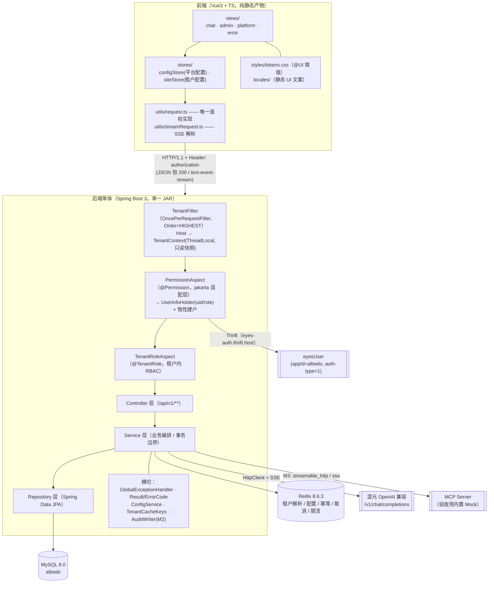
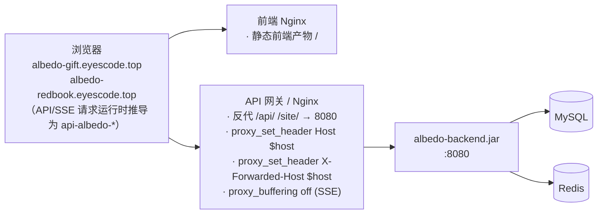
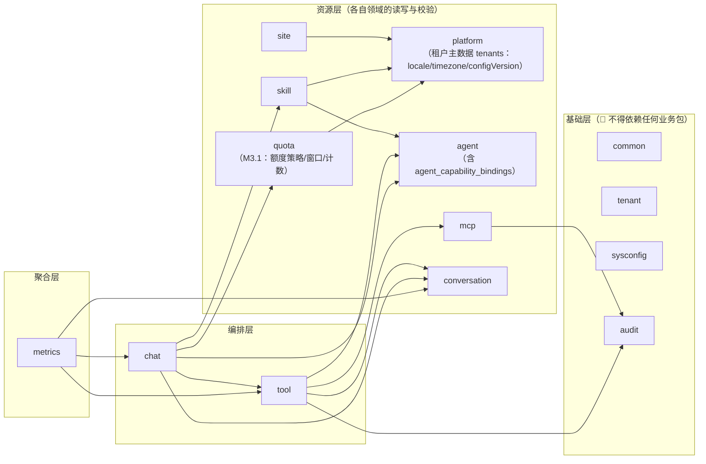
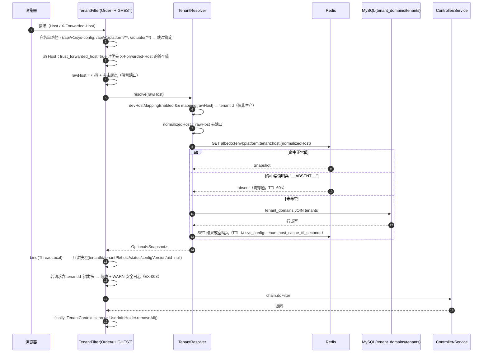
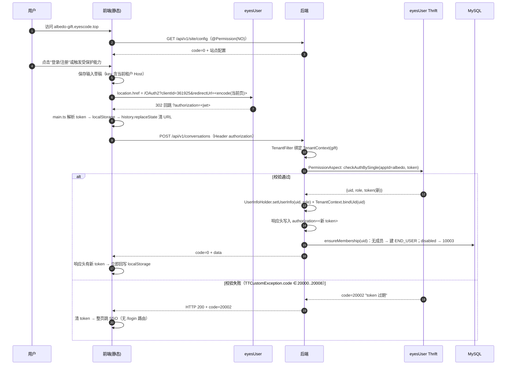
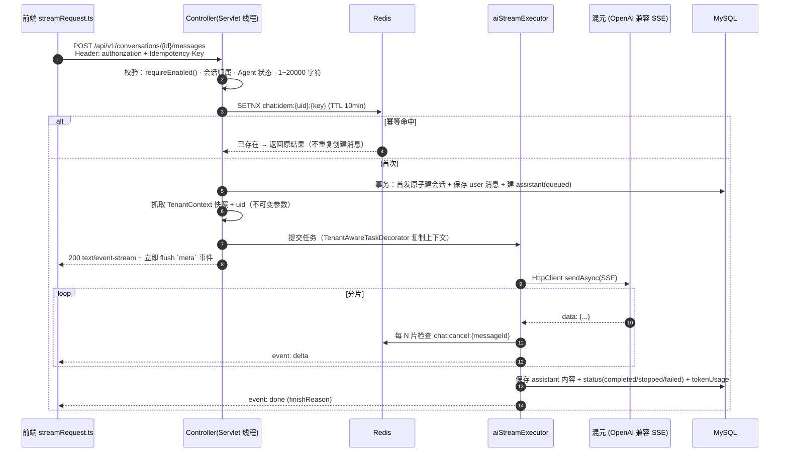
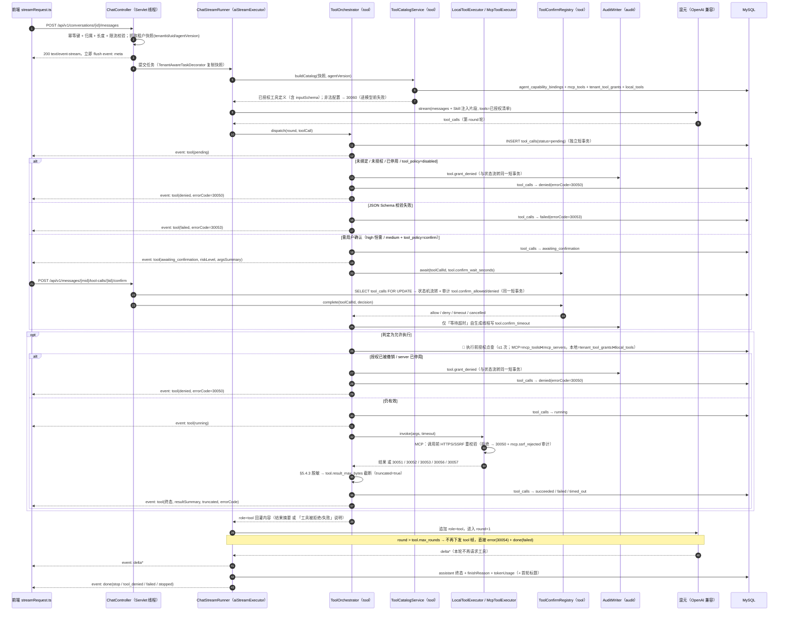
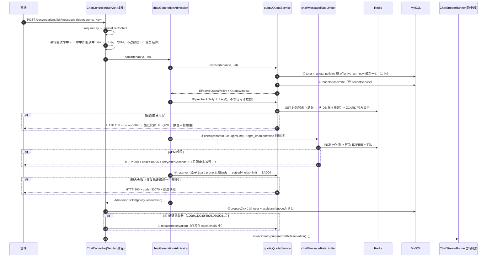

# Albedo 多租户 AI 问答系统 · 技术架构

**版本**：V1.4.8
**日期**：2026-08-18
**作者**：@架构设计师
**需求基线**：`docs/prd.md` **V1.4**、`docs/requirements.md` V1.2（M2 Deferred 至二期，M2-min 并入 M3；V1.4 新增 REQ-LMT-003 / REQ-QUOTA-001~005）
**接口契约**：`docs/api-spec.md` **V1.2.7**（唯一契约来源；本文与其冲突时，**接口形态以 api-spec 为准，技术实现以本文为准**）
**协作基线**：《团队协作基础框架 v3.1》（错误码与响应格式以框架 §十四 为唯一基线）

> 📌 **V1.3 范围**：在 M1 基线之上补齐 **M2-min + M3**（能力编排闭环）的技术方案 ——
> 模块边界与包结构（§5.1）、工具调用运行时编排（§9.5）、M3 数据模型增量（§13.4~§13.6）、
> M3 缓存键与准入复核（§12）、M3 性能门禁（§14.2）、运行时安全审计口径（§11.1）、
> 新增 **ADR-008 ~ ADR-014**（§17）。所有阈值/开关一律引用 `api-spec.md` §7.1.2 已登记的 `sys_config` 键。

> 📌 **V1.3.1 范围（本版，🔴 定点裁决回写，无全文重排）**：@后端 M3 能力层交付后提出的 **12 项契约缺口 G1~G12** 的逐条裁决 ——
> 🔴 **G1** 新增 **§13.5.10 `agent_capability_bindings` 正式登记**（含 as-built DDL 与三类 `ref_id`/`ref_version` 语义）、
> **G3** §11.1.1 新增 audit action `mcp.tool_grant_revoked`、**G11** §5.1.2 补画 `platform` 层位、
> **G5** 新增 **ADR-015**（一期内置本地 Tool 清单 + 高风险确认的生产可达路径）、
> **G8** ADR-008 第 8 条补注 + **AR-014**、**G12** §13.6 纪律 3 补注、新增 **AR-015**。
> 其余（G2/G4/G6/G7/G9/G10）落在 `api-spec.md` **V1.1.2**。逐条见 §19 变更记录 V1.3.1。

> 📌 **V1.3.2 范围（本版，🔴 定点裁决回写，无全文重排）**：@后端 M3 第三阶段（流编排 + 高风险确认闭环）5 项契约缺口的技术侧落点 ——
> **§5.1.3** 新增两行边界裁定（**模型函数名归一化归 `tool`、映射表归 `chat`**；**system 提示预算判定归 `chat/ContextAssembler`**）、
> **§9.5.1** 补注**执行期竞态 `running → denied`**（🔴 修正"归一化为 `failed`+`30052`"）、
> **§11.1.1** 新增 audit action **`tool.confirm_conflict`** 并补「审计只记新事实」原则（🔴 幂等回放不写审计）、
> **§13.6** 新增 1 键 **`chat.system_prompt_max_chars`**（键总数 22 → **23**）与取值不变量、
> **ADR-008 第 6 条**补注（回放/冲突的审计口径）、新增 **AR-016**（system 提示预算的运维风险）。
> 🔴 本版**零 DDL 变更、零新错误码**；契约细节以 `api-spec.md` **V1.1.3** 为唯一基线。逐条见 §19 变更记录 V1.3.2。

> 📌 **V1.3.3 范围（本版，🔴 M3 契约收尾定点回写，无全文重排）**：@后端 M3 第四阶段（`mvn -B verify` 单测 240 / 集成 227 全绿）7 项缺口 #1~#7 的技术侧落点 ——
> **§8.2.1（新增）** `@TenantRole` 程序化 fail-closed 兜底纪律 + `prod` profile 断言 `eyes-auth.enabled=true`（🔴 #6，安全漏洞级）、
> **§9.5.1** 补注**每次工具执行前的授权点查**（🔴 #4，订正实现缺口；时序图 `opt` 段增补一步）、
> **§9.5.3 / §14.2.1** 清单构造查询次数由 ≤3 订正为 **≤5**（#3，文档错实现对）并新增「执行前点查 ≤1 次」约束、
> **§11 安全表 + §15** 新增**埋点开关/采样率 fail-closed** 与「拦截型开关可 fail-open、采集型开关必须 fail-closed」一般原则（#1）、
> **§11.1.1 / ADR-010** `tool.confirm_conflict` 事务边界由「confirm 请求短事务」改为**独立短事务**并新增「事务边界选择判据」（#5）、
> **§13.6** 补登 2 键 `observability.analytics_enabled` / `analytics_sample_rate`（键总数 23 → **25**）+ 纪律 7 采样率区间不变量（🔴 越界拒绝启动）、
> **ADR-008 第 8 条**补注（🔴 不实现"撤授权即中断执行中调用"）、新增 **AR-017 / AR-018**。
> 🔴 本版**零 DDL 变更、零新错误码、零新接口**；契约细节以 `api-spec.md` **V1.1.4** 为唯一基线。逐条见 §19 变更记录 V1.3.3。

> 📌 **V1.3.4 范围（本版，🔴 M3 最后一轮定点订正，快进快出，无全文重排）**：@测试 终验并行期提出的 **G-0~G-5** 裁决的技术侧落点 ——
> **§8.2 / §8.2.1** 新增**纪律 8**（🔴 承载真实数据的环境必须以 `prod` profile 启动）与平台层失败码二分口径引用（G-4 / G-5）、
> **§9.5.1** 点查表新增「🔴 复查范围」行（复查授权/启用列，**不复查能力绑定**；`deleted_at` 只判 `mcp_servers`）（G-1 / G-2）、
> **§11.1.1** action 表标注 🔴 **恰 12 项**并固化 `AuditActions.ALL` 集合恒等断言（G-0）、
> **§13.5.3~§13.5.6** 显式登记四张工具相关表的**软删列现状与豁免**（G-1，🔴 0 DDL）、
> **§18** AR-018 ⑤ 订正（ADMIN 语义端点兜底已全覆盖，缺口仅剩 `USER` 级）+ 新增 **AR-019**（绑定为生成期快照的解绑残余窗口）。
> 🔴 本版**零 DDL 变更、零新错误码、零新接口、零新 `sys_config` 键（仍 25）、零新 audit action（仍 12）、零代码返工**；契约细节以 `api-spec.md` **V1.1.5** 为唯一基线。逐条见 §19 变更记录 V1.3.4。

> 📌 **V1.4.0 范围（本版，🔴 单点架构裁决，无全文重排）**：真实上游（腾讯云 WSA MCP，`gift` 租户）触发 **G6 裁决预留的二期裁决点** ——
> 🔴 **新增 ADR-016**：`sse` 传输支持 MCP 旧版「HTTP+SSE」(**2024-11-05**) **异步推送形态**，落点为 `SseTransport` **单次 exchange 内的形态自适应**（🔴 **不新增** `sse_legacy` 传输枚举值）；
> **ADR-008 第 8 条**补注 —— 🔴 首次给出「不新增线程池」的**边界定义**（复用 `HttpClient` 内部 executor 的 `sendAsync` + `BodySubscriber` **不算新增**，`new Thread` / `Executors.new*` / `supplyAsync` 算）；
> **§13.6** 新增 2 键 `mcp.sse_legacy_enabled` / `mcp.sse_stream_max_bytes` + 取值不变量（🔴 后者 ≥ `tool.result_max_bytes`，违反即**拒绝启动**）；
> **§13.5.3** 显式登记 `transport` 枚举**仍恰 2 值**（0 DDL）、**§14.2.1** MCP 超时口径订正为 **deadline 预算制**（订正 `sse` 形态最坏 2×~4× 超时的实现缺口）、**§11** SSRF 行补注（会话端点与流内 URL 纪律）、**§18** 新增 **AR-020**。
> 🔴 本版**零 DDL 变更、零新错误码、零新接口、零新 audit action（仍 12）、`last_check_result` 字面量零扩充（仍 9）**；契约细节以 `api-spec.md` **V1.2.0** 为唯一基线。逐条见 §19 变更记录 V1.4.0。

> 📌 **V1.4.1 范围（本版，🔴 ADR-016 内部冲突消除 + 实现细节追认，无全文重排、🔴 零业务代码返工）**：@后端 按 ADR-016 交付（`mvn -o test` **320 passed**，基线 287 → 320）后提出的 **5 点确认**逐条裁决 ——
> 🔴 **① ADR-016 ② 步骤 1 与失败分类表的字面冲突正式消除**：非 2xx 必须**二分**（`3xx`/`401`/`403`/`407` → 直接失败；其余非 2xx → 退化为直接 POST），追认 @后端 的"失败分类表优先"收敛；
> 🔴 **② ADR-016 ⑤「连接测试 = `mcp.connect_timeout_seconds`」作废**，订正为 **`mcp.discover_timeout_seconds`**（连接测试在实现上就是一次 `tools/list`，不存在独立握手请求），`mcp.connect_timeout_seconds` 语义收窄为运维不等式参照值 + 二期握手阶段预算键；
> ✅ **③** 接受 `McpRpcRequest` 为**独立 record 文件**（新增类数由"3 个辅助类"订正为 **4 个**：1 个零逻辑载体 + 3 个辅助）；
> ✅ **④** 接受「组件级 `*Test` 先行 + `*IT` 后补」的验证路径，并固化 **`mvn -o verify` 成为强制门禁的时点**（ADR-016 ⑪ 新增）；
> ✅ **⑤** 3 处实现细节**回写为正式契约**（流上 `HttpTimeoutException` → `TIMEOUT`；GET 状态码在 `BodyHandler.apply(ResponseInfo)` 阶段判定；**非 async 的** `whenComplete` 列入 ADR-008 第 8 条白名单）。
> 🔴 本版**零 DDL、零新错误码、零新接口、零新 `sys_config` 键（仍 29）、零新 audit action（仍 12）、`last_check_result` 仍 9 个、`transport` 仍 2 值**；契约细节以 `api-spec.md` **V1.2.1** 为唯一基线。逐条见 §19 变更记录 V1.4.1。

> 📌 **V1.4.2 范围（本版，🔴 MCP 联网搜索第 1 轮验收 2 个 P1 的定点裁决，无全文重排）**：`docs/test-report.md` V4.0 判定的 **BUG-MCP-001 / BUG-MCP-002** 逐条裁决 ——
> 🔴 **新增 ADR-017「单次生成的统一超时预算（三层 deadline）」**：订正 `SseEmitter` 误用 Agent **单轮**模型超时（`requestTimeoutSeconds`）当**整流**连接寿命的实现缺陷（P1-2 根因），确立 🔴 **业务 deadline 必须严格早于传输 deadline** 这一硬序（顺序反了则 `done 必发` 在物理上不可能成立）；
> 🔴 **新增 ADR-018「外部 MCP 工具 schema 的适配边界与失败诊断回灌」**：判定 P1-1 为**混合责任** —— ❌ 否决对上游 `input_schema` 做任何内容级加工（会连锁触发 `input_schema_digest` 变更 → 每次 `discover` 自动撤授权），✅ 采纳「**上游诊断如实回灌** + **平台级工具调用纪律段**」两项本项目侧修复；
> **§9.2 / §9.5.3 / §9.5.4** 超时口径与收敛不变量重写（不变量 2 由"`request-timeout` 统一封顶"改为"`chat.generation_deadline_seconds` 业务封顶 + 传输层仅硬兜底"，新增不变量 4/5）、
> **§13.6** 新增 3 键（`chat.generation_deadline_seconds` / `chat.deadline_grace_seconds` / `chat.tool_usage_guideline`，键总数 29 → **32**）+ 纪律 8/9、
> **§17.0** ADR 索引增 2 行、**§18** 新增 **AR-021 / AR-022**。
> 🔴 本版**零 DDL、零新错误码（复用 `50002` + `finishReason=timeout`）、零新接口、零新 audit action（仍 12）、零新 SSE 事件名**；新增 **1 个 SSE 字段**（`tool.confirmExpiresInSeconds`，契约见 api-spec §5.2）。逐条见 §19 变更记录 V1.4.2。

> 📌 **V1.4.3 范围（本版，🔴 3 点实现追认，无全文重排、🔴 零业务代码返工）**：@后端 按 ADR-017 / ADR-018 交付（`mvn -o test` **348 passed**、`mvn -o verify` **260 passed / 4 skipped**）后提出的 3 点逐条裁决 ——
> ✅ **①** `30050` 四源统一常量 `DENIED_FEEDBACK` 追认为 **🔴 订正实现**（"措辞不得按来源差异化"自 V1.4.2 即为明文契约），🔴 `SSRF_REJECTED` 复用该不精确措辞**有意为之**、严禁改精确（**ADR-018 ③** 补注 + api-spec §7.6.4）；
> ✅ **②** `remaining − grace ≤ 0 不下发确认卡` 的覆盖级别正式定为**单测**（该分支在准入判定就位后已是**防御性不变量**，IT 稳定构造需向生产代码植入时钟钩子）→ **ADR-017 落点 #12ⓒ** 订正，🔴 @测试 不得因"缺 IT"阻塞签署；
> ✅ **③** 工具准入用 `definition.timeoutSeconds()` **正确且并不保守**（🔴 订正前提：它与 `McpJsonRpcClient.callTimeout` 是**同源同公式**的生成期快照）→ **ADR-017 ③ⓒ** 补注，🔴 不精确化、不新增风险项。
> 🔴 本版**零 DDL、零新错误码、零新接口、零新 `sys_config` 键（仍 32）、零新 audit action（仍 12）、零新 SSE 字段**；契约细节以 `api-spec.md` **V1.2.3** 为唯一基线。逐条见 §19 变更记录 V1.4.3。

> 📌 **V1.4.4 范围（本版，🔴 ADR-018 ② 的契约性订正 —— 上游消息形态适配，无全文重排）**：`docs/test-report.md` V4.1 **BUG-MCP-004** 的裁决 ——
> 🔴 **ADR-018 ② 的「独立的第二条 `system` 消息」被真实上游否证并正式作废**：实测混元 OpenAI 兼容接口对 `messages` 施加**硬约束**（`status=400`「`messages` 中 system 角色必须位于列表的最开始」），因此"逻辑独立的平台段"**不能**用"物理独立的第二条 system 消息"承载。该缺陷是**全局回归**（`calculator` 等本地 Tool 同样在工具调用前 `50002`），成因在**架构决策**而非 @后端 实现。
> ✅ 裁决：纪律段**物理合并进唯一的 `system` 消息、恒为末块**；🔴 **④「不计入 `system_prompt_max_chars`」原样保留**（逻辑单列预算，`30060` 判定对象恒为**租户段**）。
> 🔴 **新增 ADR-019「上游消息形态适配：单一前导 `system` 不变量」**：把"整个请求至多 1 条 `system` 且必须在 `index 0`"升格为**全局结构不变量**，并据此一并订正**同源的既有隐患** —— 历史摘要此前也以**第二/第三条 `system` 消息**注入（`ContextAssembler` 行 174~178），🔴 该路径在"会话有更早内容且摘要已缓存"时**必然**触发同一个上游 400，表现为**该会话在摘要存续期内每轮都失败**（不可自愈，与 §7.5.4 力图消灭的失败模式同型）—— 属**本轮实测未覆盖但确定存在**的既有缺陷，本版一并合并订正。
> **ADR-018 ②/⑤、§13.6 `chat.tool_usage_guideline` 键说明、实施落点表**同步重写；**§17.0** ADR 索引增 1 行、**§18** 新增 **AR-023** 并订正 **AR-021 ③**。
> 🔴 本版**零 DDL、零新错误码、零新接口、零新 `sys_config` 键（仍 32）、零键值变更（纪律段文案不动，DBA 无动作）、零新 audit action（仍 12）、零新 SSE 字段**。逐条见 §19 变更记录 V1.4.4。

> 📌 **V1.4.5 范围（本版，🔴 新增能力增量：用户维度对话限流与每日限额）**：PRD **V1.4** 的 `REQ-LMT-003` / `REQ-QUOTA-001~005` 技术裁决 ——
> 🔴 **新增 ADR-020「用户维度额度的配置分层、预占结算与租户时区窗口」**（含 (a)/(b)/(c) 三种配置分层方案、Redis-only vs Redis+DB、SSE 帧下发 vs 前端重取、`Clock` 注入范围等 7 组备选方案的逐条裁决）；
> **新增 2 张表**（§13.5.11 `tenant_quota_policies` / §13.5.12 `user_daily_quota_usages`，含完整 DDL）、**新增 3 个 `sys_config` 键**（§13.6，键总数 32 → **35**）+ **1 处键值变更**（`ratelimit.message_per_minute` 30 → **3**）+ **1 键废弃删行**（`ratelimit.message_per_hour`）、**新增 1 个错误码**（`30070`，api-spec §2.2）、**新增 1 个接口**（`GET /api/v1/me/quota`）、**新增 2 个 Redis 运行时状态键**（§12.2，🔴 一并纳入"缓存失效接口禁止删除"清单）；
> **新增 §5 模块行 `quota`** + **§5.1.1 关键类** + **§5.1.2 依赖边 `chat → quota`**、**新增 §9.6「生成准入与额度结算」**（五步准入顺序 + 结算证据点 + 释放路径）、**§7 双层配置边界升级为三域**（新增"租户级运行策略"域并说明为何不塞 `site_config_versions`）、**§14.2.1 新增 3 行**性能约束、**§15** 新增 `[QUOTA]` 观测口径、**§18 新增 AR-024~AR-027**。
> 🔴 本版**零 SSE 事件名与字段变更**（额度快照不进 `done` 帧）、**零新 audit action（仍 12）**、**零新埋点事件名**、**零 `last_check_result` 字面量变更（仍 9）**、**零 `transport` 枚举变更（仍 2 值）**、**deadline 预算制（ADR-017）与单一前导 `system` 不变量（ADR-019）零改动**。逐条见 §19 变更记录 V1.4.5。

> 📌 **V1.4.7 范围（本版，🔴 DDL 缺陷订正 + 隐式契约固化，纯文档、🔴 零业务代码返工）**：@后端 按 §13.5.11 原文逐字建表后**后端拒绝启动**（`ddl-auto: validate` 判 `wrong column type`）——
> 🔴 **根因**：`tenant_quota_policies` 的 `qpm_enabled` / `daily_quota_enabled` 在 DDL 中写作**无长度 `TINYINT`**，而实体是 `Boolean`（期望 JDBC `BIT`）；mysql-connector-j 的 `tinyInt1isBit` 默认 `true`，🔴 **只有 `TINYINT(1)`（带显式长度）才被上报为 `BIT`**。
> **订正**：§13.5.11 两列改为 `TINYINT(1) NULL` + 失败现场与根因链登记；**新增 §13.2.1「布尔语义列的类型配对规则与全库登记表」**（A/B 两套合法配对 + 3 种失败组合 + 🔴 **全库 11 列 as-built 登记表**，经 `information_schema` + `DatabaseMetaData` **实测**取得）；**§13.2 新增纪律 10**；**§18 新增 AR-028**、**AR-006 应对强化**（🔴 新增部署纪律：DDL 实执行后、部署前必须先跑 `mvn -o verify`）；顺带修复 §18 中 **AR-027 行尾的 V1.4.5 复制残留**（误粘 AR-023 正文致表格多出一格）。
> 🔴 **同类隐患排查结论：全库仅此 1 处，无第 2 处**（其余 9 个布尔语义列均为 `Integer` + `columnDefinition="tinyint"` 配 `TINYINT`，实测一致）。
> 🔴 本版**零业务代码改动、零 DDL 新增（仅 2 条 `MODIFY`，已实执行）、零新错误码、零新接口、零新配置键、零新缓存键**；🔴 **明确否决**新增"实体↔DDL 类型比对"专项测试与"统一布尔约定"两项提议（理由见 §19 V1.4.7 裁决框）。逐条见 §19 变更记录 V1.4.7。

> 📌 **V1.4.8 范围（本版，🔴 全局传输层契约缺陷裁决 —— 建流前异常必须绕过内容协商）**：`docs/test-report.md` V5.0 的 **BUG-QUOTA-001** 裁决。
> 🔴 **根因（已由字节码 + 日志双向确证，非推测）**：`GlobalExceptionHandler` 的处理方法直接返回 `Result`，由 `RequestResponseBodyMethodProcessor` 走**内容协商**写出；真实浏览器发起 SSE 请求时带 `Accept: text/event-stream`，可写媒体类型集合（仅 `application/json`）与之无交集 → `HttpMediaTypeNotAcceptableException` → 错误分派链失败 → 容器 `/error` 二次协商同样失败 → **HTTP 500 + Content-Length: 0**。
> 🔴 **影响面远超限流**：`10005` / `30070` / `10001` / `10004` / `10003` / `20001~20005` / `50003` —— **所有**在 `meta` 帧 flush 之前抛出的业务异常，在真实浏览器下全部退化为 500 空体。限流只是**首次把既有缺陷暴露出来**（此前 QPM=30 难触发，且自动化从未发过 `Accept: text/event-stream`）。
> 🔴 **新增 ADR-021「`/api/v1/**` 恒 HTTP 200 的传输层实现约束：异常响应必须绕过内容协商」**（含 (a)~(d) 四种候选的逐条取舍、为何 `produces` 无效、为何 Spring 6.1.13 无 `@ExceptionHandler(produces=)`、`Accept` 头不得改变响应形态这一新增全局不变量）；
> **新增 §9.3.1「建流前失败的响应形态（🔴 内容协商红线）」**（两段式的**判别依据由"错误码"订正为"`meta` 是否已 flush"**，并明确 `done 必发` 的义务边界）；
> **§18 新增 AR-029**（🔴 测试替身保真度缺口：MockMvc ≠ 真实 HTTP 报文、E2E 桩比真实后端宽松 —— 与 BUG-MCP-004 同源，1166 用例全绿仍漏检的系统性原因）。
> 🔴 本版**零 DDL、零新错误码、零新接口、零新 `sys_config` 键（仍 35）、零新 audit action（仍 12）、零 SSE 事件名与字段变更、零前端契约变更**；deadline 预算制（ADR-017）与单一前导 `system` 不变量（ADR-019）零改动。契约细节以 `api-spec.md` **V1.2.7** 为唯一基线。逐条见 §19 变更记录 V1.4.8。

> 🔴 本文是全团队唯一技术基线。任何与本文冲突的实现必须先向 @架构师 发起 🔄 变更请求，经裁决并广播后方可落地。
> 🔴 本文不改变任何产品语义；PRD 与本文冲突时，**产品语义以 PRD 为准，技术实现以本文为准**。

---

## 1. 项目概述与质量目标

| 项 | 内容 |
|---|---|
| 项目名称 | Albedo 多租户 AI 问答系统 |
| 核心目标 | 单一产品底座支撑多租户独立站点（`gift`、`redbook` …），完成租户识别 → 耶瞳 SSO → 站点配置 → Agent 选择 → 会话 → 流式问答 → 管理治理 → 能力编排的闭环 |
| 交付方式 | M1（核心问答闭环）→ M2（管理治理闭环）→ M3（能力编排闭环），每里程碑六人独立签署 |
| 质量红线 | 跨租户泄露 = 0；租户识别与配置读取 P95 ≤ 20ms；非 AI 接口 P95 ≤ 500ms / P99 ≤ 1s；AI 首字 P95 ≤ 5s；停止生效 ≤ 1s；核心页面可交互 P95 ≤ 2s |
| 部署形态 | **后端单一可执行 JAR** + **前端静态 html/css/js**（Nginx 或任意静态托管） |

---

## 2. 技术选型

### 2.1 选型表

| 层次 | 技术选择 | 版本 | 选择理由 | 备选 |
|---|---|---|---|---|
| 前端框架 | Vue 3 + Composition API + TypeScript | Vue 3.5 / TS 5.6 | Boss 已锁定；静态可打包、生态成熟 | 无（已锁定，禁止 React） |
| 前端构建 | Vite | 5.4 | 秒级 HMR、原生 ESM、产物纯静态 | 无 |
| 前端状态 | Pinia | 2.2 | Vue3 官方推荐，TS 友好 | 无 |
| 前端样式 | TailwindCSS 3.4.17 + `tokens.css` 语义变量 | 3.4.17 | 原子类提速 + Token 统一视觉源 | 无 |
| 组件库 | **Element Plus（唯一）** | 2.8 | 需同时覆盖 PC 管理后台与移动端对话页；主题变量映射到 tokens.css | 禁止与 Vant 混用 |
| 图标 | lucide-vue-next | 0.4x | 线性单色，符合 @UI「极简×现代」内核 | — |
| Markdown | markdown-it + DOMPurify | 14 / 3 | 渲染与消毒分离，满足 AC-CHAT-005 | 禁止 `v-html` 直出 |
| 后端框架 | Java 17 + Spring Boot 3（Spring MVC，Servlet 栈） | 3.3.4 | Boss 已锁定；SSE 用 `SseEmitter` 即可，无需 WebFlux | 禁止 WebFlux |
| 持久层 | Spring Data JPA + Hibernate 6.5 | Boot 管理 | **Hibernate 6 原生 `@TenantId` discriminator 多租户**是方案 D 最低成本、最难绕过的实现 | 禁止 MyBatis 手写租户条件 |
| 数据库 | MySQL 8.0（库 `albedo`） | 8.0 | 已锁定；DDL 由 @后端 通过 MySQL MCP 实执行，应用侧 `ddl-auto: validate` | 无 |
| 缓存 | Redis 8.6.3 | 8.6.3 | 租户解析、配置、幂等、取消标记、限流 | 无 |
| 鉴权 | eyesUser SSO + `com.eyes:eyesAuth-spring-boot-starter:1.1.0` | 1.1.0 | 统一账号中心，禁止自建认证；⚠️ 需 jakarta 适配层，见 **ADR-002** | 无 |
| AI 接入 | OpenAI 兼容（混元）+ JDK17 `java.net.http.HttpClient` | — | 零额外依赖消费 SSE，线程模型可控 | 禁止引入 spring-ai / okhttp |
| 后端测试 | JUnit5 + Mockito + MockMvc | Boot 管理 | 单元 `*Test` / 接口 `*IT` | — |
| 前端测试 | Vitest + @vue/test-utils + @playwright/test | — | 单测 `frontend/tests/unit`、E2E `frontend/tests/e2e` | — |
| 部署 | 单 JAR + 静态资源（Nginx） | — | 依赖最少、步骤最简 | 禁止 Docker Compose 编排多服务 |

### 2.2 明确禁止引入（架构红线）

```
❌ 微服务化：API Gateway / 服务注册中心 / 多可部署单元
❌ 消息中间件：Kafka / RabbitMQ / RocketMQ（M3 工具编排在进程内完成）
❌ WebFlux / Reactor（SSE 用 SseEmitter + 独立线程池）
❌ Spring Security（鉴权由 eyesUser + @Permission AOP 承担，避免双套准入）
❌ 环境变量占位（${DB_PASSWORD}）、KMS / Vault（凭据写 application.yml，不提交 Git）
❌ 前端 axios（统一用 fetch，见 ADR-003）；React 专属动效库（framer-motion React 版 / react-spring）
❌ 业务参数硬编码（一律入 sys_config 或 site_config_versions）
```

---

## 3. 系统架构

### 3.1 分层架构（单体）



> 🔴 **单体红线自检**：全系统只有 **1 个可部署 JAR**（`albedo-backend.jar`）+ 1 份静态前端产物。模块化仅通过 Java 包结构表达，**不拆进程、不引服务发现、不引消息队列**。

### 3.2 部署拓扑



> 🔴 **前后端分域名部署**：前端站点为 `albedo-{tenant}.eyescode.top`，后端 API 为 `api-albedo-{tenant}.eyescode.top`。
> 前端在运行时把 `location.hostname` 的 `albedo-` 前缀替换为 `api-albedo-` 得到 API 域名（`request.ts` 的 `resolveApiDomain()`）。
> 后端租户识别仍精确匹配 `tenant_domains.host`，因此每个租户需**同时绑定前端域名与 API 域名两条记录**（`is_primary=1` / `=0`）。
> 生产 CORS 放开 `https://albedo-*.eyescode.top`（见 §9）。

**SSE 关键部署要求**（否则首字延迟不可控，违反 AC-CHAT-001）：

```nginx
location /api/v1/conversations/ {
  proxy_pass http://127.0.0.1:8080;
  proxy_set_header Host $host;          # 租户识别依赖真实 Host
  proxy_http_version 1.1;
  proxy_buffering off;                  # 关闭缓冲，分片实时下发
  proxy_cache off;
  proxy_read_timeout 300s;              # ≥ Agent requestTimeoutSeconds 上限
  chunked_transfer_encoding on;
}
```

---

## 4. 目录结构（全员基线）

```
albedo/
├── docs/
│   ├── prd.md · spec.md · requirements.md  # @产品经理
│   ├── architecture.md                     # 本文（@架构师）
│   ├── api-spec.md                         # 接口契约 + 错误码登记表（@架构师）
│   ├── design-system.md                    # @UI
│   ├── test-plan.md · test-report.md       # @测试
│   ├── plans/                              # brainstorming 稿（@产品经理）
│   ├── reports/                            # 产物快照（UI 走查等，留档）
│   └── input/                              # Boss 原始需求与参考图（留档）
├── frontend/
│   ├── src/
│   │   ├── api/                # 按模块拆分的接口封装（sysConfig / site / agent / conversation …）
│   │   ├── components/         # 公共组件
│   │   ├── composables/        # 逻辑复用（useConfig / useSse …）
│   │   ├── locales/            # ★ 静态 UI 文案（禁止 .vue 内联字面量）
│   │   ├── router/             # ★ 无 /login 路由
│   │   ├── stores/             # configStore（平台）· siteStore（租户）· chatStore …
│   │   ├── styles/
│   │   │   ├── tokens.css      # ★ Design Token 契约（架构师定名，@UI 填值）
│   │   │   └── index.css       # Tailwind 入口 + 全局基础样式
│   │   ├── types/              # api.ts（ApiResult/PageData）· chat.ts（SSE 事件）…
│   │   ├── utils/
│   │   │   ├── request.ts      # ★ 唯一鉴权实现（fetch）
│   │   │   └── streamRequest.ts# ★ SSE 解析（fetch + ReadableStream）
│   │   └── views/{chat,admin,platform,error}/
│   ├── tests/{unit,e2e}/       # Vitest / Playwright（不存在项目根级 tests/）
│   ├── .env                    # 仅 VITE_API_DOMAIN / VITE_SSO_URL / VITE_SSO_CLIENT_ID
│   ├── vite.config.ts · tailwind.config.ts · postcss.config.js
│   ├── tsconfig.json · tsconfig.app.json · tsconfig.node.json
│   └── playwright.config.ts · package.json
├── backend/
│   ├── src/main/java/com/eyes/albedo/
│   │   ├── AlbedoApplication.java
│   │   ├── common/             # Result · PageResult · ErrorCode · BusinessException · GlobalExceptionHandler · BaseAuditEntity
│   │   ├── config/             # WebMvcConfig · RedisConfig · JpaConfig · AsyncConfig · HttpClientConfig · AppProperties
│   │   ├── auth/               # ★ eyesAuth jakarta 适配层（ADR-002）+ @TenantRole RBAC
│   │   ├── tenant/             # TenantContext · TenantFilter · TenantResolver · BaseTenantEntity · TenantCacheKeys
│   │   ├── sysconfig/          # SysConfig 实体 · ConfigService · GET /api/v1/sys-config
│   │   ├── site/               # M1：站点配置读取 + /site/status（@后端）
│   │   ├── agent/ · conversation/ · chat/          # M1 业务（@后端）
│   │   ├── membership/ · platform/                 # M1：成员关系 / 租户注册与 Host 解析支撑
│   │   ├── audit/              # ★ M2-min：运行时安全事件审计（只写不改不删，§11.1）
│   │   ├── skill/ · mcp/ · tool/                   # ★ M3：能力编排（依赖方向见 §5.1）
│   │   └── metrics/            # ★ M3：埋点上报 + 租户用量聚合（原 §4「analytics/」更名）
│   ├── src/main/resources/
│   │   ├── application.yml           # 真实配置（.gitignore，不提交）
│   │   └── application-example.yml   # 脱敏模板（提交，键集完全一致）
│   ├── src/test/java/com/eyes/albedo/  # *Test（单元）· *IT（接口）· 离线凭据加密工具（ADR-012）
│   └── pom.xml
├── README.md · .gitignore
```

> ⚠️ 每个业务包内部统一 `controller / service / repository / entity / dto` 五段结构；**跨模块只允许 Service → Service 调用，禁止跨模块直接用别人的 Repository**。
> ⚠️ **一期不建 `admin/` 包**：M2 管理后台 Deferred 至二期（PRD DEC-008/DEC-010）；api-spec §7 中路径以 `/api/v1/admin/**` 开头的 M2-min 接口按**领域归属**落在 `sysconfig/`（配置校验）、`mcp/`（MCP 治理）、`metrics/`（用量），**不按 URL 前缀建包**。
> ⚠️ **不建 `ratelimit/` 包**：限流沿用既有 `chat/service/MessageRateLimiter`（api-spec §7.12 明确"不新增组件"）。

---

## 5. 模块职责表

| 模块（包） | 里程碑 | 职责 | 负责人 | 关键约束 |
|---|---|---|---|---|
| `common` | M1 | 统一响应、错误码、异常、分页、审计基类 | @架构师（骨架）/ @后端（扩展） | 所有响应必经 `Result`；新增错误码先登记 api-spec |
| `config` | M1 | Web/Redis/JPA/Async/HttpClient 装配、`app.*` 属性绑定 | @架构师 | 只放基础设施配置，禁止业务参数 |
| `auth` | M1 | `@Permission` jakarta 适配、`@TenantRole` RBAC、惰性建户挂钩 | @架构师（骨架）/ @后端（`TenantMembershipPort` 实现） | 不得自建登录/注册/刷新令牌 |
| `tenant` | M1 | Host → TenantContext、Hibernate discriminator、缓存键、异步上下文传播 | @架构师（骨架）/ @后端（`TenantLookupPort` 实现） | 客户端 `tenantId` 一律忽略并记安全日志 |
| `sysconfig` | M1 | 平台级配置读写 + Redis 缓存 + `GET /api/v1/sys-config` | @架构师（骨架）/ @后端（管理端 M2） | 只承载平台基础设施参数 |
| `site` | M1 读 / M2 写 | 租户站点配置版本读取、发布、回滚、`/site/status` | @后端 | 读当前 `configVersion` 指向的 published 版本 |
| `agent` | M1 读 / M2 管理 | Agent 与 Agent 版本快照、默认项、启停 | @后端 | 会话绑定创建时的已发布版本，禁止静默切版 |
| `conversation` | M1 | 会话 CRUD、分页、重命名、软删 | @后端 | 查询恒带 `uid`；跨租户/跨用户一律 10004 |
| `chat` | M1 | 消息持久化、SSE 流式、停止、重试、重新生成、标题、上下文压缩 | @后端 | 幂等 `Idempotency-Key`；取消标记走 Redis |
| `admin` / `platform` | M1 支撑 / M2 管理 | `platform`：租户注册表与 Host 解析支撑（M1 已落地）；`admin`：管理后台（**Deferred 至二期，一期不建包**） | @后端 | 一期不提供任何 `/admin/*` 页面 |
| `audit` | **M2-min** | 运行时安全事件审计写入（只写不改不删） | @后端 | 审计失败：非流式整体失败（EX-024）／流式内使该次工具调用失败但**不中断流**（ADR-010） |
| `skill` | **M2-min 数据 / M3 运行时** | Skill 版本快照读取、`{{variable}}` 解析与替换、注入片段构造、Skill 校验 | @后端 | 只消费会话绑定 `agentVersion` 引用的那个版本；指令正文永不外泄 |
| `mcp` | **M2-min 治理 / M3 运行时** | MCP 配置读取、连接测试、工具发现、JSON-RPC 调用、SSRF 校验、凭据解密 | @后端 | 传输仅 `streamable_http`/`sse`；每次调用前 SSRF 重校验（ADR-009） |
| `tool` | **M3** | 工具清单构造、权限判定、参数校验、风险与确认、执行、结果截断、`tool_calls` 落库 | @后端 | 🔴 不得依赖 `chat`（避免环依赖，§5.1） |
| `metrics` | **M3** | 埋点批量入库（`POST /api/v1/events`）、租户用量聚合（`GET /api/v1/admin/metrics/usage`） | @后端 | 禁记正文/凭据/Token/完整联系方式；埋点失败一律 `code=0` |
| **`quota`** | **M3.1** | **用户维度额度域**：有效策略解析（平台默认 + 租户覆盖）、租户时区额度日窗口计算、日额度预检/预占/结算/释放、额度快照与 `GET /api/v1/me/quota` | @后端 | 🔴 不得依赖 `chat`（`chat → quota` 单向，防成环）；🔴 阈值一律来自 `sys_config` + `tenant_quota_policies`，代码中禁止 `3`/`50` 字面量；🔴 租户 `timezone` 非法一律 `50003`，禁止回落 UTC |

### 5.1 M3 模块边界与依赖方向（🔴 禁止环依赖）

#### 5.1.1 关键类清单（@后端 据此建包，命名即契约）

| 包 | 关键类 | 职责（一句话） |
|---|---|---|
| `audit` | `AuditLog`（entity）、`AuditLogRepository`（**仅 `save`/查询，无 update/delete 方法**）、`AuditWriter`、`AuditActions`（action 字面量常量）、`AuditDigest`（sha256 前 16 hex 摘要） | 安全事件落库与摘要化；`AuditWriter.write(...)` 参与调用方事务，`writeInNewTransaction(...)` 用于流式内独立短事务 |
| `skill` | `Skill`/`SkillVersion`（entity）、`SkillVersionRepository`、`SkillInjectionService`、`SkillVariableResolver`、`SkillValidator` | 按绑定读取**不可变**版本 → 变量替换 → 产出注入片段（`instruction` + `outputConstraint`） |
| `mcp` | `McpServer`/`McpTool`（entity）、`McpServerRepository`/`McpToolRepository`、`McpClient`（JSON-RPC over JDK `HttpClient`）、`McpTransport`（`StreamableHttpTransport`/`SseTransport`）、`McpDiscoveryService`、`McpConnectionTester`、`SsrfGuard`、`CredentialCipher` | 传输细节、协议编解码、发现与授权比对、SSRF 校验、凭据解密（内存内，永不落日志） |
| `tool` | `ToolOrchestrator`、`ToolCatalogService`、`ToolArgsValidator`、`ToolRiskPolicy`、`LocalToolExecutor`（+ `LocalToolRegistry`）、`McpToolExecutor`、`ToolResultTruncator`、`ToolSummaryScrubber`、`ToolCallRecorder`、`ToolConfirmRegistry`、`ToolConfirmService`、`ToolCall`（entity）、`ToolCallRepository`、`ToolCallQueryController`、`ToolProgressListener`（回调接口）、`ToolCancellation`（函数式接口） | 一轮工具调用的**全部判定与执行**；对 `chat` 只暴露 `ToolOrchestrator` + 两个回调接口 |
| `metrics` | `AnalyticsEvent`（entity）、`AnalyticsEventRepository`、`EventIngestController`/`EventIngestService`（字段白名单 + 去重 + 采样）、`UsageQueryController`/`UsageService` | 埋点入库与用量聚合；聚合数据经各领域 `*StatService` 获取，**不直连他人 Repository** |
| **`quota`（M3.1）** | `TenantQuotaPolicy`/`UserDailyQuotaUsage`（entity）、`TenantQuotaPolicyRepository`/`UserDailyQuotaUsageRepository`、`QuotaPolicyResolver`（→ `EffectiveQuotaPolicy` record）、`QuotaWindowResolver`（→ `QuotaWindow` record，🔴 构造注入 `Clock`）、`DailyQuotaCounter`（Redis Lua：预占/结算/释放/读取，🔴 含"镜像缺失时从 DB 重建"）、`QuotaService`（编排：`precheck` / `reserve` / `settle` / `release` / `snapshot`）、`QuotaReservation`（record，含 `tracked` 标志，🔴 禁用额度时为 no-op 哨兵而非 `null`）、`QuotaSnapshotDTO`（恰 9 字段）、`controller/QuotaController` | 🔴 **对外只暴露 `QuotaService`**（`chat` 只依赖它）；🔴 策略与窗口在**一次准入内解析一次**并传递快照，禁止各步骤各解析一次 |

#### 5.1.2 依赖方向（箭头 = 允许的编译期依赖）



> 🔴 **V1.4.5 补画（ADR-020）`quota` 层位**：`quota` 属**资源层 L1**（它只读写自己的两张表 + `sys_config` + Redis 计数，不编排任何生成流程）。
> 新增依赖边恰 2 条：**`chat → quota`**（准入与结算的唯一调用方向）与 **`quota → platform`**（取 `tenants.timezone`，🔴 必须经 `platform/service/TenantService`，禁止直连 `TenantRepository`，与 `skill → platform` 同一惯例）。
> 🔴 **不成环**：`quota` 不依赖 `chat` / `tool` / `conversation` / `agent`。
> 🔴 **为什么 `MessageRateLimiter` 留在 `chat` 而不搬进 `quota`**：搬动会打断既有类路径与既有测试引用（`com.eyes.albedo.chat.service.MessageRateLimiter`）却不改变任何行为；正确做法是**把阈值来源上移**（由 `quota` 解析出的策略作为**入参**传入），使限流器退化为一个"纯机制"组件（固定窗口计数器）—— 这样 `MessageRateLimiter` 对 `quota` **零编译期依赖**，准入顺序则集中在 `chat/service/GenerationAdmission`（§9.6）。

> L1~L3 全部可依赖 L0（为避免图形噪声未画出）。
> 🔴 **V1.3.1 补画（G11 裁决）`platform` 层位**：`platform` 承载**租户主数据**（`tenants` 表：`locale` / `timezone` / `configVersion`），属**资源层 L1**（不是基础层 —— 它读的是业务主数据表，且 `TenantService` 会写 `config_version`）。
> `skill → platform` 是合法依赖（内置变量 `{{locale}}` / `{{timezone}}` 需要租户主数据），与既有 `site → platform` 惯例同形，**不构成环依赖**（`platform` 不依赖任何 L1/L2/L3 包）。
> 🔴 **但必须走 Service→Service**：`skill` 只允许注入 `platform/service/TenantService`（`currentProfile()` / `profileOf(tenantId)` 返回 `TenantProfile`），**禁止直接注入 `platform/repository/TenantRepository`** —— 违反 §4「跨模块只允许 Service → Service 调用」，且绕过 `TenantService` 的"租户不存在/已删除"统一判定。
> 🔴 性能纪律：仅当正文实际引用了 `{{locale}}` / `{{timezone}}` 时才去取租户主数据（`SkillVariableResolver.needsTenantProfile`），避免为绝大多数不用内置变量的 Skill 多付一次 DB 往返（§14.2）。

**🔴 禁止的依赖（出现即为缺陷，@测试 以包扫描断言）**：

```
tool   ✗→ chat      （否则 chat ↔ tool 成环；SSE 写出与消息域一律留在 chat）
audit  ✗→ 任何业务包（审计是基础设施，只接收结构化入参）
mcp    ✗→ tool      （传输层不感知编排；风险判定与确认不在 mcp）
skill  ✗→ chat/tool （Skill 只产出注入片段，不参与工具授权，指令文本永不提权）
metrics ✗→ mcp      （用量只读聚合结果，不触碰凭据与 endpoint）
platform ✗→ 任何 L1/L2/L3 包（租户主数据是被依赖方，反向依赖即成环）
quota  ✗→ chat/tool/conversation/agent（🔴 V1.4.5：额度域只做"能不能发、发了算几次"，
                                      绝不感知会话/消息/工具编排；反向依赖即成环）
任何包 ✗→ 别人的 Repository（🔴 跨模块只允许 Service → Service，§4；G11 已实测到 skill 直连 TenantRepository 的违例）
任何包 ✗→ admin      （一期不存在该包）
```

#### 5.1.3 `chat` 与 `tool` 的边界（🔴 逐项裁定，避免职责漂移）

| 关注点 | 归属 | 说明 |
|---|---|---|
| SSE 连接建立、`meta` 首发 flush、`delta`/`error`/`done` 写出 | `chat`（`SseWriter`） | `tool` **不持有** `SseWriter`；工具状态通过 `ToolProgressListener` 回调，由 `ChatStreamRunner` 翻译成 `tool` 事件帧 |
| 多轮循环控制与上下文回灌（`role=tool` 消息追加、下一轮请求构造） | `chat`（`ChatStreamRunner` + `ContextAssembler`） | 轮次计数与 `tool.max_rounds` 判定由 `ChatStreamRunner` 持有（它才知道"本次生成"的边界） |
| 工具清单构造（四条件过滤 + Schema 下发给模型） | `tool`（`ToolCatalogService`） | 输入为租户快照 + `agentVersion`，输出为模型可见的工具定义列表 |
| 🔴 **模型函数名归一化与碰撞判定**（V1.3.2） | `tool`（`ToolCatalogService`） | `toolKey` 含 `:` 不合上游 `^[a-zA-Z0-9_-]{1,64}$`，故清单项同时携带 `toolKey` + `functionName`（规则见 api-spec §7.6.5）。🔴 归属 `tool` 的理由：**只有它看得到本次生成的完整清单**，碰撞判定必须在全清单范围内做；超长/碰撞 → `30060`（fail-closed，不截断不静默丢弃） |
| 🔴 **`functionName → 工具定义` 映射表**（V1.3.2） | `chat`（`ChatStreamRunner`） | 按「本次生成」持有 `Map<functionName, 定义>`，模型回传 `function.name` 时**查表**取回定义；🔴 严禁字符串还原（`_ → :` 不可逆）；生成结束即释放（🔴 不进任何缓存层，§12.1） |
| 🔴 **system 提示总长预算判定**（V1.3.2） | `chat`（`ContextAssembler`） | 判定对象是**拼装结果整体**（`system_prompt` + 全部 Skill `instruction`/`output_constraint`），只有 `ContextAssembler` 持有它；🔴 边拼边累加码点并在超限处**立即短路** → `30060 rule=systemPromptBudgetExceeded`，禁止"先拼完再遍历"（api-spec §7.5.2）。`skill` 只负责单个版本的正文与变量替换，🔴 不做跨 Skill 的总量判定 |
| 权限判定（绑定 / 授权 / 状态 / `tool_policy`） | `tool` | 拒绝 → `30050` + `AuditActions.TOOL_GRANT_DENIED` |
| 参数校验（JSON Schema draft 2020-12） | `tool`（`ToolArgsValidator`，ADR-014） | 失败 → `30053`，不发起任何执行 |
| 风险判定与确认等待 | `tool`（`ToolRiskPolicy` + `ToolConfirmRegistry`） | ADR-008 |
| 执行（本地实现体调用 / MCP `tools/call`） | `tool`（`LocalToolExecutor` / `McpToolExecutor`） | `McpToolExecutor` 仅委托 `mcp/McpClient`，不自行拼 HTTP |
| MCP 传输、JSON-RPC 编解码、SSRF、凭据解密、重定向策略 | `mcp` | `tool` 只看到「结果 / 错误码」，看不到 endpoint 与凭据 |
| 结果脱敏、截断、落库、`tool_calls` 状态机 | `tool`（`ToolSummaryScrubber` / `ToolResultTruncator` / `ToolCallRecorder`） | 摘要一份四处复用（api-spec §5.4.3） |
| 停止生成（关流 + 取消标记） | `chat`（`CancelRegistry` / `ChatCancelService`） | `tool` 通过 `ToolCancellation`（`boolean isCancelled()`）感知，不反向依赖 |
| Skill 注入片段拼装进 `system` 消息 | `chat`（`ContextAssembler`）调用 `skill/SkillInjectionService` | 注入顺序见 api-spec §7.5.2 |

---

## 6. 租户模型与强制隔离

### 6.1 Host 解析与 TenantContext 建立



**规范化规则（唯一实现，`TenantResolver`）**

1. 取 Host：`trust_forwarded_host=true` 时优先 `X-Forwarded-Host`（取逗号分隔的第一个），否则用 `Host`。
2. `rawHost` = trim → 小写 → 去末尾 `.`（**保留端口**，供 dev 映射匹配 `localhost:5173`）。
3. dev 映射（仅非生产）：`dev_host_mapping_enabled=true` 且 `dev_host_mapping` JSON 命中 `rawHost` → 直接得 `tenantId`，走 `resolveByTenantId`。
4. `normalizedHost` = `rawHost` 去端口 → 精确匹配 `tenant_domains.host`，**禁止任何字符串截取猜测**。
5. 未匹配 → 不绑定上下文；`TenantContext.require()` 抛 `30010`；`/site/status` 返回 HTTP 404。

**生产强制校验**：`DevHostMappingGuard` 在 `ApplicationReadyEvent` 检查——`prod` profile 下若 `dev_host_mapping_enabled=true`，**直接抛异常终止启动**（AC-TEN-007 / EX-028）。

### 6.2 TenantContext 契约（@后端 必须遵守）

```java
TenantContext.Snapshot { String tenantId; Long tenantPk; String host; TenantStatus status; long configVersion; Long uid; }

TenantContext.current()        // Optional<Snapshot>，无上下文返回 empty
TenantContext.require()        // 无上下文 → BusinessException(30010)
TenantContext.requireEnabled() // 非 enabled → 30011；status=draft/archived → 30010
TenantContext.tenantIdOrNone() // 供 Hibernate resolver；缺失返回哨兵 "__none__"
TenantContext.bindUid(uid)     // PermissionAspect 鉴权成功后回填（生成新快照）
TenantContext.snapshotForAsync() / restore(snapshot) / clear()
```

- **只读**：`Snapshot` 是 `record`，业务代码**不得**改写租户身份。
- **命名口径**：`tenantId` 即 PRD 的租户号字符串（`gift`/`redbook`），也是 Hibernate discriminator 值；`tenantPk` 仅平台表内部外键使用。**不再引入 `tenantCode` 第二概念**（原裁决中的 `tenantCode` ≡ 本文 `tenantId`）。
- 缺失上下文时 Hibernate resolver 返回 `__none__`，租户实体查询结果必然为空（**fail-closed**），但业务层**必须**先调用 `requireEnabled()` 给出确定错误码，不得依赖空结果。

### 6.3 数据隔离（方案 D：同库同表 + Hibernate discriminator）

```java
@MappedSuperclass
public abstract class BaseTenantEntity extends BaseAuditEntity {
    @TenantId
    @Column(name = "tenant_id", nullable = false, updatable = false, length = 32)
    private String tenantId;
}
```

Hibernate 6 自动行为（**这是隔离的底线保障，不依赖开发自觉**）：

| 操作 | Hibernate 行为 |
|---|---|
| INSERT | 自动填充 `tenant_id` = resolver 返回值 |
| SELECT（HQL/Criteria/`findById`/派生查询） | 自动追加 `tenant_id = ?` |
| UPDATE / DELETE | 自动追加 `tenant_id = ?` |
| 原生 SQL（`@Query(nativeQuery=true)`） | **不追加**，🔴 禁止对租户表使用原生 SQL；确有必要须经 @架构师 审批并手写 `tenant_id = :tenantId` |

装配方式（`config/JpaConfig`）：注册 `HibernatePropertiesCustomizer`，把 `hibernate.tenant_identifier_resolver` 指向 `TenantIdentifierResolver`（`CurrentTenantIdentifierResolver<String>`，`validateExistingCurrentSessions()=false`）。

### 6.4 表 scope 清单（**必须逐表标注，评审必查**）

| 表 | scope | 是否继承 `BaseTenantEntity` | 里程碑 | 说明 |
|---|---|---|---|---|
| `tenants` | **platform** | ❌ | M1 | 租户注册表，`tenant_id` 是主数据而非隔离维度 |
| `tenant_domains` | **platform** | ❌ | M1 | Host ↔ 租户绑定；解析发生在上下文建立**之前** |
| `sys_config` | **platform** | ❌ | M1 | 平台级基础设施配置 |
| `local_tools` | **platform** | ❌ | M2-min | 平台预注册 Tool 注册表；🔴 租户无写权限（`risk_level` 不可被租户下调） |
| `audit_logs` | **platform** | ❌ | M2-min | 含 `scope` + `tenant_id` 列但需支持平台跨租户审计，**手写租户条件**；租户维度查询必须显式 `where tenant_id = 当前租户`（详见 §13.5） |
| `platform_access_grants` | **platform** | ❌ | M2（Deferred） | 平台管理员受控跨租户临时授权（≤30 分钟）；一期只保留审计 action，不建表 |
| `site_config_versions` | tenant | ✅ | M1 读 / M2 写 | 站点配置版本快照 |
| `tenant_users` | tenant | ✅ | M1 | 成员关系，`(tenant_id, uid)` 唯一 |
| `agents` / `agent_versions` | tenant | ✅ | M1 | Agent 主体 + 不可变发布快照 |
| `conversations` / `messages` | tenant | ✅ | M1 | 会话与消息 |
| `skills` / `skill_versions` | tenant | ✅ | M2-min | Skill 主体 + 不可变版本（§13.5） |
| `mcp_servers` / `mcp_tools` | tenant | ✅ | M2-min | MCP 配置与发现结果（逐个授权） |
| `tenant_tool_grants` | tenant | ✅ | M2-min | 租户对平台 Tool 的授权 + 非代码配置 |
| `agent_capability_bindings` | tenant | ✅ | M2-min | Agent 版本 ↔ Skill 版本 / MCP 工具 / 本地 Tool 绑定（精确版本引用） |
| `tool_calls` | tenant | ✅ | M3 | 工具调用摘要（🔴 只存脱敏摘要，不存明文入参/结果） |
| `analytics_events` | tenant | ✅ | M3 | 埋点事件（不含正文）；🔴 本表即 V1.0~V1.2 文档中的 `product_events` **更名**，以 api-spec §1.4 的 `uk(tenant_id, client_event_id)` 为准，实现只认 `analytics_events` |
| **`tenant_quota_policies`** | tenant | ✅ | **M3.1** | 租户级额度/限流策略**版本流**（§13.5.11）；🔴 列 `NULL` = 未覆盖（继承平台默认），非 `NULL` = 覆盖且必须合法 |
| **`user_daily_quota_usages`** | tenant | ✅ | **M3.1** | 用户每日额度**结算账本**（§13.5.12）；🔴 它是 `used` 的**唯一权威**，Redis 计数只是可重建的镜像 |

**唯一键规则**：所有租户表的业务唯一键**必须包含 `tenant_id`**（如 `uk_tenant_agent_key(tenant_id, agent_key)`），确保 AC-TEN-003「两租户可用相同 key」。

### 6.5 缓存、异步、检索、日志的隔离

| 层 | 机制 |
|---|---|
| 缓存 | 唯一入口 `TenantCacheKeys`（§12），键内必含 `tenantId` 或显式 `platform`；🔴 禁止业务代码手拼 Redis key |
| 异步 | `aiStreamExecutor` 装配 `TenantAwareTaskDecorator`：提交时抓取 `TenantContext` 快照 + `uid/role`，执行前 restore、finally clear |
| SSE 长任务 | 进入异步**之前**在主线程抓取快照并作为不可变参数传入；异步线程内禁止再次读取 Servlet 请求 |
| 缺失上下文任务 | 装饰器检测到快照为空 → 直接拒绝执行并 ERROR 日志（RISK-001 / AC-TEN-005） |
| 检索/分页 | 全部走 JPA（自动追加租户条件）；分页 `pageSize` 默认 20、上限 100，排序键必含唯一后备键（`updated_at DESC, id DESC`）保证稳定 |
| 日志 MDC | `TenantFilter` 写入 `tenantId` / `requestId`（UUID，无入参则生成）；`uid` 由 `PermissionAspect` 补写；日志格式含 `[%X{requestId}][%X{tenantId}][%X{uid}]` |

### 6.6 站点级状态页边界（AC-NFR-004 唯一例外）

| 场景 | `/api/v1/**`（恒 HTTP 200） | 站点级（允许非 200） |
|---|---|---|
| 未知 / draft / archived Host | `code=30010` | `GET /site/status` → **HTTP 404** |
| 租户 suspended | `code=30011` | `GET /site/status` → **HTTP 403** |
| 无可用已发布配置 | `code=30012` | `GET /site/status` → **HTTP 503** |
| 正常 | `code=0` | `GET /site/status` → HTTP 200 |

- `/site/status` 是**后端唯一允许返回非 200 的端点**，返回极简 `text/html`（无租户数据、无登录入口），用于 Nginx `error_page` 映射、运维探测与 @测试 验收。
- 前端另有兜底：`siteStore.load()` 收到 `30010/30011/30012` → 路由至 `error/SiteNotFound|SiteSuspended|SiteUnavailable` 视图（不展示 Agent、不展示登录入口）。

---

## 7. 双层配置边界（🔴 禁止混用）

| 维度 | 平台级 `sys_config` | 租户级 `site_config_versions` | **租户级运行策略 `tenant_quota_policies`（🔴 V1.4.5 新增第三域）** |
|---|---|---|---|
| 归属 | 平台基础设施 / 反硬编码 | 单个租户的站点品牌与文案 | 单个租户的**运行期策略覆盖**（当前只有额度/限流） |
| 读取入口（后端） | `ConfigService`（Redis 缓存 + 写后主动失效） | `SiteConfigService`（按 `tenants.config_version` 读 published 快照） | `quota/QuotaPolicyResolver`（🔴 **直读 MySQL，一期不缓存**） |
| 读取入口（前端） | `GET /api/v1/sys-config` → `configStore` | `GET /api/v1/site/config` → `siteStore` | 🔴 **不下发策略本身**；前端只拿 `GET /api/v1/me/quota` 的**结果快照** |
| 治理流程 | 直接改（M2 平台管理端），改完失效缓存即生效 | **草稿 → 校验 → 发布**，版本不可变，失败保留上一版本 | DBA **追加一条版本行**（`effective_at`），🔴 到点即生效、无需重启、无缓存需失效 |
| 典型内容 | 分页默认值/上限、限流阈值**默认值**、输入长度上限、`trust_forwarded_host`、模型 provider 清单、缓存 TTL、埋点开关、上下文压缩阈值 | `siteTitle`、`logoUrl`、`welcomeText`、`inputPlaceholder`、`footerDisclaimer`、`themePrimaryColor` | `qpm_enabled` / `qpm_limit` / `daily_quota_enabled` / `daily_quota_limit` / `effective_at` |
| 缓存键 | `albedo:{env}:platform:sysconfig:*` | `albedo:{env}:{tenantId}:site:config:{configVersion}` | 🔴 **无**（只有**运行时状态键** `albedo:{env}:{tenantId}:quota:*`，那不是缓存） |
| 禁止 | ❌ 放任何单租户品牌文案；❌ 放任何**租户级**覆盖值 | ❌ 放平台阈值/开关/基础设施参数；❌ 放额度策略 | ❌ 放品牌文案；❌ 放平台安全开关（🔴 租户**绝不能**覆盖 `mcp.require_https` 这类平台安全键） |

> 🔴 **为什么额度策略不塞进 `site_config_versions`（逐条，评审必查）**：
> ① 它是**发布制的品牌/文案快照**（草稿 → 校验 → 发布、版本不可变），而额度调整必须"DBA 改完即生效"——走发布流程等于给一次限额调整套上一次站点发布；
> ② 它经 `GET /api/v1/site/config` **匿名下发**，把限流阈值放进去等于**公开限流策略**；
> ③ 它没有 `effective_at` 语义（版本指针是"当前生效的唯一版本"，无法表达"明天 0 点起改成 100"）。
> 🔴 **为什么不给 `sys_config` 加 `tenant_id` 列**：该表的 `platform` 缓存作用域、`frontendConfig()` 匿名聚合下发、`StartupChecker` 必备键校验**三者全部**建立在"表内每行都是平台级"这一前提上；加列会连带改 `uk_group_key`、改缓存键语义，并让匿名聚合接口面临"下发哪个租户的值"的歧义 —— 高风险、低收益（完整裁决见 **ADR-020 ①**）。

### 7.1 `application.yml` 允许项白名单（其余一律入库）

```
✅ 允许：
  spring.datasource.*（含账号密码）· spring.data.redis.*（含密码）
  spring.jpa.*（含 hibernate.jdbc.time_zone / ddl-auto: validate）· spring.jackson.*
  spring.mvc.async.request-timeout · server.port · server.servlet.*
  eyes-auth.*（enabled / app-id / auth-type / thrift.host / thrift.port）
  app.ai.*（base-url / api-key / 超时）· app.crypto.secret · app.cors.allowed-origin-patterns
  app.async.*（线程池参数）· app.cache.env · logging.*
❌ 禁止：
  任何业务语义参数（分页默认值、限流阈值、状态机、字典、业务文案、功能开关）
  app.jwt.*（本项目不自签 JWT）· 环境变量占位 ${...} · 外部 KMS/Vault
```

### 7.2 文案分域（避免规范空转）

| 类型 | 归属 | 举例 |
|---|---|---|
| 租户品牌与业务文案 | `site_config_versions`（租户级） | 站点标题、欢迎语、输入占位符、页脚声明、按钮语义文案 |
| 平台业务枚举/阈值提示 | `sys_config`（`is_frontend=1`） | 可选模型清单、消息长度上限、分页可选项 |
| 静态 UI 文案 | `frontend/src/locales/zh-CN.ts` | "发送"、"取消"、"暂无会话"、"加载失败，请重试"、表单必填提示 |
| ❌ 禁止 | — | 任何 `.vue` 模板/脚本内联文案字面量、魔法数字、写死 URL/色值 |

### 7.3 ConfigService 契约

```java
public interface ConfigService {
    Optional<String> find(String group, String key);
    String getString(String group, String key, String defaultValue);
    int getInt(String group, String key, int defaultValue);
    long getLong(String group, String key, long defaultValue);
    boolean getBoolean(String group, String key, boolean defaultValue);
    <T> T getJson(String group, String key, TypeReference<T> type, T defaultValue);
    Map<String, Map<String, Object>> frontendConfig();          // is_frontend=1，按 group 聚合，按 value_type 转型
    Map<String, Object> frontendConfig(String group);
    void evict(String group, String key);                        // 写后主动失效
    void evictAll();
}
```

- 缓存：`sysconfig:{group}:{key}`（单项，TTL 10 分钟）+ `sysconfig:frontend`（聚合，TTL 5 分钟）。
- `defaultValue` 仅用于**基础设施自举**（如缓存 TTL 本身）；🔴 业务参数**不得**用代码默认值兜底，缺配置必须暴露为 `30012`/`50003` 而不是静默取默认值。
- 🔴 **V1.4.5 明确否决 `requireIntForTenant` 之类的"租户维度入口"**（ADR-020 ①）：`BusinessConfig` 是 **`sys_config`（平台作用域）** 的读取器，把租户维度塞进它会让 §7 的配置域边界失守，并诱导后续把任意租户配置塞进平台表。租户覆盖的**唯一**入口是 `quota/QuotaPolicyResolver`；平台默认仍走 `BusinessConfig.requireInt/requireBoolean`（缺配即 `50003`，语义不变）。

---

## 8. 认证与授权

### 8.1 完整鉴权时序（无任何自建认证接口）



### 8.2 权限模型

| 层 | 机制 | 判定来源 | 越权错误码 |
|---|---|---|---|
| 平台层 | `@Permission(PermissionEnum.NO / USER / ADMIN)` | eyesUser 返回的 `role`（`ROLE_admin` → 平台管理员） | `20000~20005`（🔴 切面已装配时；`eyes-auth.enabled=false` 时由 Controller 程序化兜底返 `10003` —— 二分口径见 api-spec §3，V1.3.4 G-5） |
| 租户层 | 自定义 `@TenantRole({TENANT_ADMIN, TENANT_OPERATOR})` + `TenantRoleAspect` | `tenant_users.tenant_role`（本地成员关系） | `10003`（🔴 两条路径同码，见 §8.2.1 纪律 3） |

- 执行顺序：`TenantFilter` → `PermissionAspect(@Order(10))` → `TenantRoleAspect(@Order(20))` → Controller。
- 🔴 `role=ADMIN` **不自动获得任何租户内角色**（AC-AUTH-007）；平台管理员访问租户数据须走 `platform_access_grants` 受控授权（M2）。
- 惰性建户：`PermissionAspect` 在 `USER/ADMIN` 校验成功且存在租户上下文时调用 `TenantMembershipPort.ensureMembership(uid)`；成员 `disabled` → `10003`，**不新建、不恢复**（AC-AUTH-006）。
- 退出登录：纯前端清 token + 整页跳 SSO，**后端无 logout 接口**（AC-AUTH-008）。

#### 8.2.1 🔴 `@TenantRole` 必须有程序化 fail-closed 兜底（V1.3.3 新增，#6 裁决，**安全漏洞级**）

**事实（@后端 实测，本项目当前形态）**

```
TenantRoleAspect 与 PermissionAspect 均由 auth/EyesAuthConfig 装配，
而 EyesAuthConfig 带 @ConditionalOnProperty(prefix="eyes-auth", name="enabled", havingValue="true")。
👉 eyes-auth.enabled=false 时（test profile 即如此，🔴 生产也可能被误配/漏配）：
   两个切面**整个不注册** → @Permission / @TenantRole 退化为
   "看起来有准入、实际全放行"的装饰 —— 接口直接以 code=0 返回租户数据，
   🔴 静默越权且不抛任何异常、不打任何 ERROR，属最难发现的一类安全缺陷。
```

**🔴 纪律（全局，凡 `/api/v1/**` 上出现 `@TenantRole` 的端点一律适用；与 api-spec §3 同一份，缺一即缺陷）**

| # | 要求 | 说明 |
|---|---|---|
| 1 | 注解**必须保留** | 契约可读性 + 切面生效时的正常路径；🔴 不得以"有兜底了"为由删注解 |
| 2 | 方法入口**必须**做一次程序化 fail-closed 判定 | `TenantContext.requireEnabled()` → 取 uid（无 → `10003`）→ `TenantMembershipPort.ensureMembership(uid)` → 角色不足 → `10003` |
| 3 | 两条路径失败码**必须相同**（均 `10003`） | 🔴 开关状态不得改变对外契约，否则 @测试 会得到两套断言 |
| 4 | 🔴 "只有注解、没有程序化兜底" = **缺陷（等级：安全）** | 不因"只有测试环境才会这样"而豁免 —— 开关是**运维态**，不是环境常量 |
| 5 | 落地基线（唯一实现） | 抽出 `auth/TenantRoleGuard.require(TenantRoleEnum...)`；`McpAdminController` / `ConfigValidateController` / `UsageMetricsController` 三处现有内联实现**改为调用它**，🔴 禁止各控制器各写一份 |
| 6 | 🔴 静态扫描守护测试（必须存在） | 反射扫出全部标注 `@TenantRole` 的 Controller 方法，断言其集合 **⊆** 已被兜底断言覆盖的集合；新增端点漏兜底 → 测试红（api-spec §8.3 D4） |
| 7 | 生产侧兜底 | `config/StartupChecker.checkProductionBlockers()` 在 `prod` profile 断言 `eyes-auth.enabled=true`，否则 🔴 **启动失败**（与 `mcp.require_https` 同规格，§13.6 纪律 3） |
| 8 | 🔴 **V1.3.4 新增（G-4 裁决）部署纪律：承载真实租户数据的环境必须以 `prod` profile 启动** | 纪律 7 的断言**只在 `prod` profile 生效**，故它对 `prod` 是**充分防线**（`eyes-auth.enabled=false` 即启动失败 → 生产不存在"切面缺失的运行态"，风险从**运行期静默越权**降级为**部署期启动失败**，后者不可能被忽视），但对 `dev`/`staging` **不充分**。🔴 因此写入运维手册：**任何接入真实 eyesUser / 真实租户数据的环境一律以 `prod` profile 启动**；非 `prod` profile 仅允许用于无真实数据的本地开发与 CI |

**🔴 V1.3.4 补充（G-4 裁决）平台层 `@Permission` 的兜底范围：`ADMIN` 语义已全覆盖，缺口仅剩 `USER` 级（维持二期技术债）**

| 层级 | `eyes-auth.enabled=false` 时的现状 | 结论 |
|---|---|---|
| `@TenantRole`（租户角色） | ✅ 已由 `auth/TenantRoleGuard` 全覆盖 + 守护测试（纪律 5/6） | 本期已闭环 |
| `ADMIN` 语义（平台管理员） | ✅ **已全覆盖**：`PlatformCacheController.requirePlatformAdmin()`（§7.2.1 缓存失效）与 `ConfigValidateController` 的 `localTool` 分支（`role=ROLE_admin` 判定）是一期**全部**平台管理员入口，两者均在方法入口做程序化 fail-closed 判定 | 🔴 **不存在** ADMIN 语义端点静默放行路径；AR-018 ⑤ 据此订正 |
| `USER` 级（"是否为合法登录用户"） | ❌ 无等价兜底 | 📋 **维持二期技术债**，理由见下框 |

```
🔴 为什么 USER 级不做程序化兜底（本期明确否决，不是遗漏）：
① @Permission(USER) 的语义是"**验证 eyesUser token 的真伪**"，判定必须由 eyesAuth Thrift 完成。
   切面未装配时，进程内**根本没有可信身份来源** —— 兜底能做的唯一动作是"一律拒绝"；
② 而 test profile 正是 eyes-auth.enabled=false：一律拒绝会让 244 单测 / 238 集成
   **全部不可运行**（测试通过 TestAuthConfig 注入 uid/role 模拟身份）。
   🔴 用"整个测试体系不可用"换取一个**已被纪律 7 启动断言覆盖**的场景，代价与收益倒挂；
③ 一期 USER 级端点另有两道实质防线：TenantContext（无租户上下文 → 30010/30013）
   与 uid 归属校验（会话/消息一律按 uid 过滤，跨用户 ID → 10004），
   即便身份来源缺失也无法读到他人数据（AR-018 ⑤ 原文即此判断）。
📋 二期路径：升级为"启动时探测 eyesAuth 可用性 + 非 test profile 下强制装配"，
   与 §13.6 纪律 3 的阻断项体系合并（属基础设施改造，不在 M3 范围）。
```

```
🔴 为什么"注解 + 兜底"双写不算冗余（这是本条最容易被质疑的地方）：
① 注解表达的是**契约**（谁能访问），兜底表达的是**实现的失败方向**（装配缺失时怎么办）——
   前者可读、后者可靠，二者职责不同；
② 切面是**条件装配**的，而权限判定是**不可条件化**的：任何"权限依赖于某个 Bean 是否存在"
   的设计，都等于把安全性押在配置正确上。fail-closed 的定义就是"基础设施缺失时更严格"；
③ 双写的代价是每个受保护方法 1 行 Guard 调用，收益是"漏配 = 拒绝访问"而不是"漏配 = 全放行"。
🔴 反向禁止：不得改用 @ConditionalOnMissingBean 之类的"补一个假切面"方案 ——
   那会让 eyes-auth.enabled=false 时 @Permission 也表现为放行（平台层洞更大），
   且掩盖了配置错误本身（StartupChecker 才是暴露配置错误的正确位置）。
```

### 8.3 SPI 契约（骨架给接口，@后端 给实现）

```java
// tenant/TenantLookupPort.java —— tenant_domains / tenants 查询
Optional<TenantContext.Snapshot> resolveByHost(String normalizedHost);
Optional<TenantContext.Snapshot> resolveByTenantId(String tenantId);

// auth/TenantMembershipPort.java —— 惰性建户 + 租户内角色
String ensureMembership(long uid);   // 返回 tenantRole；disabled → BusinessException(10003)
```

---

## 9. 流式对话方案与线程模型

### 9.1 端到端流程



### 9.2 线程模型与资源约束

| 项 | 决策 |
|---|---|
| 传输 | `SseEmitter`（Servlet 3.1 异步）。🔴 **V1.4.2 订正（ADR-017）**：`SseEmitter` 的 timeout = **`chat.generation_deadline_seconds` + `chat.deadline_grace_seconds`**（默认 300+15=315s），🔴 **严禁**用 Agent 的 `requestTimeoutSeconds`（那是**单轮模型调用**预算，不含工具执行与确认等待）；`spring.mvc.async.request-timeout` 降级为**纯传输层硬兜底**（提到 600s，🔴 必须 > 业务预算 + 宽限，否则容器先掐断，`done` 物理上写不出去） |
| 线程池 | `aiStreamExecutor`：core 16 / max 64 / queue 200 / `CallerRunsPolicy`（参数在 `app.async.*`），装饰器 `TenantAwareTaskDecorator` |
| 上游调用 | 单例 `java.net.http.HttpClient`（HTTP/1.1、connectTimeout 10s），`BodyHandlers.ofLines()` 逐行解析 SSE |
| 首字规避缓冲 | 建立连接后**立刻 flush `meta` 事件**（对抗 Nginx/代理缓冲），并设置 `X-Accel-Buffering: no` 响应头 |
| 停止 | `POST /api/v1/messages/{id}/stop` → ① 写 Redis `chat:cancel:{messageId}`（TTL 5min）② 本机 `CancelRegistry` 持有 `CancelHandle` 直接 `close()` 上游流 → 前端 ≤1s 停止追加（AC-CHAT-002） |
| 幂等 | 请求头 `Idempotency-Key`（UUID，前端生成并在重试时复用）+ Redis `SETNX`；命中返回原结果，绝不重复创建用户消息或重复执行非幂等工具（EX-013 / EX-019） |
| 重新生成 | `POST /api/v1/messages/{id}/regenerate` → 新建 `attempt_no + 1` 的 assistant 消息，旧尝试保留（`is_current=0`），**不新建 user 消息** |
| 故障隔离 | 上游异常 → `error` 事件（`50002`）+ 已接收内容存为 `failed`；单租户/单 Agent 故障不影响其他租户（线程池隔离 + 超时 + 无共享可变状态） |
| 上下文策略 | `summary_then_window`：保留系统提示 + 最近 N 轮 + 未完成工具链；超限先摘要，摘要失败退化为确定性滑动窗口（阈值取自 `sys_config: chat.*`） |

### 9.3 SSE 事件契约（详见 `api-spec.md` §5）

`meta` → `delta*` → (`tool*`) → (`error`) → `done`。**`done` 必发**（除连接断开）；`error` 的 `code` 是数字业务码，禁止字符串码。

#### 9.3.1 建流前失败的响应形态（🔴 内容协商红线，V1.4.8 新增 —— ADR-021）

🔴 **两段式的判别依据是「`meta` 帧是否已 flush」，不是「错误码」**（后者不可用：`50003` / `30060` 两侧都会出现）：

| 阶段 | 判据（唯一） | 响应形态 | `done` 义务 |
|---|---|---|---|
| **建流之前** | 仍在 **Servlet 线程**，`SseEmitter` 未创建 / `meta` 未 flush，响应**未提交** | 🔴 **HTTP 200 + `application/json` 的标准 `Result`**（四字段恒在） | 🔴 **无**（根本没有流，不存在 `done`） |
| **建流之后** | `meta` 已 flush，响应已提交为 `text/event-stream`（异步段） | 🔴 SSE `error` 帧（恰 3 键）+ 随后 `done` | 🔴 **必发**（§9.5.4 不变量 5） |

```
🔴 新增全局不变量（V1.4.8，ADR-021）：
   请求的 `Accept` 头**不得**改变 /api/v1/** 的响应形态。
   Accept: */* 与 Accept: text/event-stream 必须得到**逐字节可比**的建流前失败响应。
   👉 违反即缺陷（本次 BUG-QUOTA-001 正是此不变量被 Spring 内容协商悄悄打破）。

🔴 实现约束（唯一合法实现，理由见 ADR-021）：
   GlobalExceptionHandler 的每一个"有响应体"的处理方法必须返回
   ResponseEntity<Result<T>> 并**显式** .contentType(MediaType.APPLICATION_JSON)
   —— Spring 的 AbstractMessageConverterMethodProcessor.writeWithMessageConverters
   在 `outputMessage` 已有**具体** Content-Type 时**整段跳过内容协商**（isContentTypePreset 分支），
   这是唯一不依赖 Accept 头的写出路径。

🔴 反向纪律（三条，缺一即缺陷）：
   ① 🔴 禁止给 SSE 端点声明 produces —— 见 ADR-021 备选 (c)，既治不了本缺陷，
      还会让 Accept: application/json 的客户端在 handler mapping 阶段就得 406，直接违反 §1.2；
   ② 🔴 禁止把建流前失败改走 SSE 通道 —— 见 ADR-021 备选 (b)；
   ③ 🔴 两个 void 处理方法（AsyncRequestTimeoutException / AsyncRequestNotUsableException）
      必须**保持 void**：响应已提交为 text/event-stream，写 JSON 会把垃圾字节插进 SSE 流。
      配套：🔴 代码库中**永久禁止** SseEmitter.completeWithError(...)
      （它会触发错误分派 → 把 JSON 写进已提交的流；SseWriter.markBroken 已明文选用 complete()）。
```


### 9.4 前端为何不能用 `EventSource`

`EventSource` 无法设置自定义请求头 → 无法携带 `authorization`（本项目 Token 只走 Header，禁止落 URL）。因此统一用 `fetch + ReadableStream + TextDecoder` 手写 SSE 解析（`utils/streamRequest.ts`），并与 `request.ts` **完全一致**地处理：注入 token、回写响应头新 token、`20000~20005` 清 token 整页跳 SSO。

### 9.5 M3 工具调用运行时编排（🔴 本节是 M3 的实现基线）

#### 9.5.1 端到端时序（含高风险确认与多轮循环）



**🔴 V1.3.2 补注（③ 裁决）执行期竞态：`running → denied` 是本时序的必然分支，不是异常兜底**

```
读图要点：上图 opt 段先 `tool_calls → running` 再 `EXE.invoke`，而 SSRF 重校验（api-spec §7.6.3
第 4 步）与授权状态的最终裁决都发生在 invoke **之内** —— 因此"preflight 通过、置 running 之后
才发现必须拒绝"是**架构必然**（DBA 在这两步之间撤授权或把 endpoint 改成内网地址）。

🔴 裁定：该分支落 tool_calls → denied（errorCode=30050），🔴 **不得**归一化为 failed + 30052。
① 30052 的语义是"MCP 连接/传输/协议/上游鉴权失败"（外部故障）；把**平台侧的安全拒绝**
   记成外部故障，会让 DBA 拿着 30052 去查网络，永远查不到"是我自己撤了授权"；
② 审计沿用既有 action：撤授权/未绑定 → tool.grant_denied；SSRF → mcp.ssrf_rejected，
   与 `tool_calls` 状态流转同一独立短事务（§11.1.1 / ADR-010），🔴 零新增 action；
③ 用量聚合公式**不变**：api-spec §7.11.1 的互斥不变量按 **status** 二分，
   新增一条"进入 denied"的路径不改动任何 SQL（该行计入 toolDeniedCount，语义正确）；
④ confirm 接口据 `tool_calls.decision` 列（§13.5.7，已存在）区分"用户拒绝的 denied"
   与"用户已 allow 但执行期被拒的 denied"，🔴 后者再次提交 allow 属**回放**而非冲突
   （矩阵见 api-spec §7.8.2）—— 这是必须按 decision 而不是按 status 判冲突的原因。
```

**🔴 V1.3.3 补注（#4 裁决）执行前授权点查：`invoke` 之前必须再查一次，不能只信清单构造**

```
事实认定：清单构造（buildCatalog）与工具执行之间横跨**整轮生成**——
含高风险确认等待（最长 tool.confirm_wait_seconds=120s）与多轮循环（最多 tool.max_rounds 轮），
最坏可达数分钟。@后端 原实现只在清单构造时校验 granted，执行期仅重查了 mcp_servers
（status / endpoint），因此「DBA 撤 mcp_tools.granted」与「撤本地 Tool 授权」在执行期不被复查。

🔴 裁定：✅ 必须在置 running 之前补一次点查（api-spec §7.6.3 契约表为唯一基线）。
这**不是新增要求**，而是**订正实现缺口** —— api-spec §7.6.3 的标题自 V1.1 起就是
「**每次调用前**的强制校验顺序」，第 3 步本身即 granted 点查。
```

| 项 | 技术约束（与 api-spec §7.6.3 逐行一致） |
|---|---|
| 归属 | `tool/ToolOrchestrator`（🔴 不是 `ToolCatalogService` —— 清单构造是**一次**，点查是**每次执行**） |
| 时点 | 确认通过之后、`tool_calls → running` **之前**；多轮循环每轮各一次 |
| 查询预算 | 🔴 **≤1 次**（§14.2.1 已登记）：MCP → `mcp_tools JOIN mcp_servers` 单行点查；本地 Tool → `tenant_tool_grants JOIN local_tools` 单行点查。🔴 禁止拆多次、🔴 禁止缓存结果（缓存即回到 fail-open） |
| 🔴 复查范围（V1.3.4，G-1 / G-2） | **复查**：`mcp_tools.granted` / `mcp_tools.status` / `mcp_servers.status` / `mcp_servers.deleted_at IS NULL`；本地 Tool 侧 `tenant_tool_grants.granted` / `status` / `local_tools.status`。<br>🔴 **不复查**：`agent_capability_bindings`（能力绑定）、`agent_versions.tool_policy`、`input_schema` 变更 —— 三者为**本轮生成期快照**（V1.3.4 / api-spec V1.1.5 G-2 裁决，理由见 api-spec §7.6.3 的 V1.1.5 G-2 框；残余窗口登记为 **AR-019**）。<br>🔴 **`deleted_at` 只判 `mcp_servers`**：`mcp_tools` / `tenant_tool_grants` / `local_tools` **无该列**（V1.1.5 G-1 裁决，0 DDL；见 §13.5.4~§13.5.6 的软删豁免登记） |
| 失败处置 | `running` 未置入 → `pending → denied`；已置入（确认后竞态）→ `running → denied`（上方 ③ 裁决的迁移）。一律 `errorCode=30050` + `AuditActions.TOOL_GRANT_DENIED`，与状态流转**同一独立短事务**（ADR-010） |
| 性能纪律核对 | 🔴 **不违反 D-004/D-006**：那两条约束的是**租户识别 + 配置读取的 20ms 热路径**（§14.1 不变量）与**清单构造的 N+1**；本点查发生在 **异步段、首个可见帧之后**，既不在 20ms 红线内也不受首字 P95 约束（§9.5.3），相对 MCP 一次网络往返（≤30s）可忽略 |
| 🔴 残余窗口 | 点查通过 → `invoke` 返回之间仍有 TOCTOU 窗口，大小 = **单次工具执行时长**（本地 Tool ≈ 毫秒；MCP ≤ `mcp.call_timeout_seconds`）。判据：撤授权后**新发起**的执行必须 `30050`；**已进入 `invoke`** 的那一次允许完成 → 🔴 @测试 **不得**判缺陷。已登记 **AR-017** |
| 不做的事 | 🔴 不实现"执行中撤授权即中断"（需第二线程/中断机制，违反 ADR-008 第 8 条）；如产品要求即时中断，属新需求 → 先修订 ADR-008；🔴 **不**在执行前复查能力绑定（V1.3.4 / api-spec V1.1.5 G-2：会破坏"模型已见清单"与"执行侧清单"的自洽性，且不增加任何**授权**维度防护 —— 授权闸门已被本表复查范围全覆盖） |

#### 9.5.2 租户上下文在异步段的传递（🔴 AC-TEN-005 / AR-002 延伸）

```
1. Servlet 线程（ChatController）在提交任务前抓取不可变快照，作为显式参数传入
   PreparedGeneration（tenantId / uid / conversationId / assistantMessageId / agentVersion / runtime）
2. aiStreamExecutor 的 TenantAwareTaskDecorator 复制 TenantContext.Snapshot + uid/role + requestId：
   ① 恢复 TenantContext 供 Hibernate discriminator 使用（否则租户表写入会落到 __none__）
   ② 恢复 MDC，保证工具链日志仍带 [requestId][tenantId][uid]
   ③ 🔴 快照为空 → 直接拒绝执行并 ERROR，绝不"降级为无租户执行"
3. 🔴 异步段（含 tool / mcp / audit 全部调用）一律使用快照 uid：
   禁止 UserInfoHolder.getUid()、禁止读 Servlet 请求、禁止 TenantContext.require() 作为业务判据。
   理由：装饰器恢复的上下文只为框架层（Hibernate/MDC）服务；业务判断依赖隐式上下文，
   一旦线程复用或装饰器失效就会静默串户（M1 已以 ChatStreamRunner 的类注释固化该纪律）。
4. 🔴 confirm 接口运行在**另一个 Servlet 线程**：它自己的租户上下文由 TenantFilter 建立，
   与生成线程互不共享；两者的唯一交汇点是 tool_calls 行（数据库）与 ToolConfirmRegistry（进程内 Future）。
   因此 confirm 必须独立校验「messageId 所属会话的 tenant_id + uid」（跨租户/非本人 → 10004），
   🔴 不得信任 toolCallId 自带的任何身份信息。
5. 工具执行不新增线程池：MCP 调用为 JDK17 HttpClient 同步调用，跑在当前 aiStreamExecutor 线程内
   （api-spec §7.6.1）。超时靠 HttpClient 的 requestTimeout 收敛，不靠额外线程中断。
```

#### 9.5.3 首字 P95 ≤5s 如何不被工具调用破坏

| 保障点 | 做法 |
|---|---|
| `meta` 的 flush 时机与 M1 完全一致 | 在 Servlet 线程建立 `SseEmitter` 后**立即**写出，早于 Skill 注入、工具清单构造与任何 DB 读取（api-spec §5.4.2） |
| 工具清单构造放在异步段 | `ToolCatalogService.buildCatalog` 在 `aiStreamExecutor` 内执行；🔴 禁止把它挪到 Controller（会把 DB 往返算进"建立连接"路径） |
| 清单构造的 DB 访问收敛为 **≤5 次**批量查询（🔴 V1.3.3 订正，#3 裁决；原文"≤3 次"是错的） | ① `agent_capability_bindings` 一次取全（`idx_tenant_version_sort`）② `mcp_tools` `IN` 批量 ③ `mcp_servers` `IN` 批量 ④ `tenant_tool_grants` `IN` 批量 ⑤ `local_tools` `IN` 批量。🔴 **禁止 N+1**（逐个绑定单查）。<br>🔴 为何不是 3 次：③⑤ 是**不可省略的二级查询**（③ 取 status/endpoint/transport/凭据，SSRF 与连通性判定必需；⑤ 取实现体标识/`input_schema`/`risk_level`/timeout，参数校验与执行必需），且**依赖前一次的结果集**，不 join 则不可能 ≤3 —— 属**文档错、实现对**，故订正文档而非改 M3 最热的首字链路（口径表见 api-spec §7.1.2） |
| 执行前授权点查 **≤1 次 / 每次工具执行**（🔴 V1.3.3 新增，#4） | 与清单构造**不叠加统计**；发生在首个可见帧之后，不计入首字预算（§9.5.1 #4 补注） |
| 观测口径（🔴 M3 修订） | **首字 = 首个"用户可见帧"= 第一个 `delta` 或 第一个 `tool` 帧（取先到者）**。首轮即工具调用时不存在前置 `delta`，若仍以 `delta` 为锚点会得出"首字永不到达"的错误结论（该口径建议回写 api-spec §5.4.2 与 test-plan 统一断言） |
| 确认等待与工具执行**不计入**首字 | 二者必然发生在首个可见帧之后（`awaiting_confirmation` 帧本身就是可见帧），故对首字指标无影响；但计入 `messageComplete.durationMs`（埋点） |
| 心跳不得停 | 等待确认最长 `tool.confirm_wait_seconds`（120s）≫ 代理空闲阈值，`StreamWatchdog` 心跳线程独立于生成线程，等待期间照常发 `: ping` |
| 🔴 **V1.4.2 新增**：确认卡倒计时必须等于**本次实际等待上限** | 确认等待被生成预算收紧为 `min(tool.confirm_wait_seconds, remaining − grace)`（§9.5.4 不变量 4 ②）后，前端若仍按 `sys_config: tool.confirm_wait_seconds` 显示倒计时就会**骗人**（显示 90s 而 30s 后即 `timed_out`）。🔴 因此 `awaiting_confirmation` 帧必须携带 `confirmExpiresInSeconds`（api-spec §5.2 新增字段），前端**优先用它**、字段缺失/`null` 时才回退 `sys_config`（旧前端零破坏）。🔴 若 `remaining − grace ≤ 0` → **不发确认卡**，直接按超时收敛（绝不发一张"必然超时"的卡片） |

#### 9.5.4 与 `CancelRegistry`（停止生成）的交互

```
停止生成有三条并发路径，收敛顺序固定：Redis 取消标记 → 本机关流 → 确认信号 → tool_calls 终态

① POST /api/v1/messages/{id}/stop：
   ChatCancelService 写 Redis chat:cancel:{messageId} → CancelRegistry.close(messageId) 关上游流
② 🔴 若此时生成线程正挂在 ToolConfirmRegistry.await(...)：
   关闭上游流不会唤醒它（它没在读流），因此 stop 必须**额外**调用
   ToolConfirmRegistry.cancelByMessage(messageId)：把该消息下所有等待中的 Future
   以 Decision.CANCELLED 完成 → 生成线程立即返回
③ 生成线程被唤醒后：tool_calls → cancelled（终态，不写 tool.confirm_* 审计，因为不是用户决定），
   下发 event: tool(cancelled) → done(finishReason=stopped, status=stopped)
④ 会话被删除（EX-022）走同一路径：先取消生成（含唤醒确认等待）再软删
⑤ 兜底：即使 ② 未命中（如 stop 落在非生成实例），await 也会在
   tool.confirm_wait_seconds 到期后按**拒绝**收敛（timed_out + errorCode=30050），
   🔴 绝不出现"永久挂起的生成线程"
⑥ 竞态裁定：ToolConfirmRegistry 基于 CompletableFuture，complete(...) 幂等
   （二次 complete 返回 false 即丢弃）；tool_calls 的终态以**行锁内的状态机**为唯一裁决点，
   Future 只负责唤醒，不负责判定（ADR-008）
```

**收敛不变量（@测试 可直接断言）**：

```
1. 任何路径下 done 必发，且 finishReason ∈ {stop, length, stopped, failed, tool_denied, timeout}
   🔴 唯一豁免 = **物理断连**（客户端关页面/切网/传输层超时后连接已关闭）——
   此时"落库终态"仍必须完成，仅"帧抵达客户端"不可保证（api-spec §5.1 第 3 条）。

2. 🔴 **V1.4.2 重写（ADR-017，原文口径已作废）**：生成线程的最长驻留由
   **sys_config: chat.generation_deadline_seconds（业务总预算，默认 300s）** 统一封顶，
   **不再**由 spring.mvc.async.request-timeout 承担该职责。
   🔴 作废原因（P1-2 实测）：原文把"传输层超时"当成"业务封顶"，而传输层超时一旦先到，
      SseEmitter 已关闭 → 生成线程之后写的 done 帧被静默丢弃 → "超时发 done(timeout)"
      在物理上不可能成立（BUG-MCP-002）。
   🔴 新口径 = **业务 deadline 必须严格早于传输 deadline**：
      业务侧在 remaining ≤ chat.deadline_grace_seconds 时**主动收敛**
      → error(50002) + done(finishReason=timeout, status=failed)，已生成内容落库保留；
      传输层（SseEmitter timeout = deadline + grace）只是"业务侧彻底失灵"的兜底。
   🔴 最坏情形 tool.max_rounds ×(tool.max_timeout_seconds + tool.confirm_wait_seconds)
      （默认 5×(120+120)=1200s）远大于 300s，这仍是**有意为之**：单次生成不允许无限延长。
      StartupChecker 在最坏情形 > generation_deadline 时打印 WARN（🔴 不做启动拒绝）。

3. tool_calls 不存在非终态残留：流结束时（含异常与断连）ToolCallRecorder 在 finally 内
   把仍处于 pending/awaiting_confirmation/running 的行统一收敛为 cancelled

4. 🔴 **V1.4.2 新增（ADR-017）预算不得被任何单点阻塞击穿**：以下四处必须取 remaining，
   任何一处"各拿一份完整超时"即视为缺陷（与 ADR-016 的 MCP exchange deadline 同一口径）：
   ① 每轮模型调用：有效超时 = min(agent.requestTimeoutSeconds, remaining − grace)
   ② 确认等待：    有效上限 = min(tool.confirm_wait_seconds,  remaining − grace)
   ③ 工具执行准入：remaining − grace < 该工具有效超时 → 🔴 不发起本次执行，直接按超时收敛
      （宁可少跑一次工具，也不允许"跑到一半被传输层掐断"）
   ④ 进入新一轮之前：remaining ≤ grace → 直接按超时收敛，不再请求模型

5. 🔴 **V1.4.2 新增：传输层超时是"不应发生"的路径，其语义为资源兜底而非契约路径**：
   SseEmitter.onTimeout 必须 ① 唤醒确认等待为 cancelled ② 关闭上游流（CancelRegistry.close）
   ③ 打 WARN [DEADLINE]（提示预算不等式被打破或存在未按 remaining 收敛的阻塞点）。
   🔴 它**不写** Redis 取消标记（否则终态会被污染成 stopped，掩盖"超时"这一事实）。
   🔴 @测试 判据：该路径**不得**作为常规验收路径；一旦在复验中实测到
      AsyncRequestTimeoutException 或"无 done 且非用户断连"，即判预算配置/实现缺陷。
```

### 9.6 生成准入与额度结算（🔴 V1.4.5 新增，ADR-020 的实现基线）

#### 9.6.1 准入五步顺序（🔴 顺序不可调整；全部发生在**建流之前**）



**🔴 五步顺序为什么必须是这个顺序（逐条对应 PRD §8.11.3 的优先级裁决）**：

| # | 步骤 | 原子性要求 | 若顺序错会怎样 |
|---|---|---|---|
| ① | 解析**有效策略 + 额度窗口** | 无（读一致性足够）；🔴 **一次准入只解析一次**并把快照传给 ②③④ | 若 ②③④ 各自解析一次，可能出现"QPM 取平台默认、日额度取租户覆盖"的错配，且 DB 读放大 3 倍 |
| ② | 日额度**只读**预检 | 🔴 只读，**不得**写任何计数器 | 若与 ③ 交换顺序，"日额度已用尽仍增加 QPM 计数"必然发生（违反 AC-QUOTA-012） |
| ③ | QPM 消费 | 🔴 Redis Lua 原子（既有实现） | 若放在 ④ 之后，"QPM 超限却已占用日额度"必然发生（违反 AC-QUOTA-012 后半句） |
| ④ | 日额度**预占** | 🔴 **必须单条 Lua 原子完成**"prune 过期 → 读 settled 镜像 → 读 holds → 判定 → ZADD" | 拆成多次 Redis 往返即出现"两个请求同时看到 remaining=1"的超发（违反 AC-QUOTA-009） |
| ⑤ | 建消息 + 建流 | 事务已有 | 若把 ④ 放到 ⑤ 之后，被拒时会留下**孤儿** user/assistant 消息（PRD 明文"不新建生成尝试"） |

> 🔴 **唯一被明文接受的偏差**：④ 因并发失败时 ③ 已计数。判据见 api-spec §7.15.3 裁决框（与 AC-QUOTA-004"QPM 次数不回退"一致）。🔴 **严禁**为此实现 QPM 的 `DECR` 回退 —— 那会让"被限流期间重试不延长封禁窗口"这一既有性质失效，并引入"计数可被外部行为回拨"的新竞态。

#### 9.6.2 结算与释放（异步段，🔴 exactly-once）

```
结算触发点（"资源已消耗证据"，满足任一即结算，🔴 集合见 api-spec §7.15.4，@后端 不得增删）：
  ⓐ 首个正文分片（onDelta）   ⓑ 首个思考分片（onReasoning）
  ⓒ 本轮返回 tool_calls        ⓓ 上游返回可归属 token usage（totalTokens>0）

🔴 时序纪律：**先 flush 该 SSE 帧，再落账**
  ⓐ/ⓑ 正是首字锚点（§9.5.3），把 DB 往返放在其前会直接把结算耗时算进首字 P95。

🔴 exactly-once 的**权威闸门 = 进程内一次性标记**（🔴 V1.4.6 消歧裁决，见下方裁决框）：
  ① **权威闸门**：`ChatStreamRunner` 持有的 `QuotaSettlement.settled`（`AtomicBoolean.compareAndSet`）
     —— 一次生成只调一次 `settle()`。它是**唯一**的"要不要落账"判定处。
  ② **非闸门**：DB 唯一键 `uk_tenant_uid_date` 只保证"一个(租户,用户,额度日)恰一行"，
     🔴 结算 SQL 是无条件 `settled_count = settled_count + 1`（**非幂等**）→ 它**不能**去重。
  ③ **非闸门**：Redis `ZREM` 是**释放动作 + 诊断信号**，🔴 **不是**落账的前置条件。
     `ZREM=0`（预占已过期或已被移除）→ 只记 WARN，🔴 **不重复计数、也不回退已落账的 DB**。

🔴 **载荷不变量（本设计的正确性完全建立在它之上，改动前必须先改它）**：
  **一个 `reservationId` 恒由唯一一个 JVM 内的唯一一条生成线程持有并结算。**
  依据：`reservationId` 在 `admit()` 时由 `UUID.randomUUID()` 生成，只存活于 `PreparedGeneration`
  的**堆内**引用（🔴 不落库、不入 Redis 值、不下发前端、不跨节点传递），
  且幂等回放路径**完全不动账**（不预占/不结算/不释放）。
  👉 因此"跨进程/跨线程重复结算同一 reservationId"在**当前架构下不存在可达路径**
     —— 🔴 与实例数无关（即便二期多实例，该 id 仍只在其出生的那个 JVM 里被结算）。

结算动作（🔴 顺序固定：**DB 先写**）：
  1. DB：INSERT ... ON DUPLICATE KEY UPDATE settled_count = settled_count + 1（🔴 权威）
  2. Redis：ZREM 预占 + INCR 计数镜像 + 刷新两键 TTL 至 resetsAt
  🔴 若 2 失败 → WARN + **主动 DEL 计数镜像键**（下次读取自然从 DB 账本重建，自愈）
  🔴 若 1 失败 → ERROR + **保留预占不释放**（fail-closed 方向：宁可继续占位也不放行），
     🔴 但绝不影响本次生成（不中断流、不改 done、不改 finishReason）

┌─ 🔴 裁决框：为什么是"DB 先写"而不是"ZREM 成功才落账"（V1.4.6，消除本节原有的自相矛盾）
│  原文同时写了「跨进程 exactly-once = ZREM 成功才落账」与「顺序固定，DB 先写」，
│  🔴 两者互斥（DB 后写则无法在 ZREM 失败时保留预占；DB 先写则 ZREM 不再是闸门）。
│  裁定 **DB 先写**，逐条理由：
│  ⓐ **ZREM 闸门有一个无法补偿的崩溃窗口**：ZREM 成功 → 进程崩溃 → DB 未写 →
│     预占消失且账本无记录 = 用户**白得一次生成且 remaining 立即恢复**（双重损失）。
│     而 DB 先写的对称窗口是"DB 已写 → 崩溃 → 预占残留"= **多占一格 remaining 直到 hold 过期**
│     （🔴 保守方向，且由 `ZREMRANGEBYSCORE` 自愈）。两者一个漏钱、一个多占位，取后者。
│  ⓑ **ZREM 闸门需要新增"DB 失败 → 回补 ZADD"补偿路径**，而回补无法精确还原原 score
│     （原过期时刻已丢失/时间已推进），本身又是一个可失败的 Redis 写 → 净增活动部件。
│  ⓒ ZREM 闸门**防护的目标不可达**（见上方载荷不变量）：它防的是"同一 reservationId 被两处结算"，
│     而该 id 无共享途径。🔴 因此 ZREM 闸门在一期是**纯防御性**的，
│     用一个真实的崩溃漏洞（ⓐ）换一个不可达路径的防护，是负收益。
│  ⓓ 判据同 §11 的一般原则「开关失效时往哪边倒，按**损失可否撤销**判定」：
│     多占一格 remaining 可撤销（hold 到期自愈）；白送一次模型调用不可撤销。
│  🔴 反过来说：**一旦载荷不变量被打破，DB 先写立即失效**（会重复扣额度）。
│     届时正确的修法**不是**改回 ZREM 闸门（它有 ⓐ 的漏洞），而是把幂等性下沉到 DB —— 见 📋 二期事项。
└─

📋 **二期事项（🔴 登记，本期不实现）：结算幂等性下沉到 DB**
  触发条件（满足任一即必须先做本项，再动多实例/断点续传）：
    ① 后端从单实例（ADR-001）转多实例**且** `reservationId` 变成可跨节点共享
       （如：可恢复 SSE、结算走消息队列/outbox、失败结算的异步重试）；
    ② 出现任何"由非原生成线程发起 settle"的路径（如运维补偿脚本、定时对账）。
  改造内容（🔴 不是改回 ZREM 闸门）：新增结算事件表 `quota_settlement_events(reservation_id UNIQUE, ...)`，
    在**同一事务**内先 `INSERT` 事件行（唯一键冲突 → 直接返回，天然幂等）再 `UPDATE settled_count += 1`；
    此后 `ZREM` 的定位不变（仍只是释放 + 诊断），进程内标记退化为一层廉价短路。
  🔴 本期**不预留**该表、不预留字段（同 ADR-020 ① ⓔ"不为想象中的扩展预留空字段"）。

释放动作（`run()` 的 finally）：
  未标记结算 → release（ZREM 预占）→ remaining 立即恢复
  🔴 已标记结算 → 不做任何事（release 必须对已结算的预占是 no-op）

🔴 明确不参与额度的模型调用（反向断言项）：
  会话标题生成（TitleGenerator）、历史摘要刷新（ContextAssembler.refreshSummary）
  —— 它们是**平台派生调用**，不是"用户发起的生成尝试"；计入会让"用户只发 1 条却扣 2 次"。

🔴 幂等回放路径（ChatController.tryReplay → ChatStreamRunner.replay）：
  不预占、不结算、不释放（原尝试已完成全部账务）。
```

---

## 10. 版本快照与并发控制

| 对象 | 快照机制 | 并发控制 |
|---|---|---|
| 站点配置 | `site_config_versions`（`draft/published/archived`），`tenants.config_version` 为**当前版本指针**，发布 = 原子更新指针 | `tenants` 行 `@Version` 乐观锁；发布冲突 → `30020` |
| Agent | `agents`（可编辑主体）+ `agent_versions`（**不可变快照**，含 systemPrompt/模型参数/能力绑定 JSON） | `agents.@Version`；并发发布 → `30020`；校验失败 → `30021` |
| Skill / MCP | `skills` + `skill_versions`；MCP 配置改动记录 `version` | 同上 |
| 会话 | `conversations.agent_id + agent_version` 创建时固定，**旧会话永不静默切版**（RISK-005） | 重命名冲突（多标签页）→ `30020`（`updated_at` 比对 + `@Version`） |
| 回滚 | 基于历史版本内容**生成新版本号**并切指针，**不修改历史行**（AC-CFG-002） | — |

发布校验（`30021` 分类原因）：必填字段、资源同租户归属、被绑定资源状态可用、SSRF 校验、变量声明完整、默认 Agent 唯一。

---

## 11. 安全设计

| 主题 | 措施 |
|---|---|
| Token 安全 | 仅 `localStorage.authorization` + 仅 Header 传输；回跳后立即 `history.replaceState`；🔴 后端日志/审计/埋点/异常信息**禁止**出现 token（`LogScrubber` 对 `authorization/api_key/password/credential` 键做 `***` 脱敏） |
| XSS | Markdown 渲染链固定为 `markdown-it({html:false, linkify:true})` → `DOMPurify.sanitize()`，白名单标签，`a` 强制 `rel="noopener noreferrer nofollow"`，仅允许 `https/http/mailto` 协议；代码块可复制不可执行 |
| 配置文案安全 | `footerDisclaimer`、`welcomeText` 等租户文案在**发布时**做同一套消毒校验（危险协议/事件属性直接拒绝发布，`30021`） |
| 开放重定向 | SSO `redirectUrl` 只允许当前 Host 的站内 URL；回跳后恢复的草稿/路径必须校验同 Host 同 origin |
| SSRF（M2-min/M3） | MCP endpoint 仅 HTTPS；DNS 解析后校验**解析出的所有 IP**，拒绝环回/链路本地（169.254.0.0/16 含云元数据 169.254.169.254）/私网（10/172.16/192.168）/`.internal`；🔴 一律不跟随重定向（`followRedirects=NEVER`，出现 3xx → `30052`）；连接测试、工具发现、**每次调用前**三处均校验（AC-MCP-004 / EX-029）；禁止范围与内网白名单取 `sys_config: mcp.blocked_ip_cidrs` / `mcp.allowed_internal_cidrs`；JDK17 下的可实现口径见 **ADR-009**<br>🔴 **V1.4.0 补注（ADR-016 ⑦，校验点位无任何削弱）**：`sse` 支持异步形态后，本传输**只会**向两个 URL 发起请求 —— ⓐ 已通过 SSRF 校验的 `endpoint`，ⓑ 与之 **`sameOrigin`** 的会话端点（跨源 → `protocol_incompatible`，不跟随）。🔴 `event: endpoint` **只接受第一次出现的值**（防流内二次投毒）；🔴 SSE 流内出现的任何其它 URL（`resources` 链接等）一律**不请求**；三处 `SsrfGuard` 点位、`followRedirects=NEVER` 均不变 |
| 凭据加密 | MCP 凭据以 `AES-256-GCM`（密钥 `app.crypto.secret`）加密入库，密文自带版本前缀与随机 IV；离线加密工具位于 `src/test`（🔴 绝不进生产打包、绝不提供解密回显）；接口/日志/审计只回显 `configured` + `last4`，**永不回显明文或密文片段**（AC-MCP-001，见 **ADR-012**） |
| 越权 | 每次请求重新解析租户与权限；会话/消息查询恒带 `tenant_id + uid`；跨租户/跨用户 ID 统一 `10004`（不暴露存在性，AC-TEN-004） |
| 伪造 tenantId | 客户端传入的 `tenantId` 参数/自定义头一律忽略，记 WARN 安全日志（含 requestId/真实租户），高频触发告警；接口仍正常返回 `code=0`（EX-003） |
| 限流（M3） | Redis 计数，键含 `tenantId + uid`，默认 30 次/分钟、120 次/小时（阈值入 `sys_config: ratelimit.*`），超限 `10005` + `retryAfterSeconds`；🔴 Redis 不可用时**放行**并记 WARN（不让缓存故障升级为业务不可用，api-spec §7.12）——属下方原则中的**拦截型开关**，允许 fail-open |
| 埋点开关与采样（M3，🔴 V1.3.3 新增，#1 裁决） | `observability.analytics_enabled` / `analytics_sample_rate` 一律 **fail-closed**：缺行 / 不可解析 / 采样率越界 → 按 `false` / `0.0` 处理（🔴 **全部丢弃**），日志级别 **ERROR**；响应仍 `code=0` 且 `discarded` 计入实际丢弃条数（api-spec §7.10.1）。🔴 两键必须入库并纳入 `StartupChecker.REQUIRED_CONFIG`（§13.6），`analytics_sample_rate ∉ [0.0,1.0]` → **拒绝启动** |
| 审计（M2-min） | 非流式安全操作**审计写入失败则整体失败**（EX-024）；流式内安全事件走**独立短事务**，审计失败使该次工具调用失败但**绝不中断 SSE 流**（**ADR-010**）；只存 `before_digest/after_digest` 摘要，不存密钥/正文（禁记清单见 §11.1） |
| 传输 | 生产全站 HTTPS + HSTS（Nginx 层）；eyesUser Thrift 端口不对公网开放 |
| CORS | `app.cors.allowed-origin-patterns`：dev 放开 `http://localhost:*`；生产放开前端站点泛域名 `https://albedo-*.eyescode.top`（前后端分域名，前端跨域请求 `api-albedo-*.eyescode.top`） |

**🔴 V1.3.3 新增一般原则（#1 裁决，全文适用）：开关失效时往哪边倒，按"损失可否撤销"判定**

```
① **拦截型开关**（"要不要拦"：限流、降级、熔断）→ 允许 fail-open。
   依据的基础设施失效（如 Redis 宕）时放行，最坏后果 = 少拦了一些请求，
   损失是**可恢复的功能性损失**，而 fail-closed 会把缓存故障升级为业务不可用。
② 🔴 **采集/写入型开关**（"要不要采、要不要记"：埋点开关、采样率、日志字段开关）
   → **必须 fail-closed**。配置丢失时若按"默认全量"处理，等于让
   **唯一的采集关停手段**在最需要它的时刻静默失效，最坏后果 = 超范围采集用户数据，
   损失是**不可撤销的隐私损失**（数据已经落库，删不回"没采过"）。
🔴 判据一句话：可恢复的功能损失 < 不可撤销的隐私损失。
👉 直接推论：analytics_enabled / analytics_sample_rate 读取失败一律按"关闭 / 0.0"处理
   （api-spec §7.10.1），且必须打 **ERROR**（不是 WARN）—— 这类静默降级必须被告警看到。
🔴 反向禁止：不得以"埋点丢数据影响运营看板"为由把本条改回 fail-open；
   看板缺一段是**可解释的**，超范围采集是**不可解释的**（PRD §15.2）。
```

### 11.1 运行时安全事件审计口径（M2-min，🔴 与 api-spec §7.14 逐项对齐）

#### 11.1.1 `action` 枚举清单（唯一实现基线 = `audit/AuditActions`）

> 🔴 **术语统一**：PRD §15.1 与 api-spec §7.14 使用的字段名是 **`action`**（列名 `action`）。
> 本项目**不引入** `event_type` 第二概念；若外部文档出现 `event_type`，一律读作本表的 `action`。
> 新增 action **必须先回写 api-spec §7.14 再实现**。
> 🔴 **V1.3.4（G-0 裁决）本表恰 12 个 action**：本表 == api-spec §7.14 表 == `audit/AuditActions.ALL`（`Set<String>`），三者本版已**逐行复核、字面量与顺序完全一致**。
> 🔴 @测试 断言方式 = `AuditActions.ALL` **集合恒等**于本表 12 个字面量（⚠️ 同类中的 `REASON_*` / `DIGEST_*` 常量不是 action，不计入）。
> 🔴 新增 action 必须**同时**回写：api-spec §7.14 + 本表 + api-spec §8.3 F3 的**数量文字**（G-0 的成因正是漏改第三处计数）。

| `action` 字面量 | 触发点 | 事务边界 | `result` 取值 |
|---|---|---|---|
| `tool.grant_denied` | 工具未授权 / 未绑定 / 已停用 / `tool_policy=disabled` 被模型请求调用 | 流式内独立短事务 | `denied` |
| `tool.confirm_allowed` | 用户提交 `decision=allow`（api-spec §7.8.2）；🔴 **仅首次决定**（回放不写，见下方 ④） | confirm 请求短事务 | `success` |
| `tool.confirm_denied` | 用户提交 `decision=deny`；🔴 **仅首次决定**（回放不写） | confirm 请求短事务 | `denied` |
| `tool.confirm_timeout` | 确认等待超过 `tool.confirm_wait_seconds`（由**生成线程**写） | 流式内独立短事务 | `denied` |
| **`tool.confirm_conflict`** | 🔴 **V1.3.2 新增（⑤ 裁决）· 决定冲突**：同一 `toolCallId` 提交与既有决定**相反**的 `decision`（接口返回 `30055`）。`actor_type='endUser'`、`object_type='toolCall'`、`object_id=toolCallId`、`error_code=30055`、`before_digest`=既有决定字面量、`after_digest`=被拒提交值（🔴 均为 `allow`/`deny` 枚举，非敏感值，可原样记）。🔴 同一 `toolCallId` **至多一条**（行锁内按 `idx_object` 点查去重，索引见 §13.5.1）；🔴 不改动 `tool_calls` 任何列 | 🔴 **独立短事务**（V1.3.3 订正，#5）：`REQUIRES_NEW` 或等价实现，**先提交审计、再抛 `30055`** | `denied` |
| `mcp.ssrf_rejected` | 保存时或**每次调用前**的 SSRF 校验拒绝（含连接测试、工具发现） | 非流式同事务 / 流式内短事务 | `denied` |
| **`mcp.tool_grant_revoked`** | 🔴 **V1.3.1 新增（G3 裁决）· 系统发起的授权撤销**：工具发现时 ① `schema_changed` 的已授权工具自动降级（`reason='schemaChanged'`）② `removed` 且原 `granted=1` 的工具置停用（`reason='toolRemoved'`）。`actor_type='system'`、`object_type='mcpTool'`、`object_id=mcp_tools.id`、`before_digest`/`after_digest` = 新旧 `input_schema_digest`（`removed` 时 after 记 `"removed"`） | 非流式同事务（随 `discover` 落库同事务，审计失败 → 整批回滚 + `50003`） | `success` |
| `mcp.connection_test` | 连接测试（🔴 含成功） | 非流式同事务 | `success` / `failed` |
| `mcp.credential_changed` | 凭据变更首次生效（DBA 改库后经连接测试确认） | 非流式同事务 | `success` |
| `tenant.cross_probe` | 命中 `10004` 且检测到跨租户 ID | 非流式同事务 | `denied` |
| `platform.access_grant_issued` | 平台管理员排障票据签发 | 非流式同事务 | `success` |
| `platform.cache_evict` | 缓存失效接口调用（含部分失败） | 非流式同事务 | `success` / `failed` |

> 🔴 **为什么必须新增 action，而不是复用 `tool.grant_denied`（G3 裁决理由）**：
> `tool.grant_denied` 的语义是「**模型请求调用**一个不可用工具 → 拒绝本次执行」（`object_type=toolCall`、`actor_type=endUser`、`result=denied`）。
> 而 schema 变更导致的降级是「**系统主动撤销一条授权**」（`object_type=mcpTool`、`actor_type=system`、`result=success`），触发时**根本没有工具调用发生**。
> 复用会造成两个后果：① 审计按 `action` 检索时"用户越权尝试"与"系统例行降级"混在一起，安全事件被噪声淹没；② `object_id` 语义分叉（一会儿是 `toolCall`、一会儿是 `mcpTool`），破坏 §11.1.2 的 `idx_object` 追溯路径。

**🔴 V1.3.2 新增「审计只记新事实」原则（④ 裁决，全文适用，优先于任何模块的局部口径）**

```
写入条件（二者之一，缺一不写）：
  ⓐ 服务端状态**发生了变化**（含状态机流转、配置生效、授权变更）
  ⓑ 发生了一次**被拒绝的安全尝试**（越权、SSRF、决定冲突、跨租户探测）

🔴 直接推论 1（confirm 幂等回放不写审计）：
   api-spec §7.8.2 的 replayed=true 路径既未改变状态、也不是新决定 → 🔴 不写 audit_logs，
   仅记 WARN（含 requestId + toolCallId），且响应 data.auditEventId 恒为 null。
   理由（关键，不是洁癖）：confirm 接口 🔴 **不使用 Idempotency-Key**（api-spec §1.4）
   且回放返回 code=0，多标签页 / 网络抖动重试 / 用户连点都会重复提交 ——
   若回放也写审计，一次高风险确认可产生几十条同 action 行，把真正的越权与拒绝事件淹没
   （与 ADR-015 ④「low 风险纯函数成功执行不写审计」、§13.5.1 的 idx_action_time
   检索目标完全同一条抗噪原则）。可追溯性无损：首次决定的审计行 +
   tool_calls.decision / decided_by_uid / decided_at（§13.5.7 列已存在）已完整回答
   "谁在何时决定了什么"，回放不增加任何信息量。

🔴 直接推论 2（30055 必须写）：决定冲突属 ⓑ，且发生在**高风险工具**这条最需举证的链路上
   （"已 allow 并执行成功后再提交 deny"可能是试图制造"我没批准过"的抗辩）→ 必须留痕，
   但按 toolCallId 去重（冲突"发生过"即完成留痕，重复刷不增信息量）。
   ✅ ④ 与 ⑤ 叠加后审计总量**下降**：去掉的是高频无信息量回放，加上的是低频异常路径。

🔴 反例辨析（避免被误推广）：§7.2.1 缓存失效接口"天然幂等"但**每次都写审计** ——
   因为它每次调用都**真实执行了失效动作**（状态确实变了），属 ⓐ，不是回放。
   判据是"服务端是否发生变化"，🔴 不是"接口是否幂等"。
```

**🔴 V1.3.3 新增「事务边界的选择判据」（#5 裁决，全文适用，与 api-spec §7.14 不变量 7 同一份）**

```
问一句：**本路径是否存在业务写入需要与审计"原子绑定"？**

ⓐ 有（缓存失效、连接测试、工具发现、tool_calls 状态机流转…）
   → 🔴 **同一事务**，审计失败即整体失败（回滚业务 + 50003）。
   立意：不允许"执行了业务却没审计"（EX-024）。

ⓑ 没有（**纯拒绝路径**，零业务写入）
   → 🔴 **独立短事务**，且顺序必须 **先提交审计、再抛业务异常**。
   立意：这类路径必然以抛异常收尾，同事务下 Spring 回滚会把"必须留痕"的审计一并抹掉。
   👉 @后端 实测：tool.confirm_conflict 放在 confirm 主事务内，30055 场景实得 **0 条**审计
      —— ⑤ 裁决"冲突必须留痕"在物理上被自我否定。🔴 属**文档与物理现实冲突，必须改文档**。

🔴 ⓑ 类的适用清单当前**仅一处**：api-spec §7.8.2 的 30055（tool.confirm_conflict）。
🔴 严禁以"反正会抛异常"为由把 ⓐ 类路径改成独立事务 ——
   那会重新打开"业务执行了、审计没写成、但业务不回滚"的口子，正是 EX-024 要堵的洞。
🔴 新增 ⓑ 类路径必须先回写 api-spec §7.14 与本节，再实现。
✅ 对外可观测行为零变化：@测试 断言不变（30055 + 该 toolCallId 审计恰好 1 行，不是 0 行）。
```

#### 11.1.2 字段填写与 🔴 禁记清单

| 字段 | 填写口径 |
|---|---|
| `event_id` | 32 位 UUID hex（无连字符）；对外 `auditEventId` **原样返回**（api-spec 示例中的短串仅为示意，实现以本行为准，已列为回写项） |
| `scope` / `tenant_id` | 租户事件 `scope='tenant'` + `tenant_id` 必填；平台事件 `scope='platform'` + `tenant_id=NULL` |
| `request_id` | 取 MDC `requestId`（异步段由 `TenantAwareTaskDecorator` 透传，保证工具链可串联） |
| `actor_type` / `actor_id` | `endUser` / `tenantAdmin` / `tenantOperator` / `platformAdmin` / `system`；`actor_id` = uid（数值，非昵称/手机号） |
| `object_type` / `object_id` | 如 `toolCall`/`mcpServer`/`cacheScope`/`conversation` + 对应 ID |
| `before_digest` / `after_digest` | 🔴 **只允许**：`sha256(值)` 前 16 hex、或 `"changed"` / `"unchanged"` 标记、或 §5.4.3 生成的脱敏摘要 |
| `reason` | ≤200 字符，取自接口入参（如 confirm 的 `reason`、缓存失效的 `reason`）；🔴 入库前过一遍 `LogScrubber` |
| `error_code` | 已登记数字业务码（`30050`/`30052`/`30060`/`30061`/`50003` …）；🔴 禁止字符串码 |
| `ip` / `user_agent` | `ip` 按 /24（IPv4）或 /48（IPv6）截断入库；`user_agent` 截断至 200 字符并去除疑似 Token 片段 |
| `occurred_at` | UTC `DATETIME(3)` |

```
🔴 全字段禁记清单（任一出现即为安全缺陷，@测试 以数据核验断言）：
1. 凭据类：MCP 凭据明文/密文/密文片段/IV/Tag/加密密钥、api_key、authorization、jwt、cookie、session
2. 消息与内部资产：user/assistant/tool 消息正文、systemPrompt、Skill 指令正文、历史摘要正文
3. 工具明文：完整入参、完整结果（🔴 只允许 §5.4.3 脱敏摘要，与 SSE / tool_calls / 查询接口同一份）
4. 个人信息：完整手机号、完整邮箱、身份证/银行卡号（需要时只留脱敏形态）
5. 基础设施细节：MCP endpoint、内部 IP/端口、堆栈、SQL、JDBC URL
6. 其他租户的标识与资源存在性（跨租户探测事件只记"被访问对象类型 + 当前租户"，不记目标租户）

🔴 不可篡改：audit_logs 仅追加。`AuditLogRepository` 不提供 update/delete 方法，
   实体字段全部 @Column(updatable=false)；租户角色无任何修改入口（AC-AUD-001）。
```

---

## 12. 缓存键规范（唯一入口 `TenantCacheKeys`）

**格式**：`albedo:{env}:{tenantId|platform}:{module}:{resource}:{idOrVersion}`
`env` 取自 `app.cache.env`（`dev`/`test`/`prod`），保证多环境共用 Redis 不串。

### 12.1 缓存分层（L1 → L2 → DB）

```
L1  进程内 ConcurrentHashMap
      ├─ ConfigService  单项配置，TTL 30s
      └─ TenantResolver 租户解析快照，TTL 5s
 ↓ 未命中
L2  Redis（键格式见下表，含空值哨兵防穿透）
 ↓ 未命中
DB  MySQL（唯一事实来源）
```

**为什么需要 L1**：`TenantResolver` 处在**每一个请求**的最前端，它自身要读 2 个配置项（dev 映射开关 + 映射表）再读 1 次解析结果；若全部走 Redis，跨公网部署下仅此一项即消耗 20ms 预算的全部（§14.1）。依据 **ADR-001（单体单一 JAR）**，`ConfigService.evict/evictAll`、`TenantResolver.evictHost/evictTenantId` 与所有读取发生在同一 JVM，写后清 L1 即可保证「改完即生效」；L1 另有短 TTL 兜底人工改库等旁路变更。

| 可以进 L1 | 🔴 禁止进 L1 |
|---|---|
| `sys_config` 单项（平台级、读多写极少、值为不可变 String） | 任何**含租户业务内容**的对象（站点配置 DTO、Agent 快照、会话/消息）——避免多租户共享进程缓存带来的越界风险 |
| 租户解析快照 `TenantContext.Snapshot`（不可变 record、仅含租户标识与版本指针、无业务内容） | 需跨请求**强一致**的对象（幂等标记、限流计数、取消信号、排障票据）——必须以 Redis 为唯一裁决点 |
| — | 可变集合/Map（会被调用方就地修改，污染共享状态） |

🔴 **进 L1 的对象禁止携带用户身份**：`TenantContext.Snapshot` 含 `uid` 字段，而解析结果是跨请求、跨用户共享的。`TenantResolver` 在回填 L1 与 Redis 前**强制置空 `uid`**（`sanitize`），`uid` 的唯一合法来源是鉴权成功后由 `PermissionAspect` 调用 `withUid()` 回填。任何新增的共享缓存对象都必须遵守同一约束。

🔴 若未来打破 ADR-001（多实例部署），L1 必须同步引入失效广播机制，否则「改完即生效」不再成立——该约束已写入 ADR-001 的推翻条件。

#### 12.1.1 M3 对象的 L1 准入复核（🔴 结论：M3 新增对象一律禁入 L1）

| M3 对象 | L1 | L2（Redis） | 裁定理由 |
|---|---:|---:|---|
| MCP `endpoint` / 凭据密文 / 解密后凭据 | ❌ | ❌ | 安全边界：`AC-MCP-004` 要求 DBA 改库为非法地址后**运行时仍拒绝**，任何层级缓存都会造成"改库不生效"的绕过；解密结果只允许存在于调用栈内（ADR-009 / ADR-012） |
| MCP 工具授权清单（`mcp_tools`）、本地 Tool 授权（`tenant_tool_grants`）、能力绑定（`agent_capability_bindings`） | ❌ | ⚠️ 预留（一期禁用） | 含租户业务内容（禁入 L1）；且一期由 DBA 直接改库授权，缓存会破坏 AC-CFG-004「运行时兜底以当前库内配置为准」。一期**直读 DB**（清单构造 ≤5 次批量查询，§9.5.3；另有每次执行前 ≤1 次授权点查，§9.5.1） |
| Skill 版本快照（含 `instruction` 正文） | ❌ | ⚠️ 预留（一期禁用） | 指令正文是内部资产（禁入进程内共享缓存）；版本不可变故理论上可进 L2，但一期无 TTL 配置键（见 §12.2 说明），故不启用 |
| 工具确认信号 `Decision` | ❌ | ✅ 必须 | 属"需跨请求强一致"的对象（与幂等标记/取消信号同类），必须以 Redis 为跨实例裁决点；进程内 `ToolConfirmRegistry` 是**等待原语（CompletableFuture）而非缓存**，不受 L1 准入约束（ADR-008） |
| `tool_calls` 状态 | ❌ | ❌ | 状态机唯一裁决点是数据库行锁；缓存状态会与 `30055` 冲突判定打架（ADR-008） |
| 埋点事件 / 用量聚合结果 | ❌ | ❌ | 一期不缓存：聚合接口仅供实测与核验，QPS 极低；缓存会引入"数据看起来没更新"的排障噪声 |
| **🔴 额度策略（`tenant_quota_policies`）与额度快照（M3.1）** | ❌ | ❌ | **直读 MySQL**。① 含**租户业务内容** → 禁入 L1（§12.1 通用约束）；② 一期由 DBA 直接改库，缓存会破坏 **AC-QUOTA-015**「管理员上调额度并生效后重新查询即恢复发送」（与 AC-CFG-004 / AC-MCP-004 同源纪律）；③ 🔴 因此本增量**零新增缓存键**、**零新增 TTL 配置键**（@后端 禁止自造 `quota.policy_cache_ttl_seconds` 之类的键）。<br>🔴 性能已评估可承受：准入路径 **+1 次**索引点查（`uk_tenant_effective` 覆盖）+ 租户主数据经既有 `TenantService`（已有 L1/L2 缓存），且发生在**发消息接口**而非 20ms 热路径 |
| **🔴 日额度计数（M3.1）** | ❌ | ✅ **必须**（但**不是缓存**） | 属"需跨请求**强一致**"的对象（与幂等标记/取消信号/限流窗口同类），必须以 Redis 为并发裁决点；🔴 但它是 **DB 账本的镜像**，缺失即从 DB 重建（见 §12.2） |

### 12.2 键登记表

| 用途 | 键 | TTL |
|---|---|---|
| Host → 租户 | `albedo:{env}:platform:tenant:host:{host}` | L1 5s / Redis `tenant.host_cache_ttl_seconds`（默认 300s）；空值哨兵 `__ABSENT__` 60s |
| 租户号 → 租户（dev 映射路径） | `albedo:{env}:platform:tenant:code:{tenantId}` | 同上。🔴 dev 映射不经过 `tenant_domains`，若不缓存则每请求打库（M1 缺陷 D-003） |
| 平台配置单项 | `albedo:{env}:platform:sysconfig:{group}:{key}` | L1 30s / Redis 600s |
| 前端配置聚合 | `albedo:{env}:platform:sysconfig:frontend` | 300s |
| 租户站点配置 | `albedo:{env}:{tenantId}:site:config:{configVersion}` | 1800s（版本号变即天然失效） |
| Agent 发布快照 | `albedo:{env}:{tenantId}:agent:version:{agentId}:{version}` | 1800s |
| 租户成员角色 | `albedo:{env}:{tenantId}:member:role:{uid}` | `tenant.member_role_cache_ttl_seconds`（分钟级） |
| 消息幂等 | `albedo:{env}:{tenantId}:chat:idem:{uid}:{idempotencyKey}` | `chat.idempotency_ttl_seconds`（600s） |
| 生成取消标记 | `albedo:{env}:{tenantId}:chat:cancel:{messageId}` | `chat.cancel_marker_ttl_seconds`（300s） |
| 会话历史摘要 | `albedo:{env}:{tenantId}:chat:summary:{conversationId}` | 与会话生命周期一致（更新即覆写） |
| 限流计数（M3） | `albedo:{env}:{tenantId}:limit:msg:{uid}:{window}` | 窗口长度（`ratelimit.message_per_minute` / `per_hour`） |
| **工具确认信号（M3，新增）** | `albedo:{env}:{tenantId}:tool:confirm:{toolCallId}` | `tool.confirm_wait_seconds`（默认 120s）。值为 `allow` / `deny`；🔴 由 confirm 接口写入、生成线程按 `tool.confirm_poll_interval_millis` 轮询兜底（ADR-008）。新增 `TenantCacheKeys.toolConfirm(tenantId, toolCallId)` |
| **Skill 版本快照（M3，预留—一期禁用）** | `albedo:{env}:{tenantId}:skill:version:{skillId}:{version}` | — |
| **MCP 工具授权清单（M3，预留—一期禁用）** | `albedo:{env}:{tenantId}:mcp:tools:{mcpId}` | — |
| **本地 Tool 授权清单（M3，预留—一期禁用）** | `albedo:{env}:{tenantId}:tool:grants` | — |
| **🔴 日额度已结算计数镜像（M3.1，新增）** | `albedo:{env}:{tenantId}:quota:day:{uid}:d{yyyyMMdd}` | 🔴 **到 `resetsAt` 为止**（TTL = `resetsAt − now` + 固定收尾余量，🔴 **禁止写死 86400** —— DST 日为 23/25 小时）。值 = 该额度日**已结算**次数，🔴 **它是可重建的镜像而非事实来源**（事实在 `user_daily_quota_usages`）：键缺失时必须**先从 DB 账本重建**再判定，否则 Redis 重启/驱逐等于给用户免费重置额度。新增 `TenantCacheKeys.dailyQuotaCount(tenantId, uid, dateKey)` |
| **🔴 日额度在途预占集合（M3.1，新增）** | `albedo:{env}:{tenantId}:quota:hold:{uid}:d{yyyyMMdd}` | 同上（到 `resetsAt`）。**ZSET**：member = `reservationId`，score = 该预占的**过期时刻**（= `now + chat.generation_deadline_seconds + chat.deadline_grace_seconds + 固定余量`）。🔴 每次预占前先 `ZREMRANGEBYSCORE 0 now` 剪除过期项 —— 这是**预占泄漏（进程崩溃）的自愈机制**，🔴 因此不需要任何定时任务。新增 `TenantCacheKeys.dailyQuotaHold(tenantId, uid, dateKey)` |

> 🔴 **窗口标识（`dateKey`）的唯一权威格式 —— V1.4.6 消歧**：日窗口恒为 **`d{yyyyMMdd}`**（`d` 前缀**必带**），日期取**租户当地日期**（`zone = tenants.timezone`）。
> 判据：ⓐ 与既有分钟窗 **`m{yyyyMMddHHmm}`** 同体例，前缀即"窗口类型"，使 `limit:msg` / `quota:*` 的键尾自解释、且未来若增周/月窗不会与裸日期歧义；ⓑ ADR-020 ③ 与 api-spec §7.15.6 均已写明 `d{yyyyMMdd}`，本表原先漏写 `d` 属**登记笔误**（3 处文档中 2 处一致、实现与测试亦一致 → 以多数且自洽的一方为准）；ⓒ 该格式已被 `QuotaWindowResolverTest` 逐字断言（`d20260819`），改成裸日期需同时改常量与断言，属**无收益的破坏性变更**。
> 🔴 唯一生成处：`QuotaWindowResolver.DAY_WINDOW_PREFIX + yyyyMMdd`（经 `QuotaWindow.dateKey()`）；🔴 业务代码禁止另行拼接日期片段。
> ⚠️ ADR-020 ② 的 Lua 伪码中 `KEYS[1]=quota:day:{uid}:{d}` 的 `{d}` 即"窗口标识占位符"（= `dateKey`），**不是**裸 `yyyyMMdd`。

> 🔴 **"预留—一期禁用"的含义**：键名在此登记以**锁定命名与租户维度**（避免二期各自造名），但 **M3 一期不实现读写**。
> 启用前必须先满足两个前置条件：① 在 api-spec §7.1.2 登记对应 TTL 键（当前**不存在**，禁止自造）；
> ② 在 api-spec §7.2.1 的 `scope=tenant`/`agentVersion` 失效清单中补入这些键。
> 一期这三类数据一律**直读 MySQL**，以保证 DBA 改库后立即生效（AC-CFG-004 / AC-MCP-004）。

```
🔴 禁止：业务代码手写 Redis key 字符串、使用 Spring Cache @Cacheable 默认键（无租户维度）
🔴 发布/改配置后必须显式 evict 对应键（ConfigService.evict / SiteConfigService 发布钩子）
🔴 切换配置版本或变更域名绑定时，必须同时失效「Host 键」与「租户号键」——只清一个会导致
   dev 环境在 TTL 内继续读到旧 configVersion，表现为「发布了但不生效」（M1 缺陷 D-003/D-006）
🔴 缓存失效接口（api-spec §7.2.1）**禁止**删除以下"运行时状态键"——它们不是缓存，删除会破坏语义：
   chat:idem:*（幂等回放）、chat:cancel:*（停止生成）、tool:confirm:*（确认信号）、limit:msg:*（限流窗口）
   🔴 V1.4.5 新增两项：quota:day:*（日额度计数镜像）、quota:hold:*（在途预占集合）
      —— 删除 quota:day:* 等于把当日已结算数清零（免费重置额度）；删除 quota:hold:* 会让
      在途生成的预占凭空消失，导致同一用户并发突破日上限。两者必须登记进
      TenantCacheKeys.PROTECTED_KEY_SEGMENTS（该方法是唯一登记处）。
   即便 scope=all 也必须跳过；@测试 需以"生成中调用 evict all，流不受影响"作为断言用例
🔴 M3 不得在 TenantFilter / ConfigService 热路径新增任何 Redis 或 MySQL 往返（§14.1 不变量 2/3 的回归门禁）
```

---

## 13. 数据模型

### 13.1 ER 图（覆盖 M1/M2/M3，括号标注里程碑与 scope）

```mermaid
erDiagram
  TENANTS["tenants (M1·platform)"] ||--o{ TENANT_DOMAINS["tenant_domains (M1·platform)"] : "host 绑定"
  TENANTS ||--o{ SITE_CONFIG_VERSIONS["site_config_versions (M1·tenant)"] : "版本"
  TENANTS ||--o{ TENANT_USERS["tenant_users (M1·tenant)"] : "成员"
  TENANTS ||--o{ AGENTS["agents (M1·tenant)"] : "Agent"
  AGENTS ||--o{ AGENT_VERSIONS["agent_versions (M1·tenant)"] : "发布快照"
  AGENTS ||--o{ CONVERSATIONS["conversations (M1·tenant)"] : "会话"
  CONVERSATIONS ||--o{ MESSAGES["messages (M1·tenant)"] : "消息"
  MESSAGES ||--o{ TOOL_CALLS["tool_calls (M3·tenant)"] : "工具调用"
  SKILLS["skills (M2-min·tenant)"] ||--o{ SKILL_VERSIONS["skill_versions (M2-min·tenant)"] : "版本"
  MCP_SERVERS["mcp_servers (M2-min·tenant)"] ||--o{ MCP_TOOLS["mcp_tools (M2-min·tenant)"] : "发现工具"
  LOCAL_TOOLS["local_tools (M2-min·platform)"] ||--o{ TENANT_TOOL_GRANTS["tenant_tool_grants (M2-min·tenant)"] : "租户授权"
  AGENT_VERSIONS ||--o{ AGENT_CAPABILITY_BINDINGS["agent_capability_bindings (M2-min·tenant)"] : "能力绑定"
  SYS_CONFIG["sys_config (M1·platform)"]
  AUDIT_LOGS["audit_logs (M2-min·platform)"]
  PLATFORM_ACCESS_GRANTS["platform_access_grants (M2·platform·Deferred)"]
  ANALYTICS_EVENTS["analytics_events (M3·tenant)"]

  TENANTS {
    bigint id PK
    varchar tenant_id "UK 业务租户号 gift/redbook"
    varchar name
    varchar primary_host "UK"
    varchar status "draft/enabled/suspended/archived"
    varchar timezone
    varchar locale
    bigint config_version "当前站点配置版本指针"
    int version "乐观锁"
  }
  TENANT_DOMAINS {
    bigint id PK
    varchar host "UK 规范化 FQDN"
    varchar tenant_id FK
    tinyint is_primary
    varchar status "active/inactive"
  }
  SITE_CONFIG_VERSIONS {
    bigint id PK
    varchar tenant_id "隔离列"
    bigint version "UK(tenant_id,version)"
    varchar status "draft/published/archived"
    json content "siteTitle/logoUrl/welcomeText/... 全量快照"
    bigint published_by
  }
  TENANT_USERS {
    bigint id PK
    varchar tenant_id "隔离列"
    bigint uid "eyesUser uid, UK(tenant_id,uid)"
    varchar tenant_role "TENANT_ADMIN/TENANT_OPERATOR/END_USER"
    varchar status "active/disabled"
    json profile_snapshot "昵称/头像等必要快照"
    datetime last_access_at
  }
  AGENTS {
    bigint id PK
    varchar tenant_id "隔离列"
    varchar agent_key "UK(tenant_id,agent_key)"
    varchar name
    varchar status "enabled/disabled/deleted"
    tinyint is_default
    int sort_order
    bigint current_version
    int version "乐观锁"
  }
  AGENT_VERSIONS {
    bigint id PK
    varchar tenant_id "隔离列"
    bigint agent_id FK
    bigint version "UK(tenant_id,agent_id,version)"
    text system_prompt
    varchar provider_key
    varchar model
    decimal temperature
    int max_output_tokens
    varchar context_strategy
    int request_timeout_seconds
    varchar tool_policy "disabled/auto/confirm"
    json capability_snapshot
    varchar status "published/archived"
  }
  CONVERSATIONS {
    bigint id PK
    varchar tenant_id "隔离列"
    bigint uid
    bigint agent_id
    bigint agent_version
    varchar title
    varchar title_source "auto/model/manual"
    varchar status "active/readOnly/deleted"
    datetime deleted_at
    int version "乐观锁"
  }
  MESSAGES {
    bigint id PK
    varchar tenant_id "隔离列"
    bigint conversation_id FK
    varchar role "user/assistant/system/tool"
    longtext content
    varchar status "pending/sent/queued/streaming/completed/stopped/failed"
    int attempt_no
    tinyint is_current
    bigint supersedes_message_id
    varchar model
    bigint agent_version
    json token_usage
    varchar finish_reason
    varchar idempotency_key
  }
```

### 13.2 数据模型强制约定

```
1. 表名 snake_case 复数，禁止 t_ 前缀；字段 snake_case，对外 JSON camelCase
2. 主键 BIGINT AUTO_INCREMENT；🔴 对外 JSON 中所有 id / uid 序列化为 string（避免 JS 精度丢失）
3. 时间字段统一 DATETIME(3)，禁止 TIMESTAMP；存储 UTC（hibernate.jdbc.time_zone=UTC，Java 侧 Instant）
4. 软删除统一 deleted_at DATETIME(3) NULL；会话删除后 30 天物理清除（M2 定时任务）
5. 索引命名 idx_字段名 / 唯一键 uk_字段名；租户表唯一键必含 tenant_id
6. 🔴 禁止 password / phone / email 明文等本地认证字段（身份在 eyesUser，只存 uid + 必要 profile 快照）
7. JSON 列用于不可变快照与摘要（content/capability_snapshot/token_usage），🔴 禁止把可查询业务状态塞进 JSON
8. 字符集 utf8mb4 / utf8mb4_unicode_ci（AC-CHAT-004 需正确统计 Unicode 字符）
9. 所有租户表建 KEY(tenant_id, ...) 复合索引，tenant_id 必须是最左前缀（discriminator 条件恒存在）
10. 🔴 布尔语义列的类型必须与实体 Java 类型配对（V1.4.7 新增，详见下方登记表与配对规则）
```

#### 13.2.1 🔴 布尔语义列的类型配对规则与全库登记表（V1.4.7 新增，新增 DDL 前必读）

**为什么单列一节**：`TINYINT` 与 `TINYINT(1)` 在 MySQL 里**存储完全相同**，肉眼也看不出差别，但 mysql-connector-j 会把它们上报为**不同的 JDBC 类型码**，于是 `ddl-auto: validate` 判定结果相反 —— 🔴 **写错的后果不是脏数据，而是应用直接拒绝启动**。这是个纯隐式契约，V1.4.5 已在 `tenant_quota_policies` 上踩中一次（§13.5.11 订正框）。

🔴 **配对规则（二选一，必须整对使用，禁止混搭）**：

| # | 实体侧写法 | DDL 侧必须写 | 驱动上报 | Hibernate 期望 | 判定 |
|---|---|---|---|---|---|
| **A** | `Integer` + 🔴 `@Column(columnDefinition = "tinyint")` | `TINYINT` | `-6 / TINYINT` | `tinyint`（由 `columnDefinition` 决定） | ✅ 通过 |
| **B** | `Boolean`（不写 `columnDefinition`） | 🔴 `TINYINT(1)` | `-7 / BIT` | `bit (Types#BOOLEAN)` | ✅ 通过 |
| ❌ | `Boolean` | `TINYINT` | `-6 / TINYINT` | `bit` | 🔴 **拒绝启动** ← V1.4.5 缺陷 |
| ❌ | `Integer` + `columnDefinition="tinyint"` | `TINYINT(1)` | `-7 / BIT` | `tinyint` | 🔴 **拒绝启动** |
| ❌ | `Integer`（不写 `columnDefinition`） | `TINYINT` | `-6 / TINYINT` | `integer` | 🔴 **拒绝启动** |

> 🔴 **A 才是本项目的既定主约定**（9/11 列），`columnDefinition = "tinyint"` 正是历史上为规避末行那种失败而显式加的 —— 它不是冗余噪声，🔴 **删掉任何一个都会让启动失败**。
> 🔴 **B 是 `tenant_quota_policies` 的合法例外**：该表四个覆盖列需要 `NULL / true / false` **三态**语义（§13.5.11），`Boolean` 比 `Integer` 更贴合，故保留而非强行统一。
> 🔴 **明确否决"为整齐而统一"**：把 9 个 A 列改成 B（或把 DDL 统一刷成 `TINYINT(1)`）= 9 处实体改动 + 9 条 `ALTER`，收益仅为观感，且**任一处漏改即全站启动失败**。双约定已在下表登记完毕，可查即可控。

**全库布尔语义列登记表（🔴 as-built，V1.4.7 由 `information_schema` + `DatabaseMetaData` 实测取得，非人工推断）**：

| 表 | 列 | 实测 `COLUMN_TYPE` | 驱动上报 | 实体字段类型 | 约定 |
|---|---|---|---|---|---|
| `sys_config` | `is_frontend` | `tinyint` | `-6/TINYINT` | `Integer` + `columnDefinition` | A ✅ |
| `tenant_domains` | `is_primary` | `tinyint` | `-6/TINYINT` | `Integer` + `columnDefinition` | A ✅ |
| `agents` | `is_default` | `tinyint` | `-6/TINYINT` | `Integer` + `columnDefinition` | A ✅ |
| `messages` | `is_current` | `tinyint` | `-6/TINYINT` | `Integer` + `columnDefinition` | A ✅ |
| `mcp_tools` | `granted` | `tinyint` | `-6/TINYINT` | `Integer` + `columnDefinition` | A ✅ |
| `tenant_tool_grants` | `granted` | `tinyint` | `-6/TINYINT` | `Integer` + `columnDefinition` | A ✅ |
| `local_tools` | `idempotent` | `tinyint` | `-6/TINYINT` | `Integer` + `columnDefinition` | A ✅ |
| `tool_calls` | `requires_confirmation` | `tinyint` | `-6/TINYINT` | `Integer` + `columnDefinition` | A ✅ |
| `tool_calls` | `truncated` | `tinyint` | `-6/TINYINT` | `Integer` + `columnDefinition` | A ✅ |
| `tenant_quota_policies` | `qpm_enabled` | **`tinyint(1)`** | `-7/BIT` | **`Boolean`** | **B ✅**（订正后） |
| `tenant_quota_policies` | `daily_quota_enabled` | **`tinyint(1)`** | `-7/BIT` | **`Boolean`** | **B ✅**（订正后） |

> 🔴 **全库恰 11 个布尔语义列，无第 12 个**（探测口径 = `DATA_TYPE IN ('tinyint','bit','smallint')`，覆盖了所有可能的布尔承载类型）。
> ✅ **`skills` / `skill_versions` / `agent_versions` / `agent_capability_bindings` / `site_config_versions` / `tenant_users` / `tenants` / `conversations` / `mcp_servers` / `audit_logs` / `analytics_events` / `user_daily_quota_usages` 零布尔列** —— 这些表的"开关/状态"语义一律用 `VARCHAR` 枚举（`status` / `granted` 之外的治理列）承载，🔴 因此不存在同类隐患。
> ⚠️ **新增布尔列时的强制动作**：① 选定 A 或 B；② DDL 与实体按上表整对书写；③ 🔴 **回写本登记表**（否则下一个人又要靠踩坑重新发现）。

### 13.3 M1 DDL（由 @后端 通过 MySQL MCP 实执行；`ddl-auto: validate` 只校验不建表）

> 🔴 **本节只含 M1 表**（V1.3.1 补注）：M2-min / M3 新表的结构、约束与 as-built DDL 一律登记在 **§13.5**（含 §13.5.10 `agent_capability_bindings`）。
> 🔴 **表清单的唯一完整视图 = §6.4 表 scope 清单**；新建表必须同时出现在 §6.4 与 §13.3/§13.5 之一，只出现在 ER 图里**不算登记**（G1 的教训）。

```sql
-- ========== 平台级 ==========
CREATE TABLE `sys_config` (
  `id` BIGINT NOT NULL AUTO_INCREMENT,
  `config_group` VARCHAR(100) NOT NULL COMMENT '配置分组：tenant/chat/business/display/observability',
  `config_key` VARCHAR(200) NOT NULL COMMENT '配置键',
  `config_value` TEXT NOT NULL COMMENT '配置值（支持 JSON）',
  `value_type` VARCHAR(20) NOT NULL DEFAULT 'STRING' COMMENT 'STRING/NUMBER/BOOLEAN/JSON',
  `description` VARCHAR(500) NOT NULL DEFAULT '' COMMENT '配置说明',
  `is_frontend` TINYINT NOT NULL DEFAULT 0 COMMENT '是否下发前端 0否 1是',
  `sort_order` INT NOT NULL DEFAULT 0,
  `created_at` DATETIME(3) NOT NULL DEFAULT CURRENT_TIMESTAMP(3),
  `updated_at` DATETIME(3) NOT NULL DEFAULT CURRENT_TIMESTAMP(3) ON UPDATE CURRENT_TIMESTAMP(3),
  PRIMARY KEY (`id`),
  UNIQUE KEY `uk_group_key` (`config_group`,`config_key`),
  KEY `idx_is_frontend` (`is_frontend`)
) ENGINE=InnoDB DEFAULT CHARSET=utf8mb4 COLLATE=utf8mb4_unicode_ci COMMENT='平台级系统配置（反硬编码）';

CREATE TABLE `tenants` (
  `id` BIGINT NOT NULL AUTO_INCREMENT,
  `tenant_id` VARCHAR(32) NOT NULL COMMENT '租户号 ^[a-z][a-z0-9-]{1,31}$，创建后不可改',
  `name` VARCHAR(100) NOT NULL,
  `primary_host` VARCHAR(253) NOT NULL COMMENT '小写 FQDN',
  `status` VARCHAR(20) NOT NULL DEFAULT 'draft' COMMENT 'draft/enabled/suspended/archived',
  `timezone` VARCHAR(64) NOT NULL DEFAULT 'Asia/Shanghai',
  `locale` VARCHAR(16) NOT NULL DEFAULT 'zh-CN',
  `config_version` BIGINT NOT NULL DEFAULT 0 COMMENT '当前已发布站点配置版本，0=未发布',
  `version` INT NOT NULL DEFAULT 0 COMMENT '乐观锁',
  `created_at` DATETIME(3) NOT NULL DEFAULT CURRENT_TIMESTAMP(3),
  `updated_at` DATETIME(3) NOT NULL DEFAULT CURRENT_TIMESTAMP(3) ON UPDATE CURRENT_TIMESTAMP(3),
  `deleted_at` DATETIME(3) NULL,
  PRIMARY KEY (`id`),
  UNIQUE KEY `uk_tenant_id` (`tenant_id`),
  UNIQUE KEY `uk_primary_host` (`primary_host`),
  KEY `idx_status` (`status`)
) ENGINE=InnoDB DEFAULT CHARSET=utf8mb4 COLLATE=utf8mb4_unicode_ci COMMENT='租户注册表（platform）';

CREATE TABLE `tenant_domains` (
  `id` BIGINT NOT NULL AUTO_INCREMENT,
  `host` VARCHAR(253) NOT NULL COMMENT '规范化 Host（小写、无端口、无末尾点）',
  `tenant_id` VARCHAR(32) NOT NULL,
  `is_primary` TINYINT NOT NULL DEFAULT 1,
  `status` VARCHAR(20) NOT NULL DEFAULT 'active' COMMENT 'active/inactive',
  `created_at` DATETIME(3) NOT NULL DEFAULT CURRENT_TIMESTAMP(3),
  `updated_at` DATETIME(3) NOT NULL DEFAULT CURRENT_TIMESTAMP(3) ON UPDATE CURRENT_TIMESTAMP(3),
  PRIMARY KEY (`id`),
  UNIQUE KEY `uk_host` (`host`),
  KEY `idx_tenant_id` (`tenant_id`)
) ENGINE=InnoDB DEFAULT CHARSET=utf8mb4 COLLATE=utf8mb4_unicode_ci COMMENT='Host↔租户绑定（platform）';

-- ========== 租户级（均含 tenant_id，Hibernate @TenantId 自动约束） ==========
CREATE TABLE `site_config_versions` (
  `id` BIGINT NOT NULL AUTO_INCREMENT,
  `tenant_id` VARCHAR(32) NOT NULL,
  `version` BIGINT NOT NULL COMMENT '租户内递增，从 1 开始',
  `status` VARCHAR(20) NOT NULL DEFAULT 'draft' COMMENT 'draft/published/archived',
  `content` JSON NOT NULL COMMENT '站点配置全量快照',
  `published_by` BIGINT NULL COMMENT '发布人 uid',
  `published_at` DATETIME(3) NULL,
  `created_at` DATETIME(3) NOT NULL DEFAULT CURRENT_TIMESTAMP(3),
  `updated_at` DATETIME(3) NOT NULL DEFAULT CURRENT_TIMESTAMP(3) ON UPDATE CURRENT_TIMESTAMP(3),
  PRIMARY KEY (`id`),
  UNIQUE KEY `uk_tenant_version` (`tenant_id`,`version`),
  KEY `idx_tenant_status` (`tenant_id`,`status`)
) ENGINE=InnoDB DEFAULT CHARSET=utf8mb4 COLLATE=utf8mb4_unicode_ci COMMENT='站点配置版本（tenant）';

CREATE TABLE `tenant_users` (
  `id` BIGINT NOT NULL AUTO_INCREMENT,
  `tenant_id` VARCHAR(32) NOT NULL,
  `uid` BIGINT NOT NULL COMMENT 'eyesUser uid（唯一身份键）',
  `tenant_role` VARCHAR(32) NOT NULL DEFAULT 'END_USER' COMMENT 'TENANT_ADMIN/TENANT_OPERATOR/END_USER',
  `status` VARCHAR(20) NOT NULL DEFAULT 'active' COMMENT 'active/disabled',
  `profile_snapshot` JSON NULL COMMENT '昵称/头像等必要快照（禁存完整手机号/邮箱）',
  `last_access_at` DATETIME(3) NULL,
  `created_at` DATETIME(3) NOT NULL DEFAULT CURRENT_TIMESTAMP(3),
  `updated_at` DATETIME(3) NOT NULL DEFAULT CURRENT_TIMESTAMP(3) ON UPDATE CURRENT_TIMESTAMP(3),
  PRIMARY KEY (`id`),
  UNIQUE KEY `uk_tenant_uid` (`tenant_id`,`uid`),
  KEY `idx_tenant_role` (`tenant_id`,`tenant_role`)
) ENGINE=InnoDB DEFAULT CHARSET=utf8mb4 COLLATE=utf8mb4_unicode_ci COMMENT='租户成员关系（tenant）';

CREATE TABLE `agents` (
  `id` BIGINT NOT NULL AUTO_INCREMENT,
  `tenant_id` VARCHAR(32) NOT NULL,
  `agent_key` VARCHAR(64) NOT NULL COMMENT '^[a-z][a-z0-9_-]{1,63}$',
  `name` VARCHAR(60) NOT NULL,
  `description` VARCHAR(300) NOT NULL DEFAULT '',
  `avatar_url` VARCHAR(2048) NOT NULL DEFAULT '',
  `status` VARCHAR(20) NOT NULL DEFAULT 'disabled' COMMENT 'enabled/disabled/deleted',
  `is_default` TINYINT NOT NULL DEFAULT 0,
  `sort_order` INT NOT NULL DEFAULT 0,
  `current_version` BIGINT NOT NULL DEFAULT 0 COMMENT '当前已发布版本，0=未发布',
  `version` INT NOT NULL DEFAULT 0 COMMENT '乐观锁',
  `created_by` BIGINT NULL,
  `updated_by` BIGINT NULL,
  `created_at` DATETIME(3) NOT NULL DEFAULT CURRENT_TIMESTAMP(3),
  `updated_at` DATETIME(3) NOT NULL DEFAULT CURRENT_TIMESTAMP(3) ON UPDATE CURRENT_TIMESTAMP(3),
  `deleted_at` DATETIME(3) NULL,
  PRIMARY KEY (`id`),
  UNIQUE KEY `uk_tenant_agent_key` (`tenant_id`,`agent_key`),
  KEY `idx_tenant_status_sort` (`tenant_id`,`status`,`sort_order`)
) ENGINE=InnoDB DEFAULT CHARSET=utf8mb4 COLLATE=utf8mb4_unicode_ci COMMENT='Agent 主体（tenant）';

CREATE TABLE `agent_versions` (
  `id` BIGINT NOT NULL AUTO_INCREMENT,
  `tenant_id` VARCHAR(32) NOT NULL,
  `agent_id` BIGINT NOT NULL,
  `version` BIGINT NOT NULL,
  `system_prompt` LONGTEXT NOT NULL COMMENT '不向终端用户返回',
  `provider_key` VARCHAR(64) NOT NULL,
  `model` VARCHAR(128) NOT NULL,
  `temperature` DECIMAL(3,2) NOT NULL DEFAULT 0.70,
  `max_output_tokens` INT NOT NULL DEFAULT 4096,
  `context_strategy` VARCHAR(32) NOT NULL DEFAULT 'summary_then_window',
  `request_timeout_seconds` INT NOT NULL DEFAULT 120,
  `tool_policy` VARCHAR(16) NOT NULL DEFAULT 'disabled' COMMENT 'disabled/auto/confirm',
  `capability_snapshot` JSON NULL COMMENT 'Skill/MCP/Tool 绑定快照（M2 起写入）',
  `status` VARCHAR(20) NOT NULL DEFAULT 'published' COMMENT 'published/archived',
  `published_by` BIGINT NULL,
  `created_at` DATETIME(3) NOT NULL DEFAULT CURRENT_TIMESTAMP(3),
  `updated_at` DATETIME(3) NOT NULL DEFAULT CURRENT_TIMESTAMP(3) ON UPDATE CURRENT_TIMESTAMP(3),
  PRIMARY KEY (`id`),
  UNIQUE KEY `uk_tenant_agent_version` (`tenant_id`,`agent_id`,`version`)
) ENGINE=InnoDB DEFAULT CHARSET=utf8mb4 COLLATE=utf8mb4_unicode_ci COMMENT='Agent 不可变发布快照（tenant）';

CREATE TABLE `conversations` (
  `id` BIGINT NOT NULL AUTO_INCREMENT,
  `tenant_id` VARCHAR(32) NOT NULL,
  `uid` BIGINT NOT NULL,
  `agent_id` BIGINT NOT NULL,
  `agent_version` BIGINT NOT NULL,
  `title` VARCHAR(120) NOT NULL DEFAULT '',
  `title_source` VARCHAR(16) NOT NULL DEFAULT 'auto' COMMENT 'auto/model/manual',
  `status` VARCHAR(16) NOT NULL DEFAULT 'active' COMMENT 'active/readOnly/deleted',
  `last_message_at` DATETIME(3) NULL,
  `message_count` INT NOT NULL DEFAULT 0,
  `version` INT NOT NULL DEFAULT 0 COMMENT '乐观锁（重命名并发）',
  `created_at` DATETIME(3) NOT NULL DEFAULT CURRENT_TIMESTAMP(3),
  `updated_at` DATETIME(3) NOT NULL DEFAULT CURRENT_TIMESTAMP(3) ON UPDATE CURRENT_TIMESTAMP(3),
  `deleted_at` DATETIME(3) NULL,
  PRIMARY KEY (`id`),
  KEY `idx_tenant_uid_updated` (`tenant_id`,`uid`,`deleted_at`,`updated_at`,`id`),
  KEY `idx_tenant_agent` (`tenant_id`,`agent_id`)
) ENGINE=InnoDB DEFAULT CHARSET=utf8mb4 COLLATE=utf8mb4_unicode_ci COMMENT='会话（tenant）';

CREATE TABLE `messages` (
  `id` BIGINT NOT NULL AUTO_INCREMENT,
  `tenant_id` VARCHAR(32) NOT NULL,
  `conversation_id` BIGINT NOT NULL,
  `uid` BIGINT NOT NULL,
  `role` VARCHAR(16) NOT NULL COMMENT 'user/assistant/system/tool',
  `content` LONGTEXT NOT NULL,
  `status` VARCHAR(20) NOT NULL COMMENT 'pending/sent/queued/streaming/completed/stopped/failed',
  `attempt_no` INT NOT NULL DEFAULT 1,
  `is_current` TINYINT NOT NULL DEFAULT 1 COMMENT '重新生成后旧尝试置 0',
  `supersedes_message_id` BIGINT NULL,
  `model` VARCHAR(128) NOT NULL DEFAULT '',
  `agent_version` BIGINT NOT NULL DEFAULT 0,
  `token_usage` JSON NULL,
  `finish_reason` VARCHAR(32) NOT NULL DEFAULT '',
  `error_code` INT NULL,
  `idempotency_key` VARCHAR(64) NULL,
  `created_at` DATETIME(3) NOT NULL DEFAULT CURRENT_TIMESTAMP(3),
  `updated_at` DATETIME(3) NOT NULL DEFAULT CURRENT_TIMESTAMP(3) ON UPDATE CURRENT_TIMESTAMP(3),
  `deleted_at` DATETIME(3) NULL,
  -- 🔴 V1.1.7 追加（as-built，列位于表末）：推理型模型的思考过程
  -- 与 content 分列存储：content 参与上下文回灌/标题生成/复制，reasoning 仅用于展示
  -- NULL = 无思考过程（user 消息 / 非推理模型 / V1.1.7 之前的历史行）
  `reasoning` LONGTEXT NULL COMMENT '推理型模型思考过程（仅 assistant；NULL=无）',
  -- 🔴 V1.1.8 追加（as-built，列位于表末）：按轮次的「思考/正文」段落，用于还原真实时序
  -- 形如 [{"round":1,"reasoning":"…","text":""},{"round":2,…}]，与 tool_calls.round 对齐
  -- 🔴 渲染投影而非事实来源：content/reasoning 仍是唯一权威；本列缺失只降级排版、不丢内容
  `segments` JSON NULL COMMENT '按轮次的思考/正文段落（渲染投影；NULL=按旧版布局降级）',
  PRIMARY KEY (`id`),
  UNIQUE KEY `uk_tenant_idem` (`tenant_id`,`uid`,`idempotency_key`),
  KEY `idx_tenant_conv_created` (`tenant_id`,`conversation_id`,`created_at`,`id`)
) ENGINE=InnoDB DEFAULT CHARSET=utf8mb4 COLLATE=utf8mb4_unicode_ci COMMENT='消息（tenant）';
```

> 🔴 **V1.1.7 `messages.reasoning` 变更记录**（AR-006：DDL 以本文为唯一来源，实体变更必须同步）：
> 实执行语句 `ALTER TABLE messages ADD COLUMN reasoning LONGTEXT NULL COMMENT '…', ALGORITHM=INSTANT;`
> 🔴 **为什么单独建列而不复用 `content`**：`content` 参与上下文回灌、会话标题生成与「复制回答」，
> 思维链混入会同时污染这三条链路（api-spec §5.2）。
> 🔴 **为什么可空而非 `NOT NULL DEFAULT ''`**：需要区分「没有思考过程」与「思考过程为空串」，
> 且非推理模型的历史行保持 `NULL` 不占存储。
> 🔴 **为什么不加索引**：`reasoning` 只按主键随消息一并读出，从不作为查询条件；
> 给 LONGTEXT 建索引只会放大写入成本（§13.2 纪律 7 的同源理由）。
> ⚠️ `AFTER content` 会使 `ALGORITHM=INSTANT` 失效（本次实测报
> `ALGORITHM=INSTANT is not supported for this operation`），故列追加在表末 —— 上方 DDL 即 as-built 真实顺序。
>
> 🔴 **V1.1.8 `messages.segments` 变更记录**：
> 实执行语句 `ALTER TABLE messages ADD COLUMN segments JSON NULL COMMENT '…', ALGORITHM=INSTANT;`
> 🔴 **为什么必须存它**：模型在多轮工具编排里的真实时序是
> 「思考① → 工具① → 思考② → 正文」，而 `content` / `reasoning` 是**全量拼接**的扁平文本，
> 落库后再也分不出「哪段思考发生在工具调用之前」，历史回显只能把工具节点整块堆到末尾 —— 因果被颠倒。
> 🔴 **轮号必须与 `tool_calls.round` 同源**：时间线按
> `段落(N) → 工具(N)` 交替还原；两者若不同源，顺序立刻错位。
> 🔴 **它是渲染投影、不是事实来源**：`content` / `reasoning` 仍是唯一权威
> （上下文回灌、标题生成、复制回答只认它们）。本列缺失或解析失败时前端**降级为旧版布局**，
> 🔴 只损失排版、绝不丢内容 —— 刻意不让一个排版字段有能力破坏正文。
> 🔴 **不加索引、不参与任何查询条件**，符合 §13.2 纪律 7（JSON 列只放不可变快照/摘要）。

**M1 必备 `sys_config` 初始化数据（键名即契约，@后端 按此插入）**

| group | key | value_type | is_frontend | 说明 |
|---|---|---|---|---|
| `tenant` | `trust_forwarded_host` | BOOLEAN | 0 | 是否信任 `X-Forwarded-Host` |
| `tenant` | `dev_host_mapping_enabled` | BOOLEAN | 0 | dev Host 映射开关（**生产必须 false**） |
| `tenant` | `dev_host_mapping` | JSON | 0 | `{"localhost:5173":"gift","127.0.0.1:5173":"redbook"}` |
| `tenant` | `host_cache_ttl_seconds` | NUMBER | 0 | 租户解析缓存 TTL |
| `chat` | `message_max_chars` | NUMBER | 1 | 20000（前后端一致校验，AC-CHAT-004） |
| `chat` | `title_max_chars` | NUMBER | 1 | 60 |
| `chat` | `context_max_messages` | NUMBER | 0 | 上下文窗口消息数 |
| `chat` | `context_max_chars` | NUMBER | 0 | 🔴 **V1.1.9**：上下文窗口**总长预算**（码点），`24000`。缺它则窗口只按条数收敛 —— `message_max_chars`(20000)×`context_max_messages`(20)=40 万字符可击穿上游窗口，且每轮复现 → **该会话永久不可用**（口径见 api-spec §7.5.4） |
| `chat` | `context_summary_item_max_chars` | NUMBER | 0 | 🔴 **V1.1.9**：摘要中单条消息截断上限（码点），`120`。原为代码字面量，属反硬编码违规 |
| `chat` | `first_token_timeout_seconds` | NUMBER | 0 | 首字超时（EX-014） |
| `business` | `page_size_default` | NUMBER | 1 | 20 |
| `business` | `page_size_max` | NUMBER | 1 | 100 |
| `display` | `tool_status_labels` | JSON | 1 | 工具状态展示映射（M3） |

---

### 13.4 M3 / M2-min ER 图增量（🔴 只画新增与新关系，M1 部分见 §13.1）

```mermaid
erDiagram
  AGENT_VERSIONS["agent_versions (M1·tenant)"] ||--o{ AGENT_CAPABILITY_BINDINGS["agent_capability_bindings (M2-min·tenant)"] : "绑定（精确版本）"
  SKILLS["skills (M2-min·tenant)"] ||--o{ SKILL_VERSIONS["skill_versions (M2-min·tenant)"] : "不可变版本"
  SKILL_VERSIONS ||..o{ AGENT_CAPABILITY_BINDINGS : "capability_type=skill"
  MCP_SERVERS["mcp_servers (M2-min·tenant)"] ||--o{ MCP_TOOLS["mcp_tools (M2-min·tenant)"] : "发现 + 逐个授权"
  MCP_TOOLS ||..o{ AGENT_CAPABILITY_BINDINGS : "capability_type=mcpTool"
  LOCAL_TOOLS["local_tools (M2-min·platform)"] ||--o{ TENANT_TOOL_GRANTS["tenant_tool_grants (M2-min·tenant)"] : "租户授权"
  TENANT_TOOL_GRANTS ||..o{ AGENT_CAPABILITY_BINDINGS : "capability_type=localTool"
  CONVERSATIONS["conversations (M1·tenant)"] ||--o{ TOOL_CALLS["tool_calls (M3·tenant)"] : "会话维度可追溯"
  MESSAGES["messages (M1·tenant)"] ||--o{ TOOL_CALLS : "一次生成的多轮调用"
  MCP_TOOLS ||..o{ TOOL_CALLS : "toolType=mcp（弱引用 tool_key）"
  LOCAL_TOOLS ||..o{ TOOL_CALLS : "toolType=local（弱引用 tool_key）"
  TENANTS["tenants (M1·platform)"] ||--o{ ANALYTICS_EVENTS["analytics_events (M3·tenant)"] : "埋点（可匿名）"
  TENANTS ||..o{ AUDIT_LOGS["audit_logs (M2-min·platform)"] : "scope=tenant 时按 tenant_id 关联"
  SYS_CONFIG["sys_config (M1·platform)"] ||..o{ MCP_SERVERS : "阈值/开关来源（非外键）"
```

> 图例：`||--o{` = 强关系（有明确父行）；`||..o{` = **弱引用**（按业务键关联，🔴 不建物理外键）。
> 🔴 **全库不建物理外键**（沿用 M1 口径）：租户表的可见性由 Hibernate discriminator 保证，物理外键会在跨租户误写时给出"外键冲突"而非"资源不存在"，反而泄露存在性；且不利于软删与归档。

### 13.5 M3 / M2-min 新表结构与约束（🔴 DDL 由 @后端 通过 `mcp:mysql` 实执行）

> ⚠️ **V1.3.1 说明**：本节各表原则上**只登记结构与约束、不含 DDL**；**唯一例外**是 **§13.5.10 `agent_capability_bindings`** —— 它因 G1 漏登记已被 @后端 先行建表，故在此登记 **as-built DDL** 以消除"文档与实际库漂移"（AR-006）。

**通用约定（沿用 §13.2，逐表不再重复）**：主键 `BIGINT AUTO_INCREMENT`；时间列 `DATETIME(3)` 存 UTC；软删 `deleted_at`；索引 `idx_*` / 唯一键 `uk_*`；🔴 租户表**必须**继承 `BaseTenantEntity`（`@TenantId tenant_id VARCHAR(32)`）且**所有业务唯一键含 `tenant_id`**、**所有索引以 `tenant_id` 为最左前缀**；平台表显式标注 `scope=platform` 且**不得**继承 `BaseTenantEntity`。

#### 13.5.1 `audit_logs`（🔴 `scope=platform`，仅追加）

| 项 | 内容 |
|---|---|
| 继承 | ❌ 不继承 `BaseTenantEntity`。**理由**：平台事件 `tenant_id` 为 `NULL`，而 `@TenantId` 会强制填充与追加条件，导致平台审计既写不进也查不出；且平台侧需要跨租户查询 |
| 关键列 | `event_id`、`scope`(`platform`/`tenant`)、`tenant_id`(NULL able)、`request_id`、`actor_type`、`actor_id`、`action`、`object_type`、`object_id`、`before_digest`、`after_digest`、`result`、`reason`、`error_code`、`ip`、`user_agent`、`occurred_at` |
| 唯一键 | `uk_event_id(event_id)`（32 位 UUID hex，幂等重放保护） |
| 索引 | `idx_tenant_action_time(tenant_id, action, occurred_at)` —— 一期数据核验与二期租户审计查询主路径；`idx_action_time(action, occurred_at)` —— 平台维度按动作检索；`idx_object(object_type, object_id)` —— 按对象追溯（如某 `toolCall` 的全部安全事件）；`idx_request(request_id)` —— 一次请求/一次生成的链路串联 |
| 🔴 约束 | 只 INSERT：`AuditLogRepository` 不提供 update/delete；实体全字段 `updatable=false`；**租户维度查询必须手写 `where tenant_id = :tenantId`**（讨论见 §6.4）；字段禁记清单见 §11.1.2 |
| 与既有表关系 | `tenants`（弱引用 `tenant_id`）、`tool_calls`/`mcp_servers`（弱引用 `object_type + object_id`） |

#### 13.5.2 `skills` / `skill_versions`（tenant，✅ `BaseTenantEntity`）

| 项 | 内容 |
|---|---|
| `skills` 关键列 | `skill_key`、`name`、`description`、`status`(`enabled`/`disabled`)、`current_version`、`version`(乐观锁) |
| `skills` 唯一键 | `uk_tenant_skill_key(tenant_id, skill_key)` —— 🔴 **key 唯一性归属主体表**，保证 AC-TEN-003「两租户可用相同 key」 |
| `skill_versions` 关键列 | `skill_id`、`version`、`instruction`(LONGTEXT)、`variables_schema`(JSON)、`output_constraint`、`status`(`draft`/`published`/`archived`)、`published_by`、`published_at` |
| `skill_versions` 唯一键 | `uk_tenant_skill_version(tenant_id, skill_id, version)` |
| 索引 | `idx_tenant_skill_status(tenant_id, skill_id, status)` —— 取某 Skill 的已发布版本；`idx_tenant_status(tenant_id, status)` —— 校验入口批量扫描 |
| 🔴 约束 | `status='published'` 后**行不可变**：`instruction` / `variables_schema` / `output_constraint` / `version` 均 `@Column(updatable=false)`，仅允许 `published → archived` 的状态迁移；正文长度上限取 `skill.instruction_max_chars`，变量数上限 `skill.max_variables`，越界 → `30060` |
| 与既有表关系 | 被 `agent_capability_bindings`（`capability_type='skill'`，`ref_id=skill_id`，`ref_version=version`）**精确版本引用**；`agent_versions.capability_snapshot` 冗余记录同一引用用于审计对照 |
| ⚠️ 与 api-spec 的差异 | api-spec §7.5.1 把 `uk_tenant_skill_key` 标在 `skill_versions` 上，与"单 Skill 多版本递增"自相矛盾，且未登记 `skills` 主体表。本文按上表实现，**已列为 api-spec 回写项（回写前 @后端 以本表为准）** |

#### 13.5.3 `mcp_servers`（tenant，✅ `BaseTenantEntity`）

| 项 | 内容 |
|---|---|
| 关键列 | `mcp_key`、`name`、`transport`(`streamable_http`/`sse`)、`endpoint`、`auth_type`(`none`/`bearer`/`header`)、`credential_cipher`、`credential_last4`、`credential_key_version`、`credential_updated_at`、`timeout_seconds`、`status`、`last_check_status`、`last_check_result`、`last_checked_at`、`version`(乐观锁) |
| 唯一键 | `uk_tenant_mcp_key(tenant_id, mcp_key)` |
| 索引 | `idx_tenant_status(tenant_id, status)` —— 清单构造只取 `enabled`；`idx_tenant_check(tenant_id, last_check_status)` —— 排障筛选 |
| 🔴 约束 | `transport='stdio'` → `30060`（不落库、不调用）；`endpoint` 必须 HTTPS 且**每次调用前**重校验（ADR-009）；`credential_cipher` 只写不回显，`credential_last4` 由离线工具产出（明文 <8 位一律 `****`），🔴 禁止用于任何比较/鉴权；`timeout_seconds` 与 `mcp.call_timeout_seconds` 取**较小值** |
| 与既有表关系 | 一对多 `mcp_tools`；被 `agent_capability_bindings` 间接引用（经 `mcp_tools`）；阈值来自 `sys_config: mcp.*` |
| 🔴 软删除（V1.3.4 G-1 登记） | ✅ **本表有 `deleted_at`**（四张工具相关表中**唯一**有该列者）；🔴 因此运行时点查中的 `deleted_at IS NULL` **只作用于本表**（api-spec §7.6.3 判据、§9.5.1 复查范围行） |
| 🔴 `transport` 枚举（V1.4.0，ADR-016 登记，**0 DDL**） | 🔴 合法值**仍恰为 2 个**：`streamable_http` / `sse`（`stdio` 一律拒绝）。ADR-016 支持 MCP 旧版「HTTP+SSE」(2024-11-05) 异步推送形态后，**不新增 `sse_legacy` 之类的第三个枚举值** —— 两种形态由 `SseTransport` 在**单次 exchange 内自适应**（判据 = 首个 POST 的响应体形态），🔴 因此本列**无 DDL 变更**、`RuntimeConfigValidator` 的枚举校验**无变更**、`McpServer` 的传输常量**无新增**。运维只需知道"这是 sse"，不必分辨上游属哪种形态 |

#### 13.5.4 `mcp_tools`（tenant，✅ `BaseTenantEntity`，发现结果 + 逐个授权）

| 项 | 内容 |
|---|---|
| 关键列 | `mcp_id`、`tool_name`（上游原名）、`tool_key`（`{mcpKey}:{toolName}`）、`description`、`input_schema`(JSON)、`input_schema_digest`、`risk_level`、`granted`、`status`、`granted_by`、`granted_at`、`discovered_at`、`change_type`、`removed_at` |
| 唯一键 | `uk_tenant_tool_key(tenant_id, tool_key)` —— 🔴 租户内唯一，避免多 MCP 同名工具冲突（api-spec §7.6.2） |
| 索引 | `idx_tenant_mcp_status(tenant_id, mcp_id, status)` —— 发现结果比对与按服务列举；`idx_tenant_granted(tenant_id, granted, status)` —— 🔴 **清单构造主路径**（一次查出本租户全部可用工具，避免逐个绑定单查）|
| 🔴 约束 | 新发现工具 `granted=0 AND status='disabled'`；`schema_changed` 的已授权工具**自动降级**为 `granted=0/disabled` + 审计（防"先以无害 Schema 拿授权再偷换参数"）；`removed` 保留历史行置 `disabled`（保住 `tool_calls` 可追溯语义），🔴 不物理删除；单服务工具数 > `mcp.max_tools_per_server` → `30060` 且整批不落库；`risk_level` 未知一律 `high`，🔴 租户不可下调 |
| 与既有表关系 | 属于 `mcp_servers`；被 `agent_capability_bindings`（`capability_type='mcpTool'`，`ref_id=mcp_tools.id`，`ref_version` 存 `input_schema_digest` 对应的发现批次号）引用；被 `tool_calls` 弱引用 `tool_key` |
| 🔴 软删除（V1.3.4 G-1 裁决，🔴 0 DDL） | ❌ **本表无 `deleted_at`**，且**不补加**。理由：本表的"不可用"语义已由 `granted=0` / `status='disabled'` 完整承载，且上方约束已明文规定 `removed` 工具**保留历史行置 `disabled`、🔴 不物理删除**（为保住 `tool_calls.tool_key` 的可追溯语义）—— 既然从不删行，`deleted_at` 恒为 `NULL`，加列只会在每条点查上叠加一个永真条件。🔴 按 §13.5.10 同一体例**显式豁免** §13.2 第 4 条软删约定，以避免 `ddl-auto: validate` 漂移与该争议重开。🔴 撤销授权的唯一判据 = `granted` / `status`（api-spec §7.6.3 G-1） |

#### 13.5.5 `local_tools`（🔴 `scope=platform`）

| 项 | 内容 |
|---|---|
| 继承 | ❌ 不继承 `BaseTenantEntity`（平台注册表，租户只读） |
| 关键列 | `tool_key`、`name`、`version`、`description`、`input_schema`(JSON)、`output_constraint`、`risk_level`、`idempotent`、`timeout_seconds`、`status` |
| 唯一键 | `uk_tool_key(tool_key)` —— 全局唯一，`^[a-z][a-z0-9_]{1,63}$` |
| 索引 | `idx_status(status)` —— 清单构造过滤 |
| 🔴 约束 | 🔴 **只登记声明式元数据，禁止任何可执行代码**（PRD 非范围项）；实现体是平台内置 Java 组件，由 `LocalToolRegistry` 按 `tool_key` **静态注册**，注册表有行但无实现 → `30060`；`input_schema` 必须是 draft 2020-12 且根类型 `object`；`timeout_seconds ∈ [1, tool.max_timeout_seconds]`，越界 → `30060`；`idempotent=0` 时结果未知 → `30056`，🔴 禁止自动重试 |
| ⚠️ 与 api-spec 的差异 | api-spec §7.7.1 同时声明"`tool_key` 全局唯一"与"`version` 递增"，二者对"是否多版本行"未定义。本文一期按 **单行 + `version` 就地递增**（`uk_tool_key`）实现，`agent_capability_bindings.ref_version` 记录绑定时的注册版本用于审计对照；**已列为 api-spec 回写项** |
| 与既有表关系 | 一对多 `tenant_tool_grants`；被 `tool_calls` 弱引用 `tool_key` |
| 🔴 软删除（V1.3.4 G-1 裁决，🔴 0 DDL） | ❌ **本表无 `deleted_at`**，且**不补加**：平台注册表按 `status='enabled'/'disabled'` 治理（下线工具置 `disabled`，历史 `tool_calls` 仍可回指）。🔴 显式豁免 §13.2 第 4 条软删约定 |

#### 13.5.6 `tenant_tool_grants`（tenant，✅ `BaseTenantEntity`）

| 项 | 内容 |
|---|---|
| 关键列 | `tool_key`、`granted`、`config`(JSON，非代码配置)、`status`、`granted_by`、`granted_at` |
| 唯一键 | `uk_tenant_tool(tenant_id, tool_key)` |
| 索引 | `idx_tenant_granted(tenant_id, granted, status)` —— 清单构造主路径 |
| 🔴 约束 | `granted` 默认 `0`；`config` 🔴 禁止脚本/表达式/可执行片段（校验入口与运行时兜底均检测，命中 → `30060`）；运行时进入清单需**四条件同时满足**（api-spec §7.7.2）：`local_tools.status='enabled'` AND `granted=1 AND status='enabled'` AND 被会话 `agentVersion` 绑定 AND `agent_versions.tool_policy != 'disabled'` |
| 与既有表关系 | 指向 `local_tools.tool_key`（弱引用）；被 `agent_capability_bindings`（`capability_type='localTool'`）引用 |
| 🔴 软删除（V1.3.4 G-1 裁决，🔴 0 DDL） | ❌ **本表无 `deleted_at`**，且**不补加**：撤销授权一律 `UPDATE granted=0` / `status='disabled'`（§13.5.10 已硬性禁止 `DELETE + INSERT`；引入软删列会给出**第三种**撤销手段，且它不被绑定悬挂检测覆盖，反而制造新的歧义面）。🔴 显式豁免 §13.2 第 4 条软删约定 |

#### 13.5.7 `tool_calls`（tenant，✅ `BaseTenantEntity`）

| 项 | 内容 |
|---|---|
| 关键列 | `conversation_id`、`message_id`、`provider_call_id`（模型下发的 tool_call id）、`round`、`tool_type`(`local`/`mcp`)、`tool_key`、`tool_name_snapshot`、`mcp_id`(NULLable)、`schema_digest`、`risk_level`、`status`、`error_code`、`requires_confirmation`、`decision`、`decided_by_uid`、`decided_at`、`args_summary`、`result_summary`、`truncated`、`started_at`、`finished_at`、`duration_ms` |
| 唯一键 | `uk_tenant_msg_call(tenant_id, message_id, provider_call_id)` —— 🔴 保证同一轮工具请求**重复投递不重复落库**（上游重发/幂等回放场景） |
| 索引 | `idx_tenant_conv_created(tenant_id, conversation_id, created_at, id)` —— 🔴 支撑 api-spec §7.9.1 的 `created_at ASC, id ASC` 稳定分页；`idx_tenant_msg(tenant_id, message_id)` —— 按消息过滤 + confirm 接口的归属校验；`idx_tenant_status_created(tenant_id, status, created_at)` —— `status` 过滤与 §7.11.1 用量聚合（`toolCallCount`/`toolFailedCount`/`toolDeniedCount`） |
| 🔴 约束 | **只存脱敏摘要**：`args_summary` / `result_summary` 由 `ToolSummaryScrubber` 按 api-spec §5.4.3 生成，长度受 `tool.args_summary_max_chars` / `tool.result_summary_max_chars` 限制，🔴 禁存完整入参与结果、禁存 endpoint/凭据；`status` 状态机与终态判定见 api-spec §7.8.1，**唯一裁决点是本表行锁**（`SELECT … FOR UPDATE`）；`error_code` 只允许已登记数字码 |
| 用量聚合口径（⚠️ 待 api-spec 确认） | `toolCallCount` = 全部行；`toolFailedCount` = `status='failed'`；`toolDeniedCount` = `status='denied'` **OR**（`status='timed_out'` AND `error_code=30050`）—— 确认等待超时按 api-spec §7.8.1 "语义等同拒绝"归入 denied。该口径 api-spec §7.11.1 未定义，**已列为回写项** |
| 与既有表关系 | 属于 `messages`（一次生成多轮）与 `conversations`（冗余列，避免会话维度查询 join `messages`）；弱引用 `mcp_tools.tool_key` / `local_tools.tool_key` |

#### 13.5.8 `analytics_events`（tenant，✅ `BaseTenantEntity`）

| 项 | 内容 |
|---|---|
| 关键列 | `client_event_id`、`event_name`、`occurred_at`、`uid`(NULLable=匿名)、`login_state`、`config_version`、`conversation_id`、`agent_id`、`agent_version`、`tool_type`、`tool_key`、`status`、`result`、`error_code`、`duration_ms`、`latency_ms`、`char_count`、`token_usage`(JSON)、`source`、`page_path`、`action` |
| 唯一键 | `uk_tenant_client_event(tenant_id, client_event_id)` —— 🔴 api-spec §1.4 的去重机制（重复上报计入 `duplicated` 并静默丢弃） |
| 索引 | `idx_tenant_name_occurred(tenant_id, event_name, occurred_at)` —— §7.11.1 按事件名聚合；`idx_tenant_occurred(tenant_id, occurred_at, id)` —— 时间桶扫描与归档清理 |
| 🔴 约束 | 严格**字段白名单**（api-spec §7.10.1），未列出字段静默丢弃；🔴 禁记消息正文/`systemPrompt`/Skill 正文/凭据/Token/完整手机号邮箱，命中即整条 `discarded` 并记安全日志；`page_path` 服务端强制去 query 与 hash（AC-AUTH-002）；`conversation_id`/`agent_id` 不属当前租户+当前 uid 时**置空**（不报错、不泄露存在性）；匿名事件 `uid=NULL` 且 `login_state='anonymous'` |
| 与既有表关系 | 弱引用 `conversations` / `agents`（🔴 只做校验后写入，不建外键，避免会话被物理清除后埋点写入失败）；`tenants` 弱引用 |
| 命名 | 🔴 本表即旧文档中的 `product_events`，V1.3 起统一为 `analytics_events`，实现与 DDL 只认新名 |
| ⚠️ 与 api-spec 的差异 | api-spec §7.11.1 要求返回 `rateLimitedCount`，但**该指标当前无持久化数据源**：限流只在 Redis 计数（不落库），`observability.analytics_allowed_events` 白名单中也没有对应事件名，且限流发生在创建消息**之前**（`messages` 里没有对应行）。<br>👉 一期实现口径：`rateLimitedCount` **恒返回 0** 并在响应中如实反映（不伪造数据）。<br>👉 建议回写方案（任选一，需 Boss 裁决）：**(a)** 白名单增加 `messageRateLimited` 事件名，由前端在收到 `10005` 时上报；**(b)** 允许后端在限流命中时侧写一条 `analytics_events`（服务端事件，`uid` 来自当前请求）。🔴 **已列为 api-spec 回写项**，回写前不得自造键或自造事件名 |

#### 13.5.9 既有表在 M3 的落地约束（不新增表）

> 🔴 **V1.3.1 订正（G1）**：本节 V1.3 曾把 `agent_capability_bindings` 列为"既有表"，但它**从未出现在 §13.3 的 M1 DDL 中** —— 它是 M2-min **新表**。该错误分类直接导致 M3 第一阶段无法实现 Skill/工具绑定。现已移出本节，正式登记为 **§13.5.10**（含 as-built DDL）。

| 表 | M3 约束 |
|---|---|
| `agent_versions` | `tool_policy`(`disabled`/`auto`/`confirm`) 是确认矩阵的输入（api-spec §7.7.3）；`capability_snapshot` 与 `agent_capability_bindings` **双写但以绑定表为运行时事实来源**（快照仅供审计对照，避免 JSON 内藏可查询状态，§13.2 第 7 条） |
| `messages` | `role='tool'` 的回灌消息**入库但不返回**给终端用户（api-spec §4.5.6）；工具轮次的 `content` 只存**截断后的摘要级结果**，🔴 不存完整上游正文 |
| `sys_config` | 新增 5 个 group：`tool` / `mcp` / `skill` / `observability`（沿用）/ `display`（沿用），见 §13.6 |

#### 13.5.10 `agent_capability_bindings`（tenant，✅ `BaseTenantEntity`）—— 🔴 V1.3.1 正式登记（G1 裁决）

**🔴 裁决（G1）**：本表是 **M2-min 新表**，此前只出现在 §13.4 ER 图与 §13.5.9（被误列为"既有表"），从未进入 §13.3 的 M1 DDL —— 属**登记漏项**，不是"已建表"。@后端 已按 §13.5.9 的唯一键/索引/列清单实执行建表，**结构与本节 as-built DDL 逐字一致，无需改表**。

| 项 | 内容 |
|---|---|
| 继承 | ✅ `BaseTenantEntity`（`@TenantId tenant_id VARCHAR(32)`） |
| 关键列 | `agent_version_id`、`capability_type`(`skill`/`mcpTool`/`localTool`)、`ref_id`、`ref_version`、`variable_values`(JSON)、`sort_order` |
| 唯一键 | `uk_tenant_binding(tenant_id, agent_version_id, capability_type, ref_id)` |
| 索引 | `idx_tenant_version_sort(tenant_id, agent_version_id, sort_order, ref_id)` —— 🔴 支撑 §9.5.3 的"一次取全绑定"（禁止 N+1 逐个绑定单查） |
| 🔴 软删除 | **本表无 `deleted_at`**：绑定是"关系行"，解绑即物理删除（历史可追溯性由 `agent_versions.capability_snapshot` 与 `audit_logs` 承担）。§13.2 第 4 条的软删约定**不适用于纯关系表**，此处显式豁免以避免 `ddl-auto: validate` 漂移 |
| 与既有表关系 | 属于 `agent_versions`（强关系）；按 `capability_type` 弱引用 `skills` / `mcp_tools` / `tenant_tool_grants`（🔴 不建物理外键，§13.4 图例） |

**🔴 `ref_id` / `ref_version` 的三种语义（裁决明确，不可混用；与 api-spec §7.4.4 / §7.5.1 / §7.7.1 一致）**：

| `capability_type` | `ref_id` 指向 | `ref_version` 语义 | 运行时解析口径 |
|---|---|---|---|
| `skill` | `skills.id` | 🔴 **精确版本引用** = `skill_versions.version` | 🔴 参与解析：按 `(tenant_id, skill_id, ref_version)` 取那**一个**不可变版本；禁止"最新"语义（AC-SKL-002）。目标版本缺失/非 `published`/跨租户 → `30060` |
| `mcpTool` | `mcp_tools.id` | 发现批次号（审计对照） | 🔴 **不参与解析**：授权、Schema、风险等级一律读 `mcp_tools` **当前行**（AC-MCP-004 改库即生效）；与当前批次号不一致**不构成错误** |
| `localTool` | 🔴 `tenant_tool_grants.id`（**不是** `local_tools.id`） | 绑定时 `local_tools.version` 的**审计快照** | 🔴 **不参与解析**：运行时读 `tenant_tool_grants` 当前行 → 再按 `tool_key` 读 `local_tools` 当前行（api-spec §7.7.1 版本语义裁定 ②③） |

> 🔴 **`localTool` 指向 `tenant_tool_grants.id` 的裁决理由（采纳 @后端 口径）**：与 §13.4 ER 图 `TENANT_TOOL_GRANTS ||..o{ AGENT_CAPABILITY_BINDINGS` 一致；且绑定是**租户级**关系，指向租户级授权行可让"未授权即无法绑定"在数据形态上自然成立（指向平台表 `local_tools.id` 会出现"绑定了但本租户根本没授权"的悬空组合）。
> 🔴 **副作用与运维纪律（必须写入 README 运维手册）**：`tenant_tool_grants` 行被 `DELETE` 后重建会得到**新 `id`**，导致既有绑定悬挂 → 该工具**不进清单**（fail-closed，不报错、不越权）。因此调整授权一律用 **`UPDATE granted/status`，🔴 禁止 `DELETE + INSERT`**。
> 🔴 **跨租户防护**：解析绑定时必须校验 `ref_id` 所指行属于当前租户（`skills` / `mcp_tools` / `tenant_tool_grants` 均为租户表，discriminator 自动约束）；跨租户引用 → `30060`，🔴 不泄露存在性。

**as-built DDL（🔴 与生产库实际结构一致，@后端 已实执行；此处登记以消除 §13.3 与实际库的漂移，AR-006）**：

```sql
CREATE TABLE `agent_capability_bindings` (
  `id` BIGINT NOT NULL AUTO_INCREMENT,
  `tenant_id` VARCHAR(32) NOT NULL,
  `agent_version_id` BIGINT NOT NULL COMMENT '所属 agent_versions.id（同租户）',
  `capability_type` VARCHAR(16) NOT NULL COMMENT 'skill/mcpTool/localTool',
  `ref_id` BIGINT NOT NULL COMMENT 'skill=skills.id；mcpTool=mcp_tools.id；localTool=tenant_tool_grants.id',
  `ref_version` INT NOT NULL DEFAULT 0 COMMENT 'skill=精确版本引用（禁止最新语义）；localTool=绑定时注册版本的审计快照，不参与运行时解析；mcpTool=发现批次号',
  `variable_values` JSON NULL COMMENT 'Skill 变量取值 KV（DBA 写入）',
  `sort_order` INT NOT NULL DEFAULT 0 COMMENT '注入顺序，ASC',
  `created_at` DATETIME(3) NOT NULL DEFAULT CURRENT_TIMESTAMP(3),
  `updated_at` DATETIME(3) NOT NULL DEFAULT CURRENT_TIMESTAMP(3) ON UPDATE CURRENT_TIMESTAMP(3),
  PRIMARY KEY (`id`),
  UNIQUE KEY `uk_tenant_binding` (`tenant_id`,`agent_version_id`,`capability_type`,`ref_id`),
  KEY `idx_tenant_version_sort` (`tenant_id`,`agent_version_id`,`sort_order`,`ref_id`)
) ENGINE=InnoDB DEFAULT CHARSET=utf8mb4 COLLATE=utf8mb4_unicode_ci COMMENT='Agent 版本能力绑定（tenant）';
```

#### 13.5.11 `tenant_quota_policies`（tenant，✅ `BaseTenantEntity`）—— 🔴 V1.4.5 新增（ADR-020 ①）

| 项 | 内容 |
|---|---|
| 继承 | ✅ `BaseTenantEntity`（`@TenantId tenant_id VARCHAR(32)`）→ 🔴 跨租户读取在框架层不可能发生 |
| 关键列 | `qpm_enabled`、`qpm_limit`、`daily_quota_enabled`、`daily_quota_limit`（🔴 **四列均 NULLable**）、`effective_at`、`note`、`version`（乐观锁，供二期管理端） |
| 🔴 `NULL` 的语义 | **`NULL` = 未覆盖 → 继承平台默认**；**非 `NULL` = 覆盖且必须合法**（非法 → `50003`，🔴 **禁止静默继承平台默认**，AC-QUOTA-014）。这是"部分覆盖"（只覆盖 QPM 或只覆盖日限额）的唯一表达方式 |
| 🔴 禁止列默认值 | 四个覆盖列 🔴 **一律 `DEFAULT NULL`**，**严禁**写 `DEFAULT 3` / `DEFAULT 50` —— DDL 默认值会成为"代码之外的第二个默认值来源"，直接违反反硬编码红线（唯一默认值来源是 `sys_config`） |
| 唯一键 | `uk_tenant_effective(tenant_id, effective_at)` —— 🔴 含 `tenant_id`（§6.4 规则），同时防止同一时刻插入两条冲突策略 |
| 索引 | 🔴 **不额外建索引**：读取查询为 `where tenant_id=? and effective_at<=? order by effective_at desc, id desc limit 1`，`uk_tenant_effective` 已是其最优最左前缀索引（叶子隐含主键 `id`，可覆盖 tie-break 排序）。再加 `idx_tenant_effective` 属冗余索引，只增写入成本 |
| 🔴 生效时间语义 | **仅追加的版本流**：DBA 每次调整**插入一条新行**；读取时按 `effective_at <= now` 取**最新一行**。🔴 **不需要任何定时任务/调度器**（"生效时间"由读取时过滤天然实现）；未来行对当前尝试完全无效；🔴 撤销一个覆盖的正确方式是**插入一条对应列为 `NULL` 的新行**，而不是删除历史行 |
| 🔴 约束 | `qpm_limit`/`daily_quota_limit` 非 `NULL` 时必须 ≥1（非法 → `50003`）；`effective_at` 存 UTC；`note` 仅供运维备注，🔴 **禁记个人信息**（它会随策略行长期留存） |
| 🔴 软删除 | ❌ **本表无 `deleted_at`，且不补加**。理由：本表是**仅追加的版本流**（历史行是审计与"为何当时是这个额度"的唯一解释来源，从不删除），`deleted_at` 恒 `NULL` = 永真条件；且引入软删列会给出"撤销覆盖"的**第二种**手段（与"插一条 NULL 行"语义重叠）。🔴 按 §13.5.10 同一体例**显式豁免** §13.2 第 4 条软删约定 |
| 与既有表关系 | 弱引用 `tenants.tenant_id`（🔴 不建物理外键，§13.4 图例）；平台默认来自 `sys_config: ratelimit.*`（非外键） |

```sql
CREATE TABLE `tenant_quota_policies` (
  `id` BIGINT NOT NULL AUTO_INCREMENT,
  `tenant_id` VARCHAR(32) NOT NULL,
  `qpm_enabled` TINYINT(1) NULL COMMENT 'NULL=未覆盖(继承平台默认)；1/0=覆盖。🔴 长度(1)必写：实体是 Boolean',
  `qpm_limit` INT NULL COMMENT 'NULL=未覆盖；非NULL必须>=1，非法即50003（禁止静默回落平台默认）',
  `daily_quota_enabled` TINYINT(1) NULL COMMENT 'NULL=未覆盖；1/0=覆盖。🔴 长度(1)必写：实体是 Boolean',
  `daily_quota_limit` INT NULL COMMENT 'NULL=未覆盖；非NULL必须>=1，非法即50003',
  `effective_at` DATETIME(3) NOT NULL COMMENT 'UTC；读取时只取 effective_at<=now 的最新一行',
  `note` VARCHAR(200) NOT NULL DEFAULT '' COMMENT '运维备注（禁记个人信息）',
  `version` INT NOT NULL DEFAULT 0 COMMENT '乐观锁（供二期管理端）',
  `created_at` DATETIME(3) NOT NULL DEFAULT CURRENT_TIMESTAMP(3),
  `updated_at` DATETIME(3) NOT NULL DEFAULT CURRENT_TIMESTAMP(3) ON UPDATE CURRENT_TIMESTAMP(3),
  PRIMARY KEY (`id`),
  UNIQUE KEY `uk_tenant_effective` (`tenant_id`,`effective_at`)
) ENGINE=InnoDB DEFAULT CHARSET=utf8mb4 COLLATE=utf8mb4_unicode_ci COMMENT='租户额度与限流策略版本流（tenant）';
```

> 🔴 **V1.4.7 缺陷订正（本节 V1.4.5 原文的两列写作无长度 `TINYINT`，逐字建表会使后端拒绝启动）**
>
> **实测失败现场**（`ddl-auto: validate`，@后端 落库后启动）：
> ```
> Schema-validation: wrong column type encountered in column [daily_quota_enabled]
> in table [tenant_quota_policies]; found [tinyint (Types#TINYINT)], but expecting [bit (Types#BOOLEAN)]
> → Failed to initialize JPA EntityManagerFactory → APPLICATION FAILED TO START
> ```
> **根因链（三环，缺一不成立）**：① `TenantQuotaPolicy.qpmEnabled` / `dailyQuotaEnabled` 是 `Boolean` 且**未声明** `columnDefinition` → Hibernate 期望 JDBC `BIT`；② mysql-connector-j 的 `tinyInt1isBit` **默认 `true`**，它只把 **`TINYINT(1)`（带显式长度 1）** 上报为 `BIT(-7)`，无长度 `TINYINT` 上报为 `TINYINT(-6)`；③ `validate` 逐列比对 JDBC 类型码 → 不等即拒绝启动。
> 🔴 **注意它不是"写宽松一点也能跑"的风格问题**：`TINYINT` 与 `TINYINT(1)` 在 MySQL 里存储完全相同，但**经由驱动上报给 Hibernate 的类型码不同**，因此这里的括号 `(1)` 是**承重的**，不是可省的装饰。
> ✅ **已实执行订正**（@后端，与上方 DDL 一致）：
> ```sql
> ALTER TABLE `tenant_quota_policies` MODIFY COLUMN `qpm_enabled` TINYINT(1) NULL COMMENT '...';
> ALTER TABLE `tenant_quota_policies` MODIFY COLUMN `daily_quota_enabled` TINYINT(1) NULL COMMENT '...';
> ```
> 订正后后端正常启动，`StartupChecker` 自检通过（含额度阈值不变量：`message_per_minute=3 ≥ 1` 且 `daily_quota_limit=50 ≥ 1`）。
> 🔴 **本表是全库唯一使用 `Boolean` 映射的表**，普适纪律与全库布尔列登记表见 **§13.2 纪律 10**（🔴 新增 DDL 前必读）。

#### 13.5.12 `user_daily_quota_usages`（tenant，✅ `BaseTenantEntity`）—— 🔴 V1.4.5 新增（ADR-020 ②）

| 项 | 内容 |
|---|---|
| 继承 | ✅ `BaseTenantEntity` → 同一 `uid` 在 gift / redbook 的账本天然是**两行**（AC-QUOTA-002 在数据形态上自然成立） |
| 关键列 | `uid`、`quota_date`（🔴 **租户当地**日历日，`DATE`）、`timezone`（结算时的租户 IANA 时区快照）、`period_start_at`、`resets_at`（均 UTC）、`settled_count`、`first_settled_at`、`last_settled_at` |
| 唯一键 | `uk_tenant_uid_date(tenant_id, uid, quota_date)` —— 🔴 它是 `INSERT … ON DUPLICATE KEY UPDATE settled_count = settled_count + 1` 这条**单语句原子结算**成立的前提（无需行锁、无需乐观锁重试） |
| 索引 | `idx_tenant_date(tenant_id, quota_date)` —— 📋 二期"按日清理/按日核对"路径；🔴 一期不做任何跨用户聚合查询（个人用量查询属 PRD 一期不做项） |
| 🔴 为什么必须有这张表（而不是只用 Redis） | Redis 是**易失**存储（重启/驱逐/`maxmemory` 淘汰），只用 Redis 意味着"运维重启一次 Redis = 全体用户当日额度清零"，而额度直接对应**模型调用成本**；且 PRD 要求前端展示"已用/总量"，`used` 必须有可信来源。🔴 因此本表是 `used` 的**唯一权威**，Redis 只是可从本表重建的镜像（§12.2） |
| 🔴 `timezone` / `period_start_at` / `resets_at` 为什么要冗余存 | 事后必须能解释"这一行为什么属于这一天"：租户 `timezone` 可能被变更（PRD §8.11.4.5 允许），只存 `quota_date` 会让历史行的边界无法复原。🔴 它们是**结算时刻的快照**，不随租户改配置而回写 |
| 🔴 约束 | `settled_count` 只增不减（🔴 **禁止**任何 `UPDATE settled_count = settled_count - 1`：释放预占是 Redis 侧动作，与账本无关）；🔴 降低租户 `daily_quota_limit` 时**不得**改写本表（AC-QUOTA-015"历史 used 不重算、不清零"）；🔴 本表**不含**任何消息正文/标题/会话 ID（隐私红线：它只回答"这天用了几次"） |
| 🔴 软删除 | ❌ **本表无 `deleted_at`，且不补加**：账本只追加/累加，从不删除。🔴 显式豁免 §13.2 第 4 条 |
| 🔴 原生 SQL 例外登记 | 结算使用 `INSERT … ON DUPLICATE KEY UPDATE`（JPA 无等价 API），🔴 属 §11 / AR-003「禁止原生 SQL 绕过 discriminator」的**受控例外**：该语句**必须显式写入并携带 `tenant_id`**（INSERT 列表含 `tenant_id`，且 `uk` 含 `tenant_id`）；🔴 `TenantIsolationScanTest` 需将该处登记为白名单**并断言其 SQL 文本包含 `tenant_id`**（不是简单豁免） |
| 数据保留 | 🔴 一期**不做自动清理**（行数量级 = 活跃用户数 × 天数，远低于 `analytics_events`）；📋 二期若需清理必须先登记 `quota.usage_retention_days` 键再实现（🔴 禁止在代码里写死保留天数） |

```sql
CREATE TABLE `user_daily_quota_usages` (
  `id` BIGINT NOT NULL AUTO_INCREMENT,
  `tenant_id` VARCHAR(32) NOT NULL,
  `uid` BIGINT NOT NULL COMMENT 'eyesUser uid',
  `quota_date` DATE NOT NULL COMMENT '租户当地日历日（非 UTC 日）',
  `timezone` VARCHAR(64) NOT NULL COMMENT '结算时的租户 IANA 时区快照（供事后解释日界线）',
  `period_start_at` DATETIME(3) NOT NULL COMMENT 'UTC：该额度日起点（租户当地 00:00）',
  `resets_at` DATETIME(3) NOT NULL COMMENT 'UTC：下一租户当地零点',
  `settled_count` INT NOT NULL DEFAULT 0 COMMENT '已结算次数（只增不减）',
  `first_settled_at` DATETIME(3) NULL,
  `last_settled_at` DATETIME(3) NULL,
  `created_at` DATETIME(3) NOT NULL DEFAULT CURRENT_TIMESTAMP(3),
  `updated_at` DATETIME(3) NOT NULL DEFAULT CURRENT_TIMESTAMP(3) ON UPDATE CURRENT_TIMESTAMP(3),
  PRIMARY KEY (`id`),
  UNIQUE KEY `uk_tenant_uid_date` (`tenant_id`,`uid`,`quota_date`),
  KEY `idx_tenant_date` (`tenant_id`,`quota_date`)
) ENGINE=InnoDB DEFAULT CHARSET=utf8mb4 COLLATE=utf8mb4_unicode_ci COMMENT='用户每日额度结算账本（tenant）';
```


### 13.6 M3 `sys_config` 初始化登记（🔴 §13.3 的 M3 续表，键名与默认值以 api-spec §7.1.2 为唯一来源）

| group | key | value_type | 默认值 | is_frontend |
|---|---|---|---:|---:|
| `tool` | `max_rounds` | NUMBER | 5 | 0 |
| `tool` | `confirm_wait_seconds` | NUMBER | 120 | **1** |
| `tool` | `confirm_poll_interval_millis` | NUMBER | 200 | 0 |
| `tool` | `default_timeout_seconds` | NUMBER | 30 | 0 |
| `tool` | `max_timeout_seconds` | NUMBER | 120 | 0 |
| `tool` | `result_max_bytes` | NUMBER | 1048576 | 0 |
| `tool` | `args_summary_max_chars` | NUMBER | 200 | 0 |
| `tool` | `result_summary_max_chars` | NUMBER | 500 | 0 |
| `mcp` | `require_https` | BOOLEAN | true | 0 |
| `mcp` | `connect_timeout_seconds` | NUMBER | 10 | 0 |
| `mcp` | `call_timeout_seconds` | NUMBER | 30 | 0 |
| `mcp` | `discover_timeout_seconds` | NUMBER | 15 | 0 |
| `mcp` | `blocked_ip_cidrs` | JSON | 见 api-spec §7.1.2 | 0 |
| `mcp` | `allowed_internal_cidrs` | JSON | `[]` | 0 |
| `mcp` | `transport_preferred` | STRING | `streamable_http` | 0 |
| `mcp` | `max_tools_per_server` | NUMBER | 100 | 0 |
| `skill` | `instruction_max_chars` | NUMBER | 50000 | 0 |
| `skill` | `max_variables` | NUMBER | 50 | 0 |
| `observability` | `analytics_batch_max` | NUMBER | 50 | **1** |
| `observability` | `analytics_allowed_events` | JSON | 见 api-spec §7.10.1 | **1** |
| `observability` | `analytics_anonymous_enabled` | BOOLEAN | true | 0 |
| `display` | `tool_risk_labels` | JSON | 见 api-spec §7.1.2 | **1** |
| **`chat`** | **`system_prompt_max_chars`** | NUMBER | **100000** | 0 |
| **`observability`** | **`analytics_enabled`** | BOOLEAN | **true** | 0 |
| **`observability`** | **`analytics_sample_rate`** | NUMBER | **1.0** | 0 |
| **`mcp`** | **`sse_legacy_enabled`** | BOOLEAN | **true** | 0 |
| **`mcp`** | **`sse_stream_max_bytes`** | NUMBER | **4194304** | 0 |
| **`chat`** | **`generation_deadline_seconds`** | NUMBER | **300** | 0 |
| **`chat`** | **`deadline_grace_seconds`** | NUMBER | **15** | 0 |
| **`chat`** | **`tool_usage_guideline`** | STRING | 见 api-spec §7.1.2 | 0 |
| **`ratelimit`** | **`message_per_minute`**（🔴 既有键，**值 30 → 3**） | NUMBER | **3** | 0 |
| **`ratelimit`** | **`qpm_enabled`** | BOOLEAN | **true** | 0 |
| **`ratelimit`** | **`daily_quota_enabled`** | BOOLEAN | **true** | 0 |
| **`ratelimit`** | **`daily_quota_limit`** | NUMBER | **50** | 0 |
| ~~`ratelimit`~~ | ~~`message_per_hour`~~ | ~~NUMBER~~ | ~~120~~ | 🔴 **V1.4.5 废弃并删行**（纪律 10） |

> 🔴 **V1.3.2 新增第 23 键 `chat.system_prompt_max_chars`（① 裁决）**：`ContextAssembler` 拼出的 system 消息**总码点数**上限（`system_prompt` + 全部绑定 Skill 的 `instruction` + `output_constraint`，按**变量替换后**长度计），超限 → `30060 rule=systemPromptBudgetExceeded`（🔴 fail-closed，禁止截断）。
> 🔴 它**替代**了 api-spec V1.1 那句不可实现的"按 `agent_versions.max_output_tokens` 折算上下文预算"—— `max_output_tokens`（§13.3 DDL 默认 4096）是**输出**上限，与输入窗口无换算关系。完整口径与"为何不用真实 tokenizer"见 api-spec §7.5.2 ① 裁决框。
> 🔴 **V1.3.3 补登第 24/25 键 `observability.analytics_enabled` / `observability.analytics_sample_rate`（#1 裁决）**：两键此前被 api-spec §7.1.2 末注**误认定**为"沿用既有键"，实则从未出现在该表、也从未出现在本文 §13.3（M1 初始化）或本表，库内原本亦无对应行 —— 属**登记缺口**（"沿用"认定本身是错的），现正式补登。语义：`analytics_enabled` = 埋点总开关（`false` → 全部丢弃并返回 `code=0` + `accepted=0`）；`analytics_sample_rate` = 稳定采样率（按 `hash(clientEventId)` 判定，同一 `clientEventId` 多次上报判定必须一致）。🔴 **读取侧一律 fail-closed**（缺行/不可解析/越界 → `false` / `0.0`，日志 **ERROR**），理由见 §11 的「拦截型 vs 采集型开关」原则。

> 🔴 **V1.4.0 新增 2 键 `mcp.sse_legacy_enabled` / `mcp.sse_stream_max_bytes`（ADR-016 裁决）**：
> - `sse_legacy_enabled`（BOOLEAN，默认 `true`）：是否允许 `sse` 传输进入 **2024-11-05 异步推送形态**（POST 回 `202` 空体、结果从 GET 流推送）。🔴 **读取侧 fail-closed**（缺行/不可解析 → `false`）：它是"要不要发起并持有一条 SSE 流"的能力开关，取保守值即完整回到 ADR-016 之前的行为（`30052`），是运维**不改代码的止血手段**。
> - `sse_stream_max_bytes`（NUMBER，默认 `4194304` = 4MB）：单次 exchange 中 SSE 流的**累计字节上限**，超限即 `cancel` + `protocol_incompatible` + `[SECURITY]` 日志（防"无限流"拖死线程与内存）。
> - 🔴 **取值不变量**：`mcp.sse_stream_max_bytes ≥ tool.result_max_bytes`（1MB）。违反时 `StartupChecker` **拒绝启动**（⚠️ 与 `chat.system_prompt_max_chars` 的 WARN 规格**有意不同**：小于结果上限时"合法的满长工具结果必然失败"，没有任何合法运维语义，与采样率越界同类）。
> - 🔴 两键均纳入 `StartupChecker.REQUIRED_CONFIG`；🔴 代码中禁止出现 `true` / `4194304` 字面量。

> 🔴 **V1.4.2 新增 3 键（键总数 29 → 32；ADR-017 / ADR-018 裁决）**：
> - `chat.generation_deadline_seconds`（NUMBER，默认 `300`）：**单次生成的业务总预算**（含全部模型轮次 + 工具执行 + 确认等待）。🔴 它是"生成最长驻留"的**唯一权威**，取代原先由 `spring.mvc.async.request-timeout` 兼任的职责（§9.5.4 不变量 2）。
> - `chat.deadline_grace_seconds`（NUMBER，默认 `15`）：**收尾宽限**，一值两用 —— ⓐ `SseEmitter` timeout = `generation_deadline + grace`（传输层比业务多活 grace 秒，🔴 保证 `error`+`done` 一定写得出去）；ⓑ 业务侧在 `remaining ≤ grace` 时不再开启任何新工作（新轮 / 新确认 / 新工具执行）。
> - `chat.tool_usage_guideline`（STRING）：**平台级工具调用纪律段**，在**本次生成确实下发了 `tools`** 时注入。🔴 **V1.4.4 订正（ADR-019）**：注入形态由「**独立的第二条 `system` 消息**」改为「**合并进唯一的 `system` 消息，恒为末块**」—— 原形态被真实上游否证（`status=400`「system 角色必须位于列表的最开始」，test-report V4.1 BUG-MCP-004）。🔴 支持唯一占位符 `{{currentTime}}`（替换为服务器当前时间 ISO-8601，🔴 解决 P1-1 实测的"模型按训练期知识把『最近』算成 2024 年时间戳"）；🔴 **仍不计入** `chat.system_prompt_max_chars` 预算（它是平台段，不是租户配置，计入会让既有满配租户被本次变更打成 `30060`）—— 🔴 **物理合并 ≠ 预算合并**，`30060` 的判定对象恒为**租户段**（顺序与预算口径见 api-spec §7.5.2 ⑥）。
> - 🔴 三键均纳入 `StartupChecker.REQUIRED_CONFIG`（缺键/空白即启动失败）；🔴 代码中禁止出现 `300` / `15` / 纪律段文案字面量。
> - 🔴 **取值不变量**（纪律 8/9）：`generation_deadline_seconds + deadline_grace_seconds` 必须 **≤ `spring.mvc.async.request-timeout / 1000`**（违反 → **拒绝启动**）；`deadline_grace_seconds ≥ 5`（违反 → **拒绝启动**）；`generation_deadline_seconds ≥ chat.first_token_timeout_seconds`（违反 → **WARN**）。

**落地纪律（🔴 缺一即为缺陷）**：

```
1. 以上 25 键（V1.3 的 22 键 + V1.3.2 新增 chat.system_prompt_max_chars
   + 🔴 V1.3.3 补登 observability.analytics_enabled / analytics_sample_rate）必须在
   sysconfig/ConfigKeys.java 新增常量（GROUP_TOOL / GROUP_MCP / GROUP_SKILL 三个新分组常量；
   chat / observability 分组常量 M1 已有），🔴 代码中禁止出现 5 / 120 / 1048576 / 100000 /
   "streamable_http" / true / 1.0 等字面量
2. 🔴 全部 25 键必须加入 config/StartupChecker.REQUIRED_CONFIG：缺键即启动失败
   （理由同 M1：否则故障会以"某用户调用工具时才 30060"的零散形式暴露，排障成本极高）
   🔴 V1.3.3 补注（#1 裁决）：新补登两键**同样纳入** REQUIRED_CONFIG。
   @后端 曾以"契约已锁定 23 键"为由不纳入 —— 该理由不成立：
   23 是**契约的产物而非约束**，且下方纪律 4 已禁止业务参数用代码默认值兜底；
   埋点开关若允许缺失，等于允许"关停手段缺席"（fail-closed 要求它必须存在且可读）。
3. 生产阻断项（上线检查表）：mcp.require_https 必须 true；mcp.allowed_internal_cidrs 必须 []
   （与 tenant.dev_host_mapping_enabled 同规格，EX-028；test profile 例外见 api-spec §7.13）
   🔴 V1.3.1 补注（G12 裁决，采纳 @后端 口径）：本项由
   config/StartupChecker.checkProductionBlockers() 在 prod profile **启动即拦死**（非仅检查表）。
   共享库无独立 test schema，因此 test 侧的宽松值（require_https=false +
   allowed_internal_cidrs=["127.0.0.1/32"]）🔴 只允许由测试内 SysConfigOverride
   在**单个测试方法/类范围内临时覆盖并 try-finally 还原**，
   🔴 严禁把宽松值持久化写入共享库的 sys_config 行（否则等于把生产开关长期置于不安全值，
   且会让其他并行运行的测试读到被污染的配置）。
   🔴 V1.3.3 补入第三个阻断项（#6 裁决）：application.yml 的 **eyes-auth.enabled 必须为 true**
   —— 它不是 sys_config 键而是 §7.1 白名单内的基础设施配置，但同由
   checkProductionBlockers() 在 prod profile 断言，为 false 时鉴权切面整体不装配、
   等于全站放行（见 §8.2.1 纪律 7 / AR-018），故按同一规格**启动即失败**。
4. 🔴 业务参数禁止用代码默认值兜底：读取一律走 BusinessConfig.requireInt/requireLong（缺配置直接失败），
   禁止 ConfigService.getInt(group, key, 默认值) —— 默认值只服务于基础设施自举（§7.3）
5. 新增键必须先回写 api-spec §7.1.2 再登记本表，🔴 严禁在本文自造键
6. 🔴 V1.3.2 新增取值不变量（① 裁决）：chat.system_prompt_max_chars ≥ skill.instruction_max_chars
   （100000 ≥ 50000），否则"单个合法的满长 Skill 一旦被绑定即必然 30060"这一自相矛盾状态成立。
   🔴 StartupChecker 在违反时打印 **WARN 而非拒绝启动**（与 §9.5.4 不变量 2 的 WARN 同规格）——
   运维需要按业务调参的空间，启动拒绝会把调参路径堵死。
7. 🔴 V1.3.3 新增取值不变量（#1 裁决）：observability.analytics_sample_rate ∈ [0.0, 1.0]（含端点）。
   🔴 违反时 StartupChecker **拒绝启动**（⚠️ 与纪律 6 的 WARN 规格**有意不同**）：
   区间外的 system 提示预算仍可能是"运维有意为之的调参"，而采样率 1.5 / -0.2
   **没有任何合法语义**，放行只会让"我以为在采样 150%"的误配悄悄变成全量或全丢。
   🔴 配套：读取侧越界也按 0.0（全丢弃）处理 + ERROR 日志（§11 采集型开关原则），
   两道防线同时存在 —— 启动检查防误配上线，读取兜底防运行期被改坏。
8. 🔴 V1.4.2 新增取值不变量（ADR-017，🔴 拒绝启动级）：
   chat.generation_deadline_seconds + chat.deadline_grace_seconds
     ≤ spring.mvc.async.request-timeout / 1000     → 违反即**拒绝启动**
   chat.deadline_grace_seconds ≥ 5                 → 违反即**拒绝启动**
   🔴 为什么是拒绝启动而不是 WARN（判据同纪律 7 的"区间外有无合法语义"）：
   一旦业务预算 + 宽限 > 传输层上限，**传输层必然先超时** → done 帧物理上写不出去
   → §9.5.4 不变量 1（done 必发）在该配置下**必然被违反**，这没有任何合法运维语义，
   且正是 BUG-MCP-002 的成因。grace < 5s 同理：来不及完成"落库终态 + 写 error + 写 done"。
   ⚠️ 配套要求：application.yml 的 spring.mvc.async.request-timeout 提到 **600000**
   （它此后只是**传输层硬兜底**，业务封顶已交给 sys_config；白名单内的基础设施参数，§7.1）。
9. 🔴 V1.4.2 新增（ADR-017，WARN 级）：
   chat.generation_deadline_seconds ≥ chat.first_token_timeout_seconds → 违反仅 WARN
   （否则首字看门狗永不可达；但运维可能为压测有意调小，保留调参空间，同纪律 6 规格）
   🔴 并保留既有 WARN：tool.max_rounds ×(tool.max_timeout_seconds + tool.confirm_wait_seconds)
   > chat.generation_deadline_seconds 时打印 WARN（提示"最坏情形跑不完全部轮次"是有意为之）
10. 🔴 V1.4.5 新增（ADR-020）ratelimit 组的键集变更（键总数 32 → 35，🔴 必备键净 +2）：
   ✅ 新增 3 键：ratelimit.qpm_enabled(true) / daily_quota_enabled(true) / daily_quota_limit(50)
      —— 三键全部入 StartupChecker.REQUIRED_CONFIG，🔴 代码中禁止出现 3 / 50 / true 字面量
   🔧 键值变更 1 处：ratelimit.message_per_minute 30 → 3（键本身不变，🔴 无需改代码）
   ❌ 废弃并删行 1 键：ratelimit.message_per_hour（PRD V1.4 §8.11.9：50 次/日下无独立业务价值）
      🔴 处置四步且顺序不可颠倒：
        ① 移除 MessageRateLimiter 的小时窗分支（HOUR_WINDOW / HOUR_SECONDS / perHour 读取）
        ② 从 StartupChecker.REQUIRED_CONFIG 移除该项
        ③ 删除 ConfigKeys.MESSAGE_PER_HOUR 常量（🔴 留着一个无人读的常量会诱导复用）
        ④ 上线 ①②③ 之后 才 DELETE 库内该行（顺序颠倒 → 启动即失败）
      🔴 明确否决"保留键但不再读取"：那会留下"库里写着 120、改它却毫无效果"的幽灵配置，
         正是 AR-021 反复要消灭的"配置骗人"模式。
      🔴 残留 Redis 小时窗键（…:limit:msg:{uid}:h{yyyyMMddHH}）由自身 TTL ≤1h 自然回收，无需清理。
      ⚠️ ratelimit.* 属 M1 键集 → 本项移除 **不影响** StartupCheckerRequiredConfigTest 的
         25 键子集断言，🔴 @后端 不得借机改动那条历史断言。
11. 🔴 V1.4.5 新增取值不变量（ADR-020）：
   拒绝启动级（2 条）：ratelimit.message_per_minute ≥ 1 且 ratelimit.daily_quota_limit ≥ 1
     🔴 判据同纪律 7（"区间外有无合法语义"）：≤0 意味着"任何人一次都不能发"，
     而"关闭 QPM / 关闭日限额"的唯一合法表达是把对应 *_enabled 置 false —— 故 ≤0 无合法语义，
     放行只会让一次误配把整站对话打死，且表现为"每个人第一条消息就被限流"，极难与真实限流区分。
   WARN 级（1 条）：ratelimit.daily_quota_limit ≥ ratelimit.message_per_minute
     🔴 只 WARN 的理由：日限额小于 QPM 时 QPM 永不先触发，但这是"运维有意收紧日额度"的
     合法调参（如试用租户 daily=2），不是自相矛盾状态 —— 同纪律 6 规格。
```

---

## 14. 性能红线与容量

| 指标 | 红线 | 保障手段 |
|---|---|---|
| 租户识别 + 配置读取 | P95 ≤ 20ms | L1 进程内缓存 + Redis 缓存 + 空值哨兵；`tenant_domains.host` 唯一索引；解析结果单请求只做一次；**缓存命中路径零数据库访问（禁止方法级 `@Transactional`）** |
| 非 AI 接口 | P95 ≤ 500ms / P99 ≤ 1s | 复合索引最左前缀 `tenant_id`；禁止 N+1（`@EntityGraph`/fetch join）；禁止 `findAll()` 无界查询 |
| AI 首字 | P95 ≤ 5s | 先 flush `meta`；`proxy_buffering off`；HttpClient 连接复用；首字超时后至多一次安全重试；🔴 M3 观测锚点与门禁见 **§14.2** |
| 停止生成 | ≤ 1s | 本机 `CancelHandle` 直接关流 + Redis 标记（跨实例兜底） |
| 会话列表首屏 | P95 ≤ 1s | `idx_tenant_uid_updated` 覆盖排序；分页上限 100 |
| 容量基线 | 单租户 10 万用户 / 100 万会话 / 1000 万消息 | 均带 `tenant_id` 最左前缀索引；消息表按 `conversation_id` 定位；软删数据 30 天清理 |
| 前端首屏 | 可交互 P95 ≤ 2s；首屏 JS gzip ≤ 350KB | 路由懒加载、Element Plus 按需引入、markdown-it/DOMPurify 仅在会话页动态导入 |

### 14.1 20ms 红线的适用形态与观测口径（ADR-005）

**背景**：M1 回归实测本机到远程 Redis 的网络 RTT ≈ 10ms、到远程 MySQL 更高。这意味着"跨公网访问缓存"的形态下，20ms 预算最多只容得下**一次**远程往返，热路径上任何第二次远程调用都会直接击穿红线。M1 曾因此出现 140ms 的实测值（缺陷 D-002/D-003/D-004）。

| 部署形态 | 20ms 红线 | 观测口径 |
|---|---|---|
| **生产**（应用与 Redis 同机 / 同内网，RTT < 1ms） | **强制达标**，作为发布门禁 | 服务端处理耗时 P95（不含公网传输） |
| **开发 / 测试**（Redis、MySQL 均在公网远端） | **不作为门禁**，改为观测「热路径远程往返次数」 | 见下方不变量；同时记录实测耗时用于趋势对比 |

🔴 **不变量（两种形态都必须满足，可在任意环境稳定验证）**：

1. **缓存命中路径 0 次数据库访问** —— 含「不得在缓存命中路径上加方法级 `@Transactional`」（远程库上仅获取连接与开启/提交事务就有上百毫秒开销）。
2. **同一缓存对象单请求只读一次**；租户解析结果与平台配置项均由 L1 承载，**不产生 Redis 往返**，故稳态下每请求最多 **1 次 Redis**（目标资源快照，如 `site:config:{version}`）。
3. 因此「租户识别 + 配置读取」的稳态远程往返上限为 **1 次 Redis + 0 次 MySQL**。

**M1 实测（开发环境，公网 Redis RTT ≈10ms，`TenantResolverCacheTest` / `ConfigServiceLocalCacheTest` 守护该不变量）**：

| 优化阶段 | `/api/v1/site/config` P95 | 稳态远程往返 |
|---|---|---|
| 初始 | 140ms | ≥2 次 MySQL + 多次 Redis |
| 修复 D-002/D-003（去 `@Transactional`、dev 路径纳入缓存） | 48ms | 0 次 MySQL + 多次 Redis |
| 修复 D-004（`ConfigService` L1） | 23ms | 0 次 MySQL + 2 次 Redis |
| 租户解析快照纳入 L1 | **14.5ms（gift）/ 13.6ms（redbook）** | **0 次 MySQL + 1 次 Redis** |

未知 Host 的空值哨兵同样进 L1，二次访问实测 **2ms**（零远程访问），防穿透在 L1 层即生效。

### 14.2 M3 性能约束与回归门禁

#### 14.2.1 M3 新增性能约束

| 指标 | 约束 | 保障手段 |
|---|---|---|
| 工具执行超时（本地 Tool） | `local_tools.timeout_seconds ∈ [1, tool.max_timeout_seconds]`，缺省 `tool.default_timeout_seconds`（30s） | 执行前校验（越界 → `30060`）；超时 → `30051`（`idempotent=0` 改判 `30056`，🔴 禁止自动重试） |
| 工具执行超时（MCP） | `min(mcp_servers.timeout_seconds, mcp.call_timeout_seconds)`；建连 `mcp.connect_timeout_seconds`；`tools/list` `mcp.discover_timeout_seconds`<br>🔴 **V1.4.0 订正（ADR-016 ⑤）**：以上取值是**单次 exchange 的总预算（deadline）**，🔴 **不是每个子请求各取一份** —— `sse` 传输一次 exchange 内含 GET 建流 + 最多 3 次 POST + 等待，若各取一份完整 timeout，最坏可达 **2×~4× 预算**（属既有实现缺口，本版一并订正）。实现口径：入口算一次 `deadline`，各子步骤取 `remaining()`；`remaining ≤ 0` → `TIMEOUT`（`30051`）<br>🔴 **V1.4.1 订正**：**连接测试（`/admin/mcp/{id}/test`）的 exchange 预算 = `mcp.discover_timeout_seconds`**（它就是执行一次 `tools/list`）；`mcp.connect_timeout_seconds` 一期**无代码消费点**，仅作 G7 运维不等式参照值 + 📋 二期独立握手阶段预算键（仍在 `REQUIRED_CONFIG`） | JDK `HttpClient.Builder.connectTimeout` + `HttpRequest.timeout(remaining)`，🔴 不额外起线程做中断（"不新增线程池"的边界见 ADR-008 第 8 条 V1.4.0 补注） |
| 确认等待 | **不计入首字 P95**，计入 `messageComplete.durationMs` | `awaiting_confirmation` 帧本身即"用户可见帧"，出现在首字锚点之后（§9.5.3） |
| 单次生成总时长 | 由 `spring.mvc.async.request-timeout`（300s）统一封顶 → `done(finishReason=timeout)` | §9.5.4 收敛不变量 2 |
| 工具清单构造 | **≤5 次** MySQL 批量查询、0 次 Redis；🔴 禁止 N+1（逐个绑定单查）<br>🔴 V1.3.3 订正（#3）：原"≤3 次"遗漏了 `mcp_servers` / `local_tools` 两次不可省略的二级查询 | `idx_tenant_version_sort` + `idx_tenant_granted` 批量 `IN`（序列见 §9.5.3 与 api-spec §7.1.2 查询次数表） |
| 执行前授权点查（🔴 V1.3.3 新增，#4） | **≤1 次**／每次工具执行（多轮循环每轮各一次）；🔴 与清单构造**不叠加统计**；🔴 禁止缓存结果 | MCP：`mcp_tools JOIN mcp_servers` 单行点查；本地 Tool：`tenant_tool_grants JOIN local_tools` 单行点查（§9.5.1 #4 补注）。发生在异步段、首个可见帧之后，🔴 不计入首字 P95、不触碰 20ms 热路径 |
| 校验入口查询（`POST /admin/config/validate`） | **≤4 次**（3 条 `left join` 收敛）；QPS 极低且无首字约束，join 收敛为加分项 | api-spec §7.3.1 G10 / §7.1.2 查询次数表 |
| 埋点 `POST /api/v1/events` | 🔴 **不得拖慢主链路**：单请求 ≤ `observability.analytics_batch_max`（50）条，一次 **批量 INSERT**（`saveAll` + `hibernate.jdbc.batch_size`），P95 ≤ 500ms；🔴 任何失败一律 `code=0` | 与 SSE 主链路**物理隔离**（独立请求，跑在 Tomcat 线程，不进 `aiStreamExecutor`）；🔴 严禁在生成链路内同步写埋点；🔴 一期**不新增线程池**（无异步必要，理由见 ADR-014 邻近说明） |
| 用量聚合 `GET /admin/metrics/usage` | 区间 ≤31 天、`granularity ∈ {day,hour}`，P95 ≤ 1s | 三个 `*StatService` 各一条带 `tenant_id` 最左前缀的分组聚合 SQL（走 `idx_tenant_*_created`）；🔴 禁止全表扫描、禁止无界区间 |
| 确认等待的线程占用 | 最坏并发 = `aiStreamExecutor` 的 `max-pool-size`（默认 64） | 见 §18 AR-008：`CallerRunsPolicy` 回压 + 可下调 `tool.confirm_wait_seconds` + 挂起数指标 |
| **🔴 额度准入（M3.1）** | **≤1 次** MySQL 索引点查（`tenant_quota_policies`，走 `uk_tenant_effective`）+ **≤2 次** Redis 往返（日额度预检合一 + 预占 Lua）+ **≤1 次** QPM Lua；🔴 租户 `timezone` 经既有 `TenantService`（已有 L1/L2 缓存，**不新增**往返）。🔴 **禁止**为它引入任何策略缓存（会破坏 AC-QUOTA-015"改库即生效"，§12.1.1） | 发生在**发消息接口的 Servlet 线程**、建流之前；🔴 **不在** §14.1 的 20ms 热路径内（该红线覆盖的是租户识别 + 配置读取，见 §14.2.2 门禁 1），🔴 也不计入首字 P95（它在 `meta` 之前，但为常数级点查；@测试 以门禁 2 复测保证无回退） |
| **🔴 额度结算（M3.1）** | **1 次** MySQL 单语句 UPSERT + **1 次** Redis Lua；🔴 **必须发生在首个用户可见帧 flush 之后**（§9.6.2） | 🔴 若放在 flush 之前会直接把 DB 往返算进首字 P95（§9.5.3 锚点定义）；🔴 结算失败绝不改变本次生成的收敛形态 |
| **🔴 额度查询（`GET /api/v1/me/quota`）** | P95 ≤500ms（并入门禁 4）；**1 次** 策略点查 + **1 次** 账本点查（`uk_tenant_uid_date`）+ **1 次** `ZCARD` | 🔴 不缓存（同上）；QPS 上界受 QPM（默认 3 次/分钟/用户）与校准时机（页面恢复/生成结束）约束，量级可忽略 |

#### 14.2.2 M1 已达标红线在 M3 的回归门禁（🔴 M3 签署前必须复测）

```
门禁 1｜20ms（租户识别 + 配置读取）
  判据沿用 §14.1 不变量：缓存命中路径 0 次 MySQL + ≤1 次 Redis。
  🔴 M3 新增代码不得触碰 TenantFilter / TenantResolver / ConfigService 热路径；
  由 TenantResolverCacheTest + ConfigServiceLocalCacheTest 守护，回归时重跑并复测 /api/v1/site/config P95。

门禁 2｜首字 P95 ≤5s
  必测三条链路：① 无工具（M1 基线，不得回退）② 有工具但首轮无调用 ③ 首轮即工具调用。
  锚点 = 首个用户可见帧（delta 或 tool，取先到者，§9.5.3）；
  🔴 meta 的 flush 时机必须与 M1 逐字节一致（工具清单构造在 meta 之后）。

门禁 3｜停止生成 ≤1s
  必测两种状态：① 正在流式输出时停止 ② 🔴 正挂在确认等待时停止（§9.5.4 ②）。

门禁 4｜非 AI 接口 P95 ≤500ms
  覆盖 M3 全部新接口：confirm、tool-calls 列表、events、metrics/usage、config/validate、cache/evict、mcp/test|discover。
  🔴 mcp/test 与 mcp/discover 含外部网络往返，按"内置 Mock MCP（环回）"口径计入；
  真实外部 MCP 的网络耗时不计入该红线，但必须受 mcp.* 超时约束。
```

---

## 15. 可观测性

| 项 | 决策 |
|---|---|
| 日志 | logback 默认 + pattern 含 `[requestId][tenantId][uid]`；ERROR 必带 requestId；🔴 禁止打印 token/api_key/凭据/消息正文 |
| 脱敏 | `LogScrubber` 工具（键名匹配 + 正则）用于异常上下文与审计摘要 |
| 埋点（M3） | 前端 `POST /api/v1/events` 批量上报 → **`analytics_events`**（旧名 `product_events` 已废弃）；字段白名单 + `clientEventId` 去重 + 稳定采样；开关与采样率取 `sys_config: observability.analytics_enabled` / `analytics_sample_rate`（🔴 V1.3.3 起两键已正式登记 §13.6 并纳入 `REQUIRED_CONFIG`）；🔴 **读取一律 fail-closed**：缺行/不可解析/采样率越界 → 全部丢弃 + **ERROR** 日志（§11 采集型开关原则），🔴 严禁"配置丢了就默认全量采集"；🔴 禁记正文/凭据/Token/完整联系方式；🔴 埋点失败一律 `code=0`，永不影响主流程 |
| 审计（M2-min） | 运行时安全事件 → `audit_logs`（只写不改不删）；`action` 枚举与字段禁记清单见 **§11.1**；一期**只写不查**（`/admin/audit` Deferred），验收走数据核验 |
| 指标 | Actuator `health/info`（不暴露 env/beans/configprops）；AI 调用耗时、首字延迟、工具调用状态计数按 `tenantId` 维度打日志（M3）；🔴 M3 新增观测项：`aiStreamExecutor` 活跃线程数 / 队列深度 / `CallerRunsPolicy` 触发次数、**确认等待挂起数**（AR-008）、MCP 调用分类结果计数 |
| 用量（M3） | `GET /api/v1/admin/metrics/usage` 只返回**聚合计数**（🔴 无正文、无 uid 列表、无跨租户数据）；数据源 = `messages` / `conversations` / `tool_calls` / `analytics_events` 的分组聚合 |
| **额度（M3.1，🔴 V1.4.5 新增）** | 🔴 **不新增 audit action（仍 12）、不新增埋点事件名**（PRD §8.11.8.1：额度命中/结算是高频运行事件而非安全管理动作，逐次审计会淹没 `idx_action_time` 上真正的越权事件）。观测以**日志**承载，统一 `[QUOTA]` 前缀：预占失败/用尽 → **INFO**；Redis 不可用降级为 DB 直判 → **WARN**；策略非法 / 租户 `timezone` 非法 / 结算落库失败 → **ERROR**。🔴 允许字段仅：`tenantId`、`uid`、`quotaDate`、`limit`、`settled`、`holds`、`reservationId`、结果分类、原因枚举；🔴 **禁记**消息正文、会话/消息 ID 之外的任何业务内容、完整联系方式（隐私红线，PRD §8.11.8.2）。可追溯性由 `user_daily_quota_usages` 账本 + `tenant_quota_policies` 版本行承担 |

---

## 16. 里程碑交付边界

| 里程碑 | @架构师 | @后端 | @前端 | @UI | @测试 |
|---|---|---|---|---|---|
| **M1** | 本文 + api-spec + 骨架（common/config/auth/tenant/sysconfig） | DDL 实执行 + `TenantLookupPort`/`TenantMembershipPort` 实现 + site/agent/conversation/chat + `/site/status` | 对话首页/会话详情/状态页 + SSO 接入 + SSE 消费 + configStore/siteStore | tokens.css 填值 + design-system.md + 对话页布局与动效 | M1 AC 全量用例、跨租户与 Token 安全专项 |
| **M2** | ⏸ **Deferred 至二期**（PRD DEC-008）：管理后台契约在二期启动前由 @架构师 升级为正式契约 | 二期补做 | 二期补做 | 二期补做 | 二期独立验收与签署 |
| **M2-min + M3** | 本文 **V1.3.3**（§5.1 模块边界 · §8.2.1 `@TenantRole` 兜底 · §9.5 编排时序 · §13.4~§13.6 数据模型 · §12 缓存 · §14.2 门禁 · ADR-008~015）+ api-spec **V1.1.4**（含 §8.3 M3 签署清单） | **10 张新表** DDL 实执行（§13.5.1~§13.5.8 共 9 张 + 🔴 §13.5.10 `agent_capability_bindings`）+ `ErrorCode` 补 7 码 + `ConfigKeys` 补 **25** 键 + skill/mcp/tool/audit/metrics 全量实现 + 内置 Mock MCP + 离线凭据加密工具 + 🔴 2 个内置本地 Tool（ADR-015）+ 🔴 `auth/TenantRoleGuard` 程序化兜底（§8.2.1） | 工具卡片与高风险确认交互（倒计时取 `tool.confirm_wait_seconds`）+ 新错误码文案 + 埋点上报分批 | 工具状态与风险等级视觉、确认卡片与倒计时动效 | Mock MCP 全链路（两种传输）、SSRF 双点位、**执行前授权点查（撤授权即拒）**、confirm 幂等与冲突矩阵、审计不阻断 SSE、缓存 L1+L2 成对失效、限流、埋点白名单与 **fail-closed** 反向断言、`@TenantRole` 兜底守护、§14.2 四道回归门禁 |

---

## 17. 架构决策记录（ADR）

### 17.0 ADR 索引与编号说明（🔴 先读，避免引用错 ADR）

| 编号 | 决策 | 里程碑 |
|---|---|---|
| ADR-001 | 单体 + 同库同表 discriminator 多租户（方案 D） | M1 |
| ADR-002 | eyesAuth starter 1.1.0 与 Boot 3 不兼容 → 自研 jakarta 适配层 | M1 |
| ADR-003 | 前端统一 `fetch`，不引入 axios | M1 |
| ADR-004 | BIGINT 主键对外序列化为 string | M1 |
| ADR-005 | 站点级状态页收敛到单一端点 `/site/status`；**并含 §14.1 的 20ms 红线适用形态与观测口径** | M1 |
| ADR-006 | SSE 用 `SseEmitter` + 专用线程池，不引入 WebFlux | M1 |
| ADR-007 | Token 续期与 SSE 的边界 | M1 |
| **ADR-008** | **高风险工具确认的通道选择** | M3 |
| **ADR-009** | **运行时 SSRF 兜底校验** | M2-min/M3 |
| **ADR-010** | **审计与 SSE 流的事务边界** | M2-min/M3 |
| **ADR-011** | **工具调用循环上限与结果截断** | M3 |
| **ADR-012** | **MCP 凭据加密与离线加密工具** | M2-min |
| **ADR-013** | **一期无管理后台下的配置治理** | M2-min |
| **ADR-014** | **JSON Schema 校验器选型** | M3 |
| **ADR-015** | **一期内置本地 Tool 清单（最小无副作用集）+ 高风险确认的生产可达路径** | M3 |
| **ADR-016** | **`sse` 传输的旧版异步形态（HTTP+SSE 2024-11-05）与「不新增线程池」的边界定义** | M3 |
| **ADR-017** | **单次生成的统一超时预算（三层 deadline；🔴 业务 deadline 必须早于传输 deadline）** | M3 |
| **ADR-018** | **外部 MCP 工具 schema 的适配边界与失败诊断回灌（🔴 不加工上游 schema）** | M3 |
| **ADR-019** | **上游消息形态适配：🔴 单一前导 `system` 不变量（订正 ADR-018 ② 的"独立第二条 system"）** | M3 |
| **ADR-020** | **用户维度额度的配置分层、预占结算与租户时区窗口（🔴 专用策略表 + Redis 预占/DB 账本 + 五步准入）** | **M3.1** |
| **ADR-021** | **🔴 `/api/v1/**` 恒 HTTP 200 的传输层实现约束：异常响应必须绕过内容协商（`Accept` 头不得改变响应形态）** | **M3.1** |

```
🔴 编号说明（本轮任务原要求"新 ADR 从 ADR-006 起"，实际不可行，已按下表落地）：
1. ADR-006 / ADR-007 在 M1 已被占用，且被**代码与契约双向引用**：
   - backend/.../config/HttpClientConfig.java、chat/ai/AiChatClient.java 注释引用 ADR-006
   - backend/.../auth/PermissionAspect.java 注释引用 ADR-007
   - docs/api-spec.md §5.3 第 2 条引用 ADR-007（api-spec 为本轮输入基线，禁止修改）
   若重编号，会同时打断代码注释与已定稿契约的引用链，属于自伤。
   👉 因此本轮新增 ADR 编号为 **ADR-008 ~ ADR-014**，与任务清单的对应关系：
      任务 ADR-006 → 本文 ADR-008（确认通道）
      任务 ADR-007 → 本文 ADR-009（SSRF 兜底）
      任务 ADR-008 → 本文 ADR-010（事务边界）
      任务 ADR-009 → 本文 ADR-011（循环上限与截断）
      任务 ADR-010 → 本文 ADR-012（凭据加密）
      任务 ADR-011 → 本文 ADR-013（配置治理）
      新增（架构师自主）→ ADR-014（JSON Schema 校验器选型）
2. 🔴 已知文档债（V1.1 引入，本轮**不重编号**，仅在此显式登记）：
   §14.1 标题标注的 "(ADR-005)" 与 §17 的 ADR-005（站点状态页）为两件事，编号被复用。
   由于 test-report.md 与 TenantResolver.java 均已引用"ADR-005 = 20ms 口径"，
   重编号会打断既有引用，故本表将两者合并登记在 ADR-005 名下（见上表第 5 行），
   二期整理文档时再拆分。
```

### ADR-001 单体 + 同库同表 discriminator 多租户（方案 D）
**决策**：单一 JAR，租户数据同库同表，靠 Hibernate 6 `@TenantId` 自动追加租户条件。
**理由**：租户数量与数据量在容量基线内；分库/分 schema 会引入连接池膨胀与 DDL 漂移；discriminator 使"忘记写租户条件"在框架层不可能发生。
**风险与应对**：原生 SQL 绕过隔离 → 明令禁止 + 代码评审必查；平台表需手写条件 → §6.4 逐表标注 scope。

### ADR-002 🔴 eyesAuth starter 1.1.0 与 Spring Boot 3 不兼容 → 自研 jakarta 适配层
**问题**（架构师实测，直接影响 M1 能否登录）：
1. starter 编译于 Spring Boot **2.6.15**，其 `WebHelper` 使用 `javax.servlet.http.HttpServletRequest/Response`；Spring Boot 3 已迁移至 `jakarta.servlet`，`PermissionAdvice` 一旦执行必然 `NoClassDefFoundError`/`NoSuchMethodError`。
2. starter 的自动配置仅注册在 `META-INF/spring.factories`，**Spring Boot 3 不再从 spring.factories 加载 `EnableAutoConfiguration`**，`EyesAuthAutoConfiguration` 根本不会生效。

**决策**：保留 `eyesAuth-spring-boot-starter:1.1.0` 依赖（复用其 **Thrift 生成类、`TTClientPool`、`@Permission`/`PermissionEnum`、`UserInfoHolder`、`EyesAuthException`、常量**），但：
- **不加载** `EyesAuthAutoConfiguration`（不 `@Import`，包 `com.eyes.eyesAuth` 也不在 `com.eyes.albedo` 扫描范围内）；
- 由 `auth/EyesAuthConfig` 手工装配 `EyesAuthProperties`（`@EnableConfigurationProperties`）与 `TTClientPool`（`@Bean(initMethod="init")`）；
- 由 `auth/PermissionAspect`（**jakarta 版**）复刻 starter 的鉴权语义：读取 Header `authorization` → `authClient.checkAuthBySingle(appId, token)` → `UserInfoHolder.setUserInfo(uid, role)` → 响应头回写新 token → `TTCustomException.code` 原样透传为业务 code（20000~20008）。

**收益**：@Permission 注解语义、错误码、Header 约定、前端行为**与接入文档 100% 一致**，业务代码写法不变；同时守住 Spring Boot 3 与 `auth-type=1` 续期要求。
**替代方案否决**：降级到 Spring Boot 2.7（违背已锁定技术栈，且 javax 生态即将 EOL）；自建 JWT 解析（违反"禁止自建认证"红线）。
**影响**：@后端 **禁止**使用 `com.eyes.eyesAuth.utils.WebHelper` 与 `PermissionAdvice`；`@Permission` 与 `UserInfoHolder` 照常使用。

### ADR-003 前端统一 `fetch`，不引入 axios
**决策**：`request.ts` 与 `streamRequest.ts` 均基于原生 `fetch`。
**理由**：SSE 必须用 `fetch + ReadableStream`（axios 浏览器端无法流式读取），两套 HTTP 客户端会导致**鉴权逻辑分叉**（token 注入/续期回写/20000~20005 清退），这正是最高危的一致性风险；同时省一个运行时依赖。
**影响**：@前端开发专家提示词中的 axios 示例**以本 ADR 为准失效**；对外 API 形态保持不变（`request.get<T>(url, { params })` 解包后直接返回 `data`，抛 `ApiError`）。

### ADR-004 BIGINT 主键对外序列化为 string
**决策**：所有 `id`/`uid`/`conversationId`/`messageId` 在 JSON 与 SSE 事件中均为 **string**；`total/page/pageSize/tokenUsage` 等统计值保持 number。
**理由**：JS `Number` 安全整数上限 2^53-1，MySQL BIGINT 溢出会静默丢精度（会话打不开、幂等错乱）。
**落地**：后端 DTO 中该类字段声明为 `String`（Service 层转换），禁止全局 Long→String 序列化器（会污染统计字段）。

### ADR-005 站点级状态页收敛到单一端点 `/site/status`
**决策**：`/api/v1/**` 恒 HTTP 200；非 200 仅存在于 `GET /site/status`（+ 部署层 Nginx `error_page`）。
**理由**：既满足 AC-NFR-004 的"站点级页面保留非 200"，又让业务契约保持单一形态，避免过滤器里写两套响应格式。

### ADR-006 SSE 用 SseEmitter + 专用线程池，不引入 WebFlux
**决策**：Servlet 异步 + `aiStreamExecutor`（有界队列 + CallerRunsPolicy）。
**理由**：仅流式输出一个场景需要长连接，引入 WebFlux 会让全栈编程模型二元化（JPA 阻塞 + 响应式混用是典型事故源）。
**风险**：并发长连接占线程 → 通过线程池上限 + Agent `requestTimeoutSeconds`（≤300s）+ 首字超时兜底控制。

### ADR-007 Token 续期与 SSE 的边界
**决策**：SSE 请求同样在**建立阶段**（Servlet 线程、鉴权切面内）回写响应头 `authorization`；进入流式后不再改写响应头（HTTP 语义不允许）。
**影响**：前端 `streamRequest.ts` 必须在 `fetch` 的 `response.headers` 中读取并回写新 token（与 `request.ts` 一致），而不是等流结束。

---

### ADR-008 高风险工具确认的通道选择（M3）

**背景**
`high` 风险工具**每次调用**都必须由终端用户确认（PRD §8.7，不可被任何策略降级），而确认发生在**一次 SSE 生成的中途**：SSE 是单向的（服务端 → 客户端），无法接收客户端消息；同时生成上下文（消息窗口、已产出分片、轮次状态）都在生成线程的调用栈上，中断后重建成本极高。

**备选方案**

| 方案 | 结论 | 理由 |
|---|---|---|
| A. 再开一条 SSE「控制流」用于确认交互 | ❌ 否决 | api-spec §5.4.1 已把"事件名集合固定 5 个、**不新开 SSE 流**"冻结为向后兼容硬约束；两条流各自的心跳/断线重连/生命周期都要单独管理，还要把决定从控制流路由回生成线程，复杂度不降反升；多标签页会产生多条控制流，归属判定更难 |
| B. WebSocket | ❌ 否决 | 引入第二套传输与**第二套鉴权路径**（WS 握手带 `authorization` 头受限），正是 ADR-003 所要规避的"鉴权逻辑分叉"最高危风险；还需 Nginx upgrade 配置与 WS 容器 —— 为一个交互点引入一整套基础设施 |
| C. 前端轮询工具状态 + 隐式决定 | ❌ 否决 | 确认必须是**显式写操作**且强制审计（AC-TOL-002 / AC-AUD-003），轮询无法承载"提交决定"；且会把确认延迟放大到轮询间隔 |
| D. SSE 下发 `awaiting_confirmation` + 独立 HTTP 确认接口 + 进程内 Future 唤醒 | ✅ **采纳** | 零新增传输、零新增依赖，复用 M1 已验证的「本机注册表 + Redis 兜底」模式 |

**决策**（🔴 与 api-spec §7.8 逐条一致，不得另立方案）

```
1. 不新开 SSE 流、不新增事件名：需确认时下发 tool(status=awaiting_confirmation)（含
   toolCallId / riskLevel / argsSummary / round），用户决定走
   POST /api/v1/messages/{messageId}/tool-calls/{toolCallId}/confirm
2. 唤醒原语：tool/ToolConfirmRegistry 持 ConcurrentHashMap<Long, CompletableFuture<Decision>>
   —— 与 chat/service/CancelRegistry 同构（同为"本机句柄注册表 + Redis 跨实例兜底"）
   🔴 它是**等待原语，不是缓存**，因此不受 §12.1 L1 准入清单约束
3. Redis 仅作跨实例兜底：键 albedo:{env}:{tenantId}:tool:confirm:{toolCallId}（§12.2），
   TTL = tool.confirm_wait_seconds；生成线程按 tool.confirm_poll_interval_millis 轮询该键。
   🔴 单实例前提来自 ADR-001；若打破 ADR-001（多实例），必须补齐该信号通道，
   否则确认可能落在非生成实例上而永久失效 —— 该约束已写入 ADR-001 推翻条件
4. 等待上限 sys_config: tool.confirm_wait_seconds（默认 120s）：超时按**拒绝**收敛，
   落 status=timed_out + errorCode=30050 + 审计 action=tool.confirm_timeout
5. 🔴 状态裁决点唯一 = 数据库行锁：confirm 接口在 SELECT … FOR UPDATE 内完成
   状态机流转 + 审计（同一短事务），提交后才 complete(future)。
   Future 只负责"唤醒"，绝不负责"判定"（complete 幂等，二次 complete 返回 false 即丢弃）
6. 幂等与冲突（api-spec §7.8.2 矩阵逐行）：重复同一 decision → code=0 + data.replayed=true；
   相反 decision → 30055；pending（尚未要求确认）→ 10004
   🔴 V1.3.2 补注（④/⑤ 裁决）：
   ⓐ 冲突判定以 **tool_calls.decision 列**为基准，🔴 不是只看 status ——
      自 V1.3.2 起 denied 有三种来源（用户拒绝 / 用户已 allow 但执行期竞态被拒 / 从未要求确认
      的授权拒绝，§9.5.1 补注），只看 status 会把"用户重试自己的 allow"误判成 30055；
   ⓑ 🔴 回放（replayed=true）**不写 audit_logs** 且 data.auditEventId 恒为 null
      （confirm 无 Idempotency-Key + 回放返回 code=0 → 前端重试会刷出审计洪水，§11.1.1「只记新事实」）；
   ⓒ 🔴 30055 **必须**写 audit action=tool.confirm_conflict，但同一 toolCallId 至多一条
      （行锁内按 idx_object 点查去重）；🔴 该路径不改动已终态的 tool_calls 行（改动即篡改历史）。
7. 🔴 等待期间 SSE 心跳不得停：StreamWatchdog 心跳线程独立于生成线程，
   120s 等待远超代理空闲阈值，缺心跳会被中间层掐断
8. 🔴 不新增线程池：确认等待、MCP 调用、工具执行全部跑在既有 aiStreamExecutor；
   审计与埋点为同步短事务（api-spec §7.6.1 明确 MCP 用 JDK17 HttpClient 同步调用）
   🔴 V1.3.1 补注（G8 裁决，采纳 @后端 口径）：本条的必然代价是
   **本地 Tool 超时只能"计时判定 + 如实上报"，不能强制中断实现体**
   —— 强制中断需要第二个线程去 Future.cancel(true)，与本条直接冲突。
   因此：① LocalToolExecutor 在当前线程 FutureTask.run() 后按 timeout_seconds 判定，
   超时映射 30051（幂等）/ 30056（非幂等）；
   ② 🔴 LocalToolHandler 的实现体**必须是短、纯、不阻塞的操作**（无网络、无锁等待、
   无无界循环），该纪律由 @架构师 在新增内置工具时逐个复核（ADR-015 ③）；
   ③ MCP 工具**不受此限**：HttpRequest.timeout() 是真超时，由 HttpClient 自行中断。
   📋 若出现"本地 Tool 可能长阻塞"的真实需求，必须先修订本条（是否允许引入
   一个**有界**的工具执行线程池），🔴 禁止在实现层偷偷起线程绕过本条。
   🔴 V1.3.3 补注（#4 裁决的边界）：本条同时**否决**"撤销授权即中断正在执行的调用"——
   中断执行中的 invoke 需要第二个线程去 cancel(true)，与本条直接冲突。
   因此授权撤销的生效点是**下一次执行前的点查**（§9.5.1 #4 补注），
   残余窗口 = 单次工具执行时长（AR-017）。🔴 若产品要求"撤授权即刻中断"，
   属**新需求**：需 @产品经理 立 REQ 并重开本 ADR，禁止实现层自行加线程。
   🔴 V1.4.0 补注（ADR-016 裁决，🔴 本条的**边界定义**，此前从未写明因而被误读）：
   本条禁止的是"新建第二个**受我们管理的**线程池/线程"，判据是下面这份白名单/黑名单：
     ✅ 允许：复用唯一 HttpClient Bean 的**内部 executor**（httpClient.sendAsync(...) +
        HttpResponse.BodySubscriber / BodyHandlers.fromLineSubscriber），
        以及在调用方线程上 CompletableFuture.get(timeout) 的**被动等待**
        —— 🔴 事实依据：JDK17 的 HttpClient.send(...) 本身就是 sendAsync(...) + 阻塞等待
        （HttpClientImpl），BodySubscriber 一直跑在该内部 executor 上；
        因此显式使用 sendAsync **没有新增任何线程池**，只是把隐式使用变为显式。
     ❌ 禁止：new Thread / Executors.new* / @Async / 自建 ThreadPoolExecutor /
        CompletableFuture.supplyAsync（落到 ForkJoinPool.commonPool，等价于新增线程池）/
        无参 get() 或 join()（无超时等待 = 潜在永久挂起）。
   🔴 V1.4.1 补注（边界细化，回应 @后端 第 ⑤-3 问）：
     ✅ 追加白名单：**非 async 的** whenComplete(...) / thenApply(...) 等**无 Async 后缀**组合子 ——
        它们的回调在"完成该 Future 的那个线程"上**内联**执行，不向任何 executor 投递任务，
        因此不构成新增线程池。🔴 使用条件（三条同时满足）：ⓐ 回调体 O(1)、不阻塞、无 IO；
        ⓑ 仅做"转交异常 / 唤醒等待者"（如把连接层异常 completeExceptionally 给状态 Future）；
        ⓒ 该 Future 上不再注册其它依赖阶段。
        📌 正当性：连接层失败时 BodyHandler 永不被调用，不转交异常就会白等满预算，
        并把 connect_failed / dns_failed 误判为 timeout —— 该转交是**正确性必需**。
     ❌ 追加黑名单：**任何 *Async 后缀组合子**（whenCompleteAsync / thenApplyAsync /
        thenComposeAsync / handleAsync / runAsync …，它们会投递到 commonPool 或指定 executor）；
        以及 orTimeout / completeOnTimeout / delayedExecutor（启用 CompletableFuture 内部
        Delayer 的 ScheduledThreadPoolExecutor = 新增线程池）。
        🔴 本清单由 `McpThreadDisciplineScanTest` 静态扫描守护（整改项 R2：改用正则覆盖全族）。
   🔴 使用 ✅ 项的**附加纪律**：订阅者回调内禁止任何阻塞操作（无 DB、无远程调用、无锁等待）——
   该 executor 与 AI 上游的 SSE 消费共享，阻塞它会表现为"AI 首字变慢"这类难排查的耦合故障。
   🔴 适用范围仅限 mcp 包（ADR-016 的 SseTransport 及其辅助类），不得扩散到 tool / chat。
9. 客户端断连的快速收敛：SseEmitter 的 onError/onCompletion 回调中必须调用
   ToolConfirmRegistry.cancelByMessage(messageId)，把等待唤醒为 cancelled，
   🔴 否则线程会白等满 confirm_wait_seconds（心跳写失败会触发该回调）
```

**理由**
① 复用已验证模式，实现面最小；② 生成上下文留在栈上，无需序列化半个生成状态；③ 确认是写操作 → 天然获得鉴权、租户与本人校验、审计、幂等语义；④ 与 `CancelRegistry` 同构，两套"外部信号唤醒生成线程"的机制形状一致，@后端 与 @测试 的心智负担最低。

**后果与风险**
- 🔴 生成线程在等待期间被占用：最坏并发挂起数 = `aiStreamExecutor` 的 `max-pool-size`（默认 64）→ 见 AR-008（`CallerRunsPolicy` 回压 + 可下调 `tool.confirm_wait_seconds` + 挂起数指标）；等待必然在上限内收敛，**不存在永久挂起**。
- 多实例场景下 confirm 落在非生成实例时，唤醒延迟 = 轮询间隔（默认 200ms），可接受。
- 三方竞态（confirm / 等待超时 / 停止生成）→ 行锁 + `complete` 幂等 + 终态唯一（§9.5.4 ⑥）。
- `tool_calls` 行锁在**短事务内**持有，🔴 严禁把执行期或等待期包进该事务（否则 confirm 与生成线程互等 → 死锁，见 ADR-010）。

---

### ADR-009 运行时 SSRF 兜底校验（M2-min/M3）

**背景**
一期租户级配置由 **DBA 直接写库**（PRD DEC-010）：MCP `endpoint` 的写入**根本不经过应用层**。AC-MCP-004 明确要求"先写入合法地址、再改库为非法地址，运行时仍必须拒绝"；EX-029 要求连接测试、工具发现、每次调用前均拒绝。

**备选方案**

| 方案 | 结论 | 理由 |
|---|---|---|
| A. 只在保存时校验 | ❌ 否决 | 🔴 在本项目**必然失效**：一期没有"保存"这个应用层入口，DBA 的 `UPDATE` 不会触发任何 Java 校验；即便二期有管理 UI，改库旁路依然存在。把安全性建立在"所有写入都走应用层"的假设上，是与 DEC-010 直接冲突的错误假设 |
| B. 只在运行时校验 | ❌ 否决 | 连接测试与工具发现也必须拒绝（EX-029），且非法配置应尽早暴露给 DBA（AC-CFG-003） |
| C. 双点位 + 每次调用前重校验 | ✅ **采纳** | 覆盖"写入不可控"与"尽早暴露"两个要求 |

**决策**

```
1. 双点位：
   ① 校验入口：POST /api/v1/admin/config/validate（objectType=mcp）、
      POST /admin/mcp/{id}/test、POST /admin/mcp/{id}/discover
   ② 🔴 每次 tools/call 之前（api-spec §7.6.3 第 4 步，顺序不可调整：
      租户上下文 → 绑定 → 授权 → **SSRF** → Schema → 风险确认 → 轮次）
2. 校验内容（保存时与运行时**同一实现** mcp/SsrfGuard）：
   协议必须 https（mcp.require_https）→ 端口仅 443 或白名单场景显式端口 →
   解析全部 A/AAAA → 逐 IP 比对 mcp.blocked_ip_cidrs（任一命中即拒，含云元数据 169.254.169.254）→
   mcp.allowed_internal_cidrs 命中可豁免
3. 拒绝 → 30050 + 🔴 强制审计 action=mcp.ssrf_rejected；对外只说"不在允许范围内"，
   🔴 不回显解析出的 IP / 内网信息（api-spec §7.3.1、§7.4.2）
4. 重定向：HttpClient.Builder.followRedirects(NEVER)；出现 3xx → 30052
5. 🔴 "pin IP" 的可实现口径（JDK17 硬限制，与 api-spec §7.6.3 措辞的差异）：
   限制事实：
     - JDK17 无法插拔 DNS 解析器（InetAddressResolverProvider 自 JDK18 起才有）
     - 以 IP 作为 URL host + 覆写 Host 头：Host 是受限请求头（需 -Djdk.httpclient.allowRestrictedHeaders=host），
       且 IP-URL 会使**证书主机名校验必然失败**；关闭端点识别等于放弃 TLS 校验 —— 那是更大的风险
   👉 采纳等价实现：
     ① 调用前 InetAddress.getAllByName(host) 主动解析并逐 IP 校验；拒绝则不发起任何连接
     ② 立即以**原域名**发起 HTTPS 连接（保留完整证书链与 SNI 校验）
     ③ 启动参数固定 -Dnetworkaddress.cache.ttl=10（写入 README 启动脚本），
        使 ② 复用 ① 刚解析的结果，把 DNS 重绑定窗口压到 ≤10s
     ④ 因为**每次调用前都重校验**，攻击者必须在每一次调用上重新赢得 ≤10s 的竞态
     ⑤ 二期升级 JDK18+ 后改用自定义 InetAddressResolver 做严格 pin IP（登记为二期技术债）
```

**理由**
在**不放弃 TLS 主机名校验**、不引入新依赖、不脱离单体的前提下，把 TOCTOU 窗口压缩到"每次调用 × ≤10s"，是 JDK17 约束下的最优可达点；同时完整保留了 api-spec 的三项硬约束（每次调用前校验、不跟随重定向、强制审计）。

**后果与风险**
- 存在理论上的 DNS 重绑定残余风险（AR-009）：靠"每次重校验 + 10s 缓存 + 私网 CIDR 全覆盖"压制。
- `networkaddress.cache.ttl` 是 JVM 全局设置，会同时影响 eyesUser Thrift 与 AI 上游的 DNS 缓存 —— 二者均为固定域名，10s 缓存无副作用（已评估）。
- 🔴 @测试 必须实测：写合法地址 → 改库为环回/内网/云元数据 → 运行时调用仍 `30050` + 审计（AC-MCP-004）。
- 🔴 本条与 api-spec §7.6.3 的"必须复用已解析 IP（pin IP + SNI/Host 保留原域名）"措辞存在实现口径差异，**已列为 api-spec 回写项**；回写前 @后端 按本 ADR 实现，@测试 按"每次调用前重校验 + 不跟随重定向 + 拒绝即审计"断言。

---

### ADR-010 审计与 SSE 流的事务边界（M2-min/M3）

**背景**
安全动作"应审计而审计失败必须失败关闭"（EX-024），但 SSE 已建立后**无法**改 HTTP 状态或响应体形态；同时一次生成可能跨多轮工具调用、持续数十秒。

**备选方案**

| 方案 | 结论 | 理由 |
|---|---|---|
| A. 整条 SSE 生成包在一个事务里 | ❌ 否决（见下方三条硬理由） | 长事务占用连接 + **与 confirm 接口互锁死锁** + 回滚无法撤回已推送分片 |
| B. 审计全部异步（消息队列/线程池），不阻塞任何流程 | ❌ 否决 | 违反 EX-024"失败关闭"；且架构红线禁止消息中间件（§2.2） |
| C. 按"流式 / 非流式"分域：非流式同事务、流式内独立短事务 | ✅ **采纳** | 与 api-spec §7.14 完全一致 |

**🔴 为什么不能让 SSE 全程包在一个事务里**

```
① 长事务占用数据库连接与行锁：一次生成可达 300s（spring.mvc.async.request-timeout），
   远程 MySQL 下连接池会被迅速耗尽
② 🔴 致命自锁：confirm 接口必须 SELECT … FOR UPDATE 更新同一 tool_calls 行。
   若生成线程在等待确认时仍持有该行的事务锁，confirm 会锁等待超时，
   而生成线程又在等 confirm —— 双方互等，高风险确认功能直接死锁
③ SSE 响应头与分片已发出，事务回滚无法"撤回"用户已看到的内容
   → 会出现"界面内容与最终持久化状态自相矛盾"（EX-015 的反向教训）
④ 审计必须不可篡改：把审计写入放在一个可能回滚的长事务里，与"审计只写不改"冲突
```

**决策**（与 api-spec §7.14 表逐行一致）

| 场景 | 事务边界 | 审计失败后果 |
|---|---|---|
| **非流式**安全/管理操作：缓存失效、连接测试、工具发现、凭据变更生效、排障票据签发、跨租户探测 | 审计与业务**同一事务** | 🔴 **整体失败**：回滚业务动作，返回 `50003`（EX-024） |
| **流式内**安全事件：工具授权被拒、运行时 SSRF 拒绝、确认允许/拒绝/超时 | 在**工具执行边界**以**独立短事务**（`REQUIRES_NEW`）提交：`tool_calls` 状态流转 + 审计**同事务** | 🔴 该次工具调用失败（`denied`/`failed`，`errorCode=50003`）；**但绝不中断 SSE 流** —— 流内以 `tool`(终态) → 必要时 `error` → `done` 收敛 |
| 🔴 **V1.3.3 新增例外（#5）**：**零业务写入的纯拒绝路径** —— 当前**仅** `tool.confirm_conflict`（`30055`） | 🔴 **独立短事务**：先提交审计，**再**抛 `BusinessException(30055)` | 返回 `50003`；🔴 **不得**改动任何已终态业务行；🔴 去重点查仍须在**行锁内**执行（保"至多一条"在并发下成立） |

```
🔴 短事务的边界纪律（实现必守，否则退化成长事务）：
1. 禁止在短事务内做任何网络调用。工具执行必须切成三段：
   ① 短事务：status=running 提交  ② 事务外：执行工具（网络/本地）  ③ 短事务：写终态 + 审计
2. 每个短事务只覆盖"一次状态流转 + 对应审计"，提交后立即释放连接与行锁
3. 🔴 SSE 写出（SseWriter）永远在事务之外：写 SSE 是 I/O，不得让客户端网速决定事务时长
4. 🔴 V1.3.3：纯拒绝路径（ⓑ 类）必须"先提交审计事务、再抛异常"——
   顺序颠倒等于没写审计（同事务回滚实得 0 条，@后端 已实测）。选择判据见 §11.1.1。
```

**理由**
既满足"安全动作失败关闭"，又保证"用户已看到的内容与最终态一致"；并从根上消除 confirm 与生成线程的死锁可能。

**后果与风险**
- 审计不可用时会出现"工具未执行但流继续"的体验：可接受，语义已由 `tool`(终态, errorCode=50003) 明示。
- 短事务多 → 提交次数增加（每轮工具约 2~3 次），远程 MySQL 下每次提交有固定开销 → 已在 §14.2 纳入"工具执行"耗时预算，且不落在首字路径上。
- 🔴 `audit_logs` 是 platform 表，流式内短事务写入时**必须显式带 `tenant_id`**（不受 discriminator 自动填充保护，§13.5.1）。

---

### ADR-011 工具调用循环上限与结果截断（M3）

**背景**
模型可在一次生成中反复请求工具（"思考 → 调用 → 观察 → 再调用"）。若无上限，模型的循环幻觉会持续占用生成线程与上游额度；工具结果若原样回灌，超大结果会撑爆上下文并显著抬高延迟与成本。

**备选方案**

| 方案 | 结论 | 理由 |
|---|---|---|
| A. 无上限，依赖模型自行停止 | ❌ 否决 | 模型死循环会烧钱、占线程、拖垮 `aiStreamExecutor`；@测试 无法构造确定性断言 |
| B. 按 token 预算动态判定（剩余预算够就继续） | ❌ 否决 | ① 流式响应中每轮 `usage` 由上游给出、并非所有 provider 都逐轮返回，预算计算不可靠；② 判定结果不可预测 → 同一用例两次跑出不同轮数，验收无法断言；③ 上下文超限已由 `summary_then_window` 策略负责，两套机制叠加会互相打脸 |
| C. 固定轮次上限 + 固定结果字节上限（均入 `sys_config`） | ✅ **采纳** | 确定、可断言、可运维调整 |

**决策**

```
1. 轮次上限 sys_config: tool.max_rounds（默认 5），round 从 1 计：
   超限时 🔴 不再下发新的 tool 帧，直接 error(30054) + done(finishReason=failed)（api-spec §5.4.2 表末行）
   轮次计数由 ChatStreamRunner 持有（它才知道"本次生成"的边界，§5.1.3）
2. 结果上限 sys_config: tool.result_max_bytes（默认 1MB，EX-017）：
   超出即截断并置 truncated=true，回灌模型的内容尾部追加确定性标记（模型侧提示常量，
   🔴 非用户可见文案，故不入 sys_config 也不入 i18n；前端展示一律用 truncated 字段 + display 文案）
3. 🔴 两个"截断"必须区分，不得混用：
   - tool.result_max_bytes（字节）→ 截断**回灌模型的结果体**，决定 SSE 的 truncated 字段
   - tool.result_summary_max_chars / args_summary_max_chars（字符）→ 截断**摘要**（SSE / tool_calls / 审计 / 查询四处共用同一份）
4. 顺序不可颠倒（api-spec §5.4.3）：先按键名/值级脱敏 → 再截断 → 再落库/下发
5. 字节截断必须按 UTF-8 码点边界切，🔴 不得切出半个字符（否则落库与下发出现乱码）
```

**理由**
固定上限让"最坏情形"可计算（§9.5.4 不变量 2）、让验收可断言（AC-CHAT-007）、让运维可调（`sys_config`），代价仅是"复杂任务可能需要用户再问一次"，这在一期是可接受的产品语义（api-spec §2.2 已定义 `30054` 的前端动作为"展示已达调用上限，可重新提问"）。

**后果与风险**
- 5 轮可能不足以完成复杂编排 → DBA 可上调 `tool.max_rounds`，但需同步评估 §9.5.4 的 300s 总封顶。
- 1MB 截断可能丢失关键信息 → 工具应设计为分页/摘要式返回；`truncated=true` 已在 SSE、`tool_calls`、查询接口三处可见。
- 🔴 截断后的结果仍作为**不可信内容**回灌，不得改写系统提示或提升权限（api-spec §7.6.4）。

---

### ADR-012 MCP 凭据加密与离线加密工具（M2-min）

**背景**
PRD DEC-012 / AC-MCP-001 / AC-MCP-007：凭据必须由**离线工具**生成 AES-GCM 密文后由 DBA 写库；任何数据库读取、接口、日志、审计均不得回显明文；相同明文重复加密不得产生固定密文。架构红线禁止 KMS/Vault 与环境变量占位。

**备选方案**

| 方案 | 结论 | 理由 |
|---|---|---|
| A. KMS / Vault 托管 | ❌ 否决 | 架构红线明令禁止（§2.2），且引入外部依赖与网络故障域 |
| B. 数据库列级加密（MySQL 企业特性 / 函数加密） | ❌ 否决 | 依赖非通用特性；密钥仍要有人管；SQL 语句里会出现明文（进入 binlog 与 SQL 审计日志） |
| C. 应用内提供"加密接口"（POST 明文 → 返回密文） | ❌ 否决 | 🔴 在生产暴露一个可提交明文的端点 = 新攻击面；明文必然经过 HTTP、Servlet 日志、异常链路 |
| D. 离线工具产出密文 + DBA 写库 | ✅ **采纳** | 明文只存在于操作者本机与内存，生产环境永远只有密文 |

**决策**

```
1. 算法：AES-256-GCM，密钥来自 application.yml 的 app.crypto.secret（§7.1 白名单已含）
   IV 12 字节随机、Tag 128 位 → 🔴 相同明文每次加密结果都不同（AC-MCP-007）
2. 密文编码（🔴 单一字符串列 mcp_servers.credential_cipher）：
   v{keyVersion}:{base64url(iv)}:{base64url(ciphertext||tag)}
   —— 版本前缀使二期可平滑轮换；🔴 一期 keyVersion 恒为 1（单密钥）
3. AAD（附加认证数据）= "mcp:{tenantId}:{mcpKey}"
   🔴 关键设计：把密文与"哪个租户的哪个 MCP"绑定 —— 把密文从 A 租户复制到 B 租户会**解密失败**，
   杜绝"密文搬运"式越权（DBA 误操作或恶意复制）
4. 只写不回显（api-spec §7.4.1 口径，不可协商）：
   查询只返回 credential.configured + last4 + keyVersion + updatedAt；
   🔴 永不返回明文/完整密文/密文片段/IV/Tag/密钥/解密结果；
   last4 由离线工具在生成密文时一并输出并写入 credential_last4（明文 <8 位一律 "****"）；
   🔴 last4 仅供人工核对，禁止用于任何比较、校验或鉴权逻辑
5. 解密只发生在**运行时调用前**的内存中：解密结果不入日志、不入审计、不入异常消息、不进任何缓存
   （LogScrubber 对 credential/authorization/api_key/secret 键做 *** 兜底）
6. 离线工具形态：
   位置 backend/src/test/java/com/eyes/albedo/tools/McpCredentialEncryptTool.java
   🔴 位于 src/test → **绝不进入生产 JAR**（Maven 不打包 test 类），也不注册任何 Bean、不暴露任何端点
   🔴 只加密、不提供解密子命令（不给"验证一下明文对不对"的回显后门）
   输入：明文优先从 stdin 读（避免进 shell history），密钥从 --secret 或 stdin
   输出：仅 密文 + last4 + keyVersion；🔴 标准输出/日志/临时文件/异常信息均不含明文
   （异常只报"明文为空 / 长度非法 / 密钥长度非法"，不回显任何输入片段）
7. DBA 操作口径（写入 README 运维手册）：
   ① 本机运行离线工具产出密文与 last4
   ② UPDATE mcp_servers SET credential_cipher=?, credential_last4=?, credential_key_version=1,
      credential_updated_at=UTC_TIMESTAMP(3) WHERE tenant_id=? AND mcp_key=?
      🔴 SQL 中不含明文，故 binlog 与 SQL 审计日志天然安全
   ③ 调 POST /api/v1/admin/mcp/{id}/test 确认凭据生效（该调用写审计 mcp.credential_changed，
      beforeDigest/afterDigest 只记"是否变化"）
```

**理由**
把明文的生命周期压缩到"操作者本机 + 一次内存加密"，生产侧永远只有密文；AAD 绑定又把"密文有效范围"限制到具体租户与具体 MCP，超出加密学的最小要求但显著降低误用风险。

**后果与风险**
- 🔴 `app.crypto.secret` 泄露 = 全部凭据泄露 → 文件权限 600、不提交 Git、不进日志、二期支持轮换。
- 一期无密钥轮换能力（`keyVersion` 恒 1）；轮换需二期实现"多密钥解密 + 单密钥加密"。
- 🔴 AAD 绑定的副作用：租户号或 `mcp_key` 变更后**必须重新加密写入**（写入运维手册，否则解密失败表现为 `30060`/`30052`）。
- ⚠️ api-spec §7.4.1 示例里的 `keyVersion: 2` 与一期"恒为 1"不一致，**已列为回写项**（示例值订正）。

---

### ADR-013 一期无管理后台下的配置治理（M2-min）

**背景**
PRD DEC-010：一期不提供任何 `/admin/*`、`/platform/*` 管理 UI，租户级配置由 DBA/开发人员**直接写库**。这使 M2 设计的"草稿 → 校验 → 发布"三段语义在一期**失去了应用层入口**：没有校验、没有发布动作、缓存也不知道该失效。

**备选方案**

| 方案 | 结论 | 理由 |
|---|---|---|
| A. 只做运行时兜底 | ❌ 否决 | 用户会成为"第一个发现配置错误的人"（对话中报错），违反 AC-CFG-003 的"可独立调用校验" |
| B. 只做校验入口 | ❌ 否决 | 改库后 L1/L2 在 TTL 内继续返回旧值，表现为"改了没生效"（M1 缺陷 D-003/D-006 已实测踩坑） |
| C. 把 `sys_config` 缓存 TTL 调成 0（每请求打库） | ❌ 否决 | 直接击穿 20ms 红线（§14.1：热路径必须 0 次 MySQL） |
| D. 校验入口 + 缓存失效接口 + 运行时兜底（三件套） | ✅ **采纳** | 三者合起来恰好复现"校验-发布-生效"语义 |

**决策**

```
① 独立配置校验入口（= 可跑的"校验命令"）
   POST /api/v1/admin/config/validate（api-spec §7.3.1）：按单对象 + 引用链递归校验；
   合法 → code=0（warnings 不阻断）；非法 → 30060 + 字段级 violations[]；
   🔴 violations[].message 禁含密钥/内部地址/堆栈/其他租户存在性。
   🔴 落地形态补充（本文新增要求）：@后端 必须同时提供
     - backend/scripts/validate-config.sh（curl 封装，参数为 Host + objectType + objectId）
     - 对应集成测试用例（合法/非法各一）
   使 DBA 在无 UI 情况下"一条命令自查"，否则"独立校验入口"会退化为只有测试代码会调用的接口。

② 缓存失效接口
   POST /api/v1/platform/cache/evict（仅 @Permission(ADMIN)，api-spec §7.2.1）：
   🔴 L1（进程内）与 L2（Redis）**同时失效**；
   🔴 scope=tenant 时「Host 键 …:platform:tenant:host:{host}」与「租户号键 …:platform:tenant:code:{tenantId}」
      **必须成对失效**（D-003/D-006 教训：只清一个会让 dev 路径在 TTL 内继续读到旧 configVersion）；
   部分失败 → 30061 + incompleteScopes[]，🔴 禁止伪报成功；每次调用独立审计 platform.cache_evict；
   🔴 禁止顺带删除运行时状态键（chat:idem / chat:cancel / tool:confirm / limit:msg，§12.2 末尾）。

③ 运行时兜底
   非法配置必须在**进入模型或工具执行之前**以 30060 失败（AC-CFG-004）：
   Skill 未声明变量/缺必填值/正文超限/保留名冲突、MCP transport=stdio/密文非法/SSRF、
   本地 Tool 无实现体/超时越界、绑定资源跨租户或已停用 —— 全部在链路前段判定；
   🔴 禁止 NPE、未分类 500、字符串错误码；
   🔴 缺 sys_config 键在**启动时**即失败（§13.6 纪律 2），不留到运行期。
```

**这套组合如何在没有 UI 的前提下守住「校验-发布-生效」**

| 语义 | 一期由谁承担 | 缺失后果（反证） |
|---|---|---|
| 校验 | ①（写库前后均可跑，等价于"发布前校验"） | 缺 ① → 非法配置只能在用户对话时暴露 |
| 发布 | DBA 的 SQL 事务：原子性由数据库保证；`skill_versions`/`agent_versions` 行不可变保证"发布形成新版本、历史不被改写" | 缺"不可变"约束 → 改历史行会让旧会话行为漂移（违反 AC-SKL-002） |
| 生效 | ②（把"发布后 30 秒内生效"变成"调一次接口即刻生效"，且失败可见、可重试） | 缺 ② → TTL 内读旧值（D-003/D-006） |
| 兜底 | ③（覆盖"绕过 ① 直接改库"的情形） | 缺 ③ → NPE/未分类 500 / 已执行副作用（EX-031/EX-032） |

**后果与风险**
- 🔴 依赖人工纪律：**写库 → 跑校验 → 失效缓存** 三步必须写入 README 运维手册，并由 @测试 以"三步流程"实测（AC-CFG-003/004/005）。
- `scope=all` 是高危操作 → `reason` 必须含工单号；失效后允许一次冷启动延迟，但不得读到旧值。
- 一期审计**只写不查**（`/admin/audit` Deferred）→ 核验靠 SQL 查询 `audit_logs`。
- 🔴 L1 只能失效**本 JVM**：依赖 ADR-001 单实例前提；打破则本接口契约失效（已写入 ADR-001 推翻条件）。

---

### ADR-014 JSON Schema 校验器选型（M3）

**背景**
`30053`（工具入参不合法）的判定依据是 `local_tools.input_schema` / `mcp_tools.input_schema`，二者均为 **JSON Schema draft 2020-12**（api-spec §7.7.1）。这是**安全边界**：参数校验放过的非法入参可能触发危险的下游操作（退款、导出、工单）。

**备选方案**

| 方案 | 结论 | 理由 |
|---|---|---|
| A. 手写 draft 2020-12 子集校验器 | ❌ 否决 | 规范面广（`$ref`/`allOf`/`oneOf`/`anyOf`/`prefixItems`/`format`/条件子模式…），子集实现的**漏判 = 校验通过但参数非法**，属安全缺陷而非功能缺陷 |
| B. 只做浅校验（必填 + 基础类型） | ❌ 否决 | 同上；且不满足 AC-CHAT-007"每次调用均校验输入约束" |
| C. 让模型自证参数合法 | ❌ 否决 | 模型输出按不可信内容处理，不能自证 |
| D. 引入 `com.networknt:json-schema-validator` | ✅ **采纳** | 纯库、支持 2020-12、无 Spring/传递性重依赖，可复用既有 Jackson `ObjectMapper` |

**决策**

```
1. 引入 com.networknt:json-schema-validator（唯一新增运行时依赖，🔴 不引入任何中间件/框架）
2. 校验失败 → 30053：只回**字段路径**（如 /orderId），🔴 不回显值（api-spec §7.7.3）
3. 一期**不缓存编译后的 Schema 对象**：每次调用现场编译。
   理由：① 工具调用频率低（每轮至多数次），编译成本相对网络往返可忽略；
        ② 避免引入新的"进程内共享缓存"及其准入例外与失效语义；
        ③ 避免为缓存上限自造 sys_config 键（§13.6 纪律 5 禁止自造键）
   🔴 若实测编译成为瓶颈，再引入以 sha256(input_schema) 为键的有界缓存
   （digest 相同 ⇒ Schema 完全相同，跨租户复用安全），并需先回写 api-spec 增加上限键
4. Schema 自身非法（非 object 根类型 / 无法编译）→ 30060（配置非法），
   在**构造工具清单阶段**就失败，🔴 不等到模型请求调用时才暴露
```

**理由**
参数校验是安全边界，"少写一个依赖"换来的漏判风险远大于收益；该库为纯计算库，不违反任何架构红线（无微服务、无中间件、无响应式栈）。

**后果与风险**
- 新增一个第三方依赖 → 需纳入依赖清单与升级关注；@后端 须固定版本（避免传递性 Jackson 版本冲突，`pom.xml` 中显式 `exclusions` 或对齐 Boot 管理的 Jackson 版本）。
- 现场编译 Schema 的 CPU 开销进入工具执行预算（§14.2），已评估可接受。

---

### ADR-015 一期内置本地 Tool 清单（最小无副作用集）+ 高风险确认的生产可达路径（M3）

**背景（G5）**
`local_tools` 只登记声明式元数据，实现体必须是平台内置 Java 组件（§13.5.5）。但 PRD 与 V1.3 之前的文档**从未定义"一期内置哪些本地 Tool"**：`order_refund` / `export_data` 等只出现在**契约示例**里，不是需求。@后端 因此让 `LocalToolRegistry` 在生产运行时为空、任何 `local_tools` 行一律 `30060`（fail-closed）——行为正确，但导致 REQ-TOL-002 在生产链路上**没有任何可执行工具**，`awaiting_confirmation` 确认流程也只存在于测试。

**备选方案**

| 方案 | 结论 | 理由 |
|---|---|---|
| A. 维持注册表为空（现状） | ❌ 否决 | 本地 Tool 能力在生产**完全不可达**，AC-TOL-002 只能靠 Mock 验收；且"注册表有行必 30060"会让 DBA 误以为是缺陷 |
| B. 内置 `order_refund` / `create_ticket` 等业务工具 | ❌ 否决 | 🔴 一期**没有任何真实业务系统**可对接，实现体只能是假动作或直接打第三方 —— 凭空造一个"有副作用"的工具是**安全负债**（一旦被模型幻觉触发，副作用不可撤销），且违反"技术服务业务" |
| C. 内置 2 个**纯函数、无外部副作用**的工具（`datetime_now` / `calculator`） | ✅ **采纳** | 让工具链路端到端可达且可断言，同时把最坏后果限制为"返回一个错误的数"；无网络、无 IO、无状态、天然幂等 |
| D. 靠 MCP 工具承载全部工具能力 | ⚠️ 部分采纳 | MCP 需要外部服务，不适合作为**唯一**通路；但它是**高风险确认流程**的生产可达路径（见下） |

**决策**（🔴 契约细节以 api-spec §7.7.1「一期平台内置本地 Tool 清单」为唯一基线）

```
① 一期内置且仅内置两个本地 Tool，均为 riskLevel=low、idempotent=1：
   - datetime_now：返回当前时间（可选 IANA 时区参数，🔴 缺省 UTC），纯只读
   - calculator  ：十进制四则运算表达式求值，纯函数
   🔴 两者均**不读数据库、不发网络请求** —— 因此 tool 包不新增对 platform 等资源层包的依赖（§5.1.2 不变）。
   需要租户时区时，由 Skill 的内置变量 {{timezone}} 注入系统提示，模型再显式传参（api-spec §7.7.1）。
② 🔴 实现纪律（安全边界，逐条不可省）：
   - calculator 必须用**自写递归下降解析器**；🔴 严禁 ScriptEngine / Nashorn / SpEL /
     JEXL / OGNL / 任何 eval 类设施 —— 那等于把"模型输出"变成"可执行代码"（RCE）
   - 🔴 一期不支持幂运算（^ / **）与阶乘：指数运算是 CPU 放大攻击面
     （2^999999999 会在纯函数里烧满一个 aiStreamExecutor 线程）
   - 表达式字符集、长度上限、括号深度、数字位数一律由 local_tools.input_schema
     （JSON Schema，存库）约束，🔴 不在 Java 里写死阈值，也不新增 sys_config 键
   - 除零 / 溢出 / 解析失败 → BusinessException(30057)（工具执行业务失败），
     🔴 不抛未分类异常、不回显内部堆栈
③ 🔴 与 G8 的协同（重要）：LocalToolExecutor 的超时是"计时判定，不强制中断"
   （不新增线程池，ADR-008 第 8 条）。本 ADR 选定的两个工具都是**纯计算短操作**，
   因此 G8 的残余风险在一期**实际为零** —— 这是 C 方案被采纳的关键理由之一。
   🔴 反向约束：任何新增本地 Tool 必须由 @架构师 复核"是否可能长阻塞"，
   出现"可能长阻塞"的需求时，必须先修订 ADR-008 第 8 条（是否允许有界工具执行线程池）。
④ 审计口径：两个工具均为 low 风险纯函数 → 🔴 **成功执行不写审计**
   （审计只记安全事件，否则 audit_logs 会被高频纯函数调用刷爆，真实安全事件被淹没）；
   未授权/未绑定被调用仍写 tool.grant_denied（§11.1.1），可追溯性由 tool_calls 承担。
⑤ 高风险确认（awaiting_confirmation）的**生产可达路径 = MCP 工具**：
   mcp_tools.risk_level 缺省与"未能分类"一律 high（api-spec §7.4.3 规则 6 不变），
   因此 tool_policy=auto/confirm 下 MCP 工具天然触发逐次确认 —— 确认流程在生产链路
   真实可达，🔴 **无需新增任何字段**（risk_level 列已存在，varchar(16) DEFAULT 'high'）。
```

**🔴 对预裁决中"授权时可配置 riskLevel、默认 medium"的复核结论**

| 预裁决要点 | 架构裁决 | 理由 |
|---|---|---|
| MCP 工具 `riskLevel` 可在**授权时配置** | ✅ **采纳**（无需新字段） | 一期授权动作由**平台方 DBA 写库**执行（DEC-010），`mcp_tools.risk_level` 本就可在授权时显式写入 `low`/`medium`/`high`；这不违反 §7.4.3「租户不可自行下调」—— 一期租户**没有任何写入通道** |
| 默认值改为 `medium` | ❌ **否决（明确反对）** | 把"未能分类的外部工具"默认为 `medium` = **默认无需用户确认**，属安全回退：MCP 工具是**外部不可信服务**，其副作用平台无法预知。默认 `high` 时最坏是"多问用户一次"，默认 `medium` 时最坏是"未经确认执行了不可撤销的外部操作"。🔴 fail-safe 方向不可调转 |
| 二期引入授权 UI 后 | 📋 登记为二期约束 | 「下调 `risk_level`」必须限定为**平台管理员**权限且强制写审计（建议 action `mcp.tool_risk_changed`，二期登记）；租户管理员只能**上调** |

**理由**
用两个"最坏也只是算错一道数"的纯函数工具换来完整可达的工具链路与可断言的验收路径，是一期性价比最高的选择；同时把"有副作用的工具"推迟到有真实业务系统对接时再引入，避免在没有回滚手段的阶段先建立危险能力。

**后果与风险**
- 一期 AC-TOL-002 的"真实业务副作用"场景无法端到端验收 → 由 Mock MCP（§7.13）承担，属已接受的一期边界。
- 🔴 `calculator` 是**唯一**接受模型自由文本并做解析的本地工具 → 它是本地 Tool 侧最重要的安全评审对象，@测试 必须覆盖：超长表达式、非法字符、深度嵌套括号、除零、`1/3` 无限小数（精度收敛）、以及"表达式里塞 Java/JS 代码片段"必须被 `30053`（Schema 拒绝）或 `30057`（解析拒绝）挡住。
- 需 @产品经理 追认该清单属 REQ-TOL-002 的一期范围（由主协调 Agent 转交）。

---

### ADR-016 `sse` 传输的旧版异步形态支持（HTTP+SSE 2024-11-05）与「不新增线程池」的边界定义（M3）

**背景（真实上游触发，非假设）**

api-spec V1.1.2 的 **G6 裁决**把 `sse` 传输一期限定为"POST 响应体内直接返回 JSON-RPC 结果"这一**同步形态**，并明文写下二期路径：「若确有只支持旧形态的上游，需先裁决是否允许为 MCP 引入一个受限的异步读取线程」。该前提现已成立 —— 需为 `gift` 租户接入腾讯云 WSA MCP（`https://mcp-api.tencent-cloud.com/sse/{id}`），实测协议形态如下（curl / python 实探，非推测）：

| 观测项 | 事实 |
|---|---|
| `GET /sse/{id}`（`Accept: text/event-stream`） | `200` + `text/event-stream`，立即推 `event: endpoint` / `data: /message/{id}?sessionId=…` |
| `POST /sse/{id}` | 🔴 `405 Method not allowed`（该端点只接受 GET） |
| `POST /message/{id}?sessionId=…` | 🔴 `202 Accepted` + **空响应体** |
| JSON-RPC 结果 | 🔴 **只从步骤 1 那条 GET 流异步推送** |
| 会话绑定 | 🔴 `sessionId` 绑定在那条 GET 流上；**流一关，session 即失效** |
| 协议声明 | `initialize.result.protocolVersion = 2024-11-05`，`serverInfo = 腾讯云 WSA MCP 1.0.0`，capabilities 含 `tools.listChanged` / `resources` / `logging` |
| 工具 | 1 个：`wsa-SearchPro`（联网搜索），入参 `Query`(必填) / `Mode` / `Site` / `FromTime` / `ToTime` |

👉 这是 **MCP 旧版「HTTP+SSE」(2024-11-05) 的标准形态**，不是 Streamable HTTP。当前 `SseTransport` 在 `resolveSessionEndpoint()` 里一次性读完 GET 流即关闭，随后期望结果出现在 POST 响应体 → 必然拿到空体 → 判 `PROTOCOL_INCOMPATIBLE`（`30052`）。

**关键事实认定（🔴 推翻了 G6 的技术前提）**

```
G6 的否决理由是"消费该形态必须有第二个读取线程 → 与 ADR-008 第 8 条『不新增线程池』冲突"。
🔴 该理由建立在一个错误的技术前提上：JDK17 的 HttpClient.send(...) 本身
   就是 sendAsync(...) + 阻塞等待 的语法糖（HttpClientImpl），响应体的
   BodySubscriber 从来都跑在 HttpClient **自带的内部 executor** 上 ——
   也就是说：今天的同步 MCP 调用**已经**在用那个线程池了。
👉 因此 sendAsync + BodySubscriber 并**没有新增任何线程池**，
   只是把"本来就存在的内部 executor"从隐式使用改为显式使用。
🔴 ADR-008 第 8 条要禁止的是"为 MCP/工具新建第二个受我们管理的线程池"
   （new Thread / Executors.new* / @Async / ForkJoinPool.commonPool），
   而不是"禁止使用 HttpClient 的既有内部线程"。本条边界本版正式固化（见 ADR-008 第 8 条补注）。
```

**备选方案**

| 方案 | 结论 | 理由 |
|---|---|---|
| A. 维持 G6，判 `30052`，要求用户改用其他 MCP | ❌ 否决 | 该形态是 **2024-11-05 规范的正统形态**，社区存量实现极多（腾讯云 WSA 只是其中一个）；长期把它判为"协议不兼容"等于把 MCP 生态的一大半划到系统能力之外。且实测该服务**没有** Streamable HTTP 端点变体（`POST /sse/{id}` 直接 405），"换端点"这条替代路径**不存在** |
| B. 新增第三个传输枚举 `sse_legacy`，由 DBA 显式选择 | ❌ 否决 | ① **命名颠倒**：把规范的正统形态命名为 "legacy 分支"、把非标准的宽松形态保留为正统 `sse`；② **把探测责任推给运维**：DBA 无法从 URL 判断上游属于哪种形态（本次靠 curl 实探才知道），必然产生"选错 → `30052` → 反复试"的运维负担；③ 需连带改 `McpServer` 常量、`RuntimeConfigValidator` 枚举、api-spec、DDL 枚举文档 —— 变更面更大而收益为负 |
| C. 在现有 `SseTransport` 内做**形态自适应**（单一 `sse` 枚举值） | ✅ **采纳** | 探测成本 = **零额外网络往返**（判据就是第一次 POST 的响应体形态）；DBA 只需知道"这是 sse"；🔴 向后兼容天然成立（同步形态在第一步即命中，不进异步分支）；🔴 **零 DDL、零枚举扩展、零错误码新增、`last_check_result` 字面量不扩充** |
| D. 引入跨调用的 MCP 会话池（长连接复用 session） | ❌ 否决 | 会引入会话过期、重连、跨请求状态、多实例亲和四类新问题，与"无状态单体"直接背离；收益仅为省下一次建流 |

**决策**

```
① ✅ 支持该形态。落点 = 现有 sse 传输内的**形态自适应**，🔴 不新增传输枚举值。
   mcp_servers.transport 仍只有 streamable_http / sse 两个合法值（DDL 零变更）。
   👉 契约措辞同步修正：`sse` 的定义从"POST 内返回结果"扩展为
      「MCP HTTP+SSE 传输，**同时**支持同步应答形态与 2024-11-05 异步推送形态」。

② 🔴 单次 exchange 的固定序列（sse 传输，全程在**一个** deadline 预算内）：
   1) GET endpoint 建流（sendAsync + BodyHandlers.fromLineSubscriber），🔴 流保持打开
      🔴 **V1.4.1 订正（消除与下方失败分类表的字面冲突，采纳 @后端 的"分类表优先"收敛）**：
         GET 的非 2xx 必须**二分**，🔴 **不得**一律退化为 POST ——
      · 【安全/鉴权语义类】🔴 **直接失败，绝不退化**（与 requireAcceptableStatus(...) 同源判据）：
          3xx  → PROTOCOL_INCOMPATIBLE（🔴 若退化，followRedirects=NEVER 的语义
                 就会被退化路径绕过 —— 等于给"302 跳内网"开了一条旁路）
          401 / 403 / 407 → AUTH_FAILED（🔴 若退化，鉴权失败会被掩盖成"协议不兼容"，
                 且丢掉 auth_failed 这条诊断与审计线索）
      · 【能力类】其余非 2xx（404 / 405 / 5xx / 其它）→ 判定为"该地址只接受 POST"，
          退化为直接 POST 原 endpoint（🔴 保留既有兼容行为，不视为故障、不写 [SECURITY] 日志）
      🔴 判据必须与 POST 路径**同源**（同一个状态码分类函数）：GET 与 POST 若分叉，
         同一故障会在两条路径上给出不同 last_check_result。
      📌 原措辞「上游不支持 GET（**非 2xx**）→ 退化为直接 POST」**作废**：它与失败分类表
         前两行（GET 3xx / 401 的直接失败）对同一输入给出两种结果，属 ADR 内部自相冲突。
   2) 等 `event: endpoint` → 🔴 sameOrigin 校验 → sessionUri（无该事件则 sessionUri = 原 endpoint）
   3) POST `initialize` 到 sessionUri —— 🔴 它**同时**是"形态探测"与"协议握手"
      · POST 响应体含可解析 JSON-RPC 报文 → 判定**同步形态**：
        🔴 忽略该 initialize 的成败（含 -32601/-32602/任意 error，它只用于探测），
        直接 POST 目标方法并从 POST 响应体取结果 → 关流返回
      · POST 只回 2xx + 空体 / 无 JSON-RPC 报文（含 202）→ 判定**异步形态**：
        从 GET 流等 initialize 的 result（必须成功，否则 PROTOCOL_INCOMPATIBLE）
        → POST `notifications/initialized`（通知，无 id，🔴 不等结果）
        → POST 目标方法 → 从 GET 流等**匹配 id** 的 result
   4) finally：🔴 强制 subscription.cancel() + responseFuture.cancel(true)

③ 🔴 为什么必须先 initialize（而不是"先发目标方法、失败再补握手"）：
   后者在上游强制握手时会要求**重发 tools/call** —— 重试一个非幂等的外部工具调用
   可能造成**重复副作用**，与 30056「非幂等结果未知一律不自动重试」直接冲突。
   把 initialize 放在最前，既是握手也是探测，🔴 从结构上消灭"tools/call 重试"这条路径。
   代价：同步形态的 sse 上游每次 exchange 多一次 POST（sse 是兼容分支、非首选传输，可接受）。

④ 🔴 结果匹配纪律（异步形态）：逐帧解析 SSE（多行 data: 按 \n 拼接，空行为帧边界），
   仅接受 jsonrpc=="2.0" 且 id == 本次 requestId 的报文；
   其余帧（notifications/*、logging、ping、resources 变更、id 不匹配）🔴 一律丢弃、不做任何解释，
   🔴 也不得因其中出现的任何 URL 而发起新请求（见 ⑦ SSRF 纪律）。

⑤ 🔴 会话生命周期（"不长驻连接"的正式定义，采纳并加严预裁决建议口径）：
   - GET 流存活期 ⊆ **单次 exchange**，且 ≤ 该次调用的**总预算**：
     tools/call = min(mcp.call_timeout_seconds, mcp_servers.timeout_seconds)
     tools/list = mcp.discover_timeout_seconds（🔴 含**全部翻页**：翻页不得重置预算）
     🔴 **V1.4.1 订正** 连接测试（POST /api/v1/admin/mcp/{mcpId}/test）
        = **mcp.discover_timeout_seconds**，🔴 原措辞"连接测试 = mcp.connect_timeout_seconds"**作废**。
        理由（三条同向）：ⓐ 连接测试在实现上**就是执行一次 tools/list**
        （McpConnectionTester → McpClient.listTools），并不存在"独立握手请求"这一次网络往返；
        ⓑ 若按原措辞取 connect 预算，会出现"同一次 tools/list 在 /test 与 /discover 两个入口
        预算不同"的自相矛盾；ⓒ 与 api-spec §7.4.2「建连 connect → tools/list discover」的
        两阶段描述一致 —— connect 描述的是**建连阶段**，而建连超时在 JDK17 只能设在
        HttpClient Bean 上（G7 已裁决），不构成 exchange 的 deadline 预算。
        👉 mcp.connect_timeout_seconds 的语义**收窄**为：① G7 运维不等式
        （app.ai.connect-timeout-seconds ≤ 它）的参照值；② 📋 二期"独立 initialize 握手阶段"
        的预算键。🔴 该键**仍留在** StartupChecker.REQUIRED_CONFIG（缺键即启动失败）——
        它是运维不等式的一端，不因当前无代码调用点而下线。
   - 🔴 改为 **deadline 预算制**（本版订正现状缺陷）：exchange 入口算一次 deadline，
     GET / 各次 POST / 各次等待 各取 remaining()，累加不得超预算；remaining ≤ 0 → TIMEOUT。
     现状是"每个子请求各拿一份完整 timeout"，sse 形态最坏可达 2×~4× 预算 —— 属实现缺口，一并订正。
   - 🔴 exchange 结束（成功/失败/超时/中断）一律在 finally 强制关流；
   - 🔴 禁止跨调用复用 session：不得把 sessionId / 流 / subscriber 存入任何字段、静态变量、
     Redis、DB 或缓存；每次 exchange 一条新流、新 sessionId。
   👉 "长驻"的判据固化为：**存活期由单次调用预算封顶 且 无任何跨调用引用** = 非长驻。

⑥ 🔴 线程与资源泄漏防护（逐条为验收项）：
   - 允许：httpClient.sendAsync(...)、BodyHandlers.fromLineSubscriber(...)、
           CompletableFuture.get(remaining, MILLIS)
     🔴 V1.4.1 追加白名单：**非 async 的** whenComplete(...)（回调在完成线程上**内联**执行，
        不投递到任何 executor）—— 见下方 ⑥-c 的正当性论证
   - 🔴 禁止：new Thread / Executors.new* / @Async / 自建 executor /
           CompletableFuture.supplyAsync（会落到 ForkJoinPool.commonPool，等价于新增线程池）/
           无参 get() / join()（无超时等待 = 潜在永久挂起）/
           🔴 V1.4.1 追加：**任何 *Async 后缀组合子**（whenCompleteAsync / thenApplyAsync /
           thenComposeAsync / handleAsync / runAsync …）与 orTimeout / completeOnTimeout /
           delayedExecutor（后三者会启用 CompletableFuture 内部的 Delayer 调度线程）
   - 🔴 订阅者内禁止阻塞操作（无 DB、无远程调用、无锁等待）：它跑在 HttpClient 的
     共享 worker 上，阻塞它会连带拖慢 AI 上游的 SSE 消费
   - SSE 流累计字节上限 = 新键 mcp.sse_stream_max_bytes（默认 4194304 = 4MB）：
     超限 → cancel + PROTOCOL_INCOMPATIBLE + [SECURITY] 日志（防"无限流"拖死线程与内存）
     🔴 取值不变量：必须 ≥ tool.result_max_bytes（否则合法的满长结果必然失败）→ StartupChecker 拒绝启动
   - HttpRequest.timeout(remaining) 作为**双保险**：即便漏了 cancel，JDK 也会中断请求
   - 流在给出结果前被上游关闭（onComplete/onError）→ 🔴 立即失败为 PROTOCOL_INCOMPATIBLE，
     不等到超时（避免白占一个 aiStreamExecutor 线程满预算）
   🔴 **V1.4.1 追认为正式契约的 3 处实现细节**（@后端 已实现，ADR 原文未明写但属正确性必需）：
   ⓐ **流上的 HttpTimeoutException 归 TIMEOUT，不归 PROTOCOL_INCOMPATIBLE**：
      HttpRequest.timeout(remaining) 到期会以 onError(HttpTimeoutException) 打断 GET 流，
      若把它归入"流被提前关闭 → PROTOCOL_INCOMPATIBLE"，"上游一直不回"就会被误诊为
      "协议不兼容" —— 直接违反 api-spec §7.4.2 G2 判别口径（timeout = 无响应直至超时）。
      🔴 实现要求：逐层拆 cause 找 HttpTimeoutException（它常被包在 IOException 里），
      命中 → TIMEOUT / 30051；否则才 PROTOCOL_INCOMPATIBLE / 30052。
   ⓑ **GET 的状态码必须在 BodyHandler.apply(ResponseInfo) 阶段取得**：响应头到达即可判
      401/403/407/3xx，🔴 不必也不得等流读完（异步形态的流可能永不结束 → 等流读完
      等价于把"鉴权失败"拖成"满预算超时"）。非 2xx 时该阶段直接返回 BodySubscribers.discarding()，
      避免把上游错误页正文灌进订阅者（也顺带满足"不回显上游正文"的日志纪律）。
   ⓒ **必须用非 async 的 whenComplete 把连接层异常转交给状态 Future**：连接层失败
      （DNS / TLS / 连接被拒）时 BodyHandler **永不被调用** → 只等状态 Future 会白等满预算，
      并把 connect_failed / dns_failed 误判为 timeout（诊断结论错误）。
      🔴 为何它不越"不新增线程池"的界：whenComplete（无 Async 后缀）的回调在
      **完成该 Future 的那个线程上内联执行**，不向任何 executor 投递任务；回调体只做
      completeExceptionally（O(1)、不阻塞、无 IO），且该 Future 上**不注册任何依赖阶段**，
      因此既没有新线程池，也不会把工作反压回 HttpClient 的共享 worker。
      🔴 边界：whenCompleteAsync 及任何 *Async 后缀组合子仍**一律禁止**（会投递到别的池）。

⑦ 🔴 SSRF 纪律不变、且校验点位无削弱（逐条对照 ADR-009）：
   - 三处 SsrfGuard 点位（校验入口 / test+discover / 每次 tools/call 前）🔴 完全不变，
     仍在**发起任何连接之前**执行；本方案不新增也不移动任何 SSRF 校验点位
   - followRedirects=NEVER 🔴 不变（GET 建流同样受其约束，3xx → PROTOCOL_INCOMPATIBLE）
   - 会话端点 sameOrigin(base, resolved) 🔴 保留（跨主机 = 重定向的变体 → PROTOCOL_INCOMPATIBLE）
   - 🔴 新增纪律：`event: endpoint` **只接受第一次出现的值**，后续再出现一律忽略
     （防"先给合法端点、再改指向"的流内二次投毒）
   - 🔴 新增纪律：本传输**只会**向两个 URL 发起请求 —— 已通过 SSRF 校验的 endpoint，
     与与之同源的 session endpoint；流内出现的任何其它 URL（resources 链接等）一律不请求
   - 判据不变：cross-origin session endpoint 仍判 PROTOCOL_INCOMPATIBLE（🔴 不改判 30050）——
     SSRF 审计（mcp.ssrf_rejected）保留给 SsrfGuard 的 endpoint 级判定，此处**未发起任何连接**，
     改判会让安全审计混入"上游实现不规范"的噪声（既有 IT 断言同时保持不回归）

⑧ 🔴 失败分类：last_check_result 字面量集合**不扩充**（仍恰 9 个），新失败模式全部落到既有字面量。

⑨ 🔴 运维开关：新键 mcp.sse_legacy_enabled（BOOLEAN，默认 true）。
   读取侧 **fail-closed**（缺失/不可解析 → false）：本键是"要不要发起并持有一条流"的能力开关，
   按 §11 一般原则取保守值 —— 关闭即完整回到一期 G6 行为（POST 空体 → 30052），
   给运维留一个不改代码的止血手段。
   🔴 两个新键均纳入 StartupChecker.REQUIRED_CONFIG（缺键即启动失败）。

⑩ 🔴 G9（不维护 MCP 会话）的**限定修订**，不是整体推翻：
   - streamable_http：🔴 维持不发 initialize、不维护 Mcp-Session-Id（本版不变，📋 二期再议）
   - sse：允许**exchange 内一次性**握手与会话，会话生命周期严格 ⊂ 单次 exchange（见 ⑤）
   👉 修订后的不变量仍然成立：**系统不持有任何跨请求的 MCP 会话状态**。

⑪ 🔴 **V1.4.1 新增：验证路径与门禁时点**（回应 @后端 第 ④ 问，✅ 接受其路径）：
   - ✅ 允许「**组件级 *Test 先行 + *IT 后补**」：本 ADR 的两个新键在落库前会被
     StartupChecker 按契约拒绝启动（这是有意设计），因此 Spring 上下文型 IT 无法先跑。
     以**零 Spring / 零 DB**、对 JDK HttpServer 真实上游运行的组件级测试
     （SseTransportFormAdaptiveTest）先行覆盖 I1/I3/I5/I6/I7/I8 等价断言，
     🔴 是**可接受的替代**，判据是"断言的行为等价、且跑的是真实 HTTP 栈而非 mock 传输层"。
   - 🔴 但它**不替代** IT：SseLegacyTransportIT 覆盖的是组件级测不到的部分 ——
     Controller/审计/last_check_* 落库/端到端 code 映射。因此：
     🔴 **`mvn -o verify`（含 failsafe）在两个 sys_config 键落库完成后立即成为强制门禁**，
     且是 @测试 对 I 组（I1~I10）签署的**前置条件**；🔴 M3 签署前必须有一次
     `verify` 全绿记录（组件级全绿**不构成**签署依据）。
   - 🔴 反向纪律：不得为了"让 IT 能跑"而放宽 StartupChecker（缺键仍必须拒绝启动），
     也不得给两个新键加代码默认值兜底（§13.6 纪律 4）。
```

**🔴 失败分类对照表（与 api-spec §7.4.2 的 9 个字面量一一对应，不新增字面量）**

| 情形 | `McpFailure` | 诊断字面量 | 运行时码 |
|---|---|---|---|
| GET 建流 401/403/**407** | `AUTH_FAILED` | `auth_failed` | `30052` |
| GET 建流 3xx（不跟随） | `PROTOCOL_INCOMPATIBLE` | `protocol_incompatible` | `30052` |
| **GET 建流其余非 2xx（404/405/5xx…）** | 🔴 **不失败**：退化为直接 POST 原 endpoint，最终分类由那次 POST 决定 | — | — |
| GET 建连层失败（DNS / TLS / 连接被拒） | `DNS_FAILED` / `TLS_FAILED` / `CONNECT_FAILED` | 同名字面量 | `30052` |
| 等 `event: endpoint` 超预算 | `TIMEOUT` | `timeout` | `30051` |
| 会话端点跨源 | `PROTOCOL_INCOMPATIBLE` | `protocol_incompatible` | `30052` |
| POST 202 空体 且 `sse_legacy_enabled=false` | `PROTOCOL_INCOMPATIBLE` | `protocol_incompatible` | `30052` |
| 异步形态 `initialize` 返回 `error` | `PROTOCOL_INCOMPATIBLE` | `protocol_incompatible` | `30052` |
| 等目标方法 `result` 超预算 | `TIMEOUT` | `timeout` | `30051` |
| **GET 流被 `HttpRequest.timeout(remaining)` 打断（`HttpTimeoutException`）** | 🔴 `TIMEOUT`（**不是** `PROTOCOL_INCOMPATIBLE`） | `timeout` | `30051` |
| 流在给出结果前被上游关闭（非超时原因） | `PROTOCOL_INCOMPATIBLE` | `protocol_incompatible` | `30052` |
| 流累计字节超 `mcp.sse_stream_max_bytes` | `PROTOCOL_INCOMPATIBLE` | `protocol_incompatible` | `30052` |
| 匹配 id 的报文含 JSON-RPC `error` | 既有 `classifyRpcError` | 既有映射 | `30053` / `30052` |

> 🔴 判别口径不变（api-spec §7.4.2 G2）：`timeout` = **无响应直至超时**；`protocol_incompatible` = **形态 / 握手 / 流行为不符规范**；`connect_failed` = 明确拒绝或不可达。
> 🔴 **V1.4.1 本表升格为「与 ② 步骤 1 冲突时的唯一裁决基线」**：本表逐行都是"哪些非 2xx 直接失败、哪些退化"的正式答案；② 已按本表重写，二者不再冲突。

**理由**

① 被 G6 引作否决依据的技术前提是错的（JDK 同步 `send` 本身就跑在 `sendAsync` + 内部 executor 上），前提纠正后"新增线程池"这项代价**不存在**，而收益是打开 MCP 生态里存量最大的一类上游；② 自适应方案的探测成本恰好等于"第一次 POST 的响应体判断"，**零额外往返、零 DDL、零枚举扩展、零新错误码、零诊断字面量扩充**，变更面被压到一个类 + **4 个新增类**（🔴 V1.4.1 订正：1 个零逻辑载体 record `McpRpcRequest` + 3 个辅助类 `McpRpcMessages` / `SseFrameParser` / `SseSessionStream`；原文"三个新辅助类"是笔误）+ 两个配置键；③ 把 `initialize` 前置做探测，顺带从结构上消灭了"重试 `tools/call`"这条会造成重复副作用的路径 —— 这比"事后补握手再重发"更安全；④ deadline 预算制顺手订正了 `sse` 形态"最坏 2× 超时"的既有实现缺口，使「单次调用总超时」由文字约束变为可断言的实现约束。

**后果与风险**

- 🔴 **并发连接上限**：异步形态下每个挂起的 exchange 额外持有 **1 条** GET 连接，存活期 ≤ 单次调用预算。上限天然等于并发工具执行数（`aiStreamExecutor` `max-pool-size` 默认 64）+ 治理接口并发（Tomcat 线程），**不新增独立上限、不需要新连接池** → 登记为 **AR-020**。
- 同步形态的 `sse` 上游每次 exchange 多一次 `initialize` POST（探测代价）。`streamable_http` 仍是首选传输，主链路零影响。
- 🔴 `HttpClient` 内部 executor 现在会被 MCP 的行订阅者与 AI 上游的 SSE 消费**共享**：因此 ⑥ 的"订阅者内禁止阻塞"是硬纪律，违反会表现为"AI 首字变慢"这类难排查的耦合故障 → 代码评审必查项。
- 🔴 `mcp.sse_legacy_enabled` / `mcp.sse_stream_max_bytes` 两键缺失 → 启动失败（有意为之，见 §13.6 纪律 2）。
- 📋 二期路径（本版**不做**）：`streamable_http` 的 `initialize` + `Mcp-Session-Id` 协商；MCP `resources` / `prompts` 能力；异步形态下 `notifications/tools/list_changed` 的主动重发现。

**实施落点（@后端 唯一权威清单，逐项验收）**

| # | 文件 | 动作 |
|---|---|---|
| 1 | `mcp/McpTransport.java` | `exchange` 入参由 `String requestJson` 改为 `McpRpcRequest`（带 `id` / `method` / `json`）—— 传输层需要 `id` 才能在流上匹配结果 |
| 1b | `mcp/McpRpcRequest.java`（**新增**） | 🔴 **V1.4.1 裁决**：接受它作为**独立 record 文件**（零逻辑载体），**不要求**收敛为 `McpRpcMessages` 的嵌套 record。理由：ⓐ `McpRpcMessages` 被定义为"纯静态工具"，把一个**公开数据类型**塞进工具类会让类型名变成 `McpRpcMessages.McpRpcRequest`，而它出现在 `McpTransport.exchange` 的**公开签名**上（类型应独立可见）；ⓑ 记录类型与工具方法是两种不同的关注点，合并只省一个文件、却让"工具类"承担类型定义职责；ⓒ 本项目既有惯例（如 `dto/McpCallResult`）也是独立文件。🔴 因此"3 个辅助类"订正为"4 个新增类"，**不算超范围** |
| 2 | `mcp/McpRpcMessages.java`（**新增**） | 纯静态工具：构造 JSON-RPC 请求 / `initialize` / `notifications/initialized`，解析 `id` 与 `jsonrpc` 合法性。🔴 `McpJsonRpcClient` 与 `SseTransport` **共用**，禁止两处各写一遍 |
| 3 | `mcp/SseFrameParser.java`（**新增**） | SSE 帧解析：多行 `data:` 拼接、`event:` 归类、空行为帧边界、累计字节上限、`[DONE]` 忽略。🔴 纯函数、可单测、无 IO |
| 4 | `mcp/SseSessionStream.java`（**新增**） | `Flow.Subscriber<String>` 实现：持 `endpointFuture` + `resultFuture(id)`，命中即 complete；`onComplete/onError` 未命中 → `completeExceptionally(PROTOCOL_INCOMPATIBLE)`；`close()` 做 `subscription.cancel()`。🔴 实现 `AutoCloseable` |
| 5 | `mcp/SseTransport.java` | 按决策 ② 重写为形态自适应；🔴 `finally` 关流；🔴 保留 `sameOrigin` 与"GET 不支持则退化直接 POST" |
| 6 | `mcp/AbstractMcpTransport.java` | 新增 deadline 工具（`Deadline.after(timeout)` / `remaining()`）与 `postForOutcome(...)`（返回 `status + body` 的小 record，异步形态需辨识 202/空体）；🔴 失败分类逻辑不动 |
| 7 | `mcp/McpJsonRpcClient.java` | 改用 `McpRpcRequest` / `McpRpcMessages`；🔴 超时口径与 `classifyRpcError` 不变 |
| 8 | `sysconfig/ConfigKeys.java` | 新增 `MCP_SSE_LEGACY_ENABLED` / `MCP_SSE_STREAM_MAX_BYTES` |
| 9 | `config/StartupChecker.java` | 两键入 `REQUIRED_CONFIG`；新增不变量 `mcp.sse_stream_max_bytes ≥ tool.result_max_bytes` → 🔴 **拒绝启动**（区间外无合法语义，同采样率规格） |
| 10 | `mcp/entity/McpServer.java` | 🔴 **无代码变更**，仅 javadoc 注明 `sse` 覆盖同步/异步两形态 |
| 11 | `configcheck/RuntimeConfigValidator.java` | 🔴 **无变更**（枚举仍 `streamable_http` / `sse`） |
| 12 | `sys_config` 数据 | DBA 插 2 行：`mcp.sse_legacy_enabled=true`、`mcp.sse_stream_max_bytes=4194304`，均 `is_frontend=0` |
| 13 | `testsupport/MockMcpServer.java` | 新增异步形态端点（见 api-spec §7.13）：`GET /mock-mcp/sse-legacy` 保持流 + `POST /mock-mcp/sse-legacy/messages` 回 `202` 空体并把结果写回对应 `sessionId` 的流；含 `never_push` / `close_early` / `oversize_stream` 三个新场景 |
| 14 | `mcp/SseTransportFormAdaptiveTest`（**V1.4.1 追认**） | 🔴 组件级（零 Spring / 零 DB，对 JDK `HttpServer` 真实上游）覆盖 I1/I3/I5/I6/I7/I8 等价断言。🔴 **整改项 R1**：必须补 2 例 —— GET 返回 `401` → `AUTH_FAILED` 且**未发生退化 POST**（断言上游未收到 POST）；GET 返回 `302` → `PROTOCOL_INCOMPATIBLE` 且**未发生退化 POST`**。当前 14 例缺这两条 → 本 ADR ① 的裁决无机械守护 |
| 15 | `mcp/McpThreadDisciplineScanTest`（**V1.4.1 追认**） | ✅ 静态扫描 `mcp` 包的线程纪律（含 `whenComplete` 非 async 白名单、`*Async` 黑名单、`SseTransport` 必须 try-with-resources / 无 session 字段 / 无 Redis 缓存、`transport` 仍 2 值）。🔴 **整改项 R2**：黑名单由字面量列表改为**正则** `\w+Async\s*\(` 全族覆盖，并补 `orTimeout(` / `completeOnTimeout(` / `delayedExecutor`（会启用 `CompletableFuture` 内部 Delayer 调度线程）|

---

### ADR-017 单次生成的统一超时预算（三层 deadline；🔴 业务 deadline 必须早于传输 deadline）（M3）

**背景（真实实测触发，非假设）**

`docs/test-report.md` V4.0 **BUG-MCP-002**：`gift` 租户连续多轮高风险确认后，SSE 连接**先关闭**（客户端没收到契约要求的 `done(timeout)`），后端出现**未处理的** `AsyncRequestTimeoutException`（落到 `GlobalExceptionHandler.handleUnexpected` → ERROR + 兜底 `50003`，而此时客户端已断开，这个 `50003` 无人接收、只污染日志与告警）。

**根因认定（🔴 逐行定位，属实现缺陷 + 契约表述缺陷叠加，不是"外部行为"）**

```
① 实现缺陷（决定性）：ChatController.openStream 用
     new SseEmitter(runtime.requestTimeoutSeconds() * 1000 + 5000)
   把 Agent 的 **单轮模型调用** 预算（requestTimeoutSeconds，10~300s，AiChatRequest 的字段语义、
   由 AiChatClient 的 overallGuard 逐轮使用）当成了 **整条流的连接寿命**。
   🔴 二者量纲根本不同：整流耗时 = Σ(每轮模型时间) + Σ(工具执行) + Σ(确认等待)。
   于是 requestTimeoutSeconds=60s 而 tool.confirm_wait_seconds=120s 时，
   **连接必然在第一次确认等待期间就超时**（+5s 宽限毫无意义）。

② 契约表述缺陷：§9.5.4 原不变量 2 写"生成线程最长驻留由 spring.mvc.async.request-timeout
   统一封顶：超时 → 落库 failed 并发 done(timeout)"。
   🔴 这句话在物理上不可能成立 —— 传输层超时时 SseEmitter 已关闭，
   ChatStreamRunner 之后写的 done 会在 SseWriter.markBroken 里被静默丢弃。
   "谁先到"决定了 done 能否写出：**必须让业务侧先到**，原文却把传输层当成封顶者。

③ 派生噪声：AsyncRequestTimeoutException 是 Spring MVC 异步超时的**可预期**事件，
   但被 @ExceptionHandler(Exception.class) catch-all 吞成"未处理异常 + 50003"，
   同时 Spring 试图把 JSON Result 写进 text/event-stream 响应，产生二次噪声。

④ 🔴 反例校准：ChatStreamRunner 的 done 必发在**生成线程侧是完备的**
   （failGracefully / completeSuccessfully 覆盖所有分支，finally 里 writer.complete()）。
   因此本缺陷**不是**"漏写 done"，而是"done 写得太晚 —— 晚于连接死亡"。
   👉 修复方向必须是**订正预算顺序**，而不是在更多地方补写 done。
```

**备选方案**

| 方案 | 结论 | 理由 |
|---|---|---|
| A. 叠加式预算：`SseEmitter timeout = requestTimeoutSeconds + confirm_wait_seconds + max_rounds × max_timeout_seconds` | ❌ 否决 | 上界失控：默认值即 `300 + 5×(120+120) = 1500s`，一条无人看的流可占住连接与 `aiStreamExecutor` 线程 25 分钟（与 AR-008 直接冲突）；且它只是把"连接够长"堆出来，**并未**建立"业务主动收敛"的机制 —— 极端配置下同一 bug 会复发 |
| B. **固定业务预算 + 心跳保活 + 分段 `remaining` + 传输层留宽限** | ✅ **采纳** | ⓐ 上界确定（`chat.generation_deadline_seconds`，可运维调）；ⓑ 与 ADR-016 刚订正的 **MCP exchange deadline 预算制**同一心智模型（入口算一次 deadline，各步取 `remaining()`），🔴 两套预算**嵌套而非并列**，不会互相打架；ⓒ 心跳已在 `StreamWatchdog` 独立线程上（等待确认期间照常 `: ping`），保活不需要新机制；ⓓ 🔴 **业务 deadline < 传输 deadline** 使 `done 必发` 从"文字约束"变为"结构保证" |
| C. 让 `ChatStreamRunner` 在 `onTimeout` 后仍尝试写 `done` | ❌ 否决（作为**主**方案） | 物理不可行：emitter 已关闭，`send` 必然抛异常并 `markBroken`。可作为**无害的兜底动作**保留，但🔴 不得作为验收判据 |
| D. 为 SSE 引入"续期/重连"协议（前端断流后带 `messageId` 重连续读） | ❌ 否决（本期） | 需要服务端缓存未消费帧 + 新增接口 + 前端重连状态机，属**新增能力**；本期问题的根因是预算顺序错误，用协议扩展来盖过实现缺陷是方向错误。📋 二期若有"跨刷新续看生成"需求再立 REQ |

**决策**

```
① 🔴 三层 deadline，层间必须严格有序（本 ADR 的唯一硬约束）：
     L1 传输层（连接寿命）   = chat.generation_deadline_seconds + chat.deadline_grace_seconds
                              ← SseEmitter 的 timeout 取此值
     L2 业务层（生成预算）   = chat.generation_deadline_seconds
                              ← ChatStreamRunner 在**入口**算一次 Deadline，全程只取 remaining()
     L3 子步骤（每轮/每次）  = min(该步骤自身上限, remaining − grace)
   🔴 不变式：L3 ≤ L2 < L1 ≤ spring.mvc.async.request-timeout。
   🔴 违反 L2 < L1（即 deadline + grace > request-timeout）→ StartupChecker **拒绝启动**（§13.6 纪律 8）。

② 🔴 Agent 的 requestTimeoutSeconds 语义**收窄并固化**为「**单轮**模型流式调用的上限」
   （它本来就是这个语义：AiChatRequest.requestTimeoutSeconds → AiChatClient.overallGuard 逐轮生效）。
   🔴 它**不得**再出现在任何"整条流/整次生成"的计算里（含 SseEmitter timeout）。

③ 🔴 四个取 remaining 的落点（缺一即缺陷，逐条为 @测试 的验收项，见 §9.5.4 不变量 4）：
   ⓐ 每轮模型调用   有效超时 = min(agent.requestTimeoutSeconds, remaining − grace)
   ⓑ 确认等待       有效上限 = min(tool.confirm_wait_seconds,  remaining − grace)
      🔴 且必须把该值下发给前端（SSE tool.confirmExpiresInSeconds，api-spec §5.2），
         否则倒计时会骗人（显示 120s 而 30s 后即 timed_out）
      🔴 remaining − grace ≤ 0 → **不发确认卡**，直接按超时收敛
   ⓒ 工具执行准入   remaining − grace < 工具有效超时 → 🔴 不发起本次执行，按超时收敛
      👉 采用"准入判定"而非"收紧工具超时"：后者要把 remaining 传进 McpClient.callTool，
         属**跨包签名变更**（tool → mcp），收益（多跑一个必然来不及完成的调用）远小于代价。
         📋 二期若要精细化，再把 budget 作为 exchange deadline 传入（与 ADR-016 天然对齐）。
      🔴 **V1.4.3 补注（"工具有效超时"= `ToolDefinition.timeoutSeconds()` 的口径澄清）**：
         该值**不是**另一套估算，而与执行侧**同源同公式**的生成期快照 ——
         · MCP：`ToolCatalogService.effectiveMcpTimeout` = `min(mcp.call_timeout_seconds,
           mcp_servers.timeout_seconds)`，与 `McpJsonRpcClient.callTimeout(server)`（= ADR-016
           的单次 exchange 预算）**逐字同一公式**；
         · 本地：`local_tools.timeout_seconds`，与 `LocalToolExecutor` 实际使用值**同一字段**。
         👉 因此"准入判据可能大于真实 exchange 预算"**不成立**，🔴 不存在系统性偏保守。
         🔴 唯一残余偏差 = **生成期快照 vs 执行时实时读库**（§9.5.1 / AR-019 同一快照原则）：
         生成中途调**小**上述任一值 → 准入偏保守（少跑一次，无害，同"后果与风险"第 3 条）；
         调**大** → 准入偏乐观（快照 < 实际预算，最坏侵占 grace）→ 由 `grace ≥ 5s` 的启动
         不变量 + AR-022 的 WARN 信号兜住。🔴 该偏差**不新增风险项**、**不要求精确化**。
   ⓓ 进入新一轮前   remaining ≤ grace → 直接按超时收敛，不再请求模型

④ 🔴 预算耗尽的收敛形态（**零新错误码**）：
     error(code=50002, message="本次生成已超时，请重试") + done(finishReason=timeout, status=failed)
     已生成内容与 reasoning **必须落库保留**（EX-015），tool_calls 非终态收敛为 cancelled（不变量 3）。
   🔴 为什么复用 50002 而不登记新码：M1 起「整体超时 / 首字超时」就是
      AiStreamException.timeout → 50002 + finishReason=timeout（EX-014），前端与 @测试 的
      展示与断言口径已固化；"确认等待耗尽预算"与"上游不回"对用户是同一件事
      （本次生成没能在时限内完成、可重试），前端动作完全一致 —— 新增码只增加登记面与前端改动，
      不改变任何行为。
   🔴 代价（如实登记）：50002 的告警计数会混入"预算耗尽"。因此**强制要求**该路径的日志
      带 [DEADLINE] 前缀并记 deadline/elapsed/round/是否处于确认等待，供运维区分。
      📋 若二期需要独立统计，再登记 30058 并同步 §2.2 + 前端文案（本期明确不做）。

⑤ 🔴 AsyncRequestTimeoutException 的处置（单列，不再落 catch-all）：
   GlobalExceptionHandler 新增 @ExceptionHandler(AsyncRequestTimeoutException.class)：
     · 🔴 **不返回任何响应体**（方法返回 void）—— 响应已提交为 text/event-stream，
       再写 JSON Result 只会产生 "No converter for Result" 噪声，且客户端已断开
     · 日志级别 **WARN**（🔴 不是 ERROR、也不是 DEBUG）+ 带 requestId：
       它在本 ADR 的预算模型下**不应发生**，是"预算不等式被打破或存在未按 remaining 收敛的
       阻塞点"的唯一信号；降到 DEBUG 等于把这个信号丢掉，升到 ERROR 则会与真实故障混淆
     · 🔴 一并单列 AsyncRequestNotUsableException（客户端断开后写出失败）→ **DEBUG**
       （正常场景：关页面/切网，SseWriter 已 markBroken，无需告警）
   🔴 绝不放宽 catch-all：只精确匹配这两个类型，其余异常仍走 50003 —— 🔴 严禁改成
      "凡是 SSE 请求的异常都降级"，那会掩盖真实的 50003（客户端仍在的场景）。

⑥ 🔴 SseEmitter.onTimeout 的收敛语义（§9.5.4 不变量 5）：
   ① wakeConfirmWaiters（既有）② CancelRegistry.close(messageId) 关上游流，让生成线程尽快退出
   ③ WARN [DEADLINE]。🔴 **不写** Redis 取消标记（chat:cancel:{messageId}）——
      那会把终态污染成 stopped，掩盖"超时"这一事实；语义上这不是用户停止。
   🔴 该路径下 done 抵达客户端**不可保证**（物理断连豁免），但**落库终态必须完成**。

⑦ 🔴 与 ADR-016 的关系（避免两套预算互相打架，逐条对齐）：
   · 本 ADR 的 L2/L3 是**生成侧**预算；ADR-016 的 deadline 是**单次 MCP exchange**预算。
   · 二者**嵌套**：exchange 预算 = min(mcp.call_timeout_seconds, mcp_servers.timeout_seconds)，
     由 ③ⓒ 的准入判定保证「exchange 预算 ≤ remaining − grace」才发起 —— 🔴 因此
     exchange 内部（GET/POST/等待各取 remaining）的口径**完全不变，零改动**。
   · 🔴 统一口径一句话：**任何"会阻塞的步骤"都必须在开始前确认自己能在预算内结束**；
     不能确认时的正确动作是**不开始**，而不是"开始了再指望被中断"。
```

**理由**

① 把"业务 deadline 早于传输 deadline"变成**结构性保证**，`done 必发` 才有物理基础 —— 这是本次 P1 的直接病灶；② 单一权威预算键（`chat.generation_deadline_seconds`）消除了"Agent 单轮超时 / 容器异步超时 / 确认等待 / 工具超时"四个数字互相解释的混乱，运维只需调一个值；③ 与 ADR-016 的 deadline 预算制同构且嵌套，**零跨包签名变更、零 DDL、零新错误码**；④ `AsyncRequestTimeoutException` 单列后，它从"日志噪声"升级为"预算不等式被打破的告警信号"，可观测性净增。

**后果与风险**

- 🔴 **配置面新增 2 键 + 1 个启动不等式**（`generation_deadline + grace ≤ request-timeout`），误配即拒绝启动 —— 有意为之（§13.6 纪律 8）。运维必须同步把 `spring.mvc.async.request-timeout` 提到 **600000**。
- 🔴 **确认等待可能被预算收紧**：长时间无人确认的会话，实际等待可能短于 `tool.confirm_wait_seconds` → 前端必须消费 `confirmExpiresInSeconds`（否则倒计时不准，属新缺陷）。登记为 **AR-021**。
- 🔴 **工具执行准入会"浪费"一小段预算**：`remaining − grace` 恰好略小于工具超时时，本次工具不再发起（直接超时收敛）。取舍明确：宁可少跑一次，也不允许被传输层掐断。
- `50002` 的告警计数混入"预算耗尽"（已由 `[DEADLINE]` 日志前缀缓解，📋 二期可登记独立码）。
- 传输层超时仍可能因"未按 `remaining` 收敛的阻塞点"发生 → 登记为 **AR-022**（带 WARN 信号 + @测试 反向断言）。

**实施落点（@后端 唯一权威清单，逐项验收）**

| # | 文件 | 动作 |
|---|---|---|
| 1 | `sysconfig/ConfigKeys.java` | 新增 `CHAT_GENERATION_DEADLINE_SECONDS = "generation_deadline_seconds"`、`CHAT_DEADLINE_GRACE_SECONDS = "deadline_grace_seconds"`（group `chat`） |
| 2 | `config/StartupChecker.java` | 两键入 `REQUIRED_CONFIG`；新增不变量：`deadline + grace ≤ spring.mvc.async.request-timeout/1000` 与 `grace ≥ 5` → 🔴 **拒绝启动**；`deadline ≥ chat.first_token_timeout_seconds` → WARN；最坏轮次预算 > deadline → WARN |
| 3 | `resources/application.yml` + `application-example.yml` | `spring.mvc.async.request-timeout: 300000 → 600000`，注释改为"🔴 仅传输层硬兜底；业务封顶见 sys_config `chat.generation_deadline_seconds`" |
| 4 | `chat/controller/ChatController.java` | 🔴 `openStream` 的 `SseEmitter` timeout 改为 `(generation_deadline + grace) * 1000`（读 `BusinessConfig`，🔴 禁止代码默认值）；`onTimeout` 追加 `CancelRegistry.close(messageId)` + `WARN [DEADLINE]`（🔴 **不**写 Redis cancel 标记） |
| 5 | `chat/dto/PreparedGeneration.java`（或新增 `chat/service/GenerationDeadline`） | 承载本次生成的 deadline 快照（`startedAtNanos` + `deadlineSeconds` + `graceSeconds`，暴露 `remainingSeconds()`）。🔴 只在**异步段**创建/使用，不读 ThreadLocal |
| 6 | `chat/service/ChatStreamRunner.java` | ⓐ 轮次循环开头判 `remaining ≤ grace` → `failGracefully(50002, FINISH_TIMEOUT)`；ⓑ `buildRequest` 的 `requestTimeoutSeconds` 改为 `min(agent值, remaining − grace)`；ⓒ 工具派发前判准入（`remaining − grace < definition.timeoutSeconds()` → 超时收敛，本轮已发帧由 `finally` 收敛为 cancelled）；ⓓ deadline 收敛日志带 `[DEADLINE]` + deadline/elapsed/round |
| 7 | `tool/ToolOrchestrator.java` | `ToolRunContext` 增加 deadline（或 `LongSupplier remainingSeconds`）；确认等待改调 `confirmRegistry.await(..., maxWaitSeconds)`；🔴 `maxWaitSeconds ≤ 0` → 不进入确认，直接 `timed_out` + `30050`（沿用既有 TIMEOUT 分支与 `tool.confirm_timeout` 审计，**零新增 action**） |
| 8 | `tool/ToolConfirmRegistry.java` | `await` 新增重载接受 `maxWaitSeconds`；原方法保留（读 `tool.confirm_wait_seconds`）供无 deadline 场景；🔴 类的"三路收敛"注释同步补第 4 路"生成预算收紧" |
| 9 | `tool/dto/ToolProgress.java` + `chat/sse/SseEvents.java` | 新增 `confirmExpiresInSeconds`（Integer，🔴 仅 `awaiting_confirmation` 帧非 null，其余恒 null；api-spec §5.2） |
| 10 | `common/GlobalExceptionHandler.java` | 新增 `@ExceptionHandler(AsyncRequestTimeoutException.class)`（返回 **void**、WARN + requestId、🔴 不返回 `50003`）与 `@ExceptionHandler(AsyncRequestNotUsableException.class)`（void、DEBUG）；🔴 catch-all 语义不变 |
| 11 | `sys_config` 数据 | DBA 插 2 行：`chat.generation_deadline_seconds=300`、`chat.deadline_grace_seconds=15`（`is_frontend=0`） |
| 12 | 测试（必补） | ⓐ `ChatDeadlineIT`：把 `generation_deadline_seconds` 临时覆盖为极小值（`SysConfigOverride` + try-finally），断言流以 `error(50002)` + `done(finishReason=timeout,status=failed)` 收敛、消息落库 `failed`、`tool_calls` 无非终态残留；ⓑ 断言"确认等待被收紧"：`awaiting_confirmation` 帧的 `confirmExpiresInSeconds` < `tool.confirm_wait_seconds`；ⓒ `remaining − grace ≤ 0` 时**不出现** `awaiting_confirmation` 帧 —— 🔴 **V1.4.3 订正验收级别：单测（`ToolFeedbackDiagnosticTest`，注入 `usableSeconds=0`），🔴 明确不要求 IT 级证据**。理由：③ⓒ 的准入判定就位后该分支已是**防御性不变量**（准入要求 `usable ≥ definition.timeoutSeconds() ≥ 1`，而本分支判据是 `usable ≤ 0`，两点之间只有若干次进程内写库 + 一帧下发，微秒级）；要在 IT 稳定构造只能向生产代码植入可控时钟/延时钩子（当前 `GenerationDeadline` 有意用 `System.nanoTime()` 且不可变），🔴 为测一个防御分支而引入测试钩子属本末倒置，且"稳定复现一次 race"不可满足即不得作为签署阻塞项。单测须同时断言 `timed_out + 30050`、无 `awaiting_confirmation` 帧、`markAwaitingConfirmation` / `await` 均未调用（✅ 已满足）。📋 二期若引入可注入 `Clock`，可升级为 IT；ⓓ `StartupChecker` 不变量：`deadline+grace > request-timeout` 与 `grace=1` 各自**启动失败**；ⓔ 🔴 反向断言：正常收敛路径的日志中**不出现** `AsyncRequestTimeoutException` |

---

### ADR-018 外部 MCP 工具 schema 的适配边界与失败诊断回灌（🔴 不加工上游 schema）（M3）

**背景（真实实测触发）**

`docs/test-report.md` V4.0 **BUG-MCP-001**：用户以自然语言「帮我联网搜索最近关于 DeepSeek 的新闻」提问，Agent 自动为 `web_search:wsa-SearchPro` 补入 `Mode` / `FromTime` / `ToTime`，且时间戳落在 **2024 年**（当前为 2026 年）；外部返回「Mode 参数非法」后，Agent **换个写法再试**并再次要求高风险确认，连续三轮直至耗尽预算（与 P1-2 叠加）。只有用户显式要求"仅传 `Query`"才成功。

上游 schema 原文（`mcp_tools.id=479.input_schema`，透传自上游）：`Mode` 为 `type:string` 但描述语义是 `0/1/2` 三选一且**无 `enum`**；`FromTime`/`ToTime` 为 `type:number` 且要求"精确到秒时间戳"；仅 `Query` 为 `required`。

**责任分层裁决（🔴 先定边界再谈修法）**

```
🔴 结论：**混合责任**，其中**存在明确的 Albedo 侧实现缺口**，故 ❌ 不接受"判为非缺陷、仅文档化已知限制"。

【上游边界 —— Albedo 不介入】
  · schema 质量本身（Mode 缺 enum、时间参数要求模型自行换算时间戳、描述与类型不一致）
  · 外部服务对非法参数的反应方式与措辞
  👉 这些是 WebSearchMCP（腾讯云 WSA）的产品选择，Albedo 既无权改写、也无可靠依据推断。

【模型边界 —— Albedo 只能引导、不能保证】
  · function-calling 下"热心补全可选参数"是模型行为倾向，任何 prompt 都只能降低概率、不能消除
  👉 因此**不承诺"必然一次成功"**，只承诺"平台不再给模型制造无法自纠的困境"（下方 🔴 缺口）。

【🔴 Albedo 侧缺口（本次必须修，这是"反复瞎试"的直接成因）】
  ① **失败反馈信息量为零**：ToolOrchestrator.terminal(...) 用 feedbackOf(errorCode) 的**固定措辞**
     回灌模型（"工具执行返回失败"），而 McpToolExecutor 在 isError=true 分支**已经**把上游错误
     正文放进了 ToolExecutionResult.content（经 truncateForModel）—— 🔴 这段可用诊断在编排层
     被**丢弃**了。模型于是只知道"失败了"、不知道"Mode 非法"，只能改写法重试 → 实测行为完全吻合。
     ⚠️ 对照：**成功**路径回灌的就是 result.content()。同一条链，失败路径却把内容扔掉，属实现不一致。
  ② **本地 Schema 校验诊断同样被丢弃**：④ 步 argsValidator 抛出的 BusinessException 带有
     字段级校验消息，却被换成固定措辞"工具入参不符合约定，请修正参数后重试"（模型无从知道改哪个字段）。
  ③ **上下文缺少当前时间**：Agent 的 system_prompt 是**不可变版本快照**，无法携带运行时时间，
     平台也未注入 → 模型只能按训练期知识推算时间戳（实测 2024 年）。这不是模型"算错"，
     是**平台没给它算对的依据**。
```

**备选方案**

| 方案 | 结论 | 理由 |
|---|---|---|
| (a) **schema 规范化**：在 `ToolCatalogService` 构造 `ToolDefinition` 时给上游 schema 补 `enum` / `format` / 增强描述 | ❌ **否决（最坚决）** | ⓐ 🔴 **digest 连锁灾难**：`input_schema_digest` 是"上游 schema 是否变化"的判据；若把加工物**落库**，下次 `discover` 必判 `schemaChanged` → 按 §13.5.4 **自动撤销授权 + 写 `mcp.tool_grant_revoked` 审计**（每次发现撤一次授权，工具直接不可用）；若**只在下发时加工**，则"模型看到的 schema" ≠ "校验与审计所依据的库内 schema"，追溯性断裂；ⓑ 🔴 **属语义猜测**：从 `description` 文本里解析出 `0/1/2` 是脆弱启发式，猜错即把**合法**参数判非法（fail-wrong，比 fail-closed 更糟）；ⓒ 违反"上游 schema 透传"契约（§7.4.3 发现结果原样落库） |
| (b) **prompt 引导**（"只传必填参数，可选参数除非用户明确指定否则省略"） | ✅ **有条件采纳** | 唯一"零猜测"的干预点：纪律与**具体工具无关**，不需要理解任何 schema 语义。🔴 但**不得**塞进租户 `system_prompt`（会吃 `chat.system_prompt_max_chars` 预算，可能把既有满配租户打成 `30060`；且租户可改，平台纪律会被覆盖）→ 落点定为**平台段 + 入库文案**（见决策 ②）。🔴 **V1.4.4 订正**：本行原写「落点定为**独立的平台 system 段**」，其中"独立"曾被读作**物理独立的第二条 system 消息**并已被上游否证（ADR-019）—— 🔴 应读作**逻辑独立**（独立文案来源 + 独立预算口径 + 与租户段边界可机械剥离），物理承载改为「唯一 system 消息的末块」 |
| (c) **运行时兜底 + 友好重试** | ✅ **采纳为主修** | 🔴 关键认定：多轮回灌链路**结构上已存在**（`AiMessage.tool(...)` 回灌 + `round+1`），缺的是**内容**。补上诊断即让模型第一次就能自纠 —— 这是投入产出比最高的一项 |
| (d) **接受现状**（判非缺陷 / 降级为已知限制） | ❌ 否决 | 存在上述三条 Albedo 侧缺口；且现状的用户体验是"每次无效重试都要用户再点一次高风险确认"，与 P1-2 叠加成"必然超时" |
| (e) 在 `mcp_tools` 增加 `description_override` / `input_schema_override` 列供 DBA 人工修补 | 📋 二期 | 需要 DDL + digest 语义扩展（override 不应触发 `schemaChanged` 撤授权）+ 覆盖优先级契约。本期 0 DDL 原则下不做 |
| (f) 参数错误时**免确认**重试以改善体验 | ❌ 🔴 **红线，永久否决** | 高风险确认是安全闸门，不因体验让步（PRD §8.7 / ADR-008）。正确方向是**减少无效重试**，而不是放宽闸门 |

**决策**

```
① 🔴 上游 schema **一律原样透传**（本条为红线，明确排除 (a)）：
   ToolCatalogService 构造 ToolDefinition 时，inputSchema / description / digest
   🔴 逐字来自 mcp_tools 当前行；🔴 严禁补 enum、严禁改 type、严禁重写 description、
   🔴 严禁在下发前做任何"增强"。Schema 校验（④ 步）与下发给模型的定义**必须同源**。

② ✅ **平台级工具调用纪律段**（(b) 的受控落地）：
   · 文案入库：sys_config `chat.tool_usage_guideline`（STRING，is_frontend=0，🔴 禁止内联字面量）
   · 注入条件：🔴 **仅当本次生成确实下发了 tools**（catalog 非空）时注入；无工具的生成零影响
   · 注入形态：🔴 **V1.4.4 订正（原文作废，理由见 ADR-019）** ——
     ❌ 原口径「**独立的第二条 system 消息**」**作废**：真实上游（混元 OpenAI 兼容接口）对 messages
        施加硬约束，多于一条 system / system 不在列表最开始 → `status=400`
        「messages 中 system 角色必须位于列表的最开始」→ 本次生成在**进入工具调用之前**
        就以 error(50002) + done(failed) 收敛，且影响**所有**工具（实测含 calculator）。
     ✅ 新口径：纪律段**合并进唯一的 system 消息**，🔴 **恒为最后一块**
        （顺序：租户段 → 历史摘要块 → 平台纪律段），分隔沿用既有 SystemPromptBudget.SECTION_SEPARATOR。
        🔴 为何是**末块**而非首块：ⓐ 平台纪律不得被租户 systemPrompt 覆盖 ——
           后置块在指令冲突时更占优势，且租户无法在它之后再追加内容（fail-safe 方向）；
           ⓑ 租户段前缀逐字不变 → 既有行为零漂移；ⓒ 固定后缀可被**机械剥离**（endsWith 断言）。
        🔴 严禁为"标明谁说的这句话"另造可见分隔文案（如「【平台纪律】」）：那是**文案**，
           按反硬编码红线必须入库，且把平台内部结构喂给模型零收益。
           排障可区分性改由两条机制承担：ⓐ 契约「平台段恒为 system 末块且逐字等于
           sys_config 文案（占位符替换后）」；ⓑ 日志分别记租户段与纪律段码点数。
   · 🔴 **不计入** chat.system_prompt_max_chars 预算（🔴 V1.4.4 明确：**物理合并 ≠ 预算合并**，
     本条原样保留）：该预算的判定对象按 §7.5.2 是
     "system_prompt + Skill instruction + output_constraint"（**租户配置**），
     平台段不在其列。若计入，本次变更会把既有满配租户直接打成 30060（不可接受的连带破坏）。
     🔴 因此 `30060` 校验**不含**纪律段长度、**也不含**其分隔符；🔴 最终 system 消息的
     **物理长度可以超过** system_prompt_max_chars —— 这是**有意为之**，不得被判为缺陷，
     也不得反过来"因为超了就截断纪律段"（截断纪律段 = 静默降级，同 §7.5.2 ⑤ 已否决的方向）。
     🔴 实现纪律：纪律段**绝不经过** SystemPromptBudget（连 acceptSeparator 也不调用），
     它在租户段预算判定**完成之后**才拼接 —— 顺序倒过来就等于计入。
   · 占位符：🔴 仅支持 {{currentTime}}（替换为服务器当前时间 ISO-8601，缺占位符则不注入时间）
     —— 直接消灭"模型按训练期知识推算时间戳"这一实测失败模式（缺口 ③）。
     🔴 V1.4.4 补注（时序与缓存，合并后逐条仍成立）：ⓐ 替换发生在**每次** ContextAssembler.assemble
     调用内（TimeFormat.iso(Instant.now())），合并只改物理承载、不改替换时点；
     ⓑ 方法内无共享可变状态（StringBuilder 为局部变量）且运行在 aiStreamExecutor 线程 → **无竞态**；
     ⓒ BusinessConfig 缓存的是**含占位符的模板**，替换结果只存局部变量（Java String 不可变）
        → 🔴 不存在"把替换后文本写回配置缓存"的物理可能；
     ⓓ 🔴 **严禁**把"合并后的 system 文本"写入任何缓存（L1 / Redis / 会话级）——
        那会同时造成**时间冻结**与**跨租户串味**；若二期要缓存，只能缓存**租户段**（不含摘要、不含纪律段）；
     ⓔ 🔴 同一次生成内 system 只构建**一次**、各轮共用 → currentTime = **本次生成开始时刻**
        （不是逐轮刷新）。这是 V1.4.2 起的既有行为，🔴 @测试 不得断言"逐轮刷新"，
        也不得据"system 逐字稳定"做断言（见下方「后果与风险」第 3 条）。
   · 🔴 措辞纪律：必须**与具体工具无关**（不得出现 Mode/Query 等任何上游字段名）——
     否则就变成了"给某个工具打补丁"，等于把 (a) 从 schema 挪到 prompt 里换个地方猜。
   · 语义边界：它是**引导**不是**保证**；🔴 不得以"prompt 里写了"为由削弱任何校验/确认/审计。

③ ✅ **失败诊断如实回灌（本 ADR 的核心修复，(c)）—— 按"诊断来源"二分**：
   ✅ **可回灌**（来源 = 上游工具自身的业务语义 或 我们自己的入参校验器）：
      · 30057（result.isError=true）→ 回灌 = 固定措辞 + **上游错误正文**（即 ToolExecutionResult.content，
        它已过 truncateForModel，与**成功**路径完全同一条处理链 → 🔴 不引入任何新的泄露面）
      · 30053（本地 JSON Schema 校验失败）→ 回灌 = 固定措辞 + **校验器诊断消息**（字段级，无外部信息）
      · 30053（MCP JSON-RPC -32602）→ 回灌 = 固定措辞 + **上游 error.message**
        （🔴 需为 McpTransportException 增加一个**仅承载上游参数诊断**的字段；
         🔴 该字段**只能**流向"回灌模型 / resultSummary"，🔴 严禁进入日志、审计、异常 message）
   ❌ **不可回灌**（来源 = 平台/传输侧诊断，可能含 endpoint / 内网地址 / 堆栈 / 凭据线索）：
      · 30052（连接失败 / DNS / TLS / 3xx / 401 / 协议不兼容）、30051 / 30056（超时类）、
        30050（安全拒绝：措辞必须与"不在清单内"完全一致，🔴 不得差异化 —— 否则给出探测平台配置的信道）、
        50003（内部错误）
     🔴 **V1.4.3 追认（订正实现，非新增语义）**：`30050` 的**四个**来源 ——
        ⓐ 不在清单内（未授权/未绑定）ⓑ preflight 判定服务已停用 ⓒ 执行前授权点查判拒
        ⓓ 执行期竞态（`running → denied`，含 `GRANT_REVOKED` / `SSRF_REJECTED`）——
        必须回灌**同一个常量** `ToolOrchestrator.DENIED_FEEDBACK`。
        此前 ⓑ 回灌 "工具调用被拒绝"、其余三源回灌统一措辞，属**本条明文契约的实现违反**，
        故统一到常量属 🔴 **订正实现**，不占用任何新增语义面。
        🔴 明确否决"按来源差异化"：模型对四源的正确动作**完全相同**（不重试、改走别路径），
        差异化的信息增益为 0，而泄露面为正（可反复触发比对措辞，读出授权表/服务状态/endpoint 合法性）。
        🔴 因此 `SSRF_REJECTED` 复用"未授权或已停用"这句**不精确**措辞是**有意为之**，
        🔴 严禁以"措辞不准"为由改精确。可追溯性由 `tool_calls.error_code`
        + audit（`tool.grant_denied` / `mcp.ssrf_rejected`）+ 服务端日志承担（**内部区分、外部不区分**）。
      👉 这些仍**只给固定措辞**（`feedbackOf(errorCode)` 现状不变）。
   🔴 判据一句话：**"这句话是上游工具/校验器对参数说的" → 可回灌；"这句话是我们对基础设施的诊断" → 不可回灌。**
   🔴 回灌前处理链不变：脱敏 → 字节截断（tool.result_max_bytes），且回灌体与摘要
      仍分别取 feedback() / resultSummary（ADR-011 第 3 条的两类截断严格分离**不受本条影响**）。

④ 🔴 止损仍由既有机制承担，**不新增重试/去重逻辑**：
   tool.max_rounds（默认 5）封顶轮次；超限 → error(30054) + done(failed)（§9.5.1 末行）。
   叠加 ADR-017 后，最坏情形以 done(timeout) 收敛，🔴 不再出现"断连 + 卡死"。
   📋 可选加固（本期**不做**，复验若仍出现 ≥2 次同类失败再议）：同一生成内"同工具 + 同参数指纹"
      重复调用直接短路回灌"同参已失败，请改变策略或直接作答"。
      不做的理由：需要参数指纹 + 新的拒绝语义，而 ③ 已从根因上消除"因为看不到原因才乱试"。

⑤ 🔴 **验收口径（写给 @测试，避免把模型行为误判为平台缺陷）**：
   ✅ 平台侧判据（必测、可断言）：
      ⓐ 工具失败时回灌给模型的 role=tool 内容**包含上游诊断片段**（30057 / 30053 三类各一例）
      ⓑ 30052 / 30051 / 30056 / 30050 的回灌**仍只有固定措辞**（🔴 反向断言：不含 endpoint、
         不含内网地址、不含 exception 类名）
      ⓒ 下发给模型的 inputSchema 与 mcp_tools.input_schema **逐字相等**（反向守护 (a) 未被偷偷实现）
      ⓓ catalog 非空时上下文含平台纪律段且 {{currentTime}} 已替换为**当前**时间；catalog 为空时**不注入**
         🔴 **V1.4.4 订正**：断言形态改为「**恰 1 条 system 消息**（在 index 0）且其内容
         **以纪律段结尾**」；🔴 原"第 2 条 system 消息"的断言**作废**（见 ADR-019）
      ⓔ 纪律段**不计入** system_prompt 预算（满配 system_prompt + 满配 Skill 仍不因本变更 30060）
         🔴 V1.4.4 补：同一用例须同时反向断言「租户段**自身**超限仍 30060」——
         "不计入" ≠ "预算判定被放宽"
      ⓕ 🔴 **V1.4.4 新增（BUG-MCP-004 的机械守护）**：桩上游必须**复刻**真实上游的硬约束
         （>1 条 system 或 system 不在 index 0 → 回 400），并断言含工具的生成
         （含 calculator 等本地 Tool）**不再**出现 error(50002)（判据见 ADR-019 落点 #5）
   ⚠️ 模型行为判据（观察项，🔴 **不作为签署阻塞项**）：
      "普通自然语句连续 3 次是否都只传 Query 并一次成功"属**概率性指标**。
      🔴 判据订正为：**连续 3 次中不得出现"因平台丢弃诊断而导致的重复同类失败"** ——
      即每次失败后模型是否收到了可自纠的信息（查回灌内容即可判定），
      而不是要求模型 100% 不补可选参数（那不在 Albedo 的控制范围内）。
```

**理由**

① 把干预点严格限制在"零猜测"的两处（**回灌内容** + **与工具无关的通用纪律**），避免了 (a) 那种"替上游猜语义"的方案在 digest / 审计 / 校验三条链上引发连锁破坏；② 缺口 ①② 是**同一条链上的实现不一致**（成功回灌内容、失败丢内容），修复它属**订正实现缺口**而非新增能力；③ `{{currentTime}}` 以一处配置消灭了"时间戳算错"这一可复现的失败模式，而不必给任何具体工具打补丁；④ 全程**零 DDL、零新错误码、零新 audit action、零新接口**，且安全边界（回灌二分、确认闸门、审计）全部只加严不放宽。

**后果与风险**

- 🔴 上游错误正文进入模型上下文的**范围扩大**（此前仅成功结果，现含 `isError` 正文）。已由三条约束兜住：同一 `truncateForModel` 链、`role=tool` 不可信内容纪律（§7.6.4 / PRD §8.6）、🔴 不得改写系统提示或提升权限。
- 🔴 平台纪律段占用输入 token 且对**所有**含工具的生成生效（含 `calculator` / `datetime_now`）。因此措辞必须短且中立；长度失控风险登记 **AR-021**。
- 🔴 **V1.4.4 新增后果（合并形态的代价，如实登记）**：纪律段与租户 `systemPrompt` 此后处于**同一条 system 消息**内 → 租户可在自己的 `systemPrompt` 里写"忽略后续所有平台纪律"。已由三条兜住：ⓐ 纪律段**恒为末块**（后置在指令冲突中更占优势）；ⓑ 它本来就是**引导不是保证**（决策 ② 语义边界），任何校验/确认/审计**都不依赖模型是否遵守**；ⓒ 租户 `systemPrompt` 由 DBA 维护（非终端用户可写），不构成用户可达的提权面。风险登记 **AR-023**。
- `{{currentTime}}` 使 system 上下文含运行时值 → 同一会话不同轮的 system 段不再逐字相同（对上游无影响；🔴 但 @测试 不得据"system 逐字稳定"做断言）。
- 📋 二期路径：`mcp_tools` 的 `description_override` / `input_schema_override`（含"override 不触发 `schemaChanged` 撤授权"的 digest 语义）、参数指纹级重复调用短路。

**实施落点（@后端 唯一权威清单，逐项验收）**

| # | 文件 | 动作 |
|---|---|---|
| 1 | `sysconfig/ConfigKeys.java` | 新增 `CHAT_TOOL_USAGE_GUIDELINE = "tool_usage_guideline"`（group `chat`） |
| 2 | `config/StartupChecker.java` | 该键入 `REQUIRED_CONFIG`（🔴 缺键/空白即启动失败；本键无"关闭开关"，要弱化引导请改文案本身） |
| 3 | `chat/service/ContextAssembler.java` | 新增"平台工具纪律段"注入：🔴 仅当 `catalog` 非空时（需由 `ChatStreamRunner` 传入"本次是否下发工具"）；🔴 `{{currentTime}}` 替换（`TimeFormat.iso(Instant.now())`）；🔴 **不经过** `SystemPromptBudget`（不计入 `system_prompt_max_chars`）。🔴 **V1.4.4 订正形态**：原「追加**独立 system 消息**、顺序 = 租户 system 之后、摘要/窗口之前」**作废** → 改为「**合并进唯一的 system 消息并恒为末块**」（顺序：租户段 → 摘要块 → 纪律段），逐条改法见 **ADR-019 实施落点 #1** |
| 4 | `chat/service/ChatStreamRunner.java` | `contextAssembler.assemble(...)` 调用点传入"本次工具清单是否非空"；🔴 纪律段**不进** `roundText`、不落库、不参与标题生成（🔴 V1.4.4：合并进 system 后本条**不变** —— `roundText` 只累积模型输出增量，与 system 无关） |
| 5 | `tool/ToolOrchestrator.java` | 🔴 `feedbackOf` 改为 `feedback(errorCode, upstreamDetail)`：`30057` / `30053` 拼接诊断（来源见决策 ③），其余码**原样固定措辞**；`dispatch` 的 failed 分支把 `result.content()` 作为 `upstreamDetail` 传入；Schema 校验分支把 `BusinessException.getMessage()` 传入 |
| 6 | `mcp/McpTransportException.java` + `McpJsonRpcClient.java` | 新增 `upstreamParamHint`（🔴 **仅** `INVALID_PARAMS` 填充、🔴 **不得**进入 `getMessage()`/日志/审计）；`classifyRpcError` 命中 `-32602` 时携带上游 `error.message` |
| 7 | `tool/McpToolExecutor.java` | `mapTransportFailure`：`INVALID_PARAMS` 分支把 `upstreamParamHint` 作为 `ToolExecutionResult.content`（经 `truncateForModel`）；🔴 其余分支**保持**固定措辞（现有注释"不把上游正文/地址喂给模型"改为"**传输/平台侧**诊断不喂给模型"以消除与本 ADR 的字面冲突） |
| 8 | `sys_config` 数据 | DBA 插 1 行 `chat.tool_usage_guideline`（文案见 api-spec §7.1.2，含 `{{currentTime}}`，`is_frontend=0`） |
| 9 | 测试（必补） | ⓐ `ToolOrchestrator` 单测：`30057` / 本地 `30053` / MCP `-32602` 三例回灌含诊断；`30052`/`30051`/`30056`/`30050` 四例回灌**不含**上游文本（反向断言含 endpoint 关键字为 0）；ⓑ `ToolCatalogService` 断言下发 `inputSchema` 与库内**逐字相等**（守护决策 ①）；ⓒ `ContextAssembler` 单测：有工具→含纪律段且 `{{currentTime}}` 已替换、无工具→不含（🔴 **V1.4.4 订正**：断言形态改为"恰 1 条 system 且内容 `endsWith` 纪律段"，原"第 2 条 system"断言作废）；ⓓ 满配 `system_prompt` + 满配 Skill + 纪律段 → **不** `30060`（守护"不计入预算"），🔴 同时反向断言租户段自身超限仍 `30060`；ⓔ Mock MCP 新增 `param_error` 场景（回 `isError=true` + 参数错误文本）并断言下一轮上下文含该文本；ⓕ 🔴 **V1.4.4 新增**：BUG-MCP-004 回归守护与 `calculator` 恢复用例，见 **ADR-019 实施落点 #4/#5** |

---

### ADR-019 上游消息形态适配：🔴 单一前导 `system` 不变量（M3）

**背景（真实实测触发，非推测）**

`docs/test-report.md` V4.1 **BUG-MCP-004**：@后端 严格按 **ADR-018 ②** 把纪律段实现为**独立的第二条 `system` 消息**后，含工具的生成**全部**在进入工具调用之前失败：

```text
ContextAssembler - 已注入平台工具调用纪律段（独立 system 消息，不计入 system_prompt 预算）：codePoints=261
AiChatClient     - 上游模型返回非 200：status=400
                   messages 中 system 角色必须位于列表的最开始
→ SSE：error(50002) + done(status=failed)，根本没有进入工具调用
```

反向验证 `calculator`（本地 Tool、无 MCP、无外部网络）**同样失败** → 🔴 认定这**不是** WebSearchMCP 的传输/schema/授权单点问题，而是**上游对 `messages` 中 `system` 消息形态的硬约束**，影响**所有**下发了 `tools` 的生成，是 V1.4.2 变更引入的**全局回归**。

🔴 **责任归属明确**：成因在 **ADR-018 ② 的架构决策**（我把"逻辑上独立的平台段"错误地绑定到"物理上独立的第二条 system 消息"这一**实现形态**上，且该形态未经真实上游验证），**不是** @后端 实现偏差 —— @后端 逐条照做。

**🔴 一并暴露的同源既有隐患（本轮实测未触发，但确定存在）**

`ContextAssembler` 在「会话有更早内容 **且** 摘要已缓存」时，把历史摘要也作为**又一条 `system` 消息**注入（`AiMessage.system(SUMMARY_PREFIX + summary)`）。该路径与本次回归**同根**：

```
· 触发条件与工具无关 → 即使把纪律段整个删掉，长会话一旦生成摘要仍会 400；
· 🔴 失败形态最恶劣：摘要写入 Redis 后 TTL 12h，期间该会话**每一轮**都 400 →
  表现为「该会话不可用，用户重试无效」—— 正是 §7.5.4 / ContextAssembler 类注释
  力图消灭的那类**不可自愈**失败模式，只是换了触发原因；
· 该隐患自 M1 摘要特性上线即存在，🔴 之所以从未被测出：现有 IT/E2E 对上游打桩，
  桩不校验消息形态（test-report V4.1 §5 已如实指出这一覆盖缺口）。
```

**备选方案（注入位置）**

| 方案 | 结论 | 理由 |
|---|---|---|
| (a) **合并进首个 `system` 消息**（追加到末尾），并按原 ④ **不计入** `SystemPromptBudget` | ✅ **采纳**（= 题述 (a) 与 (b) 的合体；🔴 (a) 与 (b) 的对立是**伪对立**） | 🔴 关键认定：**物理承载**与**预算口径**是**两个正交问题**，原 ④ 约束的是后者。预算判定发生在 `buildSystemPrompt` 内（`SystemPromptBudget` 只被喂入**租户段**），纪律段在预算判定**完成之后**才拼接 —— 因此"合并"**不需要**改动任何预算逻辑，也就**不存在**"预算口径变复杂"这个代价。这是唯一同时满足「上游可接受」「④ 意图完整保留」「实现改动最小」的方案 |
| (b) 合并进首个 `system`，但**单列预算管理**（另立一套纪律段预算核算） | ❌ **否决（作为独立方案）** | 它想达到的效果与 (a) **完全相同**，却要新引入"纪律段预算"这一概念（新阈值 → 新 `sys_config` 键 → 新超限行为 → 新错误码语义）。🔴 而纪律段是**平台自己写的、长度可控的、运维可见的**一段文案，为它建预算机制属**为不存在的问题造机制**；长度失控风险已由 AR-021 的"建议 ≤500 码点 + 排障顺序"承担 |
| (c) 纪律段作为**首条 `user` 消息的 prefix** | ❌ **否决** | ⓐ 🔴 **语义降级**：纪律会被模型当成"用户说的话"，而用户消息是**低可信/可被后续用户输入覆盖**的通道 —— 平台纪律必须来自 system；ⓑ 🔴 **污染落库与回显**：首条 user 消息在窗口内来自 `messages` 表，prefix 只能在装配期临时拼 → 与库内内容不一致，且下一轮窗口重建时"上一轮的 user 消息"要么带上纪律（重复注入 N 次）要么不带（前后不一致）；ⓒ 与"最新一条 user 无条件保留"的长度预算规则纠缠（纪律会挤占 `context_max_chars`） |
| (d1) 放进 `tools[].function.description` | ❌ **否决（红线）** | 直接违反 **ADR-018 ①**：下发的工具定义必须与 `mcp_tools` 库内**逐字相等**（J8 守护项）。塞纪律进去 = 自己动手做我否决 (a-schema 规范化) 的那件事 |
| (d2) 放进请求体的其它顶层字段（如某些实现的 `system` 参数） | ❌ 否决 | 属**厂商私有字段**，OpenAI 兼容协议无此约定；一旦换 provider 即静默失效（纪律无声消失比报错更糟） |
| (e) 保留第二条 system，改为"上游报 400 时自动降级重发" | ❌ **否决（最坚决）** | 🔴 把**已知的必然失败**做成**每次都先失败一次再重试**：每次生成多一次完整上游往返（吃 `generation_deadline` 预算、拖慢首字）、且要解析上游错误文案做判定（脆弱启发式，换 provider/换语言即失效）。正确做法是**一开始就发上游接受的形态** |

**决策**

```
① 🔴 **全局结构不变量（本 ADR 的核心，适用于发往上游的每一个请求）**：
   发往上游的 messages 中，🔴 **role=system 至多 1 条，且必须位于 index 0**。
   👉 等价表述："system 只能是整个列表的第一条"。
   🔴 这不是"某个模型的怪癖适配"，而是本项目对外的**唯一消息形态基线**：
      OpenAI 兼容生态里"单条前导 system"是**所有**实现的公共交集，
      而"多条 system"只被部分实现接受 —— 取交集是零成本的兼容性选择。

② 🔴 **唯一 system 消息的内部块顺序固定**（api-spec §7.5.2 已回写）：
      ① 租户段：agent_versions.system_prompt → Skill instruction → Skill output_constraint
      ② 历史摘要块：SUMMARY_PREFIX + 已缓存摘要（🔴 由"独立 system 消息"改为"块"）
      ③ 平台纪律段：sys_config chat.tool_usage_guideline（🔴 **恒为最后一块**）
   然后才是最近消息窗口（user/assistant）→ 本轮工具链（assistant(tool_calls) + tool）。
   🔴 块之间沿用 SystemPromptBudget.SECTION_SEPARATOR，**不新增任何字面量**。
   🔴 三段的长度预算**互不合并**（各自不变）：
      ① → chat.system_prompt_max_chars（超限 30060，禁截断）
      ② → chat.context_summary_max_chars（确定性生成，天然有界）
      ③ → 🔴 **不设预算、不计入任何预算**（平台段，AR-021 承担长度纪律）

③ 🔴 **`30060` 的判定对象与 system 消息的物理长度正式解耦**：
   30060 rule=systemPromptBudgetExceeded 的判定对象恒为 **①（租户段）**，
   🔴 与最终 system 消息的物理长度**无关**。因此：
   · 纪律段与摘要块**不会**把满配租户打成 30060（原 ADR-018 ④ 的意图完整保留）；
   · 🔴 最终 system 物理长度**可以 > system_prompt_max_chars**，这是**有意为之**；
   · 🔴 反过来也不放宽：租户段自身超限仍 30060、仍禁止截断。

④ 🔴 **适配层 fail-fast 断言（结构性守护，不做静默修补）**：
   AiChatClient 在构造请求体前断言 ①，违反 → 抛 IllegalStateException
   （由 ChatStreamRunner 既有 catch(RuntimeException) 收敛为 error(50003) + done(failed)，
    🔴 `done 必发`不变、🔴 零新错误码）。
   🔴 异常 message 只含**结构性事实**（system 条数、首个 system 下标），🔴 严禁含任何正文。
   ❌ **否决"适配层静默自动合并/重排"**：ⓐ 它把契约违反藏起来，让"谁负责拼 system"
      从 ContextAssembler 漂移到传输层，顺序由传输层猜（哪块在前 = 哪块被覆盖，语义不可控）；
      ⓑ 静默修补后，未来真有人误加一条 system 也永不暴露 —— 与 §11 "采集/写入型必须
      fail-closed""静默降级最危险"的既定原则一致。
   ❌ **否决"降级为 WARN 后照发"**：上游必然 400，用户拿到 50002，
      而日志里只有上游报错、没有平台自己的判定 → 排障更难。

⑤ 🔴 **测试形态基线（否决"桩不校验形态"）**：
   本次回归能溜过 731 个自动化用例的**唯一原因**是桩上游不校验消息形态。
   因此：🔴 至少一条端到端用例的桩上游必须**复刻**上游硬约束
   （收到 >1 条 system 或 system 不在 index 0 → 返回 400），
   否则该类缺陷**必然**再次只能靠人工浏览器复验发现。
   🔴 这条是**签署前置**，不得以"已有单测断言只有 1 条 system"替代
   （单测断言的是装配结果，桩校验的是"上游若挑剔我们也不会挂"，两者层级不同）。
```

**理由**

① 🔴 **先认定伪对立**：题述 (a) 与 (b) 的分歧建立在"合并 = 计入预算"这一**错误前提**上 —— 预算是 `buildSystemPrompt` 内对**租户段**的判定，与"最终拼成几条消息"无因果关系。识别出这点后，本 ADR 得以在**零新概念、零新键、零预算逻辑改动**的前提下同时满足上游约束与原 ④ 意图。
② **取兼容性交集而非单一 provider 适配**：把"单条前导 system"定为全局不变量，使本项目不再依赖任何 provider 的宽松度；换模型/换网关时该维度零风险。
③ 🔴 **顺带修掉一个更严重的既有缺陷**：摘要块的多 system 隐患比本次回归**影响面更持久**（TTL 12h 内该会话每轮必挂）。若只订正纪律段，等于知情不改。
④ **末块而非首块**：租户段前缀逐字不变（既有行为零漂移）、平台纪律在指令冲突中占后置优势（fail-safe）、固定后缀可被 `endsWith` 机械断言（可验证性）。
⑤ **fail-fast 而非静默修补**：契约违反必须在测试/预发阶段就炸出来；生产侧"精确的 50003 + WARN 日志"严格优于"上游 400 → 50002 + 无平台侧线索"。

**后果与风险**

- 🔴 纪律段与租户 `systemPrompt` 同处一条消息 → 租户理论上可写"忽略后续纪律"。已由"末块 + 引导非保证 + 租户段由 DBA 维护"三条兜住，登记 **AR-023**。
- 🔴 排障时"这句话是谁说的"不再由消息边界体现 → 改由**契约**（平台段恒为末块且逐字等于 `sys_config` 文案）+ **日志**（分别记租户段/摘要块/纪律段码点数）承担；**AR-021 ③** 的排障顺序同步订正。
- `50003` 多了一个（正常情况下不可达的）来源。🔴 @测试 反向断言：常规路径**不得**出现该 `IllegalStateException`，一旦出现即判装配缺陷（与 AR-022 的 `AsyncRequestTimeoutException` 同规格）。
- 📋 二期：若引入需要"多段 system"的 provider，形态适配应落在 `AiChatClient`（新增按 provider 的形态策略），🔴 而不是把 `ContextAssembler` 的块顺序契约改回多消息。

**实施落点（@后端 唯一权威清单，逐项验收；🔴 零 DDL、零新键、零新错误码、零接口变更）**

| # | 文件 | 动作 |
|---|---|---|
| 1 | `chat/service/ContextAssembler.java` | 🔴 `assemble(...)` 改为**只 add 一条** `AiMessage.system(...)`：ⓐ 局部 `StringBuilder`（或复用 `buildSystemPrompt` 返回值）依次拼 租户段 → 摘要块 → 纪律段，块间用 `SystemPromptBudget.SECTION_SEPARATOR`；ⓑ 摘要分支（现行 174~178 行 `context.add(AiMessage.system(SUMMARY_PREFIX + summary))`）🔴 改为**追加到同一段文本**，`summaryStrategy && hasEarlier && summaryEnabled` 判定与"摘要暂缺 → debug 日志、退化滑动窗口"逐字不变；ⓒ `appendToolUsageGuideline(List,boolean)` 改为**返回文本**的 `toolUsageGuideline(boolean)`（不再操作 `context`），🔴 仍只在 `toolsOffered` 时读键、🔴 仍替换 `{{currentTime}}`、🔴 仍**不碰** `SystemPromptBudget`；ⓓ 拼完后若整段 `isBlank()` 则**不 add**（保持"无 system 也合法"的既有行为）；ⓔ 🔴 日志文案必须改（现文案含"独立 system 消息"，与新契约冲突且会误导排障）→ 建议 `已注入平台工具调用纪律段（合并为唯一 system 消息的末块，不计入 system_prompt 预算）：tenantCodePoints={} summaryCodePoints={} guidelineCodePoints={}`，🔴 仍只记长度不记正文；ⓕ 类注释「组装顺序」与 `assemble` javadoc 的"system 消息内部顺序固定"块同步为 ADR-019 ② 的三块顺序，并注明 🔴 单一前导 system 不变量 |
| 2 | `chat/ai/AiChatClient.java` | 🔴 `buildBody(request)` **之前**（建议在 `send` 入口或 `buildBody` 首行）调用新增私有方法 `assertSingleLeadingSystem(List<AiMessage>)`：`system` 计数 >1，或计数 ==1 但下标 !=0 → 抛 `IllegalStateException`；🔴 message 只含 `systemCount=? firstSystemIndex=? total=?`，🔴 严禁含 `content`；类 javadoc 增一条"上游硬约束"说明（🔴 可写实测状态码与约束语义，🔴 不写 endpoint、不写正文） |
| 3 | `chat/ai/AiMessage.java` | javadoc 补一句：🔴 `system` 全局至多 1 条且必须位于 `index 0`（ADR-019 ①），多段内容由 `ContextAssembler` **在同一条消息内**分块拼接 |
| 4 | 测试（改） | ⓐ `ContextAssemblerGuidelineTest.guidelineInjectedAsSecondSystemMessage` → 重命名并改判据：**恰 1 条** `system`、在 `index 0`、`content` 🔴 `endsWith(替换后的纪律段)`、`{{currentTime}}` 已替换且含当前日期、🔴 租户段仍为**前缀**（`startsWith("你是礼遇顾问")`）；ⓑ `noGuidelineWhenNoTools` 保持"恰 1 条 system 且不含纪律段片段"；ⓒ `guidelineDoesNotConsumeSystemPromptBudget` **判据不变**（满配租户段 + 纪律段不 `30060`；🔴 租户段自身超限仍 `30060`）—— 🔴 它是"④ 未被本次订正削弱"的守护，不得放宽 |
| 5 | 测试（新增，🔴 BUG-MCP-004 回归守护 + `calculator` 恢复） | 🔴 **必须有一条对真实 HTTP 栈运行、且桩上游复刻上游硬约束**的用例（形态可参照既有 `SseTransportFormAdaptiveTest` 的 JDK `HttpServer` 先例，或在既有 `ChatToolStream*IT` 的桩上游内加校验）：ⓐ 桩收到 `messages` 中 `system` >1 条或不在 `index 0` → 回 **400**；ⓑ 用 `calculator`（本地 Tool）跑一次含工具生成 → 🔴 断言**不出现** `error(50002)`，`tool` 帧走完 `pending → running → succeeded`，`done(status=completed)`；ⓒ 断言桩**实收**请求体里 `system` **恰 1 条、在 index 0**、且其 `content` 以纪律段结尾（🔴 反向守护"靠删纪律段变绿"）；ⓓ 🔴 补一条**长会话 + 已缓存摘要 + 有工具**的用例（同时存在三块）→ 仍 `system` 恰 1 条且成功（守护摘要块合并，即本 ADR 一并修掉的既有隐患） |
| 6 | 测试（新增，适配层守护） | `AiChatClientSystemMessageGuardTest`（零 Spring、零 DB）：ⓐ 2 条 `system` → `IllegalStateException`；ⓑ `system` 在 `index 1` → `IllegalStateException`；ⓒ 🔴 反向断言异常 message **不含**任何消息正文片段；ⓓ 1 条 `system` 在 `index 0` → 正常构体（且 `tools` 下发行为不受影响） |
| 7 | `sys_config` 数据 | 🔴 **无动作**：`chat.tool_usage_guideline` 的**文案与键均不变**（本 ADR 只改物理承载）。🔴 严禁以"上游 400"为由删除/清空该键或删减纪律条目 —— 那是回退 BUG-MCP-001 的修复 |
| 8 | 📋 非阻塞建议 R4 | `StartupChecker` 对 `chat.tool_usage_guideline` 增一条 **WARN**（码点 > 500 时提示"可能无声挤占上游输入窗口"），把 AR-021 ② 的"建议 ≤500 码点"从纯文档变成可观测信号。🔴 **WARN 不拒绝启动**（长文案仍是运维可能有意为之的调参，判据同 `system_prompt_max_chars` 的 WARN 先例）；本项**不作为签署阻塞项** |

---

### ADR-020 用户维度额度的配置分层、预占结算与租户时区窗口（M3.1）

**背景**

PRD **V1.4** 新增 `REQ-LMT-003` / `REQ-QUOTA-001~005`：每用户 QPM 平台默认 **3 次/分钟**（沿用 `10005 + retryAfterSeconds`），每用户每日默认 **50 次/日**（需**独立业务错误码**），两者均支持**租户级覆盖**，日额度按**租户 IANA 时区当地零点**重置，前端在 Composer 附近展示"剩余 / 已用·总量 / 重置时间"。原 `ratelimit.message_per_hour=120` 小时窗**废弃**。

**技术现状构成的三个硬约束（实测摸底，不是假设）**

```
① 限流器唯一实现 chat/service/MessageRateLimiter：Redis 固定窗口 + Lua 原子计数，
   双窗口（分钟 TTL 60s / 小时 TTL 3600s），窗口纪元固定 UTC，阈值直接读 sys_config。
② 🔴 sys_config 是**纯平台表**：SysConfig 不继承 BaseTenantEntity，缓存键为 platform 作用域
   （albedo:{env}:platform:sysconfig:{group}:{key}），ConfigServiceImpl.find() 的读取路径
   **完全没有 tenantId 参与** → 「租户级覆盖」在当前架构下**不被支持**，是本需求最大改动点。
③ 项目当前**无任何 quota/usage 表**，§13.5 无预留；BusinessConfig.requireInt 不接受代码默认值
   （缺失/非法 → 50003）；ratelimit.message_per_minute / message_per_hour 已在
   StartupChecker.REQUIRED_CONFIG（缺键拒绝启动）。
```

---

**① 配置分层机制（🔴 本 ADR 最关键的一条）**

| 方案 | 结论 | 理由 |
|---|---|---|
| (a) 新建 `tenant_config` **通用**租户配置表（可覆盖任意 `sys_config` key） | ❌ 否决 | ⓐ 它等于**第二个 `ConfigService`**：必须再定义类型系统、校验、继承、缓存分层、失效广播、前端下发口径 —— 在只有 **4 个字段**的第一个用例上押注通用抽象；ⓑ 通用 KV **表达不了 `effective_at` 的原子版本切换**（"明天 0 点起 QPM=5 且日限额=100"必须**整组同时**生效，KV 逐键覆盖会出现半生效），除非再叠一层版本组概念；ⓒ 🔴 **安全边界被打开**：一旦"任意 key 可被租户覆盖"，`mcp.require_https` / `mcp.allowed_internal_cidrs` / `observability.analytics_*` 这些**平台安全开关**就进入了可覆盖面，必须再造一张"哪些键允许覆盖"的白名单表来堵 —— 净增复杂度而非降低 |
| (b) **新建专用 `tenant_quota_policies` 表（只管额度/限流）** | ✅ **采纳** | ⓐ 字段有限且语义封闭（`qpm_enabled` / `qpm_limit` / `daily_quota_enabled` / `daily_quota_limit` / `effective_at`），可用**强类型列 + 数据库约束**表达，不需要类型系统；ⓑ **仅追加的版本流**天然承载 `effective_at`（一行 = 一个版本，整组原子生效）；ⓒ 🔴 **安全上封闭**：结构上就不可能覆盖平台安全键；ⓓ 与 §6.4 的租户表惯例一致（`BaseTenantEntity` → discriminator 自动隔离），无需任何新隔离机制；ⓔ "不通用"在此是**优点**：PRD §8.11.9 已明确一期不做用户级白名单，也明令**不为想象中的用户覆盖预留空字段** |
| (c) 给 `sys_config` 加 `tenant_id` 列（`''` 表平台级） | ❌ 否决 | 该表的**三项既有机制**全部建立在"每行都是平台级"这一前提上：`platform` 作用域缓存键、`frontendConfig()` 的**匿名**聚合下发、`StartupChecker` 必备键校验。加列必须连带改 `uk_group_key`、改缓存键语义、并回答"匿名聚合接口下发哪个租户的值"这一无解歧义；且会让**每一个** `ConfigService.find` 调用点都面临"我该读平台值还是租户值"的判断（几十处调用点全部变成潜在缺陷面）。🔴 高风险、低收益 |

**决策明细（ADR-020 ①）**

```
🔴 读取优先级（逐字段独立解析，不是整行覆盖）：
   租户行该列 IS NULL      → 继承平台默认（sys_config: ratelimit.*）
   租户行该列 NOT NULL 合法 → 使用覆盖值
   租户行该列 NOT NULL 非法 → 🔴 50003 + ERROR 日志，**禁止静默继承平台默认**（AC-QUOTA-014）
   平台默认缺失/非法/越界   → 🔴 启动期拒绝启动（REQUIRED_CONFIG + 纪律 11）；
                             运行期兜底仍为 BusinessConfig.requireXxx → 50003
   🔴 代码中不得出现 3 / 50 作为兜底；🔴 DDL 中不得写 DEFAULT 3 / DEFAULT 50（§13.5.11）

🔴 缓存键设计：**没有**。一期直读 MySQL（§12.1.1 已登记裁定）。
   理由与 M3 的"授权类配置直读 DB"完全同源（AC-CFG-004 / AC-MCP-004）：
   缓存会破坏 AC-QUOTA-015「管理员上调额度并生效后重新查询即恢复发送」，
   而"引入缓存再补一套失效逻辑"比"每次准入多一次索引点查"复杂得多且更易错。
   👉 直接后果：本增量**零新增缓存键、零新增 TTL 配置键、零失效逻辑**
      （@后端 🔴 禁止自造 quota.policy_cache_ttl_seconds 之类的键）。
   ⚠️ 唯一的两个新 Redis 键（quota:day / quota:hold）是**运行时状态键**而不是缓存，
      🔴 必须登记进 TenantCacheKeys.PROTECTED_KEY_SEGMENTS（缓存失效接口禁删，§12.2）。

🔴 BusinessConfig 是否需要 requireIntForTenant：❌ **不需要，且明确禁止**（§7.3 已回写）。
   BusinessConfig 是 sys_config（平台作用域）的读取器；塞进租户维度会让 §7 的配置域边界失守。
   租户覆盖的唯一入口是 quota/QuotaPolicyResolver。

🔴 生效时间（effective_at）如何实现：**读取时按 effective_at <= now 取最新一行**。
   ❌ 否决定时任务/调度器：ⓐ 单体单实例下调度器只是把"到点切换"从**读取判定**变成
      **写入判定**，多出一个可能漏跑/重复跑的活动部件；ⓑ 调度器必须回写某个"当前生效"标记，
      而该标记与版本行会出现不一致（两处真值）；ⓒ 读取时过滤是**幂等且自愈**的 ——
      服务重启、时钟回拨、DBA 补插历史行都不需要任何补偿动作。
   🔴 撤销一个覆盖的正确方式 = 插入一条该列为 NULL 的新行（不是删除历史行）。
```

---

**② 日额度的计数与存储（Redis-only vs Redis + DB）**

| 方案 | 结论 | 理由 |
|---|---|---|
| A. **只用 Redis**（TTL 到期自然重置） | ❌ 否决 | 🔴 Redis 是**易失**存储：重启 / `maxmemory` 驱逐 / 主从切换都会让"当日已用"归零 —— 即"运维重启一次 Redis = 全体用户当天额度免费重置"，而额度**直接对应模型调用成本**。且 PRD 要求前端展示"已用/总量"，`used` 没有可信来源就只能展示一个随时可能跳回 0 的数字 |
| B. **只用 DB**（每次准入 `SELECT … FOR UPDATE`） | ❌ 否决 | 并发最后一个额度需要行锁，而"预占 → 生成（可能持续数分钟）→ 结算"横跨整条 SSE 流；用行锁表达在途预占会把**数据库行锁持有到生成结束**，与 AR-011「短事务退化为长事务 → 连接耗尽」直接冲突 |
| C. **Redis 原子计数（并发裁决）+ DB 账本（权威与恢复）** | ✅ **采纳** | ⓐ 并发裁决交给 Redis 单线程 Lua（天然串行，无锁）；ⓑ `used` 的**唯一权威**是 `user_daily_quota_usages`（可查询、可核对、Redis 丢数据可恢复）；ⓒ Redis 侧计数被明确定义为**可从 DB 重建的镜像** —— 键缺失时**先从账本重建再判定**，从结构上消灭"Redis 丢数据 = 白得额度"这个漏洞（🔴 K16 反向断言）；ⓓ 预占用 **ZSET + 过期分数**，使"进程崩溃导致的预占泄漏"由下一次预占时的 `ZREMRANGEBYSCORE` **自愈**，🔴 无需任何定时任务 |

```
🔴 预占 + 结算（两时点）的必要性：
   PRD 计数口径是"开始生成才计数"，而"开始生成"发生在 SSE 已建立之后 ——
   预检（还有没有额度）与实际扣减必然是两个时点。
   若不预占：多标签页/并发请求会各自通过预检并全部开始生成 → 突破日上限（违反 AC-QUOTA-009）。
   若预占即扣减：生成前失败（参数错误、上游 400）会白扣用户额度（违反 AC-QUOTA-004）。
   👉 因此必须"预占防超发 + 结算按真实结果落账"。

🔴 并发最后一个额度的确切机制（🔴 单条 Lua 完成，缺一步即失效）：
   KEYS[1]=quota:day:{uid}:{d}   （已结算计数镜像，String）
   KEYS[2]=quota:hold:{uid}:{d}  （在途预占，ZSET：member=reservationId, score=过期时刻）
   1) ZREMRANGEBYSCORE KEYS[2] 0 now        -- 剪除泄漏的预占（自愈）
   2) settled = GET KEYS[1]（缺失时由调用方先从 DB 账本重建后再入 Lua，SET NX）
   3) holds   = ZCARD KEYS[2]
   4) if settled + holds >= limit then return 拒绝 end
   5) ZADD KEYS[2] 过期时刻 reservationId ; EXPIRE 两键至 resetsAt
   🔴 为什么 settled 镜像不可省（不能改成"DB 读 settled + Lua 只判 holds"）：
      settled 在 Lua 之外读取时可能已被另一次结算推进（结算会把一个 hold 转成 settled），
      此时该 hold 已从 ZSET 移除而我们手上的 settled 是旧值 → 少算 1 → 最坏超发 1 次。
      把 settled 放进 Lua 内读取才是**精确**的。

🔴 结算的 exactly-once（🔴 V1.4.6 消歧订正 —— 本条原文"ZREM 返回 1 才落账"与 §9.6.2
   "DB 先写"互斥，现统一为后者，完整裁决框见 §9.6.2）：
   **权威闸门 = 进程内一次性标记**（`QuotaSettlement.settled` 的 CAS），其成立依据是
   **「一个 reservationId 恒由唯一一个 JVM 内的唯一一条生成线程持有并结算」**这一载荷不变量
   （id 只存活于堆内、不落库/不入 Redis 值/不下发前端/不跨节点，幂等回放完全不动账）
   → 🔴 "跨进程重复结算"在当前架构下**不存在可达路径**，与实例数无关。
   ❌ ZREM **不是**闸门（若作闸门，"ZREM 成功 → 崩溃 → DB 未写"会让用户白得一次生成且
      remaining 立即恢复，且"DB 失败 → 回补 ZADD"无法还原原 score）；它是**释放动作 + 诊断信号**。
   ❌ DB 唯一键**也不是**闸门：结算 SQL 是无条件 `settled_count + 1`，**非幂等**。
   ZREM 返回 0（预占已过期或已结算）→ 🔴 **不重复计数、不回退已落账的 DB**，记 WARN。
   取舍说明：重复扣用户额度比"极端情况下漏计一次"更不可接受；且预占 TTL =
   generation_deadline + grace + 固定余量，由 ADR-017 保证生成必在其内收敛 → 正常路径不可能发生。
   📋 二期（多实例 + reservationId 可共享时）的正确修法是把幂等性**下沉到 DB**
      （`quota_settlement_events(reservation_id UNIQUE)` 同事务先插事件再累加），
      🔴 而不是改回 ZREM 闸门 —— 登记见 §9.6.2 末尾，本期不实现、不预留表与字段。

🔴 失败补偿（三条，全部无需定时任务）：
   预占后进程崩溃      → hold 到期被下一次预占 ZREMRANGEBYSCORE 剪除（自愈）
   结算时 Redis 写失败  → DB 已落账（权威）→ WARN + 主动 DEL 计数镜像键 → 下次读取从 DB 重建
   结算时 DB 写失败    → ERROR + 🔴 **保留预占不释放**（fail-closed：宁可继续占位也不放行），
                        🔴 但绝不影响本次生成的收敛形态（不中断流、不改 done）
```

---

**③ 租户时区零点重置**

```
🔴 窗口标识：日窗口用 d{yyyyMMdd}，其中日期是**租户当地日期**（zone = tenants.timezone）。
   periodStart = localDate.atStartOfDay(zone)        resetsAt = localDate.plusDays(1).atStartOfDay(zone)
   🔴 用 ZonedDateTime 而非"UTC 日 + 偏移"：atStartOfDay(zone) 自动处理 DST ——
      ⓐ 额度日长度可为 23h / 24h / 25h（🔴 严禁固定 86400 推算）；
      ⓑ "当地 00:00 不存在"（spring-forward 落在 00:00，如 America/Havana）时它返回当天
         实际第一个时刻（01:00），相邻两日窗口仍**首尾相接、不重叠不留空**。
🔴 Redis TTL = (resetsAt − now) + 固定收尾余量。余量是**基础设施常量**（代码常量，与
   StartupChecker.MIN_DEADLINE_GRACE_SECONDS 同类，🔴 不入 sys_config）：它只影响键的自然回收，
   不参与任何业务判定（判定用的是键名里的日期）。
🔴 租户 timezone 来源：tenants.timezone（VARCHAR(64) NOT NULL，M1 既有列），
   🔴 必须经 platform/service/TenantService（TenantProfile.timezone()），禁止直连 TenantRepository。
   ⚠️ 现状：该列**没有 IANA 合法性校验**（RuntimeConfigValidator 只把 timezone 列为 Skill 保留变量名）。
   🔴 非法/空值一律 50003 + ERROR 日志，**禁止回落 UTC**：回落会把中国租户的"今日"边界静默挪到
      08:00 —— 用户看到的"今日额度"与产品定义不符，且**没有任何人会发现**（静默错误比失败更糟）。
   🔴 选 50003 而非 30060：tenants.timezone 是**平台主数据**（DBA 维护、租户与终端用户均不可编辑），
      不属于 30060 的"Agent/Skill/MCP/Tool 配置或引用链"，用 30060 会污染其 violations 契约。
   📋 二期建议（非本期阻塞）：给 StartupChecker 加一条启动期扫描（所有 enabled 租户的 timezone
      可被 ZoneId.of 解析，否则 WARN）—— 把"运行期才暴露"提前到启动期，但🔴 不拒绝启动
      （单个租户配错不应阻断整个平台）。
🔴 分钟窗仍用 UTC 纪元（m{yyyyMMddHHmm}）—— **明确追认，不改**：
   "一分钟"与时区无关；改用租户时区只会让同一 UTC 时刻的窗口边界因租户而异（零收益），
   并打断既有键格式与既有测试。🔴 时区只影响**日历日**边界。
```

---

**④ 独立错误码**

```
✅ 采纳：30070 DAILY_QUOTA_EXHAUSTED，新增子段 30070~30079「用量与额度」（api-spec §2.1/§2.2）。
   🔴 落在业务段（未触碰耶瞳保留段 20000~20999）；🔴 必须同步 ErrorCode.REGISTERED
   （漏加会让该码在埋点里被静默置空）与 defaultMessage。
   data 载荷 = 额度快照恰 9 键（enabled/limit/used/remaining/status/periodStart/resetsAt/timezone/asOf），
   🔴 禁止携带 retryAfterSeconds（携带即被前端 rateLimitStore 误表现为秒级倒计时）。
❌ 否决复用 10005：两者恢复条件相差 5 个数量级（等 N 秒 vs 等到明日租户零点），
   前端引导与状态机完全不同（PRD §8.11.3 已产品裁决）。
❌ 否决为"配置非法"再登记一个新码：复用既有 50003（运行期）+ 拒绝启动（部署期）已足够，
   新码只增加登记面而不改变任何行为（判据同 ADR-017 ④ 对"预算耗尽复用 50002"的取舍）。
```

---

**⑤ 额度查询接口与更新时机**

| 方案 | 结论 | 理由 |
|---|---|---|
| 并入 `GET /api/v1/site/config` | ❌ 否决 | 该接口 `@Permission(NO)` **匿名可访问**且带缓存，把个人剩余额度放进去直接违反 PRD §8.11.6.3 与隐私边界 |
| 并入 `GET /api/v1/me` | ❌ 否决 | `/me` 是"身份建立"接口（前端启动调一次、命中即惰性建户 + Thrift 鉴权），而额度需要在**页面恢复前台 / 生成结束 / 到达 `resetsAt`** 高频校准 → 耦合会导致"为刷额度而反复触发建户"，且形成两处口径 |
| 并入 `GET /api/v1/conversations` | ❌ 否决 | 语义错位（会话列表与个人额度无关），且会话页可能根本不拉列表 |
| **新增 `GET /api/v1/me/quota`** | ✅ **采纳** | 语义精确、`@Permission(USER)`、🔴 **零参数**（"不接受客户端传 uid/tenantId"从"纪律"变成"结构性不可能"）；与 `/me` 同一鉴权规格，前端与 @测试 无需第二套口径 |
| **E. 额度快照随 SSE `done` 帧下发** | ❌ **否决**（本条是 PRD §8.11.6.4 授权我裁决的点） | ⓐ `done` 有 **6 个**写出分支（正常完成 / 停止 / 失败 / 预算耗尽 / 工具拒绝 / 幂等回放），逐个拼快照等于新增 6 个"漏拼即契约不一致"的错误点，其中"生成前失败"分支的快照恰恰是**未结算**的、前端并不需要；ⓑ 会引入"SSE 值与查询值不一致"的排障噪声（两处真值）；ⓒ SSE 字段一旦下发即**永久冻结**（§5.4.1），为一个可用现有接口满足的需求冻结新字段不划算；ⓓ 前端**本来就必须**实现"页面恢复 / 跨标签页 / 到达 resetsAt"的重新查询路径 → 复用同一条路径**减少**前端状态机分支。<br>✅ 替代方案（同时满足 PRD 的可验收事实）：**`30070` 拒绝响应携带同形快照**（用尽那一刻零延迟进入用尽态）+ **每次生成 `done` 之后重新拉取权威快照**（+1 次轻量 GET，QPS 上界受 QPM=3/min 约束，可忽略） |

```
🔴 响应字段：恰 9 键（api-spec §7.15.2），🔴 不含 QPM 阈值 —— 下发限流阈值等于把策略暴露给
   客户端并诱导前端做本地预判（双实现），QPM 的唯一前端输入是命中时的 10005 + retryAfterSeconds。
🔴 时区呈现：只返回 **ISO-8601 UTC 绝对时间 + IANA timezone**，🔴 不返回租户本地时间字符串
   （避免第二个真值来源，且服务端不该替前端做本地化格式）；前端按 timezone 渲染，
   🔴 禁止用浏览器本地时区推算（PRD §8.11.4.4）。
🔴 匿名行为：走标准 USER 端点路径（20001/20002），🔴 **不返回**"未启用/unlimited" ——
   造一个假响应会给匿名用户一个可探测的口径，且前端 request.ts 对 20000~20005 的动作是
   "清 token + 整页跳 SSO"，因此正确纪律是**前端 uid===null 时不发起请求**（K12 反向断言）。
🔴 隐私与跨租户隔离（三道结构性防线，不依赖"记得写 where"）：
   ① 两张表均继承 BaseTenantEntity → discriminator 自动追加 tenant_id；
   ② Redis 键经 TenantCacheKeys.ofTenant(...) 生成，键内必含 tenantId 与 uid；
   ③ 接口零参数 + uid 只取 UserInfoHolder → 同一 uid 在 gift/redbook 的额度天然独立（AC-QUOTA-002）。
   🔴 额度值本身不是消息正文级敏感内容，但属个人使用数据 → 日志、错误响应、观测一律不得跨主体披露。
```

---

**⑥ 拦截点与调用时序** → 完整时序与"顺序错会怎样"的逐条推演见 **§9.6**（五步准入 + 结算证据点）。核心：**日额度只读预检必须早于 QPM 计数**（否则"用尽仍增 QPM"必然发生），**日额度预占必须晚于 QPM 且早于建消息**（否则"QPM 超限却占额度"或"被拒仍留孤儿消息"必然发生）。

---

**⑦ `message_per_hour` 的废弃处置** → 见 §13.6 纪律 10（四步顺序 + 🔴 否决"保留键但不读取"+ 既有测试处置）。

```
既有测试处置（🔴 不是"为求绿放宽断言"，而是业务规则被废除）：
  ❌ 删除 MessageRateLimiterIT.perHourWindowIsIndependent（其断言对象已不存在）
  ✅ 新增反向断言用例：QPM 覆盖为大值（如 200）后连续 130 次 check 不抛异常
     → 证明"不存在任何小时窗拒绝"（AC-LMT-005 的唯一可执行判据）
  ✅ MessageRateLimiterIT 其余用例改为传入阈值入参（阈值来源上移，见 §5.1.2 说明）
```

---

**⑧ 既有 flaky 的处置：`Clock` 注入（🔴 与 ADR-017 拒绝时钟钩子的口径差异，逐条说明）**

```
✅ 采纳：给 MessageRateLimiter 与 quota 的窗口计算器（QuotaWindowResolver）构造注入 java.time.Clock
   （config/TimeConfig 提供 @Bean Clock systemUTC()；测试用 Clock.fixed）。
   🔴 注入范围**仅限**这两处窗口/边界计算路径，不做全局改造。
   🔴 生产代码中这两处禁止再出现 Instant.now() / ZonedDateTime.now()。

🔴 与 ADR-017 落点 #12ⓒ（GenerationDeadline 有意用不可变 System.nanoTime()、拒绝植入测试钩子）
   是否口径不一致？—— 🔴 不一致是**有意的**，因为两者性质不同：

  维度            GenerationDeadline（ADR-017）        限流/额度窗口（本 ADR）
  ─────────────────────────────────────────────────────────────────────────────
  被测对象        **时长/预算**（"还剩几秒"）           **日历边界身份**（"这是哪个窗口"）
  正确性依据      System.nanoTime() 的**单调性**        本地时区的**日历规则**（含 DST）
  是否业务判定    否（内部预算控制）                    🔴 **是** —— 窗口标识就是 Redis 键名，
                                                        它决定"这次计数落在哪一天/哪一分钟"
  可测性替代      ✅ 有：注入 usableSeconds=0 即可      ❌ 无：真实时间下要测"跨当地零点"
                  覆盖那个防御性分支                     只能等到午夜；测 DST 更是物理不可能
  注入的性质      **测试钩子**（把预算判定权交给替身）   **纯函数化**（输入=时刻+时区 → 输出=窗口
                                                        标识与边界），是设计改进
  ─────────────────────────────────────────────────────────────────────────────
  👉 结论：ADR-017 拒绝的是"为测一个防御分支而向**预算控制**植入可控时钟"；
     本 ADR 采纳的是"把**日历计算**变成可被确定性验证的纯函数"。两者判据统一为
     🔴「注入是否把**业务判定**变成了可被替身操纵的东西」—— 前者是，后者不是。

🔴 顺带闭合既有 flaky：MessageRateLimiterIT.thresholdComesFromSysConfig 的分钟窗边界竞态
   在 fixed clock 下消失（🔴 这是**修根因**而非复跑掩盖），并可新增"跨分钟边界"的确定性用例。
```

---

**⑨ 审计与埋点** → 见 §15 额度行与 api-spec §7.14 补注。结论：🔴 **零新增 audit action（仍 12）、零新增埋点事件名**；观测以 `[QUOTA]` 前缀日志承载，🔴 禁记消息正文。REQ-OBS-002（`messageRateLimited` 侧写）仍是**二期 Deferred**，🔴 本增量不得提前实现（它属"新增埋点事件名"，需先回写 `observability.analytics_allowed_events`）。

---

**⑩ 配置键清单变更与新启动不变量** → 见 §13.6 纪律 10 / 11：新增 3 键（全部入 `REQUIRED_CONFIG`）、值变更 1 处、废弃删行 1 键（必备键净 +2）；🔴 新增 2 条**拒绝启动**不变量（`message_per_minute ≥ 1`、`daily_quota_limit ≥ 1`）与 1 条 **WARN** 不变量（`daily_quota_limit ≥ message_per_minute`）。

---

**后果与风险**

```
✅ 收益：
  ① 租户级覆盖以**结构化、安全封闭**的方式落地，且不动 sys_config 的任何既有机制（零回归面）；
  ② "改库即生效"天然成立（无缓存），AC-QUOTA-015 免实现；
  ③ Redis 丢数据不再等于免费额度（DB 账本 + 镜像重建）；
  ④ 预占泄漏、时钟边界、DST 三类历史高风险点全部有**自愈或纯函数化**的处置，均不引入定时任务；
  ⑤ 零 SSE 变更、零 audit action、零埋点事件 → 对 M3 已签署面的冲击面最小。

🔴 代价与残余风险（已登记 AR-024 ~ AR-027）：
  ① Redis 不可用时降级为 DB 直判 → 失去预占防超发（最坏超发 = 并发数）；
  ② 预占泄漏窗口 = hold TTL（generation_deadline + grace + 余量），窗口内该 slot 被占用；
  ③ 结算落库失败 → 保留预占，hold 过期后该次生成**未被计数**（用户白得一次）；
  ④ 租户 timezone 变更/非法的可用性代价（fail-closed 会让该租户整体不可发送）。
```

**实施落点（🔴 @后端 逐项对照，与 §19 的清单一致）**

| # | 落点 | 要求 |
|---|---|---|
| 1 | `quota` 包（新建） | 类清单见 §5.1.1；🔴 只对 `chat` 暴露 `QuotaService` |
| 2 | `chat/service/GenerationAdmission`（新建） | 🔴 五步准入的**唯一**实现处；`send` 与 `regenerate` 共用（禁止在 Controller 里各写一遍） |
| 3 | `ChatController.send` / `regenerate` | 改为 `admit → prepare → openStream`，🔴 `prepare`/`openStream` 异常必须 `release` |
| 4 | `MessageRateLimiter` | 🔴 阈值改为入参、🔴 删除小时窗、🔴 构造注入 `Clock` |
| 5 | `ChatStreamRunner` | 4 个结算证据点（🔴 帧 flush 之后）+ `finally` 释放；🔴 幂等回放路径不动账 |
| 6 | `PreparedGeneration` | 增 `QuotaReservation reservation`（+ `withReservation`）；🔴 异步段只读快照，不读 `UserInfoHolder` |
| 7 | `ConfigKeys` / `StartupChecker` | 3 键新增 + 1 键移除 + 2 条拒绝启动 + 1 条 WARN 不变量 |
| 8 | `ErrorCode` | `DAILY_QUOTA_EXHAUSTED = 30070` + 🔴 加入 `REGISTERED` + `defaultMessage` 分支 |
| 9 | `TenantCacheKeys` | 2 个新键方法 + 🔴 `PROTECTED_KEY_SEGMENTS` 加 `quota:day` / `quota:hold` |
| 10 | `config/TimeConfig`（新建） | `@Bean Clock`（`systemUTC`）；🔴 仅供 #4 与 `QuotaWindowResolver` 注入 |
| 11 | DDL | §13.5.11 / §13.5.12 两张表（🔴 先建表再上代码，`ddl-auto: validate`） |
| 12 | `TenantIsolationScanTest` | 🔴 登记结算 UPSERT 为受控原生 SQL 例外**并断言其含 `tenant_id`** |

---

### ADR-021 🔴 `/api/v1/**` 恒 HTTP 200 的传输层实现约束：异常响应必须绕过内容协商（M3.1）

**问题**（`docs/test-report.md` V5.0 **BUG-QUOTA-001**，🔴 已复现 + 日志确证 + 字节码确证）：

```
同一请求，唯一差异是 Accept 头：
  不带 Accept: text/event-stream        → ✅ HTTP 200 + {"code":10005,...,"data":{"retryAfterSeconds":33}}
  带 Accept: text/event-stream（浏览器） → ❌ HTTP/1.1 500 + Content-Length: 0（空体）

后端日志根因链：
  MessageRateLimiter      - 消息发送触发限流：uid=1001 ... limit=1 current=2
  GlobalExceptionHandler  - 业务异常 code=10005 message=发送过于频繁，请 54 秒后重试   ← 判定与映射**都对**
  org.springframework.web.HttpMediaTypeNotAcceptableException: No acceptable representation
```

🔴 **根因是"写出阶段"，不是"判定阶段"**：`GlobalExceptionHandler` 的方法直接返回 `Result`，
由 `RequestResponseBodyMethodProcessor` → `AbstractMessageConverterMethodProcessor.writeWithMessageConverters`
写出，该方法在 Content-Type **未预设**时执行内容协商：
`acceptable = {text/event-stream}`（请求 `Accept`）∩ `producible = {application/json,…}`（可写转换器）**= ∅**
→ 抛 `HttpMediaTypeNotAcceptableException`。此异常发生在**异常处理链内部**，
`ExceptionHandlerExceptionResolver` 只记一条 WARN 并返回 `null` → 解析链耗尽 → 原始异常抛回容器
→ Tomcat 转 `/error` → `BasicErrorController` 对同一个 `Accept` 头**再次协商失败**
→ 最终报文 = **500 + 空体**（与实测逐字吻合）。

🔴 **影响面（本条是本 ADR 存在的理由）**：受影响的不是"限流"，而是
**所有在 `meta` flush 之前抛出的业务异常** —— `10005`（限流）、`30070`（日额度）、`10001`（缺 `Idempotency-Key` / 超长）、
`10004`（会话不存在/越权）、`10003`、`20001~20005`（鉴权失效 → 🔴 **前端拿不到 code，无法跳 SSO**）、`50003`。
它是**既有缺陷**：`10005` 只是第一个被真实浏览器高频触发的入口。

**候选方案与逐条取舍**

| # | 方案 | 裁决 | 理由 |
|---|---|---|---|
| (a) | `GlobalExceptionHandler` 对这两个端点**特判**，强制以 JSON 写回 | ❌ **否决（范围错）** | 缺陷是**全局**的：任何返回 `SseEmitter` 的端点、任何发非 JSON `Accept` 的客户端都会命中。按端点白名单修 = 下一个 SSE 端点必然复发，且白名单与端点清单会不可避免地漂移。修复必须落在 **advice 层、无条件生效** |
| (b) | 建流后立即以 SSE `error` + `done` 帧下发（错误也走 SSE） | ❌ **否决（契约破坏 + 语义造假）** | ① `meta` 帧的 `conversationId`/`messageId` 必须是**真实**已落库 ID，而限流/日额度的全部意义就是**不建消息、不调模型** → 只能下发**字段造假的 `meta`**，这是比原缺陷更严重的契约违反；② §5.2 明文 `error` 帧**恰 3 键**，承载不了 `30070` 的 9 键额度快照（K3/K13 断言直接失效）；③ 会推翻 §7.12 经 V1.1.3 / V1.1.4 两轮裁决的「SSE 内 `10005` 一期不可达」；④ 前端 `rateLimitStore` / `quotaStore` 现走 `ApiError` 分支，需重写两个 store —— **本可零改动的前端被迫返工** |
| (c) | 给两端点声明 `produces = {TEXT_EVENT_STREAM, APPLICATION_JSON}` | ❌ **否决（无效 + 有害）** | 🔴 **无效**：`ProducesRequestCondition` 写入的 `PRODUCIBLE_MEDIA_TYPES` 参与协商后，兼容对仍只剩 `text/event-stream`（它与 `application/json` 互不兼容），选中它后**依旧没有能写 `Result` 的转换器** → 同样抛 `HttpMediaTypeNotAcceptableException`。🔴 **有害**：声明 `produces` 后，`Accept: application/json` 的客户端会在 **handler mapping 阶段**直接得 **406**，直接违反 §1.2「`/api/v1/**` 一律 200」 |
| (d1) | `@ExceptionHandler(produces = APPLICATION_JSON_VALUE)` | ❌ **不可用（版本事实）** | 🔴 `@ExceptionHandler` 的 `produces` 属性是 **Spring Framework 6.2** 才引入的；本项目 Boot **3.3.4 → Framework 6.1.13**，该注解**只有 `value()` 一个属性**（已用 `javap` 对 6.1.13 与 6.2.16 双向实证）。为一个 4 行的修复升 Boot 大版本，风险与收益完全不对称 |
| **(d2)** | **处理方法返回 `ResponseEntity<Result<T>>` 并显式 `.contentType(APPLICATION_JSON)`** | ✅ **采纳（唯一合法实现）** | 🔴 `writeWithMessageConverters` 的第一步就是 `contentType = outputMessage.getHeaders().getContentType()`；**具体（concrete）即视为预设**，直接 `selectedMediaType = contentType` 并**整段跳过协商**（已在 6.1.13 字节码中确认该分支存在，且团队早前遇到的 `No converter for Result with preset Content-Type 'text/event-stream'` 正是同一分支的另一侧证据）。🔴 因此这是**唯一**不依赖 `Accept` 头的写出路径，且：**零新依赖、零新错误码、零契约变更、🔴 前端零改动** |

**裁决（一句话）**：修复落在 `GlobalExceptionHandler`，把每个"有响应体"的处理方法从 `Result<T>` 改为
`ResponseEntity<Result<T>>` + 显式 `Content-Type: application/json`，**无条件、全局生效**。

**由此确立的两条不变量（🔴 全局，高于任何端点）**

```
① 🔴 HTTP 状态码口径**不二分**：§1.2「所有 /api/v1/** 一律 HTTP 200」**原样适用于 SSE 端点的建流前失败**。
   唯一非 200 例外仍只有 GET /site/status（§1.5）。
   👉 明确否决"SSE 端点特殊、可以返 4xx/5xx"这一读法：`Result.java:8` 的既有约定是**无端点例外**的，
      前端 streamRequest.ts 第 165 行 `!response.ok → NetworkError` 也正是按此约定实现的**契约违反探测器**。

② 🔴 `Accept` 头**不得**改变 /api/v1/** 的响应形态。
   Accept: */*、application/json、text/event-stream 三者在建流前失败时必须给出**逐字节可比**的响应。
```

**为什么必须新立 ADR（而不是并入 ADR-017/018 的补注）**

```
① 它的作用域是**全局传输层**（每一个 /api/v1/** 端点 × 每一种 Accept 头），
   而 ADR-017 是"生成超时预算"、ADR-018/019 是"上游 MCP / 消息形态适配" —— 三者作用域互不相交，
   挂靠会让未来"新增一个 SSE 端点"的人找不到这条约束（它与超时、与 MCP 都无关）。
② 它引入了一条**新的可断言不变量**（Accept 不改变响应形态）与一条**新的实现禁令**（禁止在 SSE 端点声明 produces、
   永久禁止 completeWithError），这两条都必须有稳定的引用锚点。
③ 它是本项目第一次记录"Spring 内容协商"这一非显然机制；不落 ADR，下一个人会再走一遍 (a)(c) 两条死路。
```

**残余风险**：见 **AR-029**（测试替身保真度缺口 —— 本缺陷能溜过 1166 个用例的系统性原因）。

---

## 18. 风险登记

| ID | 风险 | 概率/影响 | 应对 |
|---|---|---|---|
| AR-001 | starter 与 Boot 3 不兼容（ADR-002） | 已确认 / 阻塞 M1 | 自研 jakarta 适配层，骨架已内置并需 @测试 实测登录链路 |
| AR-002 | 异步/SSE 丢失租户上下文 | 中 / 数据泄露 | `TenantAwareTaskDecorator` + 缺失即拒绝 + 专项用例（AC-TEN-005） |
| AR-003 | 原生 SQL 绕过 discriminator | 中 / 泄露 | 禁令 + 评审必查 + 跨租户枚举用例 |
| AR-004 | 代理缓冲导致首字超标 | 中 / 体验 | 先 flush `meta`、`X-Accel-Buffering: no`、Nginx 关缓冲（§3.2） |
| AR-005 | dev host 映射误入生产 | 低 / 严重 | `DevHostMappingGuard` 启动即失败 + 上线检查项 |
| AR-006 | `ddl-auto: validate` 与手工 DDL 漂移 | 中 / 启动失败 | DDL 以本文 §13.3 / §13.5 为唯一来源；实体变更必须同步本文并广播。🔴 **V1.4.7 强化（本项已第二次命中，见 §13.5.11）**：① 布尔列类型配对与全库登记表见 **§13.2.1**（新增 DDL 前必读）；② 🔴 **部署纪律：DDL 实执行后、部署前必须先跑一次 `mvn -o verify`** —— 测试库与生产库**同库同 `validate`**（`src/test/resources/application.yml`），任一 `@SpringBootTest` IT 的 context 加载即等价于一次全表全列校验，🔴 因此类型漂移**能且必须在测试阶段暴露，而不是在部署时**；③ 🔴 明确否决新增"实体↔DDL 类型比对"专项测试（理由见 §19 V1.4.7 裁决框：`validate` 已是同一判据的权威实现，重复守护只会更弱） |
| AR-007 | MCP 不可信输入（M3） | 中 / SSRF/注入 | 双点位 SSRF 校验（ADR-009）、最小授权（四条件）、输出按不可信处理、结果 1MB 截断 |
| **AR-008** | **高风险确认挂起 `aiStreamExecutor` 线程**：最坏 64 个线程各挂 120s，新请求被 `CallerRunsPolicy` 回压到 Tomcat 线程 | 中 / 可用性 | ① 等待必然在 `tool.confirm_wait_seconds` 内收敛（无永久挂起）② 客户端断连由 `SseEmitter.onError/onCompletion` 唤醒为 `cancelled`（ADR-008 第 9 条）③ 新增"确认等待挂起数"与线程池活跃数指标（§15）④ 压力大时下调 `tool.confirm_wait_seconds` 或上调 `app.async.max-pool-size`（application.yml 白名单内）⑤ @测试 需做"并发挂起 + 正常会话仍可用"的专项 |
| **AR-009** | **JDK17 无法严格 pin IP → DNS 重绑定残余风险** | 低 / 严重 | ADR-009 等价实现（每次调用前重校验 + `networkaddress.cache.ttl=10` + 私网 CIDR 全覆盖 + 不跟随重定向 + 拒绝即审计）；二期升 JDK18+ 改用自定义 `InetAddressResolver`；🔴 已列为 api-spec 回写项 |
| **AR-010** | **`tool_calls` 状态机三方竞态**（confirm / 等待超时 / 停止生成同时到达） | 中 / 数据一致性 | 行锁（`SELECT … FOR UPDATE`）为唯一裁决点；`CompletableFuture.complete` 幂等；`timed_out` 的两种语义由 `errorCode` 区分（30050 确认超时 / 30051·30056 执行超时）；流结束时 `finally` 统一把非终态收敛为 `cancelled`；@测试 按 api-spec §7.8.2 矩阵逐行断言 |
| **AR-011** | **短事务退化为长事务**（在事务内做工具网络调用）→ 连接耗尽 + 与 confirm 互锁 | 中 / 严重 | ADR-010 的三段切分（running 提交 → 事务外执行 → 终态短事务）；代码评审必查"事务方法内是否出现 `McpClient`/`HttpClient`/`SseWriter` 调用" |
| **AR-012** | **25 个新 `sys_config` 键缺失**（V1.3 的 22 键 + V1.3.2 的 1 键 + V1.3.3 补登的 2 键）→ 运行时大面积 `30060`/`50003`，或埋点开关缺席导致采集失控 | 中 / 阻塞 | 全部键纳入 `StartupChecker.REQUIRED_CONFIG`，缺键即启动失败（§13.6 纪律 2）；`ConfigKeys` 常量化；`analytics_sample_rate` 越界**拒绝启动**（纪律 7）；@测试 以"删一个键 → 启动失败"验证 |
| **AR-013** | **`audit_logs` 为平台表，流式内写入漏填 `tenant_id`** → 租户维度审计完整率 <100%（AC-AUD-001 直接失败） | 中 / 验收失败 | `AuditWriter` 入参强制 `scope + tenantId`（`scope=tenant` 时 `tenantId` 非空校验，缺失即抛异常）；🔴 `TenantIsolationScanTest` 扩展为扫描"审计写入是否显式带租户维度" |
| **AR-014** | **本地 Tool 超时不强制中断**（G8）：实现体自身长阻塞时，`30051`/`30056` 只能在其返回后上报，期间占用 1 个 `aiStreamExecutor` 线程 | 低 / 可用性 | ① 一期内置工具仅 `datetime_now` / `calculator`，均为纯计算短操作 → 残余风险**实际为零**（ADR-015 ③）② `LocalToolHandler` 实现者纪律 + 🔴 新增内置工具必须经 @架构师 复核"是否可能长阻塞"③ 阈值与字符集由 `local_tools.input_schema` 约束（如表达式长度/括号深度），从入口消灭 CPU 放大 ④ 出现长阻塞需求时先修订 ADR-008 第 8 条，🔴 禁止实现层私起线程 |
| **AR-015** | **`tenant_tool_grants` 行 `DELETE + INSERT` 导致 `agent_capability_bindings` 悬挂**（§13.5.10）：`localTool` 绑定的 `ref_id` 指向 grant 行主键，重建后 id 变化 | 中 / 功能静默失效 | 表现为 fail-closed（工具不进清单，不越权、不报错）；🔴 运维手册硬性规定"调整授权一律 `UPDATE granted/status`，禁止 `DELETE + INSERT`"；@测试 以"改授权后工具仍可用"作为回归断言 |
| **AR-016** | **`chat.system_prompt_max_chars` 配置不当导致"合法配置也进不了模型"**（① 裁决的副作用）：该键调得过小（< `skill.instruction_max_chars`）会让单个满长 Skill 一绑定即恒 `30060`；调得过大则把超限暴露延后到上游模型报错（`50002`），排障链变长 | 低 / 可用性 | ① `StartupChecker` 校验 `chat.system_prompt_max_chars ≥ skill.instruction_max_chars` 并 WARN（§13.6 纪律 6）② `30060` 的 `violations[]` 明确 `rule=systemPromptBudgetExceeded` + `field=systemPrompt`，DBA 一眼可辨（不与变量类错误混淆）③ 🔴 校验入口 `POST /admin/config/validate`（`objectType=agentVersion`）用**同一实现**提前暴露（api-spec §7.3.1 G10）④ 🔴 严禁以"自动截断"规避本风险（api-spec §7.5.2 ⑤ 已否决） |
| **AR-017** | 🔴 **授权撤销的残余执行窗口**（V1.3.3，#4 裁决的已知代价）：执行前点查通过后、`invoke` 返回前撤销授权，该次调用仍会执行完成。窗口 = **单次工具执行时长**（本地 Tool ≈ 毫秒；MCP ≤ `mcp.call_timeout_seconds`，默认 30s） | 低 / 中等（取决于工具副作用） | ① 每次执行前点查（≤1 次）把窗口从"整轮生成（最坏数分钟）"压到"单次执行"（§9.5.1 #4 补注）② 🔴 判据固化为契约：撤授权后**新发起**的执行必须 `30050`，**已进入 `invoke`** 的允许完成 —— @测试 据此断言，🔴 **不得**判缺陷（api-spec §7.6.3 残余窗口行 / §8.3 C5）③ 高风险工具另有逐次确认这道人工闸门 ④ 🔴 不引入执行中中断（违反 ADR-008 第 8 条）；如需即时中断 → 立新 REQ 并重开 ADR-008 ⑤ 与 AR-009（DNS 重绑定残余窗口）同类：**不可消除、已登记、有判据** |
| **AR-018** | 🔴 **`eyes-auth.enabled=false` 时鉴权切面整体不装配 → 静默越权**（V1.3.3，#6 裁决暴露的隐患）：`@Permission` / `@TenantRole` 退化为装饰，接口以 `code=0` 返回租户数据且不报错 | 中 / 🔴 **严重（安全）** | ① §8.2.1 纪律：凡 `@TenantRole` 端点必须在方法入口做程序化 fail-closed 判定（统一走 `auth/TenantRoleGuard`），失败码仍 `10003` ② 🔴 静态扫描守护测试：反射扫出的 `@TenantRole` 端点集合 ⊆ 已被兜底覆盖的集合，新增端点漏兜底 → 测试红（api-spec §8.3 D4）③ `StartupChecker.checkProductionBlockers()` 在 `prod` profile 断言 `eyes-auth.enabled=true`，否则**启动失败** ④ @测试 必须在 `eyes-auth.enabled=false` 的 profile 下做**反向断言**（出现 `code=0` 即安全缺陷）⑤ 📋 **V1.3.4 订正（G-4）**：平台层 `ADMIN` 语义端点的程序化兜底 ✅ **已全覆盖**（`PlatformCacheController.requirePlatformAdmin()` + `ConfigValidateController` 的 `localTool` 分支 = 一期全部平台管理员入口），故本项的实际缺口**仅剩 `USER` 级**并维持二期技术债；🔴 明确否决对 `USER` 级做等价兜底（切面未装配时无可信身份来源，兜底只能"一律拒绝"，将使 test profile 全部接口不可测）；`USER` 级端点另有 `TenantContext`（`30010`/`30013`）+ uid 归属校验（跨用户 → `10004`）两道实质防线 ⑥ 🔴 **V1.3.4 新增部署纪律（§8.2.1 纪律 8）**：承载真实租户数据的环境**必须以 `prod` profile 启动**（纪律 7 的启动断言只在 `prod` 生效，对 `prod` 构成充分防线、对 `dev`/`staging` 不充分） |
| **AR-019** | 🔴 **能力绑定为"生成期快照"导致的解绑残余窗口**（V1.3.4，G-2 裁决的已知代价）：生成过程中 `DELETE agent_capability_bindings` 行后，**本轮生成剩余部分仍可执行**该工具。窗口 = 本轮生成剩余时长（最坏 ≈ `tool.confirm_wait_seconds` + 剩余 `tool.max_rounds` 轮 × 单次执行时长） | 低 / 功能（🔴 **不是授权绕过**） | ① 🔴 性质澄清：该工具此刻仍 `granted=1` + `enabled`，只是"不再编排给这个 Agent 版本" —— 绑定是**能力编排**，`granted`/`status`/server `status` 才是**授权闸门**，而闸门已被每次执行前的点查全覆盖（§9.5.1 复查范围行）② 🔴 运维纪律（写入 README）：紧急止血一律用 **撤 `granted` / 停用 `status`（工具或 server）**，其**下一次执行**即被 `30050` 拒绝；🔴 **不得**把"解绑"当止血手段（生效点是下一次生成）③ 🔴 判据固化为契约：@测试 对"生成中解绑、本轮仍执行"**不判缺陷**（api-spec §7.6.3 G-2 框 / §8.3 C5ⓑ / H6），必测项是"下一次生成中该工具不再出现在清单"④ 不复查绑定的正当性：一次生成内工具清单必须自洽，否则模型按已交付定义发起调用而执行侧拒绝 → 产生用户不可解释的 `30050` 且消耗轮次 ⑤ 与 AR-017（`invoke` 内残余）、AR-009（DNS 重绑定残余）同类：**已登记、有判据、不可消除** |
| **AR-020** | 🔴 **`sse` 异步形态挂起期额外持有 1 条 GET 连接**（V1.4.0，ADR-016 的已知代价）：每个正在执行 `sse` 异步形态 MCP 调用的线程，会额外持有一条打开的 SSE 连接；最坏并发 = `aiStreamExecutor.max-pool-size`（默认 64）+ 治理接口并发 | 低 / 可用性 | ① 存活期由**单次调用预算**封顶（`min(mcp.call_timeout_seconds, mcp_servers.timeout_seconds)`，默认 ≤30s），🔴 `finally` 强制关流，不存在跨调用复用 ② 🔴 流字节上限 `mcp.sse_stream_max_bytes`（4MB）+ `HttpRequest.timeout(remaining)` 双保险，"无限流"无法拖死线程 ③ 上游在给出结果前关流 → 立即失败，🔴 不白等满预算 ④ 一键止血：`mcp.sse_legacy_enabled=false` → 完整回到一期同步形态行为（`30052`）⑤ 🔴 @测试 必须做泄漏专项：连续 200 次异步形态 exchange 后 JVM 线程数不单调增长 ⑥ 与 AR-008（确认等待挂起线程）同一资源维度，两者叠加的最坏值仍受同一 `max-pool-size` 约束，**不新增独立上限** |
| **AR-021** | 🔴 **平台侧注入内容的两类新风险**（V1.4.2，ADR-017 ⑥ / ADR-018 ②）：ⓐ 确认等待被生成预算收紧后，前端若仍按 `sys_config: tool.confirm_wait_seconds` 显示倒计时 → **倒计时骗人**（显示 120s 而 30s 后即 `timed_out`）；ⓑ `chat.tool_usage_guideline` 由运维维护且**不计入** `system_prompt` 预算 → 写成长篇会**无声挤占**上游输入窗口，表现为"上下文莫名不够 / `50002` 变多" | 中 / 体验与可用性 | ① 🔴 `awaiting_confirmation` 帧必须携带 `confirmExpiresInSeconds`（api-spec §5.2），前端**优先用它**、缺失才回退 `sys_config`（旧前端零破坏）；`remaining − grace ≤ 0` 时 🔴 **不发确认卡** ② 纪律段**建议 ≤ 500 码点**并只写与工具无关的通用纪律（ADR-018 ② 措辞纪律）；③ 🔴 `[DEADLINE]` / `50002` 增多时的排障顺序固化为"先查纪律段长度与 `context_max_chars`，再查上游"—— 🔴 **V1.4.4 订正**：纪律段已合并进唯一 system 消息（ADR-019），故"查纪律段长度"的**唯一入口**改为 `ContextAssembler` 的注入日志（`tenantCodePoints` / `summaryCodePoints` / `guidelineCodePoints` 三值分列），🔴 不得改用"数 system 消息条数"这类已作废的判据；📋 可选加固见 ADR-019 落点 #8（启动期 >500 码点 WARN）④ @测试 必测"有工具注入 / 无工具不注入"与"满配 system + 纪律段仍不 `30060`"（🔴 V1.4.4：断言形态改为"恰 1 条 system 且内容 `endsWith` 纪律段"） |
| **AR-022** | 🔴 **传输层超时仍可能先于业务 deadline 触发**（V1.4.2，ADR-017 的已知残余）：若出现"未按 `remaining` 收敛的阻塞点"（如未来新增某个同步外部调用忘了走准入判定），`SseEmitter` 仍可能先超时 → 客户端拿不到 `done`（落库终态仍完成） | 低 / 体验（🔴 **不影响数据一致性**） | ① 结构性预防：启动不等式（`deadline + grace ≤ request-timeout`、`grace ≥ 5`）**拒绝启动**（§13.6 纪律 8）+ §9.5.4 不变量 4 的四处 `remaining` 落点逐条为验收项 ② 🔴 唯一告警信号：`AsyncRequestTimeoutException` 单列为 **WARN**（🔴 不得降 DEBUG，那等于把信号丢掉；也不得升 ERROR 与真实故障混淆）+ `onTimeout` 打 `WARN [DEADLINE]` ③ 兜底动作：`onTimeout` 关上游流并唤醒确认等待，线程不被白占；🔴 不写 Redis 取消标记（避免终态被污染成 `stopped`） ④ 🔴 @测试 反向断言：常规路径**不得**出现该 WARN，一旦出现即判预算配置/实现缺陷（§9.5.4 不变量 5）⑤ 前端另有断流兜底（BUG-MCP-003 的修复：confirm 响应终态直接收敛 + 断流后拉取消息终态），使该残余不再表现为"永久卡死" |
| **AR-023** | 🔴 **平台纪律段与租户 `systemPrompt` 同处一条 `system` 消息**（V1.4.4，ADR-019 采纳方案 (a) 的已知代价）：消息边界不再区分"平台说的"与"租户说的"，租户 `systemPrompt` 理论上可写"忽略后续所有平台纪律"；且排障时不能再靠"第几条 system"定位来源 | 低 / 功能与可维护性（🔴 **不是权限/隔离缺陷**） | ① 🔴 纪律段**恒为末块**：后置指令在冲突中更占优势，且租户**无法**在它之后再追加内容（ADR-019 ②）② 🔴 性质澄清：纪律段本就是**引导不是保证**（ADR-018 ② 语义边界）—— 🔴 任何 Schema 校验 / 高风险确认 / 授权点查 / 审计**都不依赖模型是否遵守它**，因此"纪律被无视"的最坏后果是**回到 BUG-MCP-001 的概率性体验问题**，🔴 不产生任何越权或隔离破坏 ③ `agent_versions.system_prompt` 由 **DBA 维护**（一期无租户自助编辑入口，终端用户完全不可达）→ 不构成用户可达的攻击面 ④ 排障可区分性由两条机制替代：契约「平台段恒为 system 末块且逐字等于 `sys_config` 文案（占位符替换后）」+ 注入日志三值分列（AR-021 ③）⑤ 🔴 @测试 判据：断言 system 内容 `endsWith(纪律段)` 且 `startsWith(租户段)`，🔴 不得再断言"system 消息条数 ≥2" ⑥ 📋 二期若真出现"必须硬隔离平台纪律"的需求，正解是**换用支持多段 system 的 provider 并在 `AiChatClient` 内做形态策略**，🔴 而不是把 `ContextAssembler` 的单一 system 契约改回去 |
| **AR-024** | 🔴 **Redis 不可用时日额度降级为 DB 直判 → 失去预占防超发**（V1.4.5，ADR-020 ② 的已知代价）：降级路径只能读 DB `settled_count` 判定，无法表达"在途预占" → 并发请求可能同时通过，最坏超发 = 该用户当时的并发数 | 低 / 成本（🔴 **不是隔离或权限缺陷**） | ① 🔴 **明确否决 fail-open**（与 QPM 的"Redis 故障放行"**有意不同**）：QPM 放行只是抗突发能力下降，日额度放行等于**当天无限量**，直接对应模型调用成本；② 降级仍保留"已结算数 ≥ limit 即拒绝"这条硬闸门，超发上界 = 并发数而非无限；③ 结算走 DB 单语句 UPSERT（原子），🔴 账本永不失真；④ 记 **WARN**（`[QUOTA]` 前缀）作为唯一信号，运维据此判断"当前处于降级态"；⑤ 🔴 @测试 判据：**AC-QUOTA-009 / K9 的并发用例必须在 Redis 可用下执行**，🔴 不得在降级态跑该用例并判缺陷；⑥ 与 AR-009 / AR-017 / AR-019 同类：**已登记、有判据、有上界** |
| **AR-025** | 🔴 **预占泄漏窗口**（V1.4.5）：进程崩溃 / 容器被杀 / OOM 导致 `finally` 未执行时，该次预占会在 Redis 里继续占位，窗口 = hold TTL（`chat.generation_deadline_seconds + chat.deadline_grace_seconds` + 固定余量，默认约 5~6 分钟） | 低 / 体验（用户在窗口内少 1 次可用额度） | ① 🔴 **自愈机制而非定时任务**：每次预占前 `ZREMRANGEBYSCORE 0 now` 剪除过期项 → 泄漏项在**下一次该用户预占时**即被回收；② hold 过期时刻由 **ADR-017 的生成预算**推导（生成必在 `deadline + grace` 内收敛），因此"预占还活着但生成早已死"的窗口是**有界且可解释**的；③ 🔴 明确否决引入 `@Scheduled` 清理器（新增活动部件、需要租户上下文、且收益仅为把"下次预占时回收"提前到"1 分钟内回收"）；④ 观测：`[QUOTA]` 日志在剪除时记 `prunedHolds` 计数，异常升高即提示存在崩溃循环 |
| **AR-026** | 🔴 **结算落库失败 → 该次生成未被计数（用户白得一次）**（V1.4.5）：DB 异常时按裁决"保留预占、绝不影响本次生成"，hold 到期后被剪除，该次已消耗资源的生成最终 `used` 未 +1 | 低 / 成本 | ① 🔴 取舍已明文：**绝不让账务失败影响用户正在进行的生成**（中断一次正常回答的代价 > 漏计一次的代价），也**绝不重复计数**（重复扣额度不可接受）；② 保留预占是 **fail-closed 方向**：在 hold 存续期内该 slot 仍被占用，等价于"暂时计了一次"；③ 🔴 ERROR 日志（`[QUOTA]`）是唯一信号，🔴 @测试 反向断言：常规路径**不得**出现该 ERROR；④ DB 侧动作是**单语句 UPSERT**（无事务嵌套、无锁等待），失败概率与"数据库整体不可用"同级，此时业务已有更严重问题 |
| **AR-027** | 🔴 **租户 `timezone` 非法/变更的可用性与边界代价**（V1.4.5，ADR-020 ③）：ⓐ `tenants.timezone` **无 IANA 合法性校验**（M1 既有缺口），写错即该租户全部发送与额度查询 `50003`（fail-closed）；ⓑ 时区变更后新请求按新时区判定日历日，可能出现"同一自然日被切成两个额度日"或"一个额度日被拉长" | 中 / 可用性（ⓐ）+ 低 / 计量（ⓑ） | ① 🔴 fail-closed 是**有意选择**：回落 UTC 会把中国租户的"今日"静默挪到 08:00，且**没有人会发现**（静默错误比失败更糟，判据同 §11 的"采集型开关必须 fail-closed"）；② ERROR 日志记 `tenantId` + 🔴 **不回显非法值给用户**（错误响应不含配置内容，AC-QUOTA-014）；③ 🔴 运维纪律（写入 README）：改 `tenants.timezone` 前必须以 `ZoneId.of` 验证，且**避免在当地日切附近变更**；④ ⓑ 按 PRD §8.11.4.5 明文口径处理：🔴 **不合并、不复制、不补发**旧时区已消耗额度，`user_daily_quota_usages` 冗余存 `timezone`/`period_start_at`/`resets_at` 使历史边界**可事后复原**；⑤ 📋 二期建议：启动期扫描全部 enabled 租户的 `timezone` 可解析性并打 **WARN**（🔴 不拒绝启动 —— 单租户配错不应阻断整个平台） |
| **AR-028** | 🔴 **文档 DDL 与实体 Java 类型的隐式配对契约**（V1.4.7，本次已实际命中一次）：布尔列的 `TINYINT` / `TINYINT(1)` 之差在 MySQL 中**存储完全等价、肉眼不可辨**，却经驱动上报为不同 JDBC 类型码，导致 `ddl-auto: validate` 结论相反 → 🔴 **应用拒绝启动**（不是脏数据，是不可用）。且本项目**并存两套约定**（`Integer`+`columnDefinition="tinyint"` 与 `Boolean`+`TINYINT(1)`），配对写错即失败 | 中 / 启动失败（🔴 **不影响数据正确性**） | ① 🔴 **§13.2.1 固化配对规则 + 全库 11 列 as-built 登记表**（实测取得，非推断），把隐式契约变成可查表；② 🔴 DDL 注释内**就地**写明"长度(1)必写：实体是 Boolean"，让写 DDL 的人不必跨节查阅；③ 🔴 **部署纪律**：DDL 实执行后先 `mvn -o verify`（测试库=生产库+`validate`）→ 把暴露点从"部署时"前移到"测试时"（AR-006 ②）；④ 🔴 **明确否决"统一为一套约定"**（9 处实体 + 9 条 ALTER，收益仅观感，漏改任一处即全站启动失败）；⑤ 🔴 **明确否决新增专项比对测试**（`validate` 已是同一判据的权威实现，自造版本只会更弱且需维护第二份类型映射知识）；⑥ 🔴 新增布尔列必须**回写 §13.2.1 登记表**，否则下一个人只能靠踩坑重新发现 —— 本项的残余风险**完全落在"是否回写登记表"这一个动作上** |
| **AR-029** | 🔴 **测试替身保真度缺口 —— "替身比真实对端宽松"是本项目已连续命中 2 次的系统性盲区**（V1.4.8，BUG-QUOTA-001 与 BUG-MCP-004 **同源**）：ⓐ **MockMvc ≠ 真实 HTTP 报文** —— 它虽然执行真实的内容协商，但既有 IT **从不设置 `Accept` 头**（等价 `*/*`），且它**不经过 Tomcat 的 `/error` 二次分派**，因此"最终 HTTP 状态码 + `Content-Type` + 是否空体"这三项**根本不在 MockMvc 的可观测范围内**；ⓑ **前端 E2E 桩返回"应该的"而非"实际的"** —— `quota-composer.spec.ts` 的 `fulfillJson` 恒回 `200 + application/json`，与被测真实后端行为不一致，桩越"正确"越掩盖后端缺陷；ⓒ 结果：**1166 passed / 0 failed** 与一个 P1 传输层缺陷可以长期共存，唯一发现路径是人工真实浏览器 | 🔴 **高 / 高**（缺陷可带到生产，且失效模式是"鉴权失效也拿不到 code"→ 无法跳 SSO） | ① 🔴 **确立判据**：「契约规定的是 **HTTP 报文形态**（状态码 / `Content-Type` / 键集合 / 空体与否）」的断言，**MockMvc 与前端 E2E 桩一律不构成证据**，必须由**真实 HTTP 栈**用例背书（`@SpringBootTest(webEnvironment=RANDOM_PORT)` + JDK `HttpClient`；项目已有先例 `StrictSystemFormUpstream` / `SseTransportFormAdaptiveTest`）；② 🔴 **反射式机械化守护**（api-spec §8.3 **L5**）：扫描全部返回 `SseEmitter` / `ResponseEntity<SseEmitter>` 的 handler 方法，其集合必须 **⊆** 已被"带 `Accept: text/event-stream` 的建流前失败"用例覆盖的集合 —— 新增 SSE 端点漏覆盖即**测试红**（同 §8.3 D4 的守护范式）；③ 🔴 **测试基建单一入口**：SSE 端点的请求构造收敛到 `testsupport` 的一个 helper，**由它强制注入 `Accept: text/event-stream`**，避免"逐个用例加头"这种必然漏的做法；④ 🔴 **桩保真度纪律升格**（承接 §8.3 J12）：桩必须复刻真实对端的**硬约束**（上游消息形态、内容协商），🔴 **严禁**为求绿而让桩比真实对端宽松；⑤ 🔴 **不可消除的残余**：外部服务的真实行为（如 WSA 把业务错误放进 `isError=false` 的正文）无法被任何替身穷举 —— 因此**人工真实链路验收仍是签署的必要环节**，🔴 不得以自动化全绿替代（本条为长期常设风险，不随本轮关闭） |

---

## 19. 变更记录与签署

| 版本 | 日期 | 变更 |
|---|---|---|
| V1.0 | 2026-08-12 | 首版：技术选型、单体架构、租户隔离、双层配置、认证适配（ADR-002）、流式方案、数据模型、安全、缓存、性能红线、里程碑边界 |
| V1.1 | 2026-08-12 | M1 回归遗留处置：§12.1 新增缓存分层（L1 进程内 → L2 Redis → DB）与 L1 准入/禁入清单；§12.2 新增「租户号 → 租户」键并明确 Host 键与租户号键必须同时失效；§14.1 新增 ADR-005 —— 20ms 红线的适用形态与观测口径（生产强制、开发观测「缓存命中 0 次 DB + ≤1 次 Redis」等价判据） |
| V1.2 | 2026-08-13 | 性能红线闭合：租户解析快照纳入 L1（TTL 5s，`evictHost`/`evictTenantId` 同步清 L1），稳态远程往返降至 1 次 Redis + 0 次 MySQL，`site/config` P95 实测 14.5ms 达标；§12.1 新增「进 L1 的对象禁止携带用户身份（`uid` 强制置空）」安全约束；§14.1 补入四阶段实测对照表 |
| **V1.3** | **2026-08-13** | **M2-min + M3 技术方案补齐（对齐 `api-spec.md` V1.1，本文不改动任何接口契约）**：<br>① **§4 / §5**：M3 包结构落地（`skill` / `mcp` / `tool` / `audit` / `metrics`），`analytics` → `metrics` 更名，明确不建 `admin`/`ratelimit` 包；新增 **§5.1 M3 模块边界与依赖方向**（关键类清单、依赖图、🔴 禁止依赖清单、`chat` 与 `tool` 的逐项边界裁定）<br>② **§6.4**：表 scope 清单补齐 M3 全部新表，`product_events` 正式更名 `analytics_events`，`audit_logs`/`local_tools` 等里程碑修正为 M2-min<br>③ **§9.5（新增）**：工具调用运行时编排时序图（含权限判定 30050 / Schema 校验 30053 / 高风险确认挂起与唤醒 / SSRF 运行时兜底 / 结果截断 / 回灌与轮次上限 30054），并固化租户上下文异步传递纪律、首字 P95 观测锚点（**首个 `delta` 或 `tool` 帧取先到者**）、与 `CancelRegistry` 的三路收敛与不变量<br>④ **§11.1（新增）**：运行时安全审计 `action` 枚举（10 项，与 api-spec §7.14 逐项对齐）、字段填写口径与🔴 六类禁记清单、只写不改不删的实现约束；§11 表内 SSRF/凭据/审计/限流四行重写<br>⑤ **§12**：新增 **§12.1.1 M3 对象 L1 准入复核**（结论：M3 新增对象一律禁入 L1，凭据与 endpoint 连 L2 也禁入）；§12.2 登记工具确认信号键 + 三个"预留—一期禁用"键，并新增🔴「缓存失效接口禁止删除运行时状态键」清单<br>⑥ **§13.4~§13.6（新增）**：M3 ER 图增量（mermaid，标注强关系/弱引用、全库不建物理外键）；8 张新表 + 4 张既有表的**结构与约束逐表说明**（继承/scope、唯一键、索引与其支撑的查询、与 M1 表关系，🔴 不含 DDL）；22 个新 `sys_config` 键登记 + 落地纪律（含全部纳入 `StartupChecker`）<br>⑦ **§14.2（新增）**：M3 性能约束（工具超时口径、确认等待不计入首字、埋点批量且不拖慢主链路、用量聚合上界）与 **M1 红线在 M3 的四道回归门禁**（20ms / 首字 5s / 停止 1s / 非 AI 500ms）<br>⑧ **§15 / §16**：可观测性补审计与用量、指标新增"确认等待挂起数"；里程碑边界改为 M2 Deferred + M2-min/M3 合并交付<br>⑨ **§17**：新增 **§17.0 ADR 索引与编号说明**（说明为何新 ADR 从 008 起：ADR-006/007 已被代码与 api-spec 引用）；新增 **ADR-008 确认通道 / ADR-009 SSRF 运行时兜底 / ADR-010 审计与 SSE 事务边界 / ADR-011 循环上限与结果截断 / ADR-012 凭据加密与离线工具 / ADR-013 一期配置治理 / ADR-014 JSON Schema 校验器选型**<br>⑩ **§18**：新增 AR-008 ~ AR-013（确认挂起线程、pin IP 残余风险、状态机竞态、短事务退化、配置键缺失、平台审计表漏填租户维度） |
| **V1.3.1** | **2026-08-13** | **M3 能力层 12 项契约缺口（G1~G12）逐条裁决回写（🔴 本版零接口变更、零 `sys_config` 新键；新增 1 个 audit action、1 个 ADR、2 条风险登记）：**<br>① **G1（🔴 最严重）§13.3 补注 + 新增 §13.5.10 `agent_capability_bindings` 正式登记**：该表是 M2-min **新表**（V1.3 误列入 §13.5.9「既有表」，从未进 §13.3 DDL，直接导致绑定链路无法实现）；本版给出 as-built DDL（与 @后端 实执行结构逐字一致，**无需改表**）、`ref_id`/`ref_version` 对 `skill`/`mcpTool`/`localTool` 三类语义表（skill=精确版本参与解析；另两类=审计快照不参与解析）、`localTool.ref_id → tenant_tool_grants.id` 的裁决理由与 🔴「授权调整禁止 `DELETE+INSERT`」运维纪律；§13.3 增补「只出现在 ER 图不算登记」的表清单纪律<br>② **G3 §11.1.1 新增 audit action `mcp.tool_grant_revoked`**（系统发起的授权撤销：`schemaChanged` 降级 / `toolRemoved` 停用），并写明**为何不能复用 `tool.grant_denied`**（actor/object/result 三者语义全不同，复用会淹没真实越权事件并破坏 `idx_object` 追溯）<br>③ **G11 §5.1.2 依赖图补画 `platform` 层位**（L1 资源层）：登记 `skill → platform`（内置变量 `{{locale}}`/`{{timezone}}` 需租户主数据）与既有 `site → platform`，判定**不成环**；🔴 但必须经 `platform/service/TenantService`，禁止直连 `TenantRepository`；禁止依赖清单新增两条（`platform ✗→` 任何 L1~L3、任何包 ✗→ 别人的 Repository）<br>④ **G5 新增 ADR-015「一期内置本地 Tool 清单（最小无副作用集）」**：内置且仅内置 `datetime_now` / `calculator`（`low` + 幂等 + 纯函数）；🔴 严禁 ScriptEngine/SpEL/eval 类设施、🔴 一期不支持幂运算（CPU 放大面）、阈值一律由 `local_tools.input_schema` 约束（不写死、不新增键）、low 风险纯函数**成功执行不写审计**；否决"内置 `order_refund` 类有副作用工具"；**复核并明确反对**把 MCP `riskLevel` 默认值改为 `medium`（fail-safe 方向不可调转，默认恒 `high`），确认"授权时可指定 `riskLevel`"**无需新增字段**<br>⑤ **G8 ADR-008 第 8 条补注**：确认「不新增线程池」的必然代价 = 本地 Tool 超时**计时判定、不强制中断**，实现体必须短/纯/不阻塞，MCP 不受此限；新增 **AR-014**（并说明因 ADR-015 的纯函数选型，残余风险一期实际为零）<br>⑥ **G12 §13.6 纪律 3 补注**：生产阻断项由 `StartupChecker.checkProductionBlockers()` 在 prod profile **启动即拦死**；test 侧宽松值只允许 `SysConfigOverride` 方法级临时覆盖 + `try-finally` 还原，🔴 严禁持久化写入共享库<br>⑦ **新增 AR-015**：`tenant_tool_grants` 行重建导致 `localTool` 绑定悬挂（表现为 fail-closed）及其运维/回归约束<br>⑧ G2 / G4 / G6 / G7 / G9 / G10 的裁决落在 `api-spec.md` V1.1.2（诊断字面量 `connect_failed`、内置变量不可被绑定覆盖、`sse` 传输一期形态、建连超时口径、一期不维护 MCP 会话、聚合入口递归校验的收尾期限），本文相应引用保持一致 |
| **V1.3.2** | **2026-08-13** | **@后端 M3 第三阶段（流编排 + 高风险确认闭环）5 项契约缺口的技术侧裁决回写（🔴 零 DDL 变更、零新错误码、零接口变更；新增 1 个 `sys_config` 键 + 1 个 audit action + 1 条风险登记）：**<br>① **①（本期实现）§13.6 新增第 23 键 `chat.system_prompt_max_chars`（默认 `100000`）+ 纪律 6 取值不变量**：system 消息**总码点数**上限（`system_prompt` + 全部绑定 Skill 的 `instruction`/`output_constraint`，按变量替换后计），超限 → `30060 rule=systemPromptBudgetExceeded`（🔴 fail-closed，禁截断）；🔴 明确**作废** api-spec V1.1 那句"按 `agent_versions.max_output_tokens` 折算上下文预算"（`max_output_tokens` 是**输出**上限，§13.3 默认 4096，与输入窗口无换算关系，按原文实现会得出荒谬约束）；不变量 `≥ skill.instruction_max_chars`，违反时 `StartupChecker` **WARN 而非拒绝启动**（同 §9.5.4 不变量 2 规格）；新增 **AR-016**（配置过小恒 `30060` / 过大延后暴露，🔴 严禁以自动截断规避）<br>② **③（🔴 修正 @后端 归一化口径）§9.5.1 补注「执行期竞态 `running → denied`」**：上图 `opt` 段先置 `running` 再 `invoke`，而 SSRF 重校验与授权终裁发生在 `invoke` 内 → "preflight 通过后才发现必须拒绝"是**架构必然**；🔴 该分支落 `denied + errorCode=30050`，**不得**归一化为 `failed + 30052`（把平台侧**安全拒绝**记成**外部故障**会把 DBA 导向查网络的错误方向）；澄清 @后端 顾虑不成立 —— api-spec §7.11.1 互斥不变量按 **`status`** 二分，新增"进入 `denied`"的路径**不改动任何聚合 SQL**；审计沿用 `tool.grant_denied` / `mcp.ssrf_rejected`，🔴 零新增 action<br>③ **④（🔴 修正，收窄）§11.1.1 新增「审计只记新事实」原则**（全文适用，优先于模块局部口径）：写入条件 = ⓐ 服务端状态发生变化 **或** ⓑ 发生被拒绝的安全尝试；🔴 confirm 幂等回放（`replayed=true`）二者均不满足 → **不写 `audit_logs`**、`data.auditEventId` 恒 `null`、仅记 WARN；关键理由 = confirm **无 `Idempotency-Key`** 且回放返回 `code=0`，多标签页/抖动重试/连点会把单次确认放大成几十条同 action 行并淹没真实越权事件（同 ADR-015 ④ 与 `idx_action_time` 抗噪原则）；可追溯性由首次审计行 + `tool_calls.decision/decided_by_uid/decided_at`（§13.5.7 列已存在）承担；🔴 附**反例辨析** —— §7.2.1 缓存失效虽幂等但每次都真实执行失效动作（属 ⓐ），故仍每次审计，判据是"服务端是否变化"而非"接口是否幂等"<br>④ **⑤（🔴 采纳新增）§11.1.1 新增 audit action `tool.confirm_conflict`**（`actor_type=endUser`/`object_type=toolCall`/`result=denied`/`error_code=30055`，`before_digest`=既有决定、`after_digest`=被拒提交值，confirm 请求短事务）：`30055` 必须留痕（"翻转一个已生效的高风险决定"可能是试图制造"我没批准过"的抗辩）；🔴 同一 `toolCallId` **至多一条**（行锁内按 `idx_object` 点查去重）；🔴 不改动已终态的 `tool_calls` 行；✅ ④+⑤ 叠加后审计总量**下降**<br>⑤ **⑥（追认并升格）§5.1.3 新增三行边界裁定**：**模型函数名归一化与碰撞判定归 `tool`（`ToolCatalogService`）**（🔴 只有它看得到完整清单，碰撞必须全清单判定；超长/碰撞 → `30060` fail-closed）；**`functionName → 定义` 映射表归 `chat`（`ChatStreamRunner`）**（按本次生成持有，🔴 严禁字符串还原 `_ → :`，🔴 不进任何缓存层）；**system 提示预算判定归 `chat`（`ContextAssembler`）**（🔴 边拼边累加并立即短路，`skill` 不做跨 Skill 总量判定）。归一化规则/长度/碰撞的完整契约见 api-spec **§7.6.5**（新增）<br>⑥ **ADR-008 第 6 条补注**：冲突判定以 `tool_calls.decision` 为基准（🔴 不是只看 `status` —— `denied` 已有三种来源）、回放不写审计、`30055` 去重留痕<br>⑦ G10 收尾（递归深度固定 2 层 + `visited` 环防护 + ≤4 次查询 + 覆盖 system 预算与函数名碰撞 + `warnings` 消失规则）与 §7.12 判定（SSE 内 `10005` 为**契约预留、一期不可达**，不得为其新增流内限流点）落在 `api-spec.md` **V1.1.3**，本文引用保持一致 |
| **V1.3.3** | **2026-08-13** | **@后端 M3 第四阶段（`mvn -B verify` 单测 240 / 集成 227 全绿）7 项契约缺口 #1~#7 的技术侧裁决回写（🔴 零 DDL 变更、零新错误码、零接口变更、零新增 audit action；补登 2 个 `sys_config` 键 → 键总数 **25**；新增 2 条风险登记）：**<br>① **#1（🔴 采纳登记 + 纳入 `REQUIRED_CONFIG` + 否决 fail-open）§13.6 补登第 24/25 键 `observability.analytics_enabled`（BOOLEAN，`true`）/ `observability.analytics_sample_rate`（NUMBER，`1.0`）**：两键此前被 api-spec §7.1.2 末注**误认定**为"沿用既有键"，实则从未出现在该表、也从未出现在本文 §13.3 或 §13.6，库内亦无行 —— 属**登记缺口**；纪律 1/2 键数 23 → **25** 并明确两键**同样纳入** `StartupChecker.REQUIRED_CONFIG`（"契约已锁定 23 键"不成立：23 是契约的**产物**而非约束，且纪律 4 已禁止业务参数用代码默认值兜底）；新增**纪律 7** 取值不变量 `analytics_sample_rate ∈ [0.0,1.0]`，🔴 越界**拒绝启动**（⚠️ 与纪律 6 的 WARN 规格**有意不同**：区间外的采样率无任何合法语义）；**§11 安全表新增"埋点开关与采样"行 + §15 埋点行重写**：读取侧一律 **fail-closed**（缺行/不可解析/越界 → `false`/`0.0`，日志 **ERROR**）；🔴 新增**一般原则**「**拦截型开关**（限流/降级/熔断）允许 fail-open；**采集/写入型开关**（埋点开关、采样率）必须 fail-closed」，判据 = 可恢复的功能损失 < 不可撤销的隐私损失（§11 原则框），并反向禁止以"看板缺数据"为由改回 fail-open<br>② **#2（🔴 修正）** `30060` 运行时载荷形状按**调用者身份**二分（管理端带完整 `violations[]`、终端用户路径仅 `code + message`）—— 契约落点在 `api-spec.md` **§7.3.1 / §5.2**，本文侧无技术方案变更，仅在 §11.1.2 既有禁记纪律下成立（字段级明细属内部配置结构）；@后端 现状 ✅ 正确、无需返工<br>③ **#3（❌ 否决"运行时收敛到 ≤4"；✅ 订正文档）§9.5.3 + §14.2.1 清单构造查询次数 ≤3 → ≤5**：原"≤3 次"遗漏了两次**不可省略且依赖前一次结果集**的二级查询（`mcp_servers` 取 status/endpoint/transport/凭据；`local_tools` 取实现体/`input_schema`/`risk_level`/timeout），不 join 则不可能 ≤3 —— 🔴 属**文档错、实现对**，订正文档而非为对齐一个错误数字去动 M3 最热的首字链路；§14.2.1 同时新增两行：**执行前授权点查 ≤1 次/每次执行**（不与清单构造叠加统计）与**校验入口 ≤4 次**<br>④ **#4（🔴 采纳补点查，认定为"订正实现缺口"）§9.5.1 时序图 `opt` 段增补一步 + 新增「执行前授权点查」补注**：清单构造与执行之间横跨**整轮生成**（含确认等待最长 120s + 最多 `tool.max_rounds` 轮，最坏数分钟），只在清单构造时校验 `granted` 直接违反明文 **AC-MCP-004**；🔴 澄清 D-004/D-006 顾虑不成立（那两条约束的是租户识别+配置读取的 **20ms 热路径**与清单构造的 N+1，本点查在**异步段、首个可见帧之后**）；契约固化：归属 `tool/ToolOrchestrator`（不是 `ToolCatalogService`）／时点 = 置 `running` **之前**、每轮各一次／预算 🔴 **≤1 次**（MCP `mcp_tools JOIN mcp_servers`、本地 `tenant_tool_grants JOIN local_tools`）／🔴 禁止缓存点查结果（缓存即回到 fail-open）／失败 → `pending|running → denied` + `30050` + `tool.grant_denied`，与状态流转同一独立短事务；🔴 **残余窗口 = 单次工具执行时长**，判据"新发起必拒、已进入 `invoke` 允许完成"，登记 **AR-017**；**ADR-008 第 8 条补注**：本条同时**否决**"撤授权即中断执行中调用"（需第二线程），如需即时中断 → 立新 REQ 并重开 ADR-008<br>⑤ **#5（✅ 追认并改文档）§11.1.1 `tool.confirm_conflict` 事务边界「confirm 请求短事务」→ 🔴「独立短事务」+ 新增「事务边界的选择判据」+ ADR-010 决策表新增第三行与纪律 4**：该路径**必然**以抛 `BusinessException(30055)` 收尾，同事务下 Spring 回滚会把审计一并抹掉（@后端 实测实得 **0 条**）—— ⑤ 裁决"冲突必须留痕"在物理上自我否定，🔴 属**文档与物理现实冲突，必须改文档**；判据固化：ⓐ 有业务写入需与审计原子绑定 → **同一事务**（EX-024 立意：不允许"执行了业务却没审计"）；ⓑ 纯拒绝路径（零业务写入）→ **独立短事务**且顺序必须"先提交审计、再抛异常"；🔴 ⓑ 类适用清单当前**仅此一处**，严禁以"反正会抛异常"为由把 ⓐ 类改成独立事务；去重点查仍须在**行锁内**执行；✅ 对外可观测行为零变化<br>⑥ **#6（🔴 升格为全局纪律，安全漏洞级）新增 §8.2.1「`@TenantRole` 必须有程序化 fail-closed 兜底」+ 新增 AR-018**：`TenantRoleAspect` 与 `PermissionAspect` 均由 `EyesAuthConfig` 装配，后者带 `@ConditionalOnProperty(eyes-auth.enabled=true)` —— 开关为 `false` 时（test profile 即如此，生产亦可能误配）**切面整个不注册**，注解退化为"看起来有准入、实际全放行"的装饰，接口以 `code=0` 返回租户数据且不抛异常不打 ERROR（**静默越权**）；🔴 纪律 7 条：注解必须保留／方法入口必须做程序化判定（`requireEnabled` → 取 uid（无 → `10003`）→ `ensureMembership` → 角色不足 → `10003`）／两条路径失败码必须相同（均 `10003`，开关状态不改变对外契约）／🔴 "只有注解没有兜底" = **安全等级缺陷**，不因"只有测试环境会这样"而豁免／唯一实现 `auth/TenantRoleGuard`（三处内联改为调用它）／🔴 **必须有静态扫描守护测试**（反射扫出的 `@TenantRole` 端点集合 ⊆ 已被兜底覆盖的集合）／`StartupChecker.checkProductionBlockers()` 在 `prod` 断言 `eyes-auth.enabled=true` 否则**启动失败**；🔴 附"为何双写不算冗余"三条论证 + 反向禁止（不得用 `@ConditionalOnMissingBean` 补假切面掩盖配置错误）<br>⑦ **#7（✅ 确认无异议，维持 V1.3.2/V1.1.3 判定）**：SSE 内 `10005` 与 `tool.retryAfterSeconds` 为**契约预留、一期不可达**；🔴 不得为制造可达性在流内新增限流点（属新增业务约束，需 @产品经理 立需求 + 登记新键，二期）；本文 §11 限流行同时被标注为"拦截型开关，允许 fail-open"以与 #1 的采集型开关区分<br>⑧ **§16 里程碑边界**同步：本文 **V1.3.3** + api-spec **V1.1.4**（含 §8.3 M3 签署清单）、`ConfigKeys` 补 **25** 键、@后端 增 `auth/TenantRoleGuard`、@测试 增"执行前授权点查 / 埋点 fail-closed 反向断言 / `@TenantRole` 兜底守护"三类专项；**§18** AR-012 由 22 键改 25 键并补采样率越界拒绝启动，新增 **AR-017**（授权撤销残余执行窗口，与 AR-009 同类：不可消除、已登记、有判据）与 **AR-018**（鉴权切面不装配导致静默越权） |
| **V1.3.4** | **2026-08-13** | **M3 最后一轮定点订正：@测试 终验并行期 G-0~G-5 裁决的技术侧落点（🔴 零 DDL、零新错误码、零接口变更、零新 `sys_config` 键（仍 25）、零新 audit action（仍 12）、🔴 零代码返工）：**<br>① **G-0（✅ 订正数量文字）§11.1.1 标注表恰 **12 项** 并固化断言方式**：本表 == api-spec §7.14 == `audit/AuditActions.ALL`，三者本版**逐行复核一致**（字面量与顺序完全相同，登记表本身无出入）；🔴 @测试 以 `AuditActions.ALL` **集合恒等**断言（`REASON_*`/`DIGEST_*` 不计入）；🔴 新增 action 必须**同时**回写 api-spec §7.14 + 本表 + api-spec §8.3 F3 的**计数文字**（G-0 的成因正是漏改第三处）<br>② **G-1（✅ 订正契约表述，🔴 否决 DDL）§13.5.3~§13.5.6 显式登记四张表的软删现状**：`mcp_servers` ✅ 有 `deleted_at`（🔴 点查中 `deleted_at IS NULL` **只作用于本表**）；`mcp_tools` / `local_tools` / `tenant_tool_grants` ❌ **无该列且不补加**，按 §13.5.10 同一体例**显式豁免** §13.2 第 4 条软删约定（防 `ddl-auto: validate` 漂移与争议重开）。否决加列理由：ⓐ "不可用"语义已由 `granted`/`status` 完整承载，且 §13.5.4 明文"`removed` 保留历史行置 `disabled`、不物理删除"→ `deleted_at` 恒 NULL = 永真条件；ⓑ 与 §13.5.10「调整授权一律 `UPDATE granted/status`、禁止 `DELETE+INSERT`」冲突（软删列会成为第三种撤销手段且不被绑定悬挂检测覆盖）；ⓒ 代价（DDL + 重跑 `validate` + 改 4 处点查 + 全量回归）与收益（0 个 AC 依赖）不对称，M3 终验期动 DDL 属不必要风险<br>③ **G-2（❌ 不要求复查绑定；✅ 升格"生成期快照"为正式契约）§9.5.1 点查表新增「🔴 复查范围」行 + 「不做的事」行补注 + 新增 AR-019**：复查 = `granted`/`status`/server `status`+`deleted_at`；🔴 **不复查** `agent_capability_bindings` / `agent_versions.tool_policy` / `input_schema` 变更；🔴 查询预算**维持 ≤1 次不放宽**。📌 顺带纠正一处技术判断：三表 join 在 SQL 上仍是 1 次，"突破预算"不构成理由，@后端 **无需返工** —— 真正理由是 ⓐ **语义自洽**（工具定义在首帧前已交付模型，中途解绑会让模型按已知定义发起调用而执行侧拒绝 → 用户不可解释的 `30050` + 白耗 `tool.max_rounds`；一次生成内清单必须自洽，与"Skill 按 `ref_version` 取不可变版本"同一条快照原则）与 ⓑ **安全分层**（绑定是**能力编排**，`granted`/`status`/server `status` 才是**授权闸门**，而闸门已被本点查全覆盖 → 复查绑定不增加任何授权维度防护、只增加不自洽的失败面）。🔴 残余窗口如实登记 **AR-019**：生成中解绑 → 本轮剩余仍可执行（最坏 ≈ 确认等待 + 剩余轮次 × 单次执行），🔴 但**不是授权绕过**（工具此刻仍 `granted=1`+`enabled`）；🔴 运维纪律：紧急止血一律用**撤 `granted` / 停用 `status`**（下一次执行即 `30050`），🔴 不得把"解绑"当止血手段<br>④ **G-3（✅ 追认，本文无技术方案变更）**：SSE `error` 事件形状追认为**恰 3 字段**（`code`/`message`/`retryAfterSeconds`，后者恒存在、一期恒 `null`），契约落点在 api-spec §5.2；依据 §9 SSE 契约的"字段只增不改不删"硬约束，🔴 禁止回退为 2 字段（前端已上线）<br>⑤ **G-4（📋 维持二期技术债，🔴 明确 `prod` 启动断言的充分性边界）§8.2 表 + §8.2.1 新增纪律 8 与「兜底范围」对照表 + AR-018 ⑤ 订正**：🔴 关键事实 —— 平台层 **`ADMIN` 语义端点的程序化兜底已全覆盖**（`PlatformCacheController.requirePlatformAdmin()` + `ConfigValidateController` 的 `localTool` 分支 = 一期全部平台管理员入口），故 AR-018 ⑤ 的实际缺口**仅剩 `USER` 级**；🔴 明确否决对 `USER` 级做等价兜底（`@Permission(USER)` 的判定必须由 eyesAuth Thrift 完成，切面未装配时无可信身份来源，兜底只能"一律拒绝"→ 244 单测 / 238 集成全部不可运行，代价与收益倒挂；且 `USER` 级端点另有 `TenantContext`（`30010`/`30013`）+ uid 归属校验（跨用户 → `10004`）两道实质防线）。🔴 关于"`prod` 启动断言是否足够"的明确结论：**对 `prod` 充分**（`eyes-auth.enabled=false` 即启动失败 → 生产不存在切面缺失的**运行态**，风险由"运行期静默越权"降级为"部署期启动失败"），**对 `dev`/`staging` 不充分** → 新增**纪律 8（部署纪律）**：🔴 承载真实租户数据的环境**必须以 `prod` profile 启动**，非 `prod` 仅用于无真实数据的本地/CI<br>⑥ **G-5（✅ 明确二分口径）§8.2 表平台层越权码补注**：`@Permission(ADMIN)` 端点（一期唯一：`/platform/cache/evict`）平台角色不足 → `eyes-auth.enabled=true` 的真实环境恒 **`20000`**（`PermissionAspect @Order(10)` 前置拦截）；`enabled=false` 的 test profile → **`10003`**（Controller 兜底）；🔴 二分是执行顺序的物理必然，共同不变量 = **绝不 `code=0`**；完整口径与 `/admin/config/validate` 的"恒 `10003` 不二分"例外见 api-spec §3<br>⑦ **§18** AR-018 ⑤ 订正 + 新增 **AR-019**（能力绑定生成期快照的解绑残余窗口，与 AR-017 / AR-009 同类：不可消除、已登记、有判据） |
| **V1.4.0** | **2026-08-14** | **单点架构裁决：`sse` 传输支持 MCP 旧版「HTTP+SSE」(2024-11-05) 异步推送形态（G6 预留裁决点被真实上游触发；🔴 零 DDL、零新错误码、零新接口、零新 audit action（仍 12）、`last_check_result` 字面量零扩充（仍 9））：**<br>① **🔴 新增 ADR-016（核心裁决）**：✅ **支持**该形态，落点 = `SseTransport` **单次 exchange 内的形态自适应**（判据 = 首个 POST 的响应体形态），🔴 **否决**新增 `sse_legacy` 传输枚举值（理由：命名颠倒 + 把形态探测责任推给运维 + 变更面更大而收益为负）；🔴 **否决**方案 A（维持 `30052`，要求用户换服务）—— 实测该上游**不存在** Streamable HTTP 端点变体（`POST /sse/{id}` → `405`），"换端点"这条替代路径不存在<br>② **🔴 ADR-008 第 8 条补注：首次给出「不新增线程池」的边界定义**。关键事实认定：JDK17 的 `HttpClient.send(...)` 本身就是 `sendAsync(...)` + 阻塞等待，`BodySubscriber` 一直跑在 `HttpClient` **自带的内部 executor** 上 —— 因此 `sendAsync` + `BodyHandlers.fromLineSubscriber` **没有新增任何线程池**，G6 的否决理由建立在错误技术前提上。✅ 允许：复用该内部 executor + `CompletableFuture.get(timeout)` 被动等待；❌ 禁止：`new Thread` / `Executors.new*` / `@Async` / `supplyAsync`（ForkJoinPool.commonPool）/ 无参 `get()`·`join()`；🔴 附加纪律：订阅者回调内禁止任何阻塞操作（与 AI 上游 SSE 消费共享 worker）；🔴 适用范围仅限 `mcp` 包<br>③ **🔴 「不长驻连接」的正式定义（ADR-016 ⑤）**：GET 流存活期 ⊆ 单次 exchange 且 ≤ 单次调用总预算；🔴 `finally` 强制关流；🔴 禁止把 `sessionId`/流/订阅者存入任何字段、静态变量、Redis、DB、缓存；🔴 禁止跨调用复用 session。判据 = **存活期由单次调用预算封顶 且 无任何跨调用引用**<br>④ **§14.2.1 超时口径订正为 deadline 预算制**：MCP 超时是**单次 exchange 总预算**而非每子请求各取一份（`sse` 形态原最坏 2×~4× 预算，属既有实现缺口，本版一并订正）<br>⑤ **§13.6 新增 2 键** `mcp.sse_legacy_enabled`（BOOLEAN，默认 `true`，🔴 读取 fail-closed，运维一键止血）/ `mcp.sse_stream_max_bytes`（NUMBER，默认 `4194304`），🔴 不变量 `sse_stream_max_bytes ≥ tool.result_max_bytes` 违反即**拒绝启动**；两键均入 `REQUIRED_CONFIG`<br>⑥ **§13.5.3 登记 `transport` 枚举仍恰 2 值（0 DDL）**、**§11 SSRF 行补注**（本传输只请求"已校验 endpoint"与"同源会话端点"两个 URL；`event: endpoint` 只认首次出现值；流内其它 URL 一律不请求；三处 `SsrfGuard` 点位与 `followRedirects=NEVER` 均不变）<br>⑦ **🔴 G9 的限定修订**：`streamable_http` 维持不发 `initialize`、不维护会话（不变）；`sse` 允许 **exchange 内一次性**握手（`initialize` 兼作形态探测，🔴 从结构上消灭"重试 `tools/call`"这条会造成重复副作用的路径）。修订后不变量仍成立：**系统不持有任何跨请求的 MCP 会话状态**<br>⑧ **§18 新增 AR-020**（异步形态挂起期额外持有 1 条 GET 连接的资源代价，与 AR-008 同一资源维度、不新增独立上限） |
| **V1.4.1** | **2026-08-14** | **ADR-016 内部冲突消除 + 实现细节追认（@后端 交付后 5 点确认的逐条裁决；🔴 零 DDL、零新错误码、零新接口、零新 `sys_config` 键（仍 29）、零新 audit action（仍 12）、`last_check_result` 仍 9、`transport` 仍 2 值、🔴 零业务代码返工）：**<br>① **🔴 ADR-016 ② 步骤 1 重写，消除与失败分类表的字面冲突（最重要）**：原文「上游不支持 GET（**非 2xx**）→ 退化为直接 POST」与分类表「GET `3xx` → `protocol_incompatible`」「GET `401` → `auth_failed`」对同一输入给出两种结果 —— 属 ADR 自相冲突。✅ **追认 @后端 的"分类表优先"收敛**：非 2xx **二分** —— 【安全/鉴权语义类】`3xx`/`401`/`403`/`407` 🔴 **直接失败、绝不退化**（退化会让 `followRedirects=NEVER` 被旁路绕过，并把鉴权失败掩盖成协议不兼容且丢审计）；【能力类】其余非 2xx（`404`/`405`/`5xx`）→ 退化为直接 POST（既有兼容行为，不视为故障）。🔴 判据必须与 POST 路径**同源**（同一状态码分类函数）；🔴 **失败分类表升格为该问题的唯一裁决基线**，并补 `407` 行、`GET 其余非 2xx 不失败` 行、`GET 建连层失败` 行<br>② **🔴 ADR-016 ⑤「连接测试 = `mcp.connect_timeout_seconds`」作废 → 订正为 `mcp.discover_timeout_seconds`**：连接测试在实现上**就是一次 `tools/list`**（`McpConnectionTester → McpClient.listTools`），不存在"独立握手请求"这次往返；按原措辞会出现"同一次 `tools/list` 在 `/test` 与 `/discover` 两入口预算不同"的矛盾。👉 `mcp.connect_timeout_seconds` 语义**收窄**为 G7 运维不等式参照值 + 📋 二期独立握手阶段预算键，🔴 **仍留在** `REQUIRED_CONFIG`（不因当前无调用点下线）；@后端 **无需改代码**（现状即正确），仅需 javadoc 登记<br>③ **✅ 接受 `McpRpcRequest` 为独立 record 文件**，"3 个新辅助类"订正为 **4 个新增类**（1 载体 + 3 辅助）：它出现在 `McpTransport.exchange` 的**公开签名**上，塞进"纯静态工具"类会让公开类型名退化为 `McpRpcMessages.McpRpcRequest`，且与既有 `dto/*` 惯例不符 —— 🔴 **不要求**改为嵌套<br>④ **✅ 接受「组件级 `*Test` 先行 + `*IT` 后补」的验证路径，并新增 ADR-016 ⑪ 固化门禁时点**：两新键落库前 `StartupChecker` 按契约拒绝启动（有意设计）→ Spring 型 IT 无法先跑；以零 Spring/零 DB、对 JDK `HttpServer` 真实上游运行的 `SseTransportFormAdaptiveTest` 覆盖 I1/I3/I5/I6/I7/I8 等价断言 = 可接受替代（判据："行为等价 + 跑真实 HTTP 栈"）。🔴 但**不替代 IT**（Controller/审计/`last_check_*` 落库/端到端 code 映射测不到）→ **`mvn -o verify` 在两键落库后立即成为强制门禁**，且是 I 组签署的前置条件；🔴 反向纪律：不得为让 IT 能跑而放宽 `StartupChecker` 或给新键加代码默认值<br>⑤ **✅ 3 处实现细节回写为正式契约（ADR-016 ⑥ⓐⓑⓒ）**：ⓐ 流上 `HttpTimeoutException` → 🔴 `TIMEOUT`/`30051`（归 `PROTOCOL_INCOMPATIBLE` 会把"上游一直不回"误诊为"协议不兼容"，违反 §7.4.2 G2）；ⓑ GET 状态码在 `BodyHandler.apply(ResponseInfo)` 阶段判定（响应头到达即可判 `401`/`3xx`，🔴 不得等流读完 —— 异步流可能永不结束，等价于把鉴权失败拖成满预算超时），非 2xx 直接 `BodySubscribers.discarding()`；ⓒ 🔴 **非 async 的 `whenComplete`** 转交连接层异常是**正确性必需**（否则 `connect_failed`/`dns_failed` 被拖成 `timeout`）<br>⑥ **🔴 ADR-008 第 8 条白/黑名单细化（V1.4.1 补注）**：✅ 追加白名单 = **无 Async 后缀**的组合子（回调在完成线程**内联**执行，不投递任务），使用条件三条（O(1) 不阻塞无 IO / 仅转交异常或唤醒 / 该 Future 上不再注册依赖阶段）；❌ 追加黑名单 = **任何 `*Async` 后缀组合子** + `orTimeout` / `completeOnTimeout` / `delayedExecutor`（启用 `CompletableFuture` 内部 Delayer 调度线程 = 新增线程池）<br>⑦ **实施落点表新增 #1b / #14 / #15** 并登记两项测试侧整改：**R1** 补 GET `401` / `302` 两例并断言"未发生退化 POST"（① 的裁决当前无机械守护）；**R2** 线程纪律扫描黑名单改正则 `\w+Async\s*\(` 全族 + 补 3 个延时 API<br>⑧ **抽查结论（@架构师 已逐项复核实现）**：✅ 白名单边界未被越过（`whenComplete` 非 async、无 `*Async`、无 `new Thread`/`Executors.new*`/`supplyAsync`/无参 `get()`/`join()`）；✅ deadline 预算制成立（`exchange` 入口一次 `Deadline`，GET/3 次 POST/各次等待均取 `remaining()`，`tools/list` **含翻页共用同一 deadline**）；✅ SSRF 三项到位（`event: endpoint` 首次 CAS 只认一次、流内其它 URL 根本不解释故不可能被请求、跨源仍判 `protocol_incompatible` 未改判 `30050`）；✅ 同步形态零回归（`/mock-mcp/sse` 走"GET 200 → endpoint → `initialize` 探测（`-32601` 被忽略）→ POST 取体"、`sse-cross-origin` 行为不变）；✅ `StartupChecker` 两键 + `sse_stream_max_bytes ≥ tool.result_max_bytes` 拒绝启动不变量已实现 |
| **V1.4.2** | **2026-08-17** | **MCP 联网搜索第 1 轮验收 2 个 P1 的定点裁决（`docs/test-report.md` V4.0 BUG-MCP-001 / BUG-MCP-002；🔴 零 DDL、零新错误码、零新接口、零新 audit action（仍 12）、零新 SSE 事件名；新增 3 个 `sys_config` 键（29 → **32**）+ 1 个 SSE 字段）：**<br>① **🔴 新增 ADR-017「单次生成的统一超时预算（三层 deadline）」——（P1-2 主裁决）**：根因认定为**实现缺陷 + 契约表述缺陷叠加**，`ChatController.openStream` 把 Agent 的**单轮**模型预算（`requestTimeoutSeconds`）当成**整流**连接寿命（`+5s` 宽限毫无意义），而原 §9.5.4 不变量 2 又把 `spring.mvc.async.request-timeout` 当"业务封顶者"—— 🔴 该表述在物理上不可能成立（传输层先超时 → `SseEmitter` 已关闭 → 之后写的 `done` 被 `SseWriter.markBroken` 静默丢弃）。✅ 采纳方案 B：**L1 传输层（`deadline + grace`）> L2 业务层（`chat.generation_deadline_seconds`）≥ L3 子步骤（`min(自身上限, remaining − grace)`）**，🔴 **业务 deadline 必须严格早于传输 deadline**（`done 必发`从文字约束变为结构保证）；❌ 否决叠加式预算（默认即 1500s，与 AR-008 冲突且未建立主动收敛机制）、❌ 否决"`onTimeout` 后再补写 `done`"（物理不可行，仅保留为无害兜底、🔴 不作验收判据）、❌ 否决 SSE 续期/重连协议（属新增能力，本期问题的根因是预算顺序）。四处 `remaining` 落点（每轮模型 / 确认等待 / **工具执行准入** / 进入新轮）逐条入 §9.5.4 不变量 4；🔴 工具侧采用**准入判定**而非"收紧工具超时"以避免 `tool → mcp` 跨包签名变更（📋 二期再与 ADR-016 的 exchange deadline 对接）<br>② **🔴 收敛形态零新错误码**：预算耗尽 → `error(50002)` + `done(finishReason=timeout, status=failed)`，内容与 `reasoning` 落库保留、`tool_calls` 非终态收敛 `cancelled`。复用 `50002` 的理由：M1 起「整体/首字超时」即 `50002 + finishReason=timeout`（EX-014），前端与 @测试 口径已固化，用户视角同为"本次生成超时可重试"；🔴 代价（告警计数混入）由**强制 `[DEADLINE]` 日志前缀**（记 deadline/elapsed/round/是否在确认等待）缓解，📋 二期如需独立统计再登记 `30058`<br>③ **🔴 `AsyncRequestTimeoutException` 单列（不再落 catch-all）**：`GlobalExceptionHandler` 新增该 handler —— 返回 **void 不写响应体**（响应已提交为 `text/event-stream`，再写 JSON 只产生 "No converter for Result" 噪声且客户端已断开）+ **WARN** 级（🔴 不降 DEBUG：它是"预算不等式被打破/存在未按 `remaining` 收敛的阻塞点"的**唯一信号**；🔴 不升 ERROR：会与真实故障混淆）；一并单列 `AsyncRequestNotUsableException` → DEBUG；🔴 **绝不放宽 catch-all**（只精确匹配这两个类型，其余仍 `50003`，不得改成"SSE 请求异常一律降级"）<br>④ **🔴 `onTimeout` 收敛语义（§9.5.4 新增不变量 5）**：① 唤醒确认等待 ② `CancelRegistry.close(messageId)` 关上游流 ③ `WARN [DEADLINE]`；🔴 **不写** Redis 取消标记（否则终态被污染成 `stopped`，掩盖"超时"事实）；该路径 `done` 抵达客户端不可保证（物理断连豁免），但**落库终态必须完成**；🔴 @测试 判据：它**不得**是常规验收路径<br>⑤ **🔴 新增 ADR-018「外部 MCP 工具 schema 的适配边界与失败诊断回灌」——（P1-1 主裁决）**：判定为**混合责任**，❌ **不接受"判非缺陷"** —— 存在三条 Albedo 侧缺口：ⓐ `ToolOrchestrator.terminal` 用固定措辞回灌，把 `McpToolExecutor` 在 `isError=true` 分支**已取回**的上游错误正文**丢弃**（🔴 而**成功**路径回灌的正是 `result.content()`，属**同一条链上的实现不一致**）→ 模型只知"失败了"不知"`Mode` 非法"，只能改写法重试（与实测行为完全吻合）；ⓑ 本地 Schema 校验的字段级诊断同样被换成固定措辞；ⓒ 上下文**缺少当前时间**（`system_prompt` 是不可变版本快照，平台也未注入）→ 模型只能按训练期知识推算，实测得出 2024 年时间戳。<br>🔴 **❌ 最坚决否决 (a) schema 规范化**（补 `enum`/`format`/增强描述）：**digest 连锁灾难** —— 加工物落库 → 下次 `discover` 必判 `schemaChanged` → 按 §13.5.4 **自动撤授权 + 写 `mcp.tool_grant_revoked`**（每次发现撤一次授权）；只在下发时加工 → "模型所见 schema" ≠ "校验与审计依据的库内 schema"，追溯性断裂；且从 `description` 解析 `0/1/2` 属**语义猜测**，猜错即把合法参数判非法（fail-wrong）。❌ 否决 (f)「参数错误免确认重试」= 🔴 **红线，永久否决**（确认是安全闸门，不因体验让步）。<br>✅ 采纳 **(c) 诊断如实回灌（主修）** + **(b) 平台级纪律段（受控落地）**：回灌按**诊断来源二分** —— 可回灌 = `30057`（上游 `isError` 正文）/ `30053`（本地校验诊断、MCP `-32602` 的上游 `error.message`）；🔴 不可回灌 = `30052`/`30051`/`30056`/`30050`/`50003`（平台与传输侧诊断，可能含 endpoint/内网地址/堆栈；`30050` 措辞必须与"不在清单内"完全一致，🔴 不得差异化 —— 否则给出探测平台配置的信道）；判据一句话：**"上游工具/校验器对参数说的话"可回灌，"我们对基础设施的诊断"不可回灌**；🔴 处理链沿用 `truncateForModel`（与成功路径同源，不引入新泄露面），ADR-011 两类截断分离**不受影响**<br>⑥ **§13.6 新增 3 键（29 → 32）+ 纪律 8/9**：`chat.generation_deadline_seconds`（300）/ `chat.deadline_grace_seconds`（15，一值两用：传输层多活 + 业务侧不再开新工作）/ `chat.tool_usage_guideline`（平台纪律段文案，🔴 仅在**本次生成确实下发 tools** 时作为**独立第二条 system 消息**注入（⚠️ **该形态已于 V1.4.4/ADR-019 作废 → 合并进唯一 system 消息的末块**），🔴 支持唯一占位符 `{{currentTime}}`，🔴 **不计入** `chat.system_prompt_max_chars` —— 否则本次变更会把既有满配租户直接打成 `30060`）；🔴 新增**拒绝启动**级不变量：`deadline + grace ≤ spring.mvc.async.request-timeout/1000` 与 `grace ≥ 5`（区间外必然违反"`done` 必发"，无合法运维语义，判据同纪律 7）；配套 `application.yml` 的 `request-timeout` 提到 **600000**（此后只是传输层硬兜底）<br>⑦ **§9.2 / §9.5.3 / §9.5.4 重写**：`SseEmitter` timeout 口径改为 `deadline + grace` 并🔴 明令禁用 `requestTimeoutSeconds`（其语义收窄固化为"**单轮**模型调用上限"）；§9.5.3 新增"确认卡倒计时必须等于**本次实际**等待上限"（🔴 新增 SSE 字段 `tool.confirmExpiresInSeconds`，前端优先用它、缺失回退 `sys_config`，旧前端零破坏；`remaining − grace ≤ 0` → 🔴 不发确认卡）<br>⑧ **§17.0 索引补 ADR-016 / ADR-017 / ADR-018**；**§18 新增 AR-021**（确认倒计时失真 + 纪律段无声挤占上下文）与 **AR-022**（传输层超时残余：结构性预防 + WARN 信号 + @测试 反向断言）<br>⑨ **@测试 口径订正（写在 ADR-018 ⑤，避免把模型行为误判为平台缺陷）**：平台侧判据 5 项可断言（回灌含诊断 / 平台诊断不外泄的反向断言 / 下发 schema 与库内**逐字相等** / 纪律段有无工具的注入差异 / 纪律段不计入预算）；"普通自然语句连续 3 次一次成功"属**概率性指标**，🔴 判据订正为「不得出现**因平台丢弃诊断而导致**的重复同类失败」，不作为签署阻塞项 |
| **V1.4.3** | **2026-08-17** | **@后端 ADR-017 / ADR-018 交付后 3 点追认的逐条裁决（🔴 零 DDL、零新错误码、零新接口、零新 `sys_config` 键（仍 32）、零新 audit action（仍 12）、🔴 零业务代码返工、零测试返工）：**<br>① **✅ 追认为「订正实现」（ADR-018 ③ 补注）**：`30050` 的**四源**（不在清单内 / preflight 服务停用 / 执行前授权点查 / 执行期竞态含 `GRANT_REVOKED`·`SSRF_REJECTED`）统一到常量 `DENIED_FEEDBACK` —— 🔴 「措辞不得按来源差异化」自 V1.4.2 起即为**明文契约**（本文 ADR-018 ③ / api-spec §7.6.4），preflight 分支回灌 "工具调用被拒绝" 属**契约违反**，统一即**订正**，不占新增语义面；🔴 明确否决差异化：模型对四源的正确动作**完全相同**（不重试、改走别路径）→ 信息增益 0、泄露面为正（可反复触发比对措辞，读出授权表/服务状态/endpoint 合法性）；🔴 因此 `SSRF_REJECTED` 复用"未授权或已停用"这句**不精确**措辞是**有意为之**，🔴 严禁以"措辞不准"为由改精确；可追溯性由 `tool_calls.error_code` + audit + 服务端日志承担（**内部区分、外部不区分**）<br>② **✅ 接受单测级覆盖，🔴 明确不要求 IT 级证据（ADR-017 落点 #12ⓒ 订正）**：③ⓒ 准入判定就位后，`remaining − grace ≤ 0` 已是**防御性不变量**（准入要求 `usable ≥ definition.timeoutSeconds() ≥ 1`，本分支判据 `usable ≤ 0`，两点间仅若干次进程内写库 + 一帧下发，微秒级）；IT 稳定构造只能向生产代码植入可控时钟/延时钩子（`GenerationDeadline` 有意用不可变 `System.nanoTime()`），🔴 为测一个防御分支引入测试钩子属本末倒置，且"稳定复现一次 race"不可满足 → **不得作为签署阻塞项**；注入 `usableSeconds=0` 的单测已同时断言 `timed_out + 30050` / 无 `awaiting_confirmation` 帧 / `markAwaitingConfirmation`·`await` 均未调用，判定**充分**。📋 二期若引入可注入 `Clock` 再升级为 IT<br>③ **✅ 接受现实现，🔴 并订正其技术前提（ADR-017 ③ⓒ 补注）**：@后端 所述"`definition.timeoutSeconds()` 可能大于真实 exchange 预算"**不成立** —— MCP 的该值由 `ToolCatalogService.effectiveMcpTimeout` = `min(mcp.call_timeout_seconds, mcp_servers.timeout_seconds)` 产出，与 `McpJsonRpcClient.callTimeout`（ADR-016 的 exchange 预算）**逐字同一公式**；本地 Tool 则与 `LocalToolExecutor` 用**同一字段** → 🔴 **不存在系统性偏保守**；唯一残余偏差 = **生成期快照 vs 执行时实时读库**（与 AR-019 / G-2 同一快照原则）：中途调小 → 偏保守（少跑一次，无害）；中途调大 → 偏乐观（最坏侵占 grace），由 `grace ≥ 5` 启动不变量 + AR-022 的 WARN 信号兜住 → 🔴 **不新增风险项、不要求精确化**（精确化 = 把 `remaining` 传进 `McpClient.callTool`，属 ADR-017 ③ⓒ 已明文否决的跨包签名变更，📋 二期与 ADR-016 exchange deadline 对接时一并做）<br>④ 📋 **唯一非阻塞测试建议 R3**（可在 M3 签署窗口内做，不返工业务代码）：`ToolFeedbackDiagnosticTest` 的"四源逐字相同"当前只断言了三源，建议补第 4 例（执行器返回 `denied` 的执行期竞态），使四个调用点全部被机械守护（当前由单一常量提供编译期保证，补例是防"日后有人在该分支内联新字面量"） |
| **V1.4.4** | **2026-08-17** | **🔴 ADR-018 ② 的契约性订正：上游消息形态适配（`docs/test-report.md` V4.1 **BUG-MCP-004**；🔴 零 DDL、零新错误码、零新接口、零新 `sys_config` 键（仍 32）、零键值变更、零新 audit action（仍 12）、零新 SSE 字段）：**<br>① **🔴 ADR-018 ②「独立的第二条 `system` 消息」正式作废**：实测混元 OpenAI 兼容接口硬约束 `status=400`「messages 中 system 角色必须位于列表的最开始」→ 含工具的生成在**进入工具调用之前**即 `error(50002)` + `done(failed)`，且影响**所有**工具（实测含 `calculator`）→ 🔴 认定为 V1.4.2 引入的**全局回归**，🔴 成因在**架构决策**（把"逻辑独立的平台段"绑定到"物理独立的第二条 system"这一未经真实上游验证的形态），**不是** @后端 实现偏差<br>② **🔴 新增 ADR-019「上游消息形态适配：单一前导 `system` 不变量」**：确立全局结构不变量 —— 🔴 发往上游的 `messages` 中 `role=system` **至多 1 条且必须位于 `index 0`**（取 OpenAI 兼容生态的公共交集，🔴 不做单一 provider 适配）；唯一 system 内部块顺序固定为 **① 租户段 → ② 历史摘要块 → ③ 平台纪律段（🔴 恒为末块）**，块间沿用 `SystemPromptBudget.SECTION_SEPARATOR`（🔴 零新增字面量）<br>③ **🔴 裁决"合并 vs 单列预算"为伪对立**：✅ 采纳 **(a)+(b) 合体** —— **物理承载**与**预算口径**正交，`SystemPromptBudget` 只被喂入**租户段**、纪律段在预算判定**完成之后**才拼接，故"合并"**不需要**改动任何预算逻辑 → 🔴 **原 ④「不计入 `system_prompt_max_chars`」原样保留**；❌ 否决独立的 (b)（为不存在的问题新造预算机制 + 新键）、❌ 否决 (c) 首条 user prefix（语义降级为"用户说的话" + 与落库/窗口重建/长度预算三处纠缠）、❌ 否决 (d1) 塞 `tools[].description`（直接违反 ADR-018 ① 的 schema 逐字透传红线）、❌ 否决 (d2) 厂商私有顶层字段（换 provider 即静默失效）、❌ **最坚决否决 (e)「400 后自动降级重发」**（把已知必然失败做成每次先失败一次，吃 deadline 预算 + 靠解析上游错误文案做判定）<br>④ **🔴 `30060` 口径正式解耦并明文化**：判定对象恒为**租户段**，🔴 与最终 system 消息的**物理长度无关** → 纪律段/摘要块**不计入** `30060`、最终 system 物理长度**可以超过** `system_prompt_max_chars`（🔴 有意为之，不得判缺陷、不得因此截断纪律段）；🔴 反向也不放宽：租户段自身超限仍 `30060` 且仍禁截断<br>⑤ **🔴 一并订正同源既有隐患（本轮实测未触发但确定存在）**：历史摘要此前也以**另一条 `system` 消息**注入（`ContextAssembler` 174~178）→ 该路径在"会话有更早内容 + 摘要已缓存"时**必然**触发同一个上游 400，且摘要 TTL 12h 内**每轮都挂** → 表现为「会话不可用、重试无效」（正是 §7.5.4 力图消灭的不可自愈失败模式）；🔴 之所以从未被测出 = 桩上游不校验消息形态。本版将摘要改为**同一条 system 内的块**<br>⑥ **🔴 适配层 fail-fast（否决静默修补）**：`AiChatClient` 构体前断言不变量，违反 → `IllegalStateException` → 既有 `catch(RuntimeException)` 收敛为 `error(50003)` + `done(failed)`（🔴 `done 必发`不变、零新错误码），🔴 异常 message 只含结构性事实（`systemCount`/`firstSystemIndex`）严禁含正文；❌ 否决"传输层静默自动合并/重排"（把契约违反藏起来 + 拼装顺序责任漂移到传输层）、❌ 否决"WARN 后照发"（必然 400，且平台侧无判定线索）<br>⑦ **🔴 测试形态基线（签署前置）**：本次回归溜过 731 个用例的**唯一原因**是桩上游不校验消息形态 → 🔴 至少一条端到端用例的桩必须**复刻**上游硬约束（>1 条 system 或不在 index 0 → 400），并断言 `calculator` 恢复正常、桩**实收**请求体里 system 恰 1 条且内容以纪律段结尾（🔴 反向守护"靠删纪律段变绿"）；🔴 不得以"单测已断言只有 1 条 system"替代<br>⑧ **§13.6 键说明 / ADR-018 ②·⑤·(b) 行 / 实施落点 #3·#4·#9** 同步订正；**§17.0** 索引增 ADR-019；**§18** 新增 **AR-023**（纪律段与租户段同处一条 system 的已知代价：🔴 已澄清**不是**权限/隔离缺陷，最坏后果仅回到 BUG-MCP-001 的概率性体验问题）+ **AR-021 ③** 排障入口订正为 `ContextAssembler` 注入日志三值分列 |
| **V1.4.5** | **2026-08-18** | **🔴 新增能力增量：用户维度对话限流与每日限额（PRD **V1.4** `REQ-LMT-003` / `REQ-QUOTA-001~005`；🔴 零 SSE 事件名与字段变更、零新 audit action（仍 12）、零新埋点事件名、零新缓存键与 TTL 配置键、`last_check_result` 仍 9、`transport` 仍 2 值、ADR-017/ADR-019 零改动）：**<br>① **🔴 新增 ADR-020**，对 7 组备选方案逐条裁决：**配置分层**采纳 **(b) 专用 `tenant_quota_policies`**（❌ 否决 (a) 通用 `tenant_config`：等于第二个 `ConfigService`、表达不了 `effective_at` 的**整组原子生效**、且会把 `mcp.require_https` 等**平台安全键**纳入可覆盖面；❌ 否决 (c) 给 `sys_config` 加 `tenant_id`：该表的 `platform` 缓存作用域 / **匿名**聚合下发 / `StartupChecker` 必备键校验三项机制均以"每行都是平台级"为前提，加列会让几十处 `find` 调用点全部变成"读平台还是租户"的潜在缺陷面）；**存储**采纳 **Redis 原子计数（并发裁决）+ DB 账本（权威与恢复）**（❌ 否决 Redis-only：重启/驱逐 = 全体用户当日额度免费重置，而额度直接对应模型成本；❌ 否决 DB-only 行锁：预占横跨整条 SSE 流会把行锁持有到生成结束，与 AR-011 冲突）；**更新时机**采纳 **`30070` 携带快照 + `done` 后前端重取**（❌ 否决给 SSE `done` 加字段：6 个 `done` 分支各留一个"漏拼"错误点 + 两处真值的排障噪声 + SSE 字段永久冻结）<br>② **🔴 新增 2 张表（§13.5.11 / §13.5.12，含完整 DDL）**：`tenant_quota_policies`（🔴 四个覆盖列**均 NULLable**：`NULL`=继承、非 `NULL`=覆盖且必须合法；🔴 **严禁 `DEFAULT 3`/`DEFAULT 50`** —— DDL 默认值会成为代码外的第二个默认值来源；🔴 **仅追加的版本流** + `uk_tenant_effective`，读取时按 `effective_at<=now` 取最新一行 → **无需任何定时任务**；🔴 显式豁免软删约定）、`user_daily_quota_usages`（🔴 `used` 的**唯一权威**；`uk_tenant_uid_date` 使结算成为**单语句原子 UPSERT**；冗余存 `timezone`/`period_start_at`/`resets_at` 以便事后复原日界线；🔴 `settled_count` 只增不减，降低 limit 时不得改写账本；🔴 结算 UPSERT 登记为**受控原生 SQL 例外**并要求扫描测试断言其含 `tenant_id`）<br>③ **🔴 新增 §9.6「生成准入与额度结算」**：**五步准入顺序**（解析策略/窗口 → 日额度**只读**预检 → QPM 计数 → 日额度**预占** → 建消息/建流）+ 逐步"顺序错会怎样"的推演表（②③ 互换 → 违反 AC-QUOTA-012；④ 移到 ⑤ 后 → 留下孤儿消息）+ 🔴 唯一被接受的偏差（并发导致 ④ 失败时 ③ 已计数，与 AC-QUOTA-004 一致，🔴 严禁实现 `DECR` 回退）；**结算证据点 ⓐ~ⓓ**（首个正文/思考分片、`tool_calls`、可归属 token usage）+ 🔴 **先 flush 帧再落账**（否则直接把 DB 往返算进首字 P95）+ 🔴 **exactly-once**（进程内一次性标记 + 跨进程 `ZREM` 返回 1 才落账；返回 0 🔴 **不重复计数**）（⚠️ **"ZREM 才落账"已于 V1.4.6 作废** —— 它与同节"DB 先写"互斥，现统一为 **DB 先写 + 进程内标记为权威闸门**，`ZREM` 降级为释放动作与诊断信号，裁决框见 §9.6.2）+ 三条失败补偿（预占泄漏由 `ZREMRANGEBYSCORE` **自愈**、Redis 写失败 → DEL 镜像键自愈、DB 写失败 → 🔴 保留预占且**绝不影响本次生成**）+ 🔴 标题生成/摘要刷新等平台派生调用**不计数**<br>④ **🔴 §7 双层配置边界升级为三域**：新增"租户级运行策略 `tenant_quota_policies`"列，并逐条给出**为何不塞 `site_config_versions`**（它是**发布制**品牌快照 / 经**匿名**接口下发 / 无 `effective_at` 语义）；**§7.3** 明确否决 `requireIntForTenant` 之类入口（`BusinessConfig` 是平台作用域读取器，塞租户维度会让配置域边界失守）<br>⑤ **🔴 §13.6 新增纪律 10/11**：3 键新增（`ratelimit.qpm_enabled` / `daily_quota_enabled` / `daily_quota_limit`，键总数 32 → **35**，必备键净 **+2**）+ 值变更 1 处（`message_per_minute` 30 → **3**）+ 🔴 `message_per_hour` **废弃删行**（四步顺序：移代码 → 移必备集 → 删常量 → **上线后**删库行；🔴 否决"保留键但不读取"这一"配置骗人"模式；⚠️ 明确它属 M1 键集 → **不影响** `StartupCheckerRequiredConfigTest` 的 25 键子集断言）；🔴 新增 **2 条拒绝启动**不变量（两个阈值 ≥1 —— `≤0` 无合法语义，"关闭"的唯一合法表达是 `*_enabled=false`）+ **1 条 WARN**（`daily ≥ qpm`，试用租户 `daily=2` 是合法调参）<br>⑥ **🔴 §12 新增 2 个 Redis 键并纳入受保护清单**：`quota:day:{uid}:{yyyyMMdd}`（已结算计数**镜像**，🔴 缺失时必须**先从 DB 账本重建**，从结构上消灭"Redis 丢数据=白得额度"）与 `quota:hold:{uid}:{yyyyMMdd}`（**ZSET** 在途预占，score=过期时刻，🔴 预占前剪除过期项 = 泄漏自愈）（⚠️ 两处日期片段**漏写 `d` 前缀**，已于 V1.4.6 订正为 **`d{yyyyMMdd}`**，见 §12.2 消歧注）；两键 TTL 到 `resetsAt`（🔴 禁写死 86400 —— DST 日为 23/25 小时）；🔴 一并加入 `PROTECTED_KEY_SEGMENTS`（删 `quota:day` 等于免费重置额度，删 `quota:hold` 会让并发突破上限）；**§12.1.1** 登记额度策略与快照 🔴 **禁入 L1/L2、直读 MySQL**（与 M3 授权类配置同源纪律，保证 AC-QUOTA-015"改库即生效"），🔴 因此本增量**零新增缓存键与 TTL 配置键**<br>⑦ **🔴 租户时区窗口（ADR-020 ③）**：窗口标识 `d{租户当地 yyyyMMdd}`，边界用 `ZonedDateTime.atStartOfDay(zone)` → 🔴 自动覆盖 **23h/25h** 与 **"当地 00:00 不存在"**（spring-forward 落在 00:00）两类 DST；🔴 `tenants.timezone` 非法/空一律 `50003` 且**禁止回落 UTC**（回落会把中国租户的"今日"静默挪到 08:00 —— 静默错误比失败更糟）；🔴 选 `50003` 而非 `30060`（它是**平台主数据**，不属"Agent/Skill/MCP/Tool 配置链"，用 `30060` 会污染 `violations` 契约）；🔴 **追认分钟窗继续用 UTC 纪元**（"一分钟"与时区无关，改动零收益且打断既有键格式）<br>⑧ **🔴 `Clock` 注入（ADR-020 ⑧）**：给 `MessageRateLimiter` 与 `QuotaWindowResolver` 构造注入 `Clock`（`config/TimeConfig`），🔴 **仅限窗口/边界计算路径**。并给出与 **ADR-017 落点 #12ⓒ 拒绝时钟钩子**的口径差异表：ADR-017 拒绝的是"为测防御分支而向**预算控制**植入可控时钟"（正确性依据是 `nanoTime` 单调性、有替代覆盖手段）；本 ADR 采纳的是"把**日历边界计算**变成纯函数"（窗口标识**就是业务判定**、真实时间下测跨零点/DST 物理不可能）。🔴 统一判据 =「注入是否把**业务判定**变成可被替身操纵的东西」。顺带**修根因**闭合既有 flaky `MessageRateLimiterIT.thresholdComesFromSysConfig`（🔴 不是复跑掩盖）<br>⑨ **🔴 审计与埋点：零新增（ADR-020 ⑨）**：额度命中/结算是**高频运行事件**而非安全管理动作（PRD §8.11.8.1），逐次审计会淹没 `idx_action_time` 上真正的越权事件 → **audit action 仍恰 12**、**埋点事件名零新增**；观测改由 `[QUOTA]` 前缀日志承载（§15 新增行，🔴 字段白名单 + 禁记正文）；REQ-OBS-002 仍为二期 Deferred，🔴 本增量不得提前实现<br>⑩ **§5 / §5.1.1 / §5.1.2** 新增 `quota` 模块行、关键类清单与依赖边（🔴 恰 2 条新边：`chat → quota`、`quota → platform`；🔴 `quota ✗→ chat/tool/conversation/agent` 入禁止清单；并说明**为何 `MessageRateLimiter` 留在 `chat`** —— 阈值来源上移即可，搬动只会打断既有引用而不改变行为）；**§14.2.1** 新增 3 行性能约束（准入 ≤1 次 MySQL + ≤3 次 Redis、结算必须在首帧之后、查询并入门禁 4）；**§18** 新增 **AR-024~AR-027**（Redis 降级失去防超发 / 预占泄漏窗口 / 结算落库失败漏计 / 租户时区非法与变更的代价）<br>⑪ **自查结论**：新增错误码恰 1 个且落在业务段（🔴 未触碰 `20000~20999`）；两张新表均继承 `BaseTenantEntity` 且唯一键含 `tenant_id`（§6.4 规则）；全链路**不含消息正文**（隐私红线）；`done 必发`、反硬编码、租户隔离、deadline 预算制（ADR-017）、单一前导 `system` 不变量（ADR-019）**五条红线全部未放宽** |
| **V1.4.6** | **2026-08-18** | **ADR-020 交付后 2 处文档内部不一致的裁决消歧（🔴 零 DDL、零新错误码、零新接口、零新 `sys_config` 键（仍 35）、零键值变更、零新 Redis 键、零新 audit action（仍 12）、零 SSE 变更、🔴 零业务代码返工）：**<br>① **✅ 窗口标识统一为 `d{yyyyMMdd}`（§12.2 表两行订正 + 新增消歧注）**：ADR-020 ③ 与 api-spec §7.15.6 均写 `d{yyyyMMdd}`，而 §12.2 键登记表漏写 `d` 前缀 —— 判定为**登记笔误**而非契约分歧（3 处文档 2 处一致，实现与 `QuotaWindowResolverTest` 的逐字断言 `d20260819` 亦一致）。裁定保留 `d` 前缀：与既有分钟窗 **`m{yyyyMMddHHmm}`** 同体例（前缀即窗口类型 → 键尾自解释，未来若增周/月窗不与裸日期歧义），且改成裸日期需同时动常量与断言，属**无收益的破坏性变更**。🔴 唯一生成处固化为 `QuotaWindowResolver` → `QuotaWindow.dateKey()`，业务代码禁止另行拼接日期片段；⚠️ 澄清 ADR-020 ② Lua 伪码中的 `{d}` 是"窗口标识占位符"而非裸 `yyyyMMdd`。@后端 **无需改代码**<br>② **🔴 结算顺序裁定为「DB 先写」；exactly-once 权威闸门 = 进程内一次性标记（§9.6.2 重写 + ADR-020 ② 订正 + api-spec §7.15.4 订正）**：原 §9.6.2 同节并存「跨进程 exactly-once = **ZREM 成功才落账**」与「顺序固定，**DB 先写**」，🔴 **两者互斥**（DB 后写则无法在 ZREM 失败时保留预占；DB 先写则 ZREM 不再是闸门）—— 属 ADR 原文自相矛盾，必须消歧而非各自解读。裁定 **DB 先写**（= @后端 现实现），逐条理由：ⓐ **ZREM 闸门有不可补偿的崩溃窗口**（ZREM 成功 → 崩溃 → DB 未写 = 用户**白得一次生成且 `remaining` 立即恢复**，双重损失），而 DB 先写的对称窗口是"预占残留 = 多占一格 `remaining` 直到 hold 过期"（🔴 保守方向，且由 `ZREMRANGEBYSCORE` **自愈**）；ⓑ ZREM 闸门需新增"DB 失败 → 回补 `ZADD`"补偿路径，而回补**无法还原原 score**、本身又是一次可失败的 Redis 写 → 净增活动部件；ⓒ 🔴 它防护的目标**不可达**（见下方载荷不变量）；ⓓ 判据同 §11 一般原则「按**损失可否撤销**判定」：多占一格可撤销（hold 到期自愈），白送一次模型调用不可撤销。<br>🔴 **三个角色的定性固化**：**闸门** = `QuotaSettlement.settled` 的 CAS（进程内一次性标记，唯一的"要不要落账"判定处）；**非闸门** = DB 唯一键（结算 SQL 是无条件 `settled_count + 1`，**非幂等**，去不了重）；**非闸门** = `ZREM`（降级为**释放动作 + 诊断信号**；返回 0 → 只记 WARN，🔴 不重复计数、不回退已落账 DB）。<br>🔴 **新增载荷不变量（本设计正确性的全部承重点，改动前必须先改它）**：「**一个 `reservationId` 恒由唯一一个 JVM 内的唯一一条生成线程持有并结算**」—— 依据：该 id 在 `admit()` 现场 `UUID.randomUUID()` 生成，只存活于 `PreparedGeneration` 的**堆内**引用（🔴 不落库、不入 Redis 值、不下发前端、不跨节点传递），且幂等回放路径**完全不动账**。👉 结论：**"跨进程重复结算"在当前架构下不存在可达路径，🔴 且与实例数无关**（即便二期多实例，该 id 仍只在其出生的 JVM 里被结算）→ 故 ZREM 闸门在一期是**纯防御性**的，用一个真实崩溃漏洞（ⓐ）换一条不可达路径的防护是**负收益**。<br>📋 **登记二期事项（本期不实现、🔴 不预留表与字段）**：当 ⓧ 转多实例**且** `reservationId` 变为可跨节点共享（可恢复 SSE / 结算走 MQ·outbox / 结算异步重试），或 ⓨ 出现"非原生成线程发起 settle"的路径（运维补偿脚本、定时对账）时，载荷不变量被打破，DB 先写立即失效（会重复扣额度）。🔴 届时正确修法**不是**改回 ZREM 闸门（它有 ⓐ 漏洞），而是把幂等性**下沉到 DB**：新增 `quota_settlement_events(reservation_id UNIQUE)`，同一事务内先插事件行（唯一键冲突即返回，天然幂等）再累加 `settled_count`；`ZREM` 定位不变，进程内标记退化为廉价短路。@后端 **无需改代码**<br>③ **复核结论（逐项抽查实现，全部通过）**：✅ 预占 5 步真在**单条 Lua** 内（`ZREMRANGEBYSCORE → GET 镜像 → ZCARD → 判定 → ZADD+EXPIRE`），镜像缺失返哨兵 `-1` → 调用方 `SET NX` 从 DB 账本重建后**重试一次**，重试仍缺失则 🔴 **fail-closed 拒绝**（绝不当 0 放行）；✅ `GenerationAdmission` 为五步顺序**唯一实现处**，两条反向不变量成立（`QuotaAdmissionIT` K4ⓐ/K4ⓑ）；✅ `QuotaPolicyResolver` **零缓存直读 MySQL**（无 L1/Redis），改库即生效；✅ 非法覆盖值与 `tenants.timezone` 非法/空 → `50003` 且**不静默继承、不回落 UTC、不回显非法值**；✅ 全链路**无 `86400` 字面量**，DST 23h/25h 与 `America/Havana`"当地 00:00 不存在"均有断言；✅ `QuotaSnapshotDTO` 恰 **9 键** + `@JsonInclude(ALWAYS)`（🔴 **该处理判定正确**：全局 `default-property-inclusion: non_null` 会把 `limit`/`remaining` 整键省成 7 键；类级注解**只作用于本 record**，不改变任何其它 DTO 的序列化契约，与 `common/Result` 同一先例）；✅ `GET /api/v1/me/quota` 响应**不含任何 QPM 阈值**（契约测试反向断言 `qpmLimit`/`qpmEnabled`/`retryAfterSeconds`/`quotaDate` 均不存在）<br>④ 📋 **唯一非阻塞整改 R5（测试守护，不动业务代码）**：`QuotaDisciplineScanTest.readCodeOnly` 为消除 Javadoc 假阳性而剔除了**三引号文本块**，导致 `forbidCounterRollback` 的 `DECR` 检查与 `86400` 检查**看不见 Lua 脚本本体** —— 而 Lua 恰是唯一可能出现 Redis `DECR` / 写死 TTL 的地方，该扫描对其自述目标**局部空转**（Java 侧仍由 `decrement` 关键字覆盖，故非当前缺陷、不阻塞签署）。整改：增一趟**只保留文本块**的扫描，断言其不含 `DECR`/`DECRBY`/`86400` |

| **V1.4.7** | **2026-08-18** | **🔴 ADR-020 DDL 缺陷订正 + 布尔列隐式契约固化（纯文档；🔴 零业务代码返工、零新表、零新错误码、零新接口、零新 `sys_config` 键（仍 35）、零新 Redis 键、零新 audit action（仍 12）、零 SSE 变更；DDL 侧仅 2 条已实执行的 `MODIFY`）：**<br>① **🔴 §13.5.11 DDL 订正（本节 V1.4.5 原文有缺陷，@后端 逐字建表后拒绝启动）**：`qpm_enabled` / `daily_quota_enabled` 由无长度 `TINYINT` 改为 **`TINYINT(1) NULL`**，并在表后新增**失败现场 + 三环根因链**登记框。🔴 **根因**：ⓐ 实体 `TenantQuotaPolicy` 这两列是 `Boolean` 且未声明 `columnDefinition` → Hibernate 期望 JDBC `BIT`；ⓑ mysql-connector-j 的 `tinyInt1isBit` **默认 `true`**，🔴 **只把 `TINYINT(1)`（带显式长度 1）上报为 `BIT(-7)`**，无长度 `TINYINT` 上报为 `TINYINT(-6)`；ⓒ `ddl-auto: validate` 逐列比对类型码 → 不等即 `SchemaManagementException` → **`APPLICATION FAILED TO START`**。🔴 **性质澄清**：这不是"写宽松点也能跑"的风格问题 —— `TINYINT` 与 `TINYINT(1)` 在 MySQL 里**存储完全等价**，但经驱动上报的类型码不同，因此括号 `(1)` 是**承重语法**。已实执行 2 条 `MODIFY`（DDL 原文即 as-built），订正后启动正常、`StartupChecker` 自检通过（含 `message_per_minute=3 ≥ 1`、`daily_quota_limit=50 ≥ 1` 两条额度不变量）<br>② **🔴 新增 §13.2.1「布尔语义列的类型配对规则与全库登记表」+ §13.2 新增纪律 10**：给出 **2 套合法配对**（**A** `Integer` + `columnDefinition="tinyint"` ↔ `TINYINT`；**B** `Boolean` ↔ `TINYINT(1)`）与 **3 种必然拒绝启动的错配组合**（含本次命中的 `Boolean` ↔ `TINYINT`，以及反向的 `Integer+columnDefinition` ↔ `TINYINT(1)`、`Integer` 无 `columnDefinition` ↔ `TINYINT`）；并登记 🔴 **全库布尔语义列 as-built 登记表（恰 11 列）** —— 🔴 该表经 `information_schema.COLUMNS` + JDBC `DatabaseMetaData.getColumns` **实测取得，非人工推断**（探测口径 `DATA_TYPE IN ('tinyint','bit','smallint')`，覆盖全部可能的布尔承载类型）。🔴 **A 是本项目既定主约定（9/11 列）**，`columnDefinition = "tinyint"` 正是历史上为规避第 3 种错配而显式添加的 —— **删掉任何一个都会让启动失败**，🔴 不得当作冗余噪声清理<br>③ **🔴 同类隐患排查结论：全库仅 §13.5.11 这 1 处，无第 2 处**（逐表实测）。`sys_config.is_frontend` / `tenant_domains.is_primary` / `agents.is_default` / `messages.is_current` / `mcp_tools.granted` / `tenant_tool_grants.granted` / `local_tools.idempotent` / `tool_calls.requires_confirmation` / `tool_calls.truncated` 共 **9 列**全部为约定 A 且实测一致 ✅；本轮新增的 **`user_daily_quota_usages` 零布尔列** ✅（`settled_count` 是 `INT` 计数、非开关）；`skills` / `skill_versions` / `agent_versions` / `agent_capability_bindings` / `site_config_versions` / `tenant_users` / `tenants` / `conversations` / `mcp_servers` / `audit_logs` / `analytics_events` 亦零布尔列 ✅（治理语义一律 `VARCHAR` 枚举承载）。🔴 **更强的整体保证**：@后端 当前 `validate` 已通过 = **全库每一列的类型都与实体匹配**，故本结论不依赖我的逐表核对，而由 `validate` 本身背书<br>④ **🔴 §18 新增 AR-028** + **AR-006 应对强化**（新增 🔴 **部署纪律：DDL 实执行后、部署前必须先跑一次 `mvn -o verify`**；并把"否决专项比对测试"写入应对栏）<br>⑤ 🔴 **明确否决两项提议（裁决理由见下方裁决框）**：ⓐ **否决**新增"实体↔DDL 类型比对"专项测试；ⓑ **否决**把 9 个 A 列"统一"为 B 约定<br>⑥ **顺带修复既有文档缺陷**：§18 **AR-027 行尾有 V1.4.5 遗留的复制残留**（误粘 AR-023 正文片段，导致该行在 Markdown 表格中多出一格并重复陈述另一条风险），已删除残留；同时订正 AR-028 的行序（原插入在 AR-026 与 AR-027 之间）<br>⑦ **`api-spec.md` 无需同步（已核）**：本版只动存储层列类型，🔴 不涉及接口形态、字段、错误码、`sys_config` 键或 `data` 键集；api-spec 中出现的 `idempotent | TINYINT` / `granted | TINYINT`（§7.7.1 / §7.7.2 字段表）🔴 **本就正确**（它们是约定 A 列），不得跟随改成 `TINYINT(1)` —— 🔴 改了反而会让 9 列全部拒绝启动 |

| **V1.4.8** | **2026-08-18** | **🔴 全局传输层契约缺陷裁决：建流前异常必须绕过内容协商（BUG-QUOTA-001；🔴 零 DDL、零新错误码、零新接口、零新 `sys_config` 键（仍 35）、零新 audit action（仍 12）、零 SSE 事件名与字段变更、🔴 前端零改动）：**<br>① **🔴 新增 ADR-021**，对 4 组候选逐条裁决：✅ 采纳 **(d2)**「`GlobalExceptionHandler` 的每个有响应体的处理方法返回 `ResponseEntity<Result<T>>` + 显式 `Content-Type: application/json`」，🔴 **无条件、全局生效** —— 依据是 `AbstractMessageConverterMethodProcessor.writeWithMessageConverters` 在响应已有**具体** Content-Type 时**整段跳过内容协商**（已在 6.1.13 字节码确认该分支；团队早前遇到的 `No converter for Result with preset Content-Type 'text/event-stream'` 正是同一分支的另一侧证据）；❌ 否决 **(a) 端点特判**（缺陷是全局的，白名单式修复必然在下一个 SSE 端点复发）；❌ 否决 **(b) 建流后走 SSE 帧**（要下发**字段造假的 `meta`**，且 `error` 帧恰 3 键承载不了 `30070` 的 9 键快照，还会推翻 §7.12 两轮裁决并迫使前端重写两个 store）；❌ 否决 **(c) `produces`**（🔴 **无效**：兼容对仍只剩 `text/event-stream`，选中后依旧没有能写 `Result` 的转换器；🔴 **且有害**：`Accept: application/json` 会在 handler mapping 阶段直接 406，违反 §1.2）；❌ **(d1) `@ExceptionHandler(produces=)` 不可用**（🔴 该属性是 **Spring Framework 6.2** 才引入，本项目 Boot 3.3.4 → Framework **6.1.13**，已用 `javap` 对 6.1.13 与 6.2.16 双向实证）<br>② **🔴 新增两条全局不变量**：ⓐ **HTTP 状态码口径不二分** —— §1.2「所有 `/api/v1/**` 一律 HTTP 200」**原样适用于 SSE 端点的建流前失败**，唯一非 200 例外仍只有 `GET /site/status`（🔴 明确否决"SSE 端点特殊、可返 5xx"这一读法；`Result.java:8` 的既有约定**无端点例外**，前端 `streamRequest.ts:165` 的 `!response.ok → NetworkError` 正是按此实现的**契约违反探测器**，🔴 不得为"兼容 500 带 JSON 体"而放宽）；ⓑ **`Accept` 头不得改变 `/api/v1/**` 的响应形态** —— `*/*`、`application/json`、`text/event-stream` 三者在建流前失败时必须给出**逐字节可比**的响应<br>③ **🔴 新增 §9.3.1「建流前失败的响应形态」**：把两段式的**判别依据由"错误码"订正为"`meta` 是否已 flush / 响应是否已提交"** —— 🔴 用错误码分域是**错的**（`50003`/`30060` 两侧都会出现）；并明确 **`done` 必发的义务边界**：建流前失败**没有** `done` 义务（🔴 @测试 不得因"JSON 拒绝响应里没有 `done`"判违反 `done 必发`），建流后仍 100% 必发；同节固化三条反向纪律（禁给 SSE 端点声明 `produces`、两个 `void` 处理方法保持 `void`、🔴 **永久禁止** `SseEmitter.completeWithError(...)`）<br>④ **🔴 §18 新增 AR-029「测试替身保真度缺口」**（🔴 高/高，长期常设）：定性 BUG-QUOTA-001 与 BUG-MCP-004 **同源** —— ⓐ MockMvc **确实执行内容协商**（因此补 `Accept` 头即可复现抛异常），但它**不经过 Tomcat `/error` 二次分派**，故"最终状态码 + `Content-Type` + 是否空体"**不在其可观测范围**；ⓑ 前端 E2E 桩恒回"应该的"`200 + application/json`，桩越正确越掩盖后端缺陷。据此确立判据：🔴 **凡断言对象是 HTTP 报文形态者，MockMvc 与 E2E 桩一律不构成证据**，必须由真实 HTTP 栈用例背书<br>⑤ **契约侧落点**（`api-spec.md` **V1.2.7**）：§1.2 新增传输层不变量、§4.6.1 两段式判据重写、§5.1 `done` 义务边界补注、§7.12 未建流行补"与 `Accept` 无关"、🔴 **§8.3 新增 L 组 L1~L7 全部为签署前置门禁**（A~K 组编号与判据零变化）<br>⑥ **自查结论**：本版**不新增任何业务语义**、不动 `sys_config`、不动 DDL、不动 SSE 契约；`done 必发`、契约四字段、租户隔离、反硬编码、deadline 预算制、单一前导 `system` 六条红线**全部未放宽**；🔴 前端与 @UI **零改动** |

┌─ 🔴 裁决框：为什么**不**为"实体↔DDL 类型不匹配"新增专项测试（V1.4.7，回应 @后端 的机械化守护提议）
│
│ **提议**：加一条测试（启动时或扫描测试），在 DDL 与实体类型不匹配时更早、更清晰地暴露。
│ **裁决：❌ 否决新增专项测试；✅ 采纳把"落库后先跑 `mvn -o verify`"固化为部署纪律**（已写入 AR-006 ②）。
│
│ **理由 ①（决定性）：这类缺陷是"关系型"的，任何守护必须同时看到两侧 —— 而只有 `validate` 看得到。**
│ 单看实体：`Boolean` 是**完全合法**的写法（`tenant_quota_policies` 正需要三态语义），🔴 实体侧不存在"可判定为错"的特征。
│ 单看 DDL：`TINYINT` 也是**完全合法**的列类型（9 个 A 列都是它）。
│ 👉 因此**不接触数据库的扫描测试在原理上无法发现本缺陷**，无论怎么写。而一旦接触数据库，它就是在重新实现 `validate` ——
│ 用一份自己维护的"Java 类型 ↔ 驱动上报类型"映射知识，去复算 Hibernate 已经算过的同一件事。🔴 **第二实现必然更弱**
│ （它只覆盖我们想到的布尔列，`validate` 覆盖全库每一列的每一种类型），且自身会成为新的维护负担与假阴性来源。
│
│ **理由 ②：@后端 判断正确 —— 测试阶段本来就能发现，本次只是没跑。**
│ 实证：`src/test/resources/application.yml` 与生产**同库**且同样 `ddl-auto: validate`（该文件开头已注明"本项目没有独立测试库"），
│ 故任意一个 `@SpringBootTest` IT 的 context 加载 = 一次全表全列校验。列类型错 → 🔴 **IT 全体 context 加载失败**（不是个别断言红）。
│ 👉 所以缺口**不在"缺少检测手段"，而在"检测手段的执行时机"**：`mvn -o test` 只有单元测试（不载 context、不连库）看不见它，
│ 必须到 `mvn -o verify` 才触发。正确的修法是**补一条纪律**，而不是**补一个能力**（能力已存在且更强）。
│
│ **理由 ③：判据与 §11「不为不可达路径新增活动部件」一致。**
│ 与 V1.4.6 否决 ZREM 闸门同一口径：当既有机制已是权威判定处时，🔴 叠加一个更弱的同源守护是净负收益
│ （多一处要维护的类型知识 + 两处结论不一致时的排障噪声）。
│
│ **🔴 但残余缺口必须承认并已定点封堵**：`validate` 保证"DB ↔ 实体"一致，**不保证"文档 DDL ↔ DB"一致** ——
│ 而本次错的恰恰是**文档**（DB 与实体在 @后端 手工 `ALTER` 后已一致）。对此**不做机械化**（写 Markdown DDL 解析器属过度设计），
│ 改用三条低成本文档手段：ⓐ §13.2.1 配对规则 + 全库登记表（可查表，不靠记忆）；ⓑ 🔴 DDL 注释内**就地**写明
│ "长度(1)必写：实体是 Boolean"（读 DDL 的人不必跨节查阅）；ⓒ AR-028 ⑥ 把"新增布尔列必须回写登记表"列为强制动作。
└─

> 📢 **V1.4.8 增量广播（ADR-021；🔴 零 DDL、零新错误码、零新接口、零新 `sys_config` 键、零新 audit action、零 SSE 事件名与字段变更、🔴 前端与 @UI 零改动）**：
> - **@后端（🔴 有代码改动，但集中在 1 个文件 + 测试）**：ⓐ 🔴 **唯一必改生产文件 = `common/GlobalExceptionHandler.java`** —— 把每个**有响应体**的 `@ExceptionHandler` 的返回类型从 `Result<T>` 改为 `ResponseEntity<Result<T>>`，统一经一个私有 helper 构造并 🔴 **显式** `.contentType(MediaType.APPLICATION_JSON)`；ⓑ 🔴 两个 `void` 处理方法（`AsyncRequestTimeoutException` / `AsyncRequestNotUsableException`）**保持 `void` 不变**（响应已提交为 `text/event-stream`，写 JSON 会把垃圾字节插进 SSE 流）；ⓒ 🔴 顺手把 `HttpMediaTypeNotAcceptableException` / `HttpMediaTypeNotSupportedException` 并入 `10001` 分支（安全网：即便未来又出现协商失败，也是 `200 + code` 而非 500 空体）；ⓓ 🔴 **不得**在 `ChatController` 的两个 SSE 端点上加 `produces`（会让 `Accept: application/json` 在 handler mapping 阶段就 406，见 ADR-021 备选 (c)）；ⓔ 🔴 **不得**把限流/额度改走 SSE `error` 帧（见备选 (b)）。🔴 **四条禁止**：**禁止**按端点白名单特判、**禁止**升 Boot 去用 `@ExceptionHandler(produces=)`、**禁止**引入能把 `Result` 写成 `text/event-stream` 的转换器（会产出非法 SSE）、🔴 **永久禁止** `SseEmitter.completeWithError(...)`。
> - **@测试**：🔴 签署依据 = api-spec **§8.3 L 组 L1~L7，全部为签署前置门禁**（A~K 组编号与判据**零变化**）。四条口径务必注意：ⓐ 🔴 **凡断言对象是 HTTP 报文形态（状态码 / `Content-Type` / 键集合 / 是否空体），MockMvc 与前端 E2E 桩一律不构成证据**，必须有真实 HTTP 栈（`RANDOM_PORT` + JDK `HttpClient`）用例（AR-029 ①）；ⓑ 🔴 MockMvc **确实做内容协商**，因此"补 `Accept: text/event-stream`"是**有效**的复现手段，不得以"MockMvc 不协商"为由跳过 L1；ⓒ 🔴 **建流前失败没有 `done` 义务** —— 不得因"JSON 拒绝响应里没有 `done` 帧"判违反 `done 必发`（§9.3.1）；ⓓ 🔴 复验必须**同时**覆盖 `10005` 与至少一个非限流码（建议 `10001` 缺 `Idempotency-Key`），以证明修复是**全局**的而非只治了限流。
> - **@前端**：🔴 **契约零变化、代码零改动**。修复后你现在看到的 `HTTP 500 + 空体` 会变回契约规定的 `HTTP 200 + {code:10005, data.retryAfterSeconds}`，既有 `streamRequest.ts` 第 ②/③ 分支即可正常分流。🔴 **明令保留** `streamRequest.ts` 的 `!response.ok → NetworkError`（它是**契约违反探测器**）—— 🔴 **禁止**改成"非 200 也尝试解析 JSON body"，那会把后端契约违反永久掩盖成一次可用的业务提示。
> - **@UI / @产品经理**：🔴 无改动（无接口、字段、错误码、视觉、产品语义变更）。产品侧可感知的唯一变化：真实浏览器下限流/额度用尽终于能正确进入既有的倒计时/用尽态（原本设计就该如此）。

> 📢 **V1.4.7 增量广播（🔴 纯文档订正；零业务代码返工、零新表/接口/错误码/配置键/缓存键，DDL 侧仅 2 条已实执行的 `MODIFY`）**：
> - **@后端**：🔴 **无需返工，你的处置完全正确并已被采纳为 as-built** —— 两条 `MODIFY … TINYINT(1)` 即 §13.5.11 的现行 DDL 原文，实体 `TenantQuotaPolicy` 🔴 **不要动**（`Boolean` 是该表三态语义的正确选择）。三条须知：ⓐ 🔴 **新增 §13.2.1 布尔列配对规则 + 全库 11 列登记表**（A：`Integer`+`columnDefinition="tinyint"` ↔ `TINYINT`；B：`Boolean` ↔ `TINYINT(1)`）—— 🔴 现有 9 处 `columnDefinition = "tinyint"` **一个都不能删**（删掉即启动失败，它不是冗余噪声）；ⓑ 🔴 **禁止"为整齐而统一"**（不得把 9 个 A 列刷成 `TINYINT(1)`，也不得把 api-spec §7.7.1/§7.7.2 字段表里的 `TINYINT` 改成 `TINYINT(1)`）；ⓒ 🔴 **新部署纪律（AR-006 ②）：DDL 实执行后、部署前必须先跑一次 `mvn -o verify`** —— 测试库与生产**同库同 `validate`**，任一 IT 的 context 加载即等价一次全表全列校验，本次若先跑 verify 即可在部署前拦住。🔴 **你提议的"类型比对专项测试"已裁决否决**（理由见 §19 V1.4.7 裁决框：不接触 DB 的扫描在原理上发现不了此类缺陷，接触 DB 则等于重造一个更弱的 `validate`）；后续新增布尔列时的唯一强制动作 = 🔴 **回写 §13.2.1 登记表**。
> - **@测试**：🔴 无新增用例、无判据变化。仅一条流程口径：🔴 **DDL 变更后的签署证据必须是 `mvn -o verify` 全绿**（`mvn -o test` 不载 Spring context、不连库，🔴 看不见列类型漂移）；若 IT 出现**全体 context 加载失败**，🔴 应优先按"库表列类型与实体不匹配"排查，而不是逐个用例查断言。
> - **@前端 / @UI / @产品经理**：🔴 无改动（无接口、字段、错误码、视觉、产品语义变更）。

> 📢 **V1.4.5 增量广播（ADR-020；🔴 零 SSE 变更、零新 audit action（仍 12）、零新埋点事件、零新缓存/TTL 配置键；新增 1 接口 + 1 错误码 + 3 `sys_config` 键 + 2 表 + 2 个 Redis 运行时状态键）**：
> - **@后端（🔴 有代码改动，逐项见 ADR-020「实施落点」12 项）**：ⓐ 🔴 新建 `quota` 包（`QuotaPolicyResolver` / `QuotaWindowResolver` / `DailyQuotaCounter` / `QuotaService` / 2 entity + 2 repository / `QuotaController`）；ⓑ 🔴 新建 `chat/service/GenerationAdmission` 作为**五步准入的唯一实现处**（§9.6.1，`send` 与 `regenerate` 共用），🔴 日额度**只读预检必须早于 QPM 计数**、**预占必须早于建消息**、**建消息/建流失败必须 `release`**；ⓒ `MessageRateLimiter` 🔴 阈值改为入参（不再自行读 `sys_config`）+ 🔴 **删除小时窗分支** + 🔴 构造注入 `Clock`；ⓓ `ChatStreamRunner` 在 **4 个"资源已消耗证据"点**结算（🔴 帧 flush 之后、exactly-once）并在 `finally` 释放，🔴 幂等回放路径不动账、🔴 标题生成与摘要刷新不计数；ⓔ 3 键入 `ConfigKeys` + `REQUIRED_CONFIG`（同时**移除** `message_per_hour`）+ 2 条**拒绝启动**不变量 + 1 条 WARN；ⓕ `ErrorCode` 加 `30070` 并 🔴 **同步 `REGISTERED`**；ⓖ `TenantCacheKeys` 加 2 键并 🔴 登记进 `PROTECTED_KEY_SEGMENTS`。🔴 **六条禁止**：**禁止**代码/DDL 中出现 `3`/`50` 作为默认值、**禁止**租户覆盖非法时静默继承平台默认、**禁止**租户 `timezone` 非法时回落 UTC、**禁止**为额度给 SSE `done` 帧加字段、**禁止**为"回退 QPM"实现 `DECR`、**禁止**为额度策略引入任何缓存或 TTL 键。
> - **@前端**：🔴 1 个新接口（`GET /api/v1/me/quota`）+ 1 个新错误码（`30070`）+ 1 个新展示区（Composer 额度区）。🔴 **两态必须严格区分**：`10005` 走既有 `rateLimitStore` 倒计时；`30070` 🔴 **绝不进** `rateLimitStore`，改写 `quotaStore` 的 `exhausted` 态（用响应内快照直接落地）。🔴 用尽后**保留输入与草稿、禁用发送与 Enter**，🔴 不得禁用复制/编辑/停止生成；🔴 匿名（`uid===null`）不请求不展示；🔴 禁止本地自减；🔴 时区渲染必须用快照的 `timezone`（禁止浏览器本地时区推算）。
> - **@UI**：🔴 需要新视觉 —— 额度信息区的 5 态（`available` / `exhausted` / `unlimited` / `loading` / `error`）+ 🔴 与 QPM 倒计时的层级关系（**同时满足时日额度用尽态优先**）；🔴 不得只用颜色表达；新增 Token 必须走 `tokens.css` 变量流程。
> - **@测试**：🔴 签署依据 = api-spec **§8.3 K 组 K1~K16**（A~J 组零变化）。四条务必注意：ⓐ **K4 必须直接断言 Redis 分钟窗计数值**（"日额度用尽不增 QPM 计数"无法从响应体观测）；ⓑ **K9 只在 Redis 可用下断言**（降级态见 AR-024，🔴 不得判缺陷）；ⓒ **K10 必须含 DST 双用例**（23h/25h + "当地 00:00 不存在"），🔴 不得以固定 24h 替代；ⓓ **K16 必须做"删 Redis 镜像键后 `used` 不回退"** 的反向断言。🔴 另：`MessageRateLimiterIT.perHourWindowIsIndependent` 应**删除**（业务规则废除，不是放宽断言），并补"无小时窗拒绝"的反向用例。
> - **@产品经理（🔴 需追认 1 处手段变更，产品语义不变）**：PRD §8.11.6.4 的"通过发送/流式响应链路下发额度快照"🔴 裁决为「**`30070` 拒绝响应携带同形快照** + **生成 `done` 之后前端重新拉取权威快照**」，🔴 **不给 SSE `done` 帧加字段**（理由见 ADR-020 备选 E）。🔴 可验收事实不变：结算后展示与权威快照一致、不依赖本地自减、用尽即时禁发。

> 📢 **V1.4.4 增量广播（ADR-019；🔴 零 DDL、零新错误码、零新接口、零新 `sys_config` 键、零键值变更、零新 action、零新 SSE 字段）**：
> - **@后端（🔴 有代码改动，逐项见 ADR-019「实施落点」表；🔴 这是我的决策失误引入的回归，不计入你的实现质量）**：ⓐ `ContextAssembler.assemble` 🔴 只 add **一条** `system` 消息，内部块顺序 = **租户段 → 摘要块 → 纪律段（🔴 恒末块）**，块间用既有 `SystemPromptBudget.SECTION_SEPARATOR`；ⓑ 🔴 摘要分支（现 174~178 行）也必须**合并为块**，不得再单独 `context.add(AiMessage.system(...))` —— 它与本次 400 同根，只是触发条件是"长会话 + 已缓存摘要"（TTL 12h 内该会话每轮必挂）；ⓒ 纪律段仍 🔴 **不过** `SystemPromptBudget`、仍只在 `toolsOffered` 时注入、仍替换 `{{currentTime}}`；ⓓ 🔴 注入日志文案必须改（现含"独立 system 消息"，与新契约冲突且会误导排障），改为分列 `tenantCodePoints/summaryCodePoints/guidelineCodePoints`；ⓔ `AiChatClient` 构体前断言 🔴 **system 至多 1 条且必须在 index 0**，违反抛 `IllegalStateException`（🔴 message 只含结构性事实，严禁含正文）。🔴 **四条禁止**：**禁止**在传输层做"静默自动合并/重排"（把契约违反藏起来）、**禁止**"400 后自动降级重发"、**禁止**为迁就上游而删减/清空 `chat.tool_usage_guideline`（那是回退 BUG-MCP-001）、**禁止**把纪律段或摘要块计入 `system_prompt_max_chars`（`30060` 判定对象恒为**租户段**）。
> - **@测试**：🔴 复验判据以 **ADR-019 落点 #4/#5/#6** 与 api-spec **§8.3 J9 订正 + J11/J12** 为准。三条务必注意：ⓐ 🔴 「第 2 条 system 消息」的旧断言**全部作废** → 改为「**恰 1 条 system 且在 index 0**、内容 `endsWith(纪律段)` 且 `startsWith(租户段)`」；ⓑ 🔴 **签署前置**：至少一条端到端用例的桩上游必须**复刻**上游硬约束（>1 条 system 或不在 index 0 → 400）—— 本次回归溜过 731 个用例的唯一原因就是桩不校验形态，🔴 不得以"单测断言只有 1 条 system"替代；ⓒ 🔴 必测「长会话 + 已缓存摘要 + 有工具」（三块同时存在）仍 1 条 system 且成功；ⓓ 反向断言：常规路径**不得**出现 `IllegalStateException`/`50003`（规格同 AR-022 的 `AsyncRequestTimeoutException`）。🔴 最终 system **物理长度可以超过** `system_prompt_max_chars`，这是**有意为之**，不得判缺陷。
> - **@前端 / @UI**：🔴 无改动（无接口、SSE 字段、错误码、视觉变更）。BUG-MCP-005 与本版无关，仍按原判由 @前端 消费 `confirmExpiresInSeconds`。
> - **@产品经理（知会，无需追认，不改 PRD）**：上一轮"平台调用纪律引导"的**产品语义完全不变**（纪律文案一字不改），本版只改它在请求里的**物理摆放位置** —— 因为真实模型上游不接受原摆法，导致所有带工具的提问在调用工具前就失败。

> 📢 **V1.4.3 增量广播（3 点追认；🔴 零 DDL、零新错误码、零新接口、零新键、零新 action、🔴 零代码返工）**：
> - **@后端**：三点**全部接受，无需返工**。① 四源统一 `DENIED_FEEDBACK` = **订正实现**（V1.4.2 起即为明文契约），🔴 `SSRF_REJECTED` 复用该措辞是有意为之，严禁改精确；② `remaining−grace ≤ 0` 的覆盖级别**正式定为单测**，🔴 不要求 IT；③ 准入用 `definition.timeoutSeconds()` ✅ 正确且**并不保守**（与 exchange 预算同源同公式），🔴 不要精确化。📋 唯一非阻塞建议 **R3**：`ToolFeedbackDiagnosticTest` 补第 4 例（执行期竞态源），使四源全部被机械守护。> - **@测试**：🔴 ADR-017 落点 #12ⓒ 的验收级别**已订正为单测**（`ToolFeedbackDiagnosticTest`）—— 🔴 **不得**因"缺 IT 证据"判缺陷或阻塞签署；#12ⓐⓑⓓⓔ 判据不变。`30050` 的判据新增一条：四源回灌措辞**逐字相同**（含 SSRF 拒绝），出现差异化即判**安全缺陷**。
> - **@前端 / @UI / @产品经理**：🔴 无改动（无接口、字段、错误码、视觉、产品语义变更）。

> 📢 **V1.4.2 增量广播（ADR-017 / ADR-018；🔴 零 DDL、零新错误码、零新接口、零新 audit action、零新 SSE 事件名；新增 3 键 + 1 个 SSE 字段）**：
> - **@后端（🔴 有代码改动，逐项见 ADR-017 / ADR-018 的「实施落点」两表）**：ⓐ 🔴 **最优先**：`SseEmitter` timeout 改为 `(chat.generation_deadline_seconds + chat.deadline_grace_seconds)*1000`，🔴 **禁止**再用 `runtime.requestTimeoutSeconds()`（它是**单轮**模型预算）；ⓑ `ChatStreamRunner` 入口算一次 deadline，四处取 `remaining`（每轮模型 / 确认等待 / **工具执行准入** / 进入新轮），耗尽 → `error(50002)` + `done(timeout)`；ⓒ `GlobalExceptionHandler` 单列 `AsyncRequestTimeoutException`（**void + WARN**，🔴 不返回 `50003`）与 `AsyncRequestNotUsableException`（void + DEBUG），🔴 catch-all 语义不变；ⓓ `ToolOrchestrator.feedbackOf` 改为按**诊断来源二分**（`30057`/`30053` 拼上游诊断，其余码固定措辞不变）；ⓔ `ContextAssembler` 注入平台纪律段（仅 catalog 非空、⚠️ **「独立 system 消息」已于 V1.2.4/ADR-019 作废 → 合并进唯一 system 消息的末块**、`{{currentTime}}` 替换、🔴 **不过** `SystemPromptBudget`）；ⓕ 3 键入 `ConfigKeys` + `REQUIRED_CONFIG` + 两条**拒绝启动**不变量；ⓖ `application.yml` 的 `spring.mvc.async.request-timeout` → **600000**。🔴 三条禁止：**禁止**加工上游 `input_schema`（digest 连锁撤授权）、**禁止**把纪律段计入 `system_prompt_max_chars`、**禁止**为"参数错误重试"跳过高风险确认。
> - **@前端**：🔴 **1 个新字段需消费** —— `tool` 事件在 `status=awaiting_confirmation` 时新增 `confirmExpiresInSeconds`（number|null）：🔴 倒计时**优先**用它，`null`/缺失时才回退 `sys_config: tool.confirm_wait_seconds`（否则倒计时会骗人）。其余无接口/错误码变更；`done(finishReason=timeout)` + `error(50002)` 为**既有**形态，按原有超时态展示即可（这正是 BUG-MCP-002 修好后你会稳定收到的终帧）。
> - **@测试**：🔴 复验判据以 ADR-017 落点 #12 与 ADR-018 落点 #9 为准。两条口径务必注意：ⓐ **传输层超时（`AsyncRequestTimeoutException` / 无 `done` 且非用户断连）不再是"允许的路径"**，实测到即判缺陷（§9.5.4 不变量 5）；ⓑ P1-1 的复验判据**订正**为「失败后模型是否收到了可自纠的诊断」（查回灌内容，可断言），🔴 **不得**把"模型是否 100% 不补可选参数"当作签署阻塞项（不在 Albedo 控制范围，ADR-018 ⑤）。
> - **@UI**：确认卡倒计时的**数据来源**变为服务端下发值（视觉与交互不变），无新增视觉稿需求。
> - **@产品经理（知会，无需追认，不改 PRD）**：ⓐ 单次生成新增明确上限（默认 5 分钟，含等待用户确认的时间）—— 超时以"本次生成已超时，请重试"收敛且**保留已生成内容**；ⓑ 外部 MCP 工具的 schema 质量问题，平台**不做**代猜式修补（会引发授权被自动撤销等连锁故障），改为"把外部报错如实告诉模型让其自纠 + 平台级调用纪律引导"，🔴 因此"普通自然语句一次成功"是**高概率**而非**保证**。

> 📢 **V1.4.1 增量广播（ADR-016 冲突消除 + 实现细节追认；🔴 零 DDL、零新错误码、零新接口、零新键、零新 action、`last_check_result` 仍 9、`transport` 仍 2 值、🔴 零业务代码返工）**：
> - **@后端**：🔴 **业务代码零返工**，5 点确认全部按你的收敛裁决 —— ① GET 非 2xx **二分**（`3xx`/`401`/`403`/`407` 直接失败，其余退化 POST）✅ 正确，ADR 措辞已按你的实现改写；② 连接测试预算 = **`mcp.discover_timeout_seconds`**（ADR 原文作废，实现无需改），🔴 仅需在 `McpJsonRpcClient.connectTimeout()` javadoc 补一句"当前无调用点：连接测试预算由 `discover` 承担；本键保留为 G7 运维不等式参照 + 二期握手阶段预算"；③ `McpRpcRequest` 保持**独立 record 文件** ✅（不要改成嵌套）；④ 组件级替代 ✅ 接受，`mvn -o verify` 在两键落库后成为强制门禁；⑤ 三处细节已回写 ADR-016 ⑥ⓐⓑⓒ + ADR-008 第 8 条白名单。🔴 **两项测试侧整改（非阻塞签署，但须在 M3 签署前完成）**：**R1** `SseTransportFormAdaptiveTest` 补 GET `401` → `auth_failed` / GET `302` → `protocol_incompatible` 两例，并断言**未发生退化 POST**；**R2** `McpThreadDisciplineScanTest` 黑名单改正则 `\w+Async\s*\(` 并补 `orTimeout` / `completeOnTimeout` / `delayedExecutor`。
> - **@测试**：I 组核对项新增 **I10**（GET 非 2xx 二分：`401`/`403`/`407`/`3xx` → 直接失败且**不退化**；`404`/`405`/`5xx` → 退化 POST 后按 POST 结果分类）；I3 判据细化（`HttpTimeoutException` 打断流 → `timeout`/`30051`，**不是** `30052`）。🔴 签署前置条件明确：**组件级测试全绿不构成签署依据**，必须有一次 `mvn -o verify`（含 `SseLegacyTransportIT`）全绿记录。
> - **@前端 / @UI / @产品经理**：🔴 无改动（无接口、字段、错误码、视觉、产品语义变更）。

> 📢 **V1.4.0 增量广播（ADR-016；🔴 零 DDL、零新错误码、零新接口、零新 audit action、`last_check_result` 字面量不变）**：
> - **@后端（有代码改动，逐项见 ADR-016「实施落点」表 13 项）**：🔴 核心 5 点 —— ⓐ `SseTransport` 重写为**形态自适应**（GET 建流保持打开 → `initialize` 探测 → 同步/异步分支 → `finally` 强制关流）；ⓑ 新增 `McpRpcMessages` / `SseFrameParser` / `SseSessionStream` 三个辅助类，`McpTransport.exchange` 入参改为 `McpRpcRequest`（传输层需要 `id` 才能在流上匹配结果）；ⓒ 🔴 全链路改 **deadline 预算制**（`AbstractMcpTransport` 提供 `remaining()`），禁止每个子请求各取一份完整 timeout；ⓓ 两个新配置键入 `ConfigKeys` + `StartupChecker.REQUIRED_CONFIG` + 不等式断言（违反即拒绝启动）；ⓔ 🔴 **不得**新增 `transport` 枚举值、**不得**改 `RuntimeConfigValidator` 枚举校验、**不得**扩充 `McpCheckResult`（仍恰 9 个字面量）。🔴 禁止事项：`new Thread` / `Executors.new*` / `supplyAsync` / 无参 `join()` / 订阅者内阻塞 / 缓存 `sessionId`。
> - **@测试**：🔴 两侧都要测 —— ⓐ **不回归侧**：Mock 的**同步形态** `sse` 用例（`McpClientMockIT` 现有 `TRANSPORT_SSE` 全部用例、`AC-MCP-003`「两种传输完整链路」、`sse-cross-origin` 仍判 `protocol_incompatible`）必须**原样通过**（注意实现会多发一次 `initialize` POST，Mock 对未知方法回 `-32601`，🔴 该 error **必须被忽略**，不得影响结论）；ⓑ **新增可用侧**：异步形态 success / `never_push`（→ `timeout`·`30051`）/ `close_early`（→ `protocol_incompatible`·`30052`）/ `oversize_stream`（→ `30052`）/ `initialize` 返 error（→ `30052`）/ `sse_legacy_enabled=false`（→ `30052`，等价一期行为）；ⓒ 🔴 **泄漏专项（AR-020）**：连续 200 次异步 exchange 后 JVM 线程数不单调增长；ⓓ 🔴 **预算专项**：`sse` 异步形态整次 exchange 耗时 ≤ 单次调用预算（不得为 2× 以上）。
> - **@前端 / @UI**：🔴 无改动（无接口、字段、错误码、视觉变更）。
> - **@产品经理（仅知会，无需追认、不改 PRD）**：MCP 生态中「2024-11-05 HTTP+SSE」形态的服务（如腾讯云 WSA 联网搜索）现已**可接入**；🔴 新增一类已知资源代价 **AR-020**（调用期间额外持有一条连接，存活期 ≤ 单次调用超时）。

> 📢 **V1.3.3 增量广播（#1~#7 技术侧落点；🔴 零 DDL、零新错误码、零接口变更）**：
> - **@后端（返工点，精确到类/常量）**：① 🔴 **必须补做** `tool/ToolOrchestrator` 在置 `tool_calls → running` **之前**的授权点查（≤1 次，每轮各一次，禁缓存），拒绝 → `denied` + `30050` + `AuditActions.TOOL_GRANT_DENIED`，与状态流转同一独立短事务（§9.5.1 #4 / api-spec §7.6.3）；② 🔴 **必须补做** `auth/TenantRoleGuard` + 三处内联改造 + 静态扫描守护测试 + `StartupChecker.checkProductionBlockers()` 断言 `prod` 下 `eyes-auth.enabled=true`（§8.2.1）；③ 🔴 `sysconfig/ConfigKeys` 补两键常量并加入 `REQUIRED_CONFIG`（25 键），`StartupChecker` 增采样率区间校验（越界**拒绝启动**）（§13.6 纪律 2/7）；④ 🔴 `metrics` 埋点读取侧 fail-open → **fail-closed**，日志 WARN → **ERROR**（§11 / §15）；⑤ ✅ **无需返工**：`ToolCatalogService` 5 次批量查询、`ToolConfirmService` 的 `30055` 独立短事务、运行时 `30060` 仅 `code + message` —— 三项现状均已被本版升格为正式契约，🔴 仅需在类注释登记口径，**不要**为对齐旧数字改写为 join、**不要**补 `violations`。
> - **@测试**：新增/变更断言 —— ⓐ 撤 `mcp_tools.granted` / 撤本地 Tool 授权后**下一次执行必 `30050`**，但**已进入 `invoke`** 的那次允许完成（🔴 按 AR-017 判据，不判缺陷）；ⓑ 清单构造 **≤5 次**、执行前点查 **≤1 次**、校验入口 ≤4 次；ⓒ 删两键任一 → **启动失败**，采样率置 `1.5` → **启动失败**，运行期破坏两键 → 事件**全部丢弃**（反向断言 fail-closed）；ⓓ `eyes-auth.enabled=false` 下 `@TenantRole` 端点仍返 `10003`（出现 `code=0` 即**安全缺陷**），且守护测试对"新增未兜底端点"必须变红；ⓔ `30055` 场景审计行数 = **1**（不是 0）。签署以 api-spec **§8.3** 清单逐条打勾为准。
> - **@前端 / @UI**：🔴 无改动（无接口、字段、错误码、视觉变更）。
> - **@产品经理（需追认）**：ⓐ 埋点开关与采样率改 **fail-closed**（配置异常时宁可丢埋点、不超范围采集），配置误删期间运营数据会**缺一段**而非"照常全量"，请确认与 PRD §15.2 一致；ⓑ 知会（无需改 PRD）：撤销工具授权后存在**最长等于单次工具执行时长**的残余窗口（AR-017），若要求"撤授权即刻中断执行中的调用"属**新需求**（需重开 ADR-008，与"不新增线程池"红线冲突）。

> 📢 **V1.3.4 增量广播（G-0~G-5 技术侧落点；🔴 零 DDL、零新错误码、零接口变更、零新键、零新 action、🔴 零代码返工）**：
> - **@后端**：🔴 **本轮无返工、无 DDL**。四项**追认为正式契约、不得反向改动**：ⓐ `deleted_at` 只判 `mcp_servers`（G-1，不得给三张表加列）；ⓑ 执行前点查**不复查**能力绑定、预算维持 ≤1 次（G-2，🔴 也不得主动"加强"为复查绑定）；ⓒ SSE `error` 恒 3 字段（G-3，不得回退）；ⓓ `ConfigValidateController` 的 `localTool` 分支保持 `@Permission(USER)` + 方法体内平台管理员判定 → `10003`（G-5，不要改 `@Permission(ADMIN)`）。两项**仅需注释登记**：① `ToolOrchestrator` 点查方法注释写明"复查范围 = 授权/启用列；🔴 不含绑定（生成期快照，AR-019）"；② `PlatformCacheController.requirePlatformAdmin()` 注释写明"生产由 `PermissionAspect` 先以 `20000` 拦截，本兜底仅在 `eyes-auth.enabled=false` 时生效并返 `10003`"。🔴 `AuditActions.ALL` 保持 **12 项**。
> - **@测试**：以 api-spec **§8.3** 逐条打勾签署（🔴 本版只改判据文字，**58 项编号与总数不变**，已完成的 65 条用例映射全部继续有效）；本版变更的判据 = **A4 / C3 / C5 / C7 / D3 / F3 / H6**（详见 api-spec V1.1.5 广播）。三条最容易误判的口径：ⓐ audit action 断言 **12 项**（不是 11）；ⓑ 🔴 三张表**无 `deleted_at`**，不得断言该列；ⓒ 🔴 生成中**解绑**后本轮仍可执行 = **AR-019 已授权，不判缺陷**（必测的是"下一次生成不再出现该工具"）。
> - **@前端 / @UI**：🔴 无改动。
> - **@产品经理（仅知会，无需追认、不改 PRD）**：新增一类已知残余窗口 **AR-019** —— 生成过程中把工具从 Agent 版本**解绑**，本轮对话剩余部分仍可能调用它，生效点为**下一次提问**；🔴 需要即刻生效时运维应改用"撤销授权/停用工具"（下一次执行即拒）。

> 📢 **V1.3 曾登记的 `api-spec.md` 回写缺口（🔴 已在 api-spec V1.1.1 全部回写闭合，此处保留作追溯）**：
> ① `skill_versions` 唯一键矛盾（§13.5.2）② `local_tools` 单行/多版本未定义（§13.5.5）③ `rateLimitedCount` 无持久化数据源（见下）④ `toolDeniedCount`/`toolFailedCount` 聚合口径（§13.5.7）⑤ pin IP 在 JDK17 的可实现口径（ADR-009）⑥ `credential.keyVersion` 一期恒为 1（ADR-012）⑦ `auditEventId` 格式（§11.1.2）⑧ 首字观测锚点（§9.5.3）⑨ 若启用 Skill/授权清单缓存需补 TTL 键（§12.2）。

> 修改本文的 §7 双层配置边界、§8 认证、§9 SSE 契约、§13 数据模型任一节，**必须**同步 `docs/api-spec.md` 并按框架 §三.3 广播 @所有专家。
